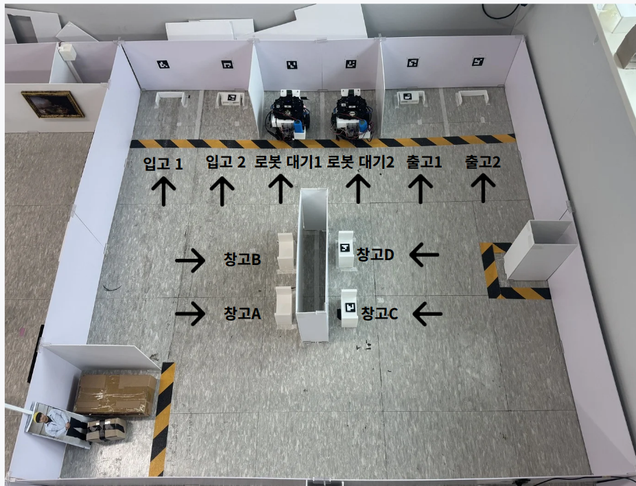

# Nav Server

두 대의 TurtleBot3를 독립 ROS domain으로 운용하면서 Nav2 주행, ArUco 정밀 접근,
리프트 작업, 공유 통로 교통 조정, 충돌 정지를 하나의 Movement API로 연결한 물류
자율주행 서버입니다.

**담당 범위:** Navigation · Docking · Fleet traffic · Safety · Main/LMS 연동

<p align="center">
  
</p>

<p align="center">
  <b>Gazebo 듀얼 로봇 안전 E2E</b><br>
  20 cm 대기선에서 동시 명령 → 한 대만 공유 구간 진입 → 다른 로봇 대기 → 순차 완료<br>
  <a href="docs/videos/dual_robot_traffic_topview.mp4">19초 MP4 보기</a>
</p>

## 최종 성과

| 검증 항목 | 결과 | 근거 |
| --- | ---: | --- |
| 2대 공유 구간 제어 | `PASS` | `WAITING_TRAFFIC` 관찰, 두 명령 모두 `DONE` |
| `leave_dock` 마커 거리 | R1 `20 → 39.54 cm`, R2 `20 → 39.60 cm` | 목표 `40 cm` |
| 최종 AMCL approach 오차 | R1 `1.38 cm`, R2 `1.65 cm` | 허용 기준 `5 cm` 이내 |
| 로봇 간 위치 오차 편차 | `0.27 cm` | 동일 시작 조건 반복 |
| Collision Monitor 정지 | `PASS` | 전방 여유 `34.77 cm`, 정지 중 이동 `0.15 cm` |
| 자동 회귀 검사 | `222 passed + 2 subtests` | ROS-free 전체 테스트 |

수치는 2026-07-28 `nav_server_dual_standby` Gazebo 실행 결과이며
[원본 증거 JSON](docs/evidence/dual_robot_safety_2026-07-28.json)으로 확인할 수 있습니다.
실로봇에서 공유 구간 선점과 대기는 확인했지만, **2대 전체 실물 E2E는 아직 최종
통과로 기록하지 않습니다.** 현재 검증 범위는
[듀얼 로봇 인수인계](docs/handoff/DUAL_ROBOT_SEGMENT_TRAFFIC_HANDOFF_2026-07-21.md)에
구분해 두었습니다.

## 시스템 구성

```text
Main / LMS
    │  POST /movement-api/v1/routes/commands
    ▼
Movement API :8001 / :8002
    │
    ├── readiness · command gate · state/callback
    ├── segment traffic lock ── QUEUED / WAITING_TRAFFIC / LOCKED
    └── movement executor
          ├── Nav2 navigation / recovery
          ├── ArUco metric two-stage docking
          └── lift / leave_dock
                    │
                    ▼
        /cmd_vel_nav → velocity_smoother → collision_monitor → /cmd_vel
                    │
                    ▼
           TurtleBot3 R1 / R2
              ▲          ▲
       AMCL · Scan   ArUco · Lift
```

- 로봇 1: ROS domain `2`, Movement API `:8001`, `tb3_burger_01`
- 로봇 2: ROS domain `5`, Movement API `:8002`, `tb3_burger_02`
- 두 API가 같은 `TRAFFIC_LOCK_STATE_PATH`를 사용해 좁은 통로의 단독 점유를 보장합니다.
- Nav2와 사용자 제어 속도는 `velocity_smoother`와 방향별 Collision Monitor를 통과합니다.
- ArUco 접근은 카메라 pose 거리 기준으로 `40 cm → 정지 → 18~20 cm`를 폐루프 제어합니다.

### 실제 맵 제작

<p align="center">
  
</p>

<p align="center">
  <b>실제 운용 환경의 Navigation 맵 제작 화면</b><br>
  SLAM·RViz에서 작성하고 검토한 occupancy map과 <code>zones.json</code>을
  Nav2 경로 계획과 Gazebo 시나리오의 공통 입력으로 사용합니다.
</p>

## 명령 처리 흐름

```text
R1 / R2: marker 20 cm hold
          │
          ├── 동시에 leave_dock + Nav2 명령 수신
          │
          ├── 출발 슬롯 배정
          │
          ├── warehouse_aisle 선점 로봇만 이동
          │        └── 다른 로봇은 WAITING_TRAFFIC 상태로 정지
          ├── marker 40 cm approach까지 후진
          ├── Nav2 구간 완료 후 lock 해제
          └── 대기 로봇이 이어서 이동 → 둘 다 DONE
```

`leave_dock`은 고정 시간 후진이 아니라 마커 거리와 odom/TF 피드백으로 approach
위치까지 복귀합니다. 두 로봇의 기구·마찰 차이 때문에 실제 이동 거리는 조금 달라도,
판정 기준은 최종 마커 거리와 map pose 오차입니다.

## 핵심 구성

| 구성 | 주요 코드 | 역할 |
| --- | --- | --- |
| Movement API | `nav_app/routers/robot_commands.py`, `movement_api.py` | 명령 접수·조회·취소와 idempotency |
| Command State | `nav_app/services/command_state.py` | 활성 명령, ARRIVED gate, callback 상태 |
| Movement & Docking | `movement_executor.py`, `docking.py` | Nav2 이동, ArUco 접근, Lift, 거리 기반 복귀 |
| Traffic Safety | `traffic_coordination.py`, `scripts/traffic_manager.py` | segment 예약, 대기, 소유권 기반 해제 |
| Robot Runtime | `scripts/start_all_tb3_1.sh`, `start_all_tb3_2.sh` | 로봇별 bringup·Nav2·RViz·API 실행 |
| Simulator | `Simulator/` | 실제 맵 기반 듀얼 로봇 안전 회귀 시험 |

## 실행

### 실로봇 실행 정본

중앙 Supervisor는 현재 사용하지 않습니다. 실로봇 정본은 로봇별
`start_all_tb3_1.sh`, `start_all_tb3_2.sh`가 각각 7개 pane을 올리는 방식입니다.
과거 `stack_supervisor_tb3_2.sh`와 Supervisor runbook은 이력 자료이며 실행 대상이
아닙니다.

| 로봇별 pane | 실행 위치 |
| --- | --- |
| TurtleBot bringup · lift · camera | Robot SBC |
| ArUco detector · Nav2/RViz · Movement API · status | Nav PC |

현재 절차:

- [로봇 1 스택](docs/runbook/TB3_1_CURRENT_STACK.md)
- [로봇 2 스택](docs/runbook/TB3_2_CURRENT_STACK.md)
- [2대 전체 실행 순서](docs/runbook/RUNBOOK_LMS_FULL_STARTUP.md)

### Gazebo 자동 안전 시험

ROS 2 Jazzy, Gazebo Sim 8, Nav2, `jq`가 필요합니다. GPU/EGL이 불안정한 PC에서는
`xvfb`를 한 번 설치합니다.

```bash
cd Nav-server
sudo apt install xvfb
bash Simulator/scripts/run_dual_robot_safety_test.sh
```

시험은 두 로봇을 20 cm 선으로 매번 초기화하고 traffic + collision 시나리오를
검증합니다. 결과는
`Simulator/generated/dual_robot/latest_safety_evidence.json`에 생성됩니다.

탑뷰 GUI:

```bash
cd Nav-server
GAZEBO_GUI=1 GAZEBO_USE_XVFB=1 \
  bash Simulator/scripts/start_dual_robot_standby.sh reset
```

자세한 실행과 장애 대응은 [Simulator runbook](Simulator/docs/runbook/RUN_HOST_NATIVE.md)을
참조합니다.

### 실로봇 2대 스택

비밀번호는 Git에 넣지 않고 권한 `600`인 `.env`의 `ROBOT1_PW`, `ROBOT2_PW`로
관리합니다.

```bash
cd /home/lucas/slam_nav_ws
export TRAFFIC_COORDINATION_MODE=segment
export TRAFFIC_DEPARTURE_STAGGER_SEC=4
export TRAFFIC_SEGMENT_WAIT_TIMEOUT_SEC=300
export TRAFFIC_SEGMENT_TTL_SEC=900

scripts/start_all_tb3_1.sh stop
scripts/start_all_tb3_2.sh stop
scripts/start_all_tb3_1.sh start
scripts/start_all_tb3_2.sh start
```

```bash
scripts/start_all_tb3_1.sh status
scripts/start_all_tb3_2.sh status
```

## 폴더 구조

```text
Nav-server/
├── nav_app/       # FastAPI routers, command state, movement services
├── scripts/       # robot launchers, navigator, traffic manager, operators
├── launch/        # Nav2 / RViz launch
├── config/        # robot, Nav2, Fast DDS, route configuration
├── map/           # occupancy maps, zones, waypoints
├── Simulator/     # 2대 Gazebo 재현 환경과 자동 안전 시나리오
├── tests/         # ROS-free contract and regression tests
└── docs/          # as-built, API contract, runbook, evidence
```

## 설정과 인터페이스

| 정본 | 내용 |
| --- | --- |
| `config/robots.json` | robot ID, ROS domain, API, camera·Lift 설정 |
| `config/main_server_routes.json` | Main/LMS route와 Nav endpoint |
| `config/nav2/*.yaml` | planner, controller, costmap, Collision Monitor |
| `map/zones.json` | waypoint, marker 거리, semantic zone, traffic segment |
| `Simulator/config/profiles/*.json` | Gazebo 로봇·맵·Nav2 안전 profile |

입력은 Main/LMS의 Movement API 명령, ArUco 관측, AMCL·TF·scan·Lift telemetry입니다.
출력은 Nav2 goal/cancel, Collision Monitor를 통과한 속도 명령, Lift 명령과
Main callback·polling 상태입니다. 상세 계약은
[Main/LMS API 계약](docs/reference/MAIN_SERVER_CONTRACT.md)을 따릅니다.

## 검증

```bash
cd Nav-server
python3 -m pytest tests/ -q
bash Simulator/scripts/run_dual_robot_safety_test.sh
```

| 검증 계층 | 현재 근거 | 판정 범위 |
| --- | --- | --- |
| 자동 테스트 | `222 passed + 2 subtests` | API, 상태, traffic, docking, 안전 설정 |
| Gazebo 듀얼 E2E | evidence JSON과 탑뷰 영상 | 20 cm 초기화, 40 cm 복귀, traffic, collision |
| 실로봇 개별 스택 | R1·R2 current-stack runbook | 로봇별 bringup, Nav2/RViz, camera, Lift, API |
| 실로봇 2대 전체 E2E | 최종 합격 미기록 | 같은 공유 구간 시나리오의 현장 재검증 필요 |

Simulation 성공은 실제 마찰, 센서 오차, 네트워크 지연과 Lift 하중까지 증명하지
않습니다. 실물 최종 합격 전에는 Gazebo 결과와 실물 결과를 분리해 기록합니다.

## 설계에서 지킨 것

- **로봇별 격리:** domain, API port, 상태 디렉터리, 토픽을 로봇별로 분리합니다.
- **좁은 통로 단독 점유:** 출발 전 segment를 예약하고 소유권을 확인한 뒤 해제합니다.
- **안전 경로 일원화:** Nav2와 ArUco/manual 명령을 smoother와 Collision Monitor로 보냅니다.
- **거리 기반 복귀:** 두 로봇에 같은 시간을 적용하지 않고 센서 피드백으로 종료합니다.
- **준비 전 명령 거부:** online, localization, Nav2 lifecycle, `/cmd_vel` subscriber를 확인합니다.
- **증거 기반 판정:** 명령 상태, traffic state, AMCL 오차, collision state를 JSON으로 남깁니다.
- **운영과 이력 분리:** 현재 runbook만 실행 정본으로 두고 폐기된 Supervisor는 명시적으로 제외합니다.

## 관련 문서

- [현재 구현 정본](docs/as-built/NAV_STACK_AS_BUILT.md)
- [Main/LMS API 계약](docs/reference/MAIN_SERVER_CONTRACT.md)
- [개발 검증](docs/runbook/DEVELOPMENT_VERIFICATION.md)
- [ArUco 도킹](docs/runbook/RUNBOOK_ARUCO_DOCKING.md)
- [Simulator](Simulator/README.md)
- [데모 영상 촬영안](docs/demo/DUAL_ROBOT_VIDEO_PLAN.md)
