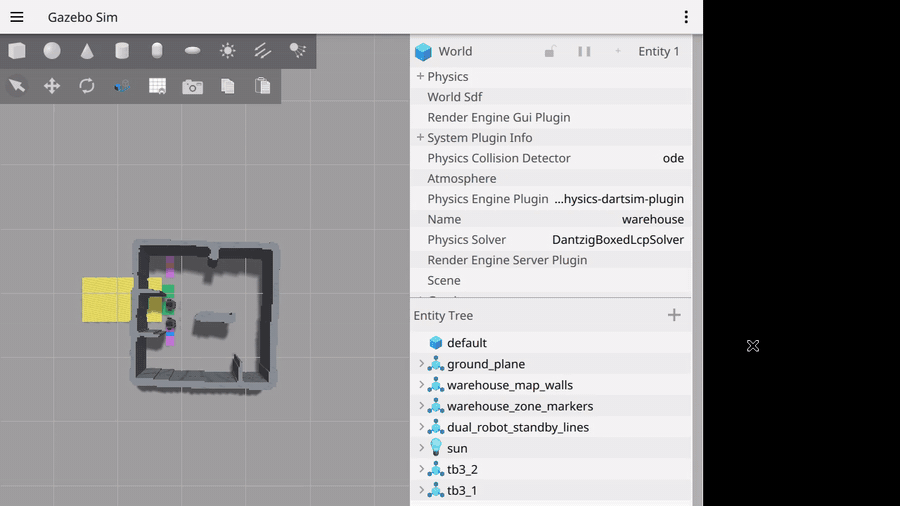

# ros2-ai-amr-repo3

Eduwing 물류 AMR의 ROS 2 Navigation 서버입니다. 두 대의 TurtleBot3를 대상으로
Nav2, ArUco 정밀 도킹, 리프트, Main/LMS Movement API, 공유 통로 교통 조정,
Collision Monitor를 통합합니다.

<p align="center">
  
</p>

## 구성

| 경로 | 설명 |
| --- | --- |
| [`Nav-server/`](Nav-server/) | 실로봇 Navigation/Movement API 정본 |
| [`Nav-server/Simulator/`](Nav-server/Simulator/) | 실제 맵 기반 듀얼 로봇 Gazebo 안전 시험 |
| [`Nav-server/docs/`](Nav-server/docs/) | 구현 정본, API 계약, 운영 runbook, 검증 증거 |

## 검증

```bash
cd Nav-server
python3 -m pytest tests/ -q
bash Simulator/scripts/run_dual_robot_safety_test.sh
```

세부 성과, 구조, 실로봇 실행법은
[`Nav-server/README.md`](Nav-server/README.md)에서 확인할 수 있습니다.

## 작업공간 동기화

Nav PC의 `/home/lucas/slam_nav_ws`에서 코드와 재현 가능한 Simulator 소스만
가져오며, 로그·PID·생성 world·로컬 의존성 빌드는 제외합니다.

```bash
bash scripts/sync_nav_server_from_workspace.sh
```
