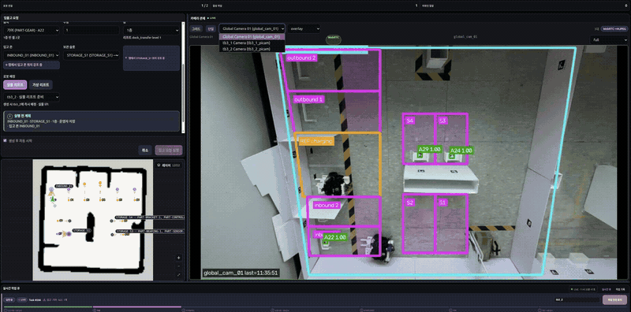
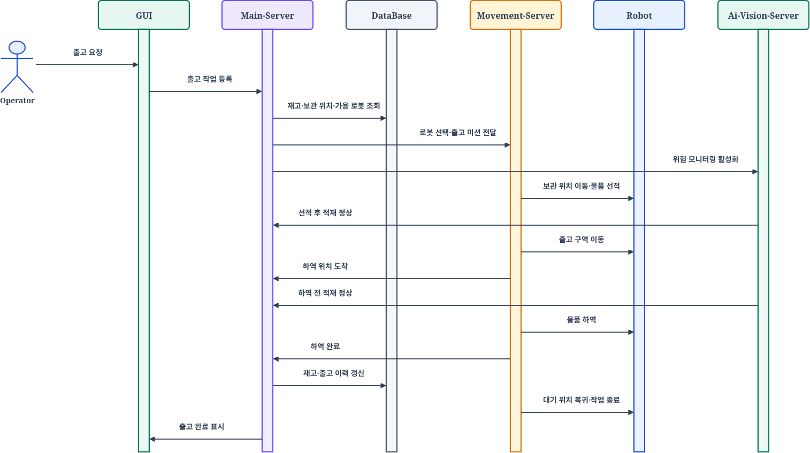

# E2E 물류 관제 시스템

운영자의 입·출고 요청을 로봇 배정, 자율주행, 정밀 도킹, 적재·하역, Vision 검증과 재고 반영까지 연결한 ROS 2 기반 물류 자동화 프로젝트입니다.

Main Server, Nav Server, AI Server와 두 대의 TurtleBot3가 역할을 나누되, 하나의 `task_id`를 기준으로 작업의 시작부터 완료까지 추적할 수 있도록 구성했습니다.
[](assets/lift_nav_safety_full_e2e_combined.mp4)

> 이미지를 클릭하면 전체 E2E 통합 영상을 볼 수 있습니다.

---

## 1. 프로젝트 한눈에 보기

| 구분 | 내용 |
| --- | --- |
| 프로젝트 목표 | 입·출고 요청부터 재고 반영까지 이어지는 E2E 물류 작업 구현 |
| 운영 대상 | TurtleBot3 기반 포크리프트형 AMR 2대 |
| 핵심 구성 | Main Server, Nav Server, AI Server, PostgreSQL, Admin UI |
| 이동 방식 | ROS 2, Nav2, AMCL, LiDAR 기반 자율주행 |
| 정밀 작업 | ArUco 정렬, 포크 삽입, Lift 적재·하역 |
| 작업 검증 | 카메라 source, Zone ROI, marker와 수량 기반 Vision evidence |
| 안전 전략 | 사람 위험 감지, E-stop, 작업 보류와 운영자 복구 |
| 상태 관리 | `task_id`와 `command_id` 기반 명령·결과·증거·재고 추적 |

---

## 2. 주제 선정 이유

물류 자동화는 단순 이동뿐 아니라 작업 요청, 로봇 할당, 적재·하역, 영상 검증과 재고 반영을 하나의 흐름으로 연결해야 합니다. 이 프로젝트는 분산된 상태를 추적 가능한 E2E 작업으로 통합하고, 실제 로봇 환경에서 검증하기 위해 선정했습니다.

| 선정 배경 | 프로젝트 방향 |
| --- | --- |
| 반복적인 입·출고 운반 업무 | 요청부터 재고 반영까지 정형화된 작업 흐름 구성 |
| 단순 자율주행만으로는 부족한 물류 동작 | Nav2, ArUco 도킹과 Lift 적재·하역 통합 |
| 여러 서버와 장치에 분산된 상태 | `task_id`와 `command_id` 기반 실행 결과 추적 |
| 화물 불일치와 사람 접근 위험 | Vision evidence, E-stop과 운영자 복구 적용 |
| ROS 2·Vision·관제·DB 통합 필요 | Main·Nav·AI 책임을 분리한 E2E 시스템 구현 |

---

## 3. 프로젝트 목표와 범위

| 핵심 목표 | 구현 범위 |
| --- | --- |
| 입·출고 작업과 재고 관리 | 작업 생성·상태 전이와 PostgreSQL 기반 재고·이력 반영 |
| 가용 로봇 할당 | TurtleBot3 두 대의 준비 상태·지원 기능 확인과 중복 할당 방지 |
| 자율주행과 정밀 작업 | Nav2 waypoint 이동, ArUco 도킹과 Lift 적재·하역 |
| 작업 결과 검증 | Vision evidence를 업무 진행의 검증 근거로 사용 |
| 위험 대응 | 사람 감지, E-stop, 작업 보류와 운영자 복구 |
| E2E 상태 정합성 | `task_id`·`command_id` 기반 결과 추적과 검증 후 재고 반영 |

---

## 4. System Requirements

| ID    | 요구사항            | 완료 조건                                                    | 책임 영역       |
| ----- | --------------- | -------------------------------------------------------- | ----------- |
| FR-01 | 입·출고 작업 생성      | 유효한 품목·수량·위치로 작업이 생성되고 고유 `task_id`가 발급됨                 | Main        |
| FR-02 | 자원 재검증          | 작업 생성 직전 재고와 위치 조건을 다시 확인하고 충돌 시 생성을 거절함                 | Main·DB     |
| FR-03 | 가용 로봇 할당        | 통신·준비 상태·지원 기능을 만족하는 로봇 하나만 작업에 할당함                      | Main        |
| FR-04 | 자율주행 이동         | 지정 waypoint 또는 approach pose에 도착하고 명령 결과를 반환함            | Nav         |
| FR-05 | 정밀 적재·하역        | ArUco 정렬, 포크 삽입, Lift와 후진 단계를 실행하고 결과를 보고함               | Nav·Robot   |
| FR-06 | Vision evidence | 예상 source·marker·Zone·수량과 freshness를 평가해 근거와 reason을 반환함 | AI          |
| FR-07 | 작업 단계 진행        | 현재 작업·로봇·단계·`command_id`가 일치하는 결과만 다음 단계로 반영함            | Main        |
| FR-08 | 위험 감지와 정지       | 사람 감지 또는 운영자 요청 시 작업을 보류하고 로봇 정지를 요청함                    | AI·Main·Nav |
| FR-09 | 운영자 복구          | 보류 작업에 대해 재개·안전 위치 이동·취소 중 하나를 선택할 수 있음                  | Main·UI     |
| FR-10 | 재고와 이력 반영       | 전체 단계가 검증된 뒤 작업 완료·재고·이력·로봇 해제를 함께 반영함                   | Main·DB     |

---

## 5. 운영 시나리오

### 5.1 입고 시나리오

1. 운영자가 품목, 수량과 입고 위치를 입력합니다.
2. Main Server가 요청을 검증하고 현재 재고·보관 위치를 조회합니다.
3. 작업 생성 조건을 다시 확인한 뒤 가용 로봇을 할당합니다.
4. Nav Server가 입고 지점까지 Nav2 이동을 실행합니다.
5. 로봇이 ArUco marker를 이용해 팔레트와 정렬하고 포크를 삽입합니다.
6. Lift가 화물을 들어 올리고 AI Server가 적재 evidence를 생성합니다.
7. Main Server가 evidence의 대상·시각·결과를 확인한 뒤 보관 위치 이동을 지시합니다.
8. 로봇이 보관 위치에서 하역 단계를 수행하고 결과를 반환합니다.
9. 최종 검증이 끝나면 로봇은 대기 위치로 복귀합니다.
10. Main Server가 작업 완료, 입고 이력과 재고를 PostgreSQL에 반영합니다.

> **Sequence Diagram  — 입고 작업**


### 5.2 출고 시나리오

1. 운영자가 출고할 품목과 수량을 요청합니다.
2. Main Server가 재고와 해당 품목의 보관 위치를 확인합니다.
3. 가용 로봇을 할당하고 보관 위치까지 이동하도록 명령합니다.
4. Nav Server가 approach pose 도착 후 ArUco 정렬과 적재를 실행합니다.
5. AI Server의 evidence를 통해 예상 화물이 적재되었는지 확인합니다.
6. 로봇이 출고 위치로 이동하고 하역 전 상태를 다시 확인합니다.
7. 하역 완료 후 로봇은 대기 위치로 복귀합니다.
8. Main Server가 출고 이력, 작업 완료와 감소한 재고를 함께 반영합니다.

> **Sequence Diagram  — 출고 작업**



### 5.3 위험 감지와 복구 시나리오

1. 주행 중 사람 접근, 적재 불량 또는 운영자 E-stop 요청이 발생합니다.
2. AI Server 또는 운영자가 위험 신호를 Main Server에 전달합니다.
3. Main Server가 작업을 보류하고 Nav Server에 정지를 요청합니다.
4. Nav Server가 현재 동작을 취소하고 물리 정지 결과를 보고합니다.
5. 정지 여부가 확인되지 않으면 작업은 자동으로 진행되지 않습니다.
6. 운영자가 현장, 로봇 위치, 화물과 이전 명령 상태를 확인합니다.
7. 안전 상태에 따라 현재 단계 재개, 안전 위치 이동 또는 작업 취소를 선택합니다.
8. 복구 결과와 운영자 결정은 기존 `task_id`의 이력으로 남습니다.

> **Sequence Diagram — 위험 감지, E-stop과 작업 복구**


---

## 6. 시스템 설계

### 6.1 소프트웨어 아키텍처

(1).png>)

---

## 7. 하드웨어 설계

.png>)


---

## 9. 통합 결과와 검증

### 9.1 E2E 시나리오 결과

기록된 통합 시나리오에서는 작업 266을 기준으로 작업 생성부터 완료와 재고 반영까지 동일한 `task_id`로 대조했습니다.

| 시나리오 | 검증 내용         |  결과  |
| ---- | ------------- | :--: |
| S01  | 작업 생성과 로봇 배정  | PASS |
| S02  | 자율주행 이동과 도착   | PASS |
| S03  | 적재 evidence   | PASS |
| S04  | 안전 정지와 복구     | PASS |
| S05  | 적재 주행 중 사람 감시 | PASS |
| S06  | 최종 복귀         | PASS |
| S07  | 작업 완료와 재고 반영  | PASS |

| 통합 지표 | 결과 |
| --- | ---: |
| 전체 시나리오 | 7/7 |
| Evidence gate | 2/2 |
| 안전 정지·복구 | 2/2 |
| E2E 실행 시간 | 5분 25초 |
| 작업 완료와 재고 반영 | 동일 시각 확인 |

> **결과 이미지 자리 — 작업 타임라인, 로그와 최종 재고 Before/After**

### 9.2 검증 계층

| 검증 구분 | 확인 범위 | 증명하지 않는 범위 |
| --- | --- | --- |
| 자동 테스트 | API, schema, 인증, 상태 전이, DB와 설정 | 실제 로봇의 물리 동작 |
| no-hardware 통합 | Main·Nav·AI 계약과 기본 E2E 경로 | 실제 Nav2 주행과 Lift 하중 |
| 시뮬레이션 | ROS graph, Nav2 goal과 가상 이동 | 실물 센서 오차와 마찰·하중 |
| 실물 기능 검증 | camera, localization, 주행, ArUco와 Lift | 장시간·대규모 운영 안정성 |
| 실물 E2E | 요청부터 재고 반영까지 전체 작업 | 모든 조명·배치·장애물 조건 |

no-hardware와 시뮬레이션 성공을 실물 주행이나 물리 적재·하역의 합격으로 사용하지 않습니다. 수치 결과는 사용한 지도, 장비, profile과 측정 조건을 함께 보존해야 합니다.

---

## 10. 기술 스택

### Robot & Middleware


### Navigation & Perception


### Backend & Data


### Frontend & Streaming


### Integration & Validation


---

## 11. 저장소 구조

```text
.
├── main-server/   # 작업·재고·안전 상태와 Admin UI
├── nav-server/    # 이동·도킹·Lift와 로봇별 runtime
├── ai-server/     # 영상·탐지·stream과 evidence
├── config/        # 네트워크와 통합 runtime profile
├── scripts/       # 전체 환경 준비, 실행, 종료와 점검
├── tests/         # 서버 간 계약과 no-hardware 검증
├── docs/          # 통합 계약, 운영, 검증과 이력
└── assets/        # README와 발표용 이미지
```

세 서버는 각자 구현과 실행을 설명하는 README와 책임 경계 문서를 가집니다. 최상단 문서는 프로젝트 배경, E2E 시나리오와 통합 결과를 설명하고, 세부 API·설정·운영 절차는 서버별 문서에서 관리합니다.

---

## 12. 빠른 시작

### 12.1 No-hardware 검증

```bash
./scripts/bootstrap-nohardware-envs.sh
./scripts/test-nohardware.sh
```

API, 인증, DB와 Main·Nav·AI 계약을 확인하며 실제 주행과 Lift는 포함하지 않습니다.

### 12.2 통합 Profile 실행

| 실행 환경 | Profile | 실행 범위 |
| --- | --- | --- |
| 단일 로봇 통합 PC | `tb1-local-e2e`, `tb2-local-e2e` | Main·UI와 선택 Nav |
| 두 로봇 통합 PC | `all-local-e2e` | Main·UI와 TB1·TB2 Nav |
| Main 전용 PC | `main-field` | PostgreSQL·Main·UI |
| Nav 전용 PC | `nav-field-tb1`, `nav-field-tb2` | 선택 로봇 Nav |
| 두 로봇 Nav PC | `nav-field-all` | TB1·TB2 Nav |

```bash
./scripts/sf_stack.sh profiles
./scripts/sf_stack.sh --profile PROFILE_NAME check
./scripts/sf_stack.sh --profile PROFILE_NAME foreground
```

### 12.3 실물 통합 시작

실물 운용은 Robot SBC → AI → Nav → Main 순서로 시작합니다. 최초 설치 시에는 각 서버의 setup과 공통 hostname·credential 점검을 먼저 완료해야 합니다.

```bash
# Robot SBC
ROS_DOMAIN_ID=HARDWARE_DOMAIN WS_SETUP=/path/to/tb3-overlay/install/setup.bash \
  nav-server/scripts/robot_sbc/start_bringup.sh
ROS_DOMAIN_ID=HARDWARE_DOMAIN LIFT_WS_SETUP=/path/to/lift-overlay/install/setup.bash \
  nav-server/scripts/robot_sbc/start_lift_bridge.sh
ROS_DOMAIN_ID=HARDWARE_DOMAIN WS_SETUP=/path/to/tb3-overlay/install/setup.bash \
  nav-server/scripts/robot_sbc/start_camera.sh

# AI PC
cd ai-server
./scripts/vision/sf_lab.sh check low-load
./scripts/vision/sf_lab.sh low-load

# Nav PC — repository root
./scripts/sf_stack.sh --profile nav-field-all check
./scripts/sf_stack.sh --profile nav-field-all foreground

# Main PC — repository root
./scripts/sf_stack.sh --profile main-field check
./scripts/sf_stack.sh --profile main-field foreground
```

실물 명령 전 상태를 확인합니다.

```bash
./scripts/sf_stack.sh status
./scripts/sf_stack.sh smoke

# AI PC
cd ai-server && ./scripts/vision/sf_lab.sh status
```

`localized`, `nav2_ready`, `command_accepting`, Lift `ready`, AI source freshness가 모두 정상일 때만 실물 명령을 보냅니다. 종료 전에는 새 작업을 중지하고 로봇의 물리 정지를 먼저 확인합니다.

```bash
# Main·Nav PC
./scripts/sf_stack.sh down

# AI PC
cd ai-server && ./scripts/vision/sf_lab.sh down

# Robot SBC
nav-server/scripts/robot_sbc/stop_stack.sh
```

---

## 13. 현재 한계와 확장 목표

| 현재 확보한 기반 | 다음 목표 |
| --- | --- |
| 한 대의 로봇으로 Full E2E 검증 | 두 대 이상 동시 배정과 traffic·zone 경합 검증 |
| Lift step 제어와 1층 적재·하역 | 2층 승강 정착 시간과 반복 위치 오차 검증 |
| `task_id` 기반 보류·복구 추적 | 실패 유형별 복구 단계 자동화 |
| 전역 Localization과 AMCL 인계 | fine 단계 연산·대기 병목과 손실 함수 고도화 |
| 관찰 가능한 checkpoint evidence | 조명·가림·카메라 위치 변화에 대한 반복 검증 |
| no-hardware와 실물 검증 분리 | 장시간 반복 운용과 장애 주입 시험 |

현재 결과는 제한된 물류 공간과 지정된 장비에서 확보한 프로젝트 검증 결과입니다. 산업 현장 적용을 주장하기보다, E2E 물류 자동화에 필요한 책임 분리, 상태 추적, 물리 실행과 검증 구조를 구현하고 확인한 범위로 정의합니다.

---

## 14. 팀 구성과 역할

| 팀원 | 담당 영역 | 주요 역할 |
| --- | --- | --- |
| 윤주찬 | Hardware | 포크리프트 구조, Lift 구동부와 실물 하드웨어 구성 |
| 김현수 | Main·UI·DB | 작업·재고·관제 UI, PostgreSQL과 서버 오케스트레이션 |
| 손영빈 | Nav·Hardware | ROS 2·Nav2, 도킹, Lift 연동과 실물 주행 |
| 하샘 | Vision·Localization | 영상 pipeline, evidence, 안전 감지와 위치 복구 |
