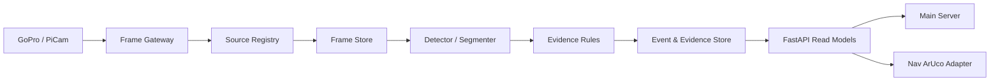

# AI Server

카메라 영상을 처리해 객체·ArUco 관측, 적재 근거, 사람 위험 advisory와 관제 stream을 제공하는 Vision 서버입니다.

## Implementation Overview



source와 freshness를 확인한 frame을 모델 adapter로 처리하고, 탐지 결과를 공통 event로 정규화합니다. 적재·하역 요청은 ArUco·ROI 근거를 `PASS`, `FAIL`, `UNCERTAIN`, `NO_DECISION`으로 평가하지만 실제 업무 진행 여부는 결정하지 않습니다.

## Main Components

| Component | Primary code | 구현 역할 |
| --- | --- | --- |
| API & Runtime | `app/api/`, `app/runtime_routes.py` | frame, detection, stream, evidence endpoint |
| Source Registry | `app/source_registry.py`, `app/source_health.py` | source 정의와 frame freshness 관리 |
| Frame & Event Store | `app/frame_store.py`, `app/event_store.py` | 최신 frame·관측 read model |
| Model Adapters | `app/detectors.py`, `app/model_adapters.py` | detect·segment 결과 정규화 |
| Evidence Rules | `app/evidence_evaluation.py`, `app/lift_roi_evidence.py` | ROI·ArUco 기반 판정 근거 생성 |
| ROS Gateway | `ros2/smartfactory_perception_ros/` | ROS image 수신과 overlay bridge |

## Directory Structure

```text
ai-server/
├── app/                 # FastAPI, model adapter, evidence 정책
├── config/vision/       # source, ROI, media, runtime profile
├── ros2/                # ROS image gateway와 overlay bridge
├── scripts/ai/          # Python 환경, API 실행·테스트
├── scripts/vision/      # camera·stream runtime 운영
├── tests/               # API·contract·policy 회귀 테스트
└── docs/                # 계약, 운영 참고와 책임 경계
```

## Interfaces

| Direction | 상대 시스템 | 인터페이스 | 목적 |
| --- | --- | --- | --- |
| Input | ROS camera gateway | HMAC frame ingest | source별 최신 frame 수신 |
| Input | Main Server | HMAC Vision API | monitor·화물 evidence 요청 |
| Input | Media runtime | WebRTC·MJPEG source | 관제 영상 구성 |
| Output | Main Server | detection·evidence·hazard API | 업무 판단에 사용할 관측 제공 |
| Output | Nav Server | latest ArUco detection API | 도킹용 marker 관측 제공 |
| Output | Main 경유 Admin UI | stream·frame·overlay read model | 관제 영상과 상태 표시 |

전체 payload와 서명 규칙은 [AI Server API Contract](docs/contracts/ai-server-api.md)에 있습니다.

## Configuration

| Variable | 필수 여부 | 용도 |
| --- | :---: | --- |
| `AI_SERVER_HOST`, `AI_SERVER_PORT` | 선택 | API bind, 기본 `127.0.0.1:8100` |
| `MAIN_SERVER_URL` | 필수 | Main Server origin |
| `MAIN_HMAC_SECRET` | 필수 | Main mutation 요청 검증 |
| `VISION_GATEWAY_HMAC_SECRET` | 필수 | frame gateway 서명 검증 |
| `VISION_SOURCES_REGISTRY_PATH` | 선택 | source registry 경로 |
| `VISION_MODEL_PATH`, `VISION_MODEL_TASK` | 조건부 | 모델 파일과 detect·segment task |
| `SOURCE_STALE_AFTER_S`, `SOURCE_OFFLINE_AFTER_S` | 선택 | freshness 기준 |

secret과 실제 장비 주소는 versioned profile에 기록하지 않고 runtime 환경에서 주입합니다.

## Run

```bash
cd ai-server
./scripts/ai/setup_ai_server_env.sh
./scripts/ai/run_ai_server.sh --reload
curl -fsS http://127.0.0.1:8100/api/v1/health
```

카메라와 stream을 포함한 현장 profile은 `./scripts/vision/sf_lab.sh check low-load` 후 `./scripts/vision/sf_lab.sh low-load`로 실행합니다.

## Test

```bash
cd ai-server
./scripts/ai/test_ai_server.sh
python3 scripts/validate/validate_deployment_assets.py
python3 scripts/validate/self_containment_audit.py
```

## Responsibility

AI Server는 관측과 evidence의 생성·최신성을 소유합니다. 작업 완료·재고 변경·정지·주행 제어는 소유하지 않습니다. 결정별 경계는 [AI Server Responsibility](docs/responsibility.md)에 정리되어 있습니다.

## Related Documentation

| 문서 | 내용 |
| --- | --- |
| [API 계약](docs/contracts/ai-server-api.md) | endpoint, schema, HMAC |
| [Lift/load evidence](docs/contracts/lift-load-evidence.md) | 화물 판정 계약 |
| [Low-load runtime](docs/low-load-mode.md) | 현장 저부하 profile |
| [배포](docs/deployment.md) | API·ROS·모델 배포 차이 |
| [품질 기준](docs/quality-gates.md) | 자동·현장 검증 범위 |
