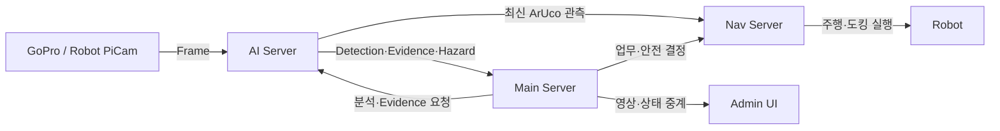
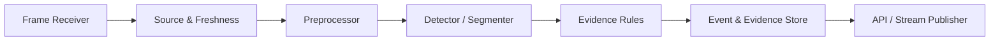

# AI Server Responsibility

## Responsibility Summary

AI Server는 영상에서 관측 사실을 생성하는 서버입니다. source별 frame과 freshness를 관리하고 객체·ArUco·위험·화물 근거를 공통 계약으로 제공하지만, 그 근거를 업무 완료나 로봇 제어로 승격하지 않습니다.

| 구분 | 내용 |
| --- | --- |
| Owns | 카메라 source 등록, frame 수신과 freshness 상태 |
| Owns | 객체 탐지·segmentation과 공통 event 변환 |
| Owns | ArUco·ROI 기반 적재·하역 evidence 평가 |
| Owns | 사람 위험 advisory와 frame·overlay·stream read model |
| Owns | evidence reason, 관측 시각과 schema 일관성 |
| Delegates to | Main Server: 작업 진행·보류, 재고와 안전 정책 결정 |
| Delegates to | Nav Server: marker 관측을 이용한 도킹 제어 |
| Does not own | 작업 상태, 작업 완료와 재고 변경 |
| Does not own | E-stop, 감속, Nav2 goal과 리프트 제어 |
| Does not own | 입출고 단계 실행과 운영자 복구 절차 |

## Responsibility Boundary

| Decision or State | Owner |
| --- | --- |
| frame source와 최신성 | AI Server |
| 객체·marker 관측 결과 | AI Server |
| lift/load evidence 결과와 reason | AI Server |
| 관측을 현재 작업에 연결할지 여부 | Main Server |
| AI 결과로 작업을 진행·보류할지 여부 | Main Server |
| 재고 변경과 작업 완료 | Main Server |
| marker 기반 조향·도킹 제어 | Nav Server |
| 사람 위험에 따른 E-stop 요청 | Main Server |
| E-stop 물리 실행 | Nav Server |

## Collaboration Diagram

## Internal Responsibility Diagram

## Design Rules

1. AI 응답은 관측 근거이며 업무 명령이나 재고 변경 명령이 아닙니다.
2. stale·offline frame, marker·ROI 부족은 `PASS`로 처리하지 않습니다.
3. 모든 결과는 source와 관측 시각을 포함해 소비자가 현재 작업과 freshness를 검증할 수 있어야 합니다.
4. Main·gateway mutation은 HMAC 검증에 실패하면 상태를 변경하지 않습니다.
5. WebRTC·MJPEG fallback은 전송 가용성만 바꾸며 evidence 의미와 판정 기준은 바꾸지 않습니다.
