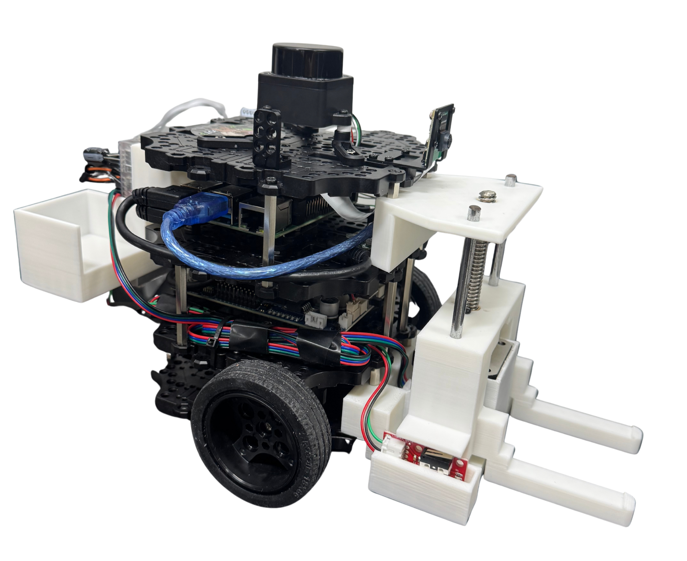
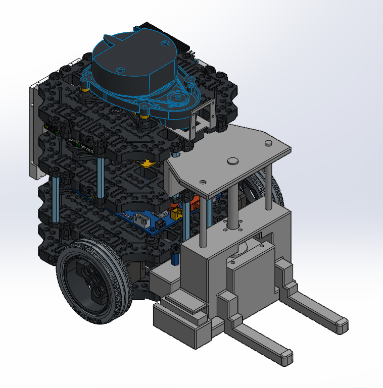
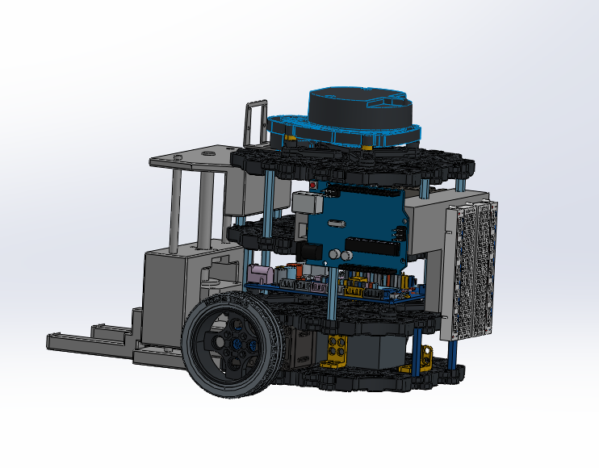
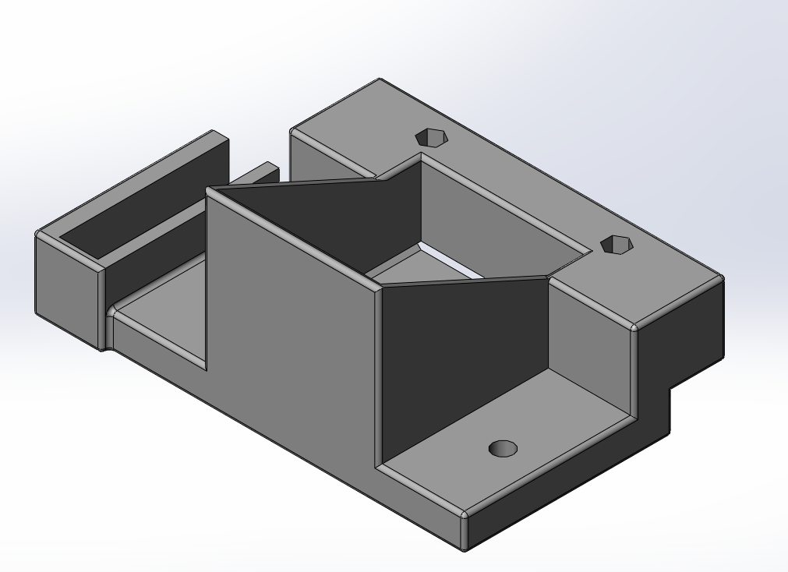
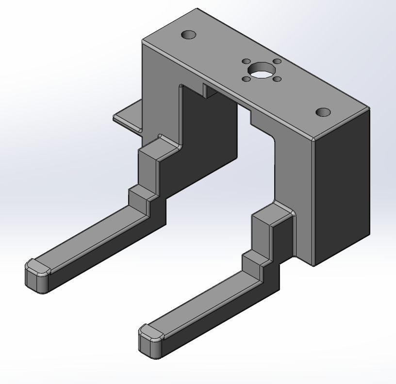
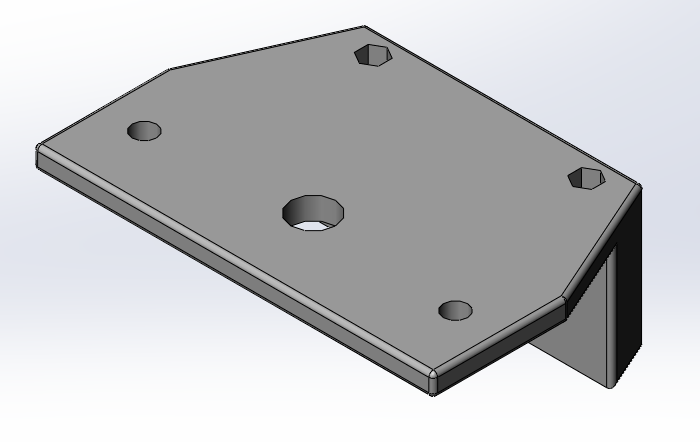
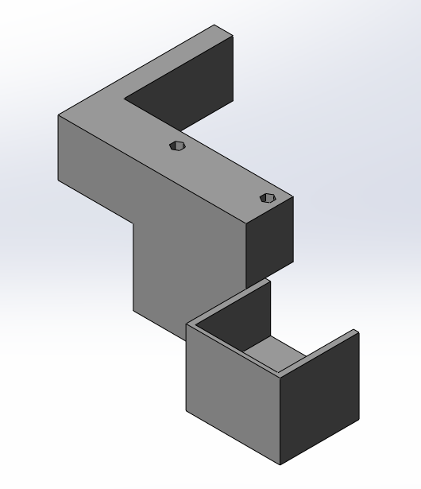
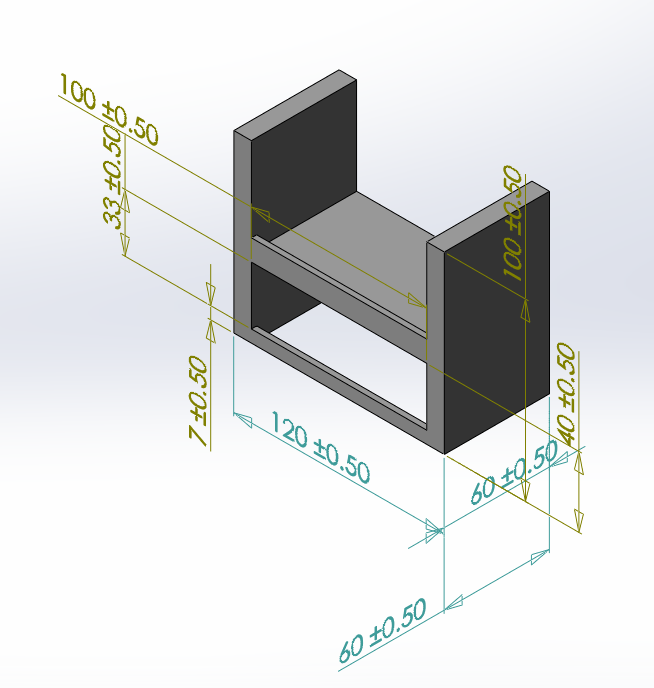
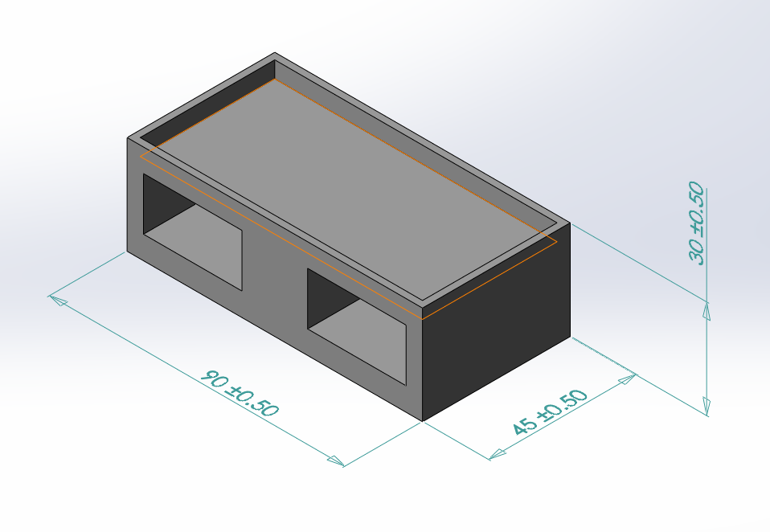

# Lift·Rack·Pallet 3D 기구 설계

이 문서는 TurtleBot3에 제작·장착한 Lift와 별도 적재 구조물인 2단 Rack,
Pallet의 실제 기구 설계와 제작 방법을 정리한다.
## 1. 최종 구현 형태

| 구성 | 역할 | 주요 결합 대상 |
| --- | --- | --- |
| Lift | Pallet을 들어 올리고 내리는 로봇 장착 승강 기구 | TurtleBot3, Pallet |
| Rack | Pallet을 보관하는 2단 적재 구조물 | Pallet |
| Pallet | 부품을 담고 Lift와 Rack 사이를 이동하는 적재판 | Lift fork, Rack |

## 2. 전체 조립체와 CAD 원본

전체 조립체의 정면·후면 CAD 렌더와 각 파트 형상은
[CAD Design](https://baksa2584.atlassian.net/wiki/spaces/KAN/pages/30146626/CAD+Design)
에서 확인할 수 있다. Confluence에 등록된 설계 파트는 다음 여섯 개다.

| 구분 | CAD 파일명 | 용도 |
| --- | --- | --- |
| Lift | [`motor_plate_R`](../assets/Cads/motor_plate_R.STEP) | motor와 수직 기둥을 지지하는 하단 plate |
| Lift | [`lift__R`](../assets/Cads/lift__R.STEP) | Pallet을 들어 올리는 중심 승강축과 fork |
| Lift | [`upper_R`](../assets/Cads/upper_R.STEP) | 상단 plate와 최대 stroke의 기계적 경계 |
| Lift | [`Arduino_plate_new`](../assets/Cads/Arduino_plate_new.STEP) | Arduino, battery, board를 장착하는 후방 plate |
| Rack | [`lack`](../assets/Cads/lack.STEP) | Pallet 보관용 2단 rack |
| Pallet | [`Pallet`](../assets/Cads/pallet.STEP) | 부품 적재 및 Lift·Rack 결합용 적재판 |

## 3. Lift 설계

### 3.1 `motor_plate_R`

- Step motor와 Lift 기둥을 지지하는 하단 plate다.
- 하단 구멍에 기둥을 체결할 때 plate와 수직이 되도록 고정한다.
- 기둥이 기울면 중심축과 `upper_R`이 비틀리고 motor 부하가 증가할 수 있다.

### 3.2 `lift__R`

- 실제로 승강하며 Pallet 아래로 진입하는 중심축과 fork 역할을 한다.
- 출력 후 guide hole이 뻑뻑하면 간섭 부위만 조금씩 연마한다.
- 한 번에 많이 연마하면 축 유격이 생기므로 실제 기둥에 반복 체결하며
  가공한다.

### 3.3 `upper_R`

- Lift 상단을 고정하며 물리적인 최대 stroke를 결정한다.
- 출력할 때 180도 뒤집어 배치하면 안정적으로 가공할 수 있다.
- `motor_plate_R`과 수직으로 맞지 않으면 중심축이 걸리고 motor가 과부하를
  받을 수 있다.

### 3.4 `Arduino_plate_new`

- Arduino, battery와 motor driver board를 장착하는 후방 plate다.
- 돌출 형상 때문에 3D printing support가 필요하다.
- 실제 조립에서는 connector를 분리할 공간과 Lift 이동 중 cable이 당겨지지
  않는 경로를 확보한다.

## 4. Rack 설계

Pallet을 보관하는 2단 Rack으로 설계됐다.

## 5. Pallet 설계

`Pallet`은 부품을 적재하고 Lift fork와 Rack을 연결하는 물리 인터페이스다.
Pallet 치수는 fork 간격, Rack 내부 폭과 적재 위치에 동시에 영향을 주므로
단독으로 변경하지 않는다.

## 6. 층별 승강 높이 기록

높이는 Lift home 위치를 `0 mm` 기준으로 측정한다. 하역 높이는 Pallet을
Rack에 내려놓고 fork가 빠질 수 있는 위치, 적재 높이는 fork가 Pallet을
들어 올려 Rack에서 꺼낼 수 있는 위치로 기록한다.

| 구분       | 동작 기준                           | 실측 확정값 (mm) |
| -------- | ------------------------------- | ----------: |
| 1층 하역 높이 | Pallet을 Rack 1층에 내려놓는 Lift 위치   |           0 |
| 1층 적재 높이 | Rack 1층의 Pallet을 들어 올리는 Lift 위치 |           6 |
| 2층 하역 높이 | Pallet을 Rack 2층에 내려놓는 Lift 위치   |          43 |
| 2층 적재 높이 | Rack 2층의 Pallet을 들어 올리는 Lift 위치 |          50 |
