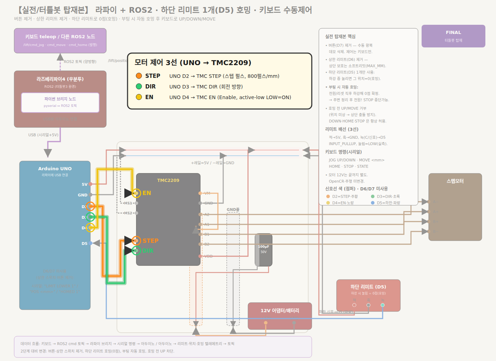

# Lift 전장 및 배선 설계

이 문서는 Lift 구동부에 사용된 controller, Step motor, driver, 전원,
limit switch와 실제 배선 확인 항목을 정리한다.

## 1. 하드웨어 부품

이름은 Confluence 문서의 표기를 사용하고, 문서와 배선도에서 추가로
확인된 사양만 비고에 기재한다. 확인할 수 없는 정보는 빈칸으로 둔다.

| 이름 | 역할 | 비고 |
| --- | --- | --- |
| Step 모터 | 리프트 승강 구동 | NEMA17 출력 나사 스테퍼 모터, `17HS4401S-T8*8`, 100 mm, 1.5 A, 정격 2.7 V |
| Step 모터 드라이버 | Step 모터 구동 제어 | TMC2209, 모터 전원 5.5–28 V, 로직 전압 3–5 V |
| Arduino Uno | 리프트 제어 및 입출력 처리 | |
| 전해 콘덴서 100uF | 모터 전원 안정화 | 정격 50 V |
| 리미트 스위치 | 리프트 하부 원점 감지 | 하부 장착, 3선식, +5 V·GND·신호 |
| DC 잭 케이블 암수 (배터리 용) | 배터리 전원 연결 | |
| 리튬이온 배터리 충전지 11.1V | 모터 구동 전원 공급 | |
| 1550pcs 점프헤드 커넥터 단자 핀 헤더 하우징 | 전원·신호 배선 연결 | |
| TB3 볼캐스터-A01 | 차체 하부 지지 | |
| 아두이노 USB 케이블 30cm 2EA | Arduino 연결 | |

## 2. 배선 자료

.png>)

## 3. Pinout 기록

배선도에서 확인된 값만 기록한다. 확인되지 않은 값은 빈칸으로 둔다.

| 신호 | Controller pin | 연결 대상 | 비고 |
| --- | --- | --- | --- |
| `STEP` | D2 | TMC2209 `STEP` | 800 pulses/mm |
| `DIR` | D3 | TMC2209 `DIR` | |
| `EN` | D4 | TMC2209 `EN` | `LOW=ON` |
| Lower limit | D5 | 하부 리미트 스위치 신호선 | `INPUT_PULLUP`, 눌림=`LOW` |
| 미사용 | D6, D7 | | |
| Logic GND | GND | Driver·controller 공통 GND | |
| Motor supply | | Battery → TMC2209 | |
