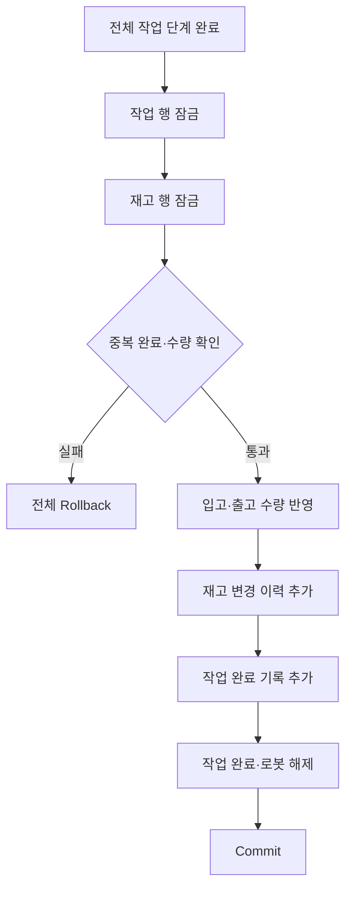

# 데이터베이스

작업 자원, 재고와 실행 이력을 PostgreSQL에서 일관되게 관리하는 구조입니다.

---

## 데이터 관계

| 데이터 | 테이블 | 역할 |
| --- | --- | --- |
| 기준정보 | `items`, `robots`, `locations` | 품목·로봇·작업 위치 |
| 경로·장치 | `location_route_steps`, `maps`, `cameras` | 이동 경유지·지도·카메라 |
| 현재 상태 | `inventory`, `tasks`, `safety_stops` | 재고·작업 큐·안전 정지 |
| 실행 정의 | `commands` | 작업 유형별 원자 명령 순서 |
| 실행 기록 | `evidence_events` | 단계·Callback·AI 판정·운영 이벤트 |
| 완료 기록 | `task_logs`, `item_change_logs` | 작업 결과와 재고 변경 이력 |

| 자원 | 점유 기준 |
| --- | --- |
| 로봇 | 완료되지 않은 작업 하나만 허용 |
| 입고 위치 | 같은 위치·층의 활성 입고 작업 하나만 허용 |
| 출고 재고 | 현재 수량에서 활성 출고 작업 수량을 제외 |
| 실시간 위치 | 서버 메모리에 최신 pose만 보관, 의미 있는 이벤트만 DB 기록 |

---

## 재고 확정

| 보장 | 구현 |
| --- | --- |
| 중복 자원 방지 | 활성 작업 제약과 transaction 잠금 |
| 음수 재고 방지 | 출고 수량 재확인 후 변경 |
| 중복 완료 방지 | 작업 상태 잠금 후 완료 여부 확인 |
| 중간 상태 방지 | 재고·이력·완료·로봇 해제를 한 transaction으로 처리 |
| 감사 이력 보존 | 현재 작업이 정리돼도 완료·변경 기록 유지 |

---

## 기준 파일

| 대상 | 파일 |
| --- | --- |
| 업무 데이터 모델 | [`ref/smartfactory-db-final.dbml`](../ref/smartfactory-db-final.dbml) |
| 신규 DB 스키마 | [`database/schema_pg.sql`](../database/schema_pg.sql) |
| 지도·카메라 스키마 | [`database/schema_pg_infra.sql`](../database/schema_pg_infra.sql) |
| 기존 DB 변경 | [`database/migrations/`](../database/migrations/) |
| 초기 기준정보 | [`database/seed/`](../database/seed/) |
| DB 연결·transaction | [`connection.py`](../backend/app/db/connection.py) |
| 마이그레이션 적용 | [`migrations.py`](../backend/app/db/migrations.py) |
| 작업 저장 | [`mvp/tasks.py`](../backend/app/db/mvp/tasks.py) |
| 재고 저장 | [`mvp/inventory.py`](../backend/app/db/mvp/inventory.py) |
| 실행 기록 | [`mvp/evidence.py`](../backend/app/db/mvp/evidence.py) |

| 변경 규칙 | 기준 |
| --- | --- |
| 적용된 migration | 수정하지 않고 새 번호 파일 추가 |
| 파일 검증 | 저장된 checksum과 다르면 서버 시작 중단 |
| 변경 단위 | DBML·DDL·migration·repository·API 모델 함께 수정 |
| 검증 대상 | 신규 DB와 기존 migration 적용 DB 모두 확인 |
| 운영 데이터 | 자동 seed에 포함하지 않음 |

| 관련 문서 | 내용 |
| --- | --- |
| [작업 흐름](WORKFLOW.md) | 작업 완료 시점 |
| [실행과 운영](OPERATIONS.md) | DB 점검·백업·복원 |
