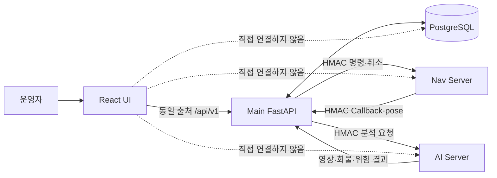
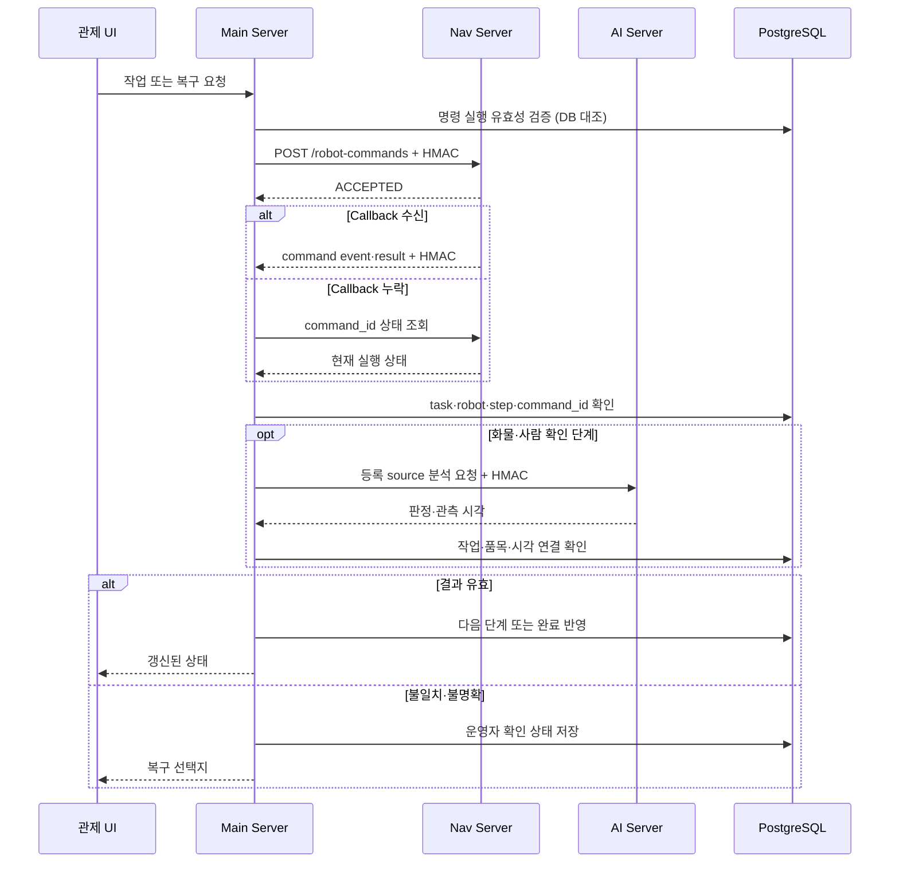

# 인터페이스

브라우저·Main·Nav·AI 사이의 연결 경계와 외부 결과 검증 규칙입니다.

---

## 연결 경계

| 연결 | Main의 책임 |
| --- | --- |
| Browser ↔ Main | 작업·기준정보 요청 검증과 통합 상태 제공 |
| Main ↔ Nav | 원자 명령 전송, 결과·pose 수신과 실행 ID 확인 |
| Main ↔ AI | 등록 카메라 중계, 화물·사람 판정과 작업 연결 확인 |
| Main ↔ PostgreSQL | 작업·재고·안전·이력 transaction |

---

## 명령과 결과

| 검증 대상 | 조건 |
| --- | --- |
| Nav 결과 | 현재 작업·로봇·단계·`command_id` 일치 |
| 중복 결과 | 동일 종료 결과는 한 번만 반영 |
| AI 결과 | 등록 source·작업·품목·관측 시각 일치 |
| 외부 timeout | 성공으로 추정하지 않음 |
| E-stop 해제 | 이전 작업 자동 재개 금지 |

---

## 주요 경로

| 방향 | 경로·기능 | 내용 |
| --- | --- | --- |
| Browser → Main | `/api/v1/work-orders`, `/tasks` | 작업 미리보기·생성·중단·복구 |
| Browser → Main | `/items`, `/storage-slots`, `/inventory` | 품목·위치·재고 관리 |
| Browser → Main | `/maps`, `/waypoints`, `/robots`, `/camera-sources` | 지도·장치 관리 |
| Main → Browser | `/status`, `/events`, `/records`, `/robot-poses` | 관제 상태와 이력 |
| Main → Nav | `POST /robot-commands` | 현재 단계 원자 명령 |
| Nav → Main | `/movement/command-events`, `/movement/results` | 명령 진행·종료 Callback |
| Nav → Main | `/robots/{robot_id}/pose` | 최신 로봇 위치 |
| Main ↔ AI | `/vision/*` | 영상 중계·화물 evidence·사람 위험 |

| Nav 명령 | 완료 결과 |
| --- | --- |
| `move_to_point` | `ARRIVED` |
| `dock_transfer` | `DONE` |
| `aruco_align` | `DONE` |
| `leave_dock` | `DONE` |
| `manual_drive`, `estop` | `DONE` |

| HMAC Header | 내용 |
| --- | --- |
| `X-SF-Timestamp` | 서명 생성 시각 |
| `X-SF-Nonce` | 요청 재사용 방지 값 |
| `X-SF-Signature` | method·path·body 기반 HMAC-SHA256 |

전체 Main API는 실행 중인 서버의 `/docs` 또는 `/openapi.json`에서 확인합니다.

| 관련 문서 | 내용 |
| --- | --- |
| [작업 흐름](WORKFLOW.md) | 상태 전이와 결과 반영 |
| [Nav 인터페이스](../../nav-server/docs/reference/INTERFACES.md) | Nav 명령 계약 |
| [실행과 운영](OPERATIONS.md) | 연결 설정과 진단 |
