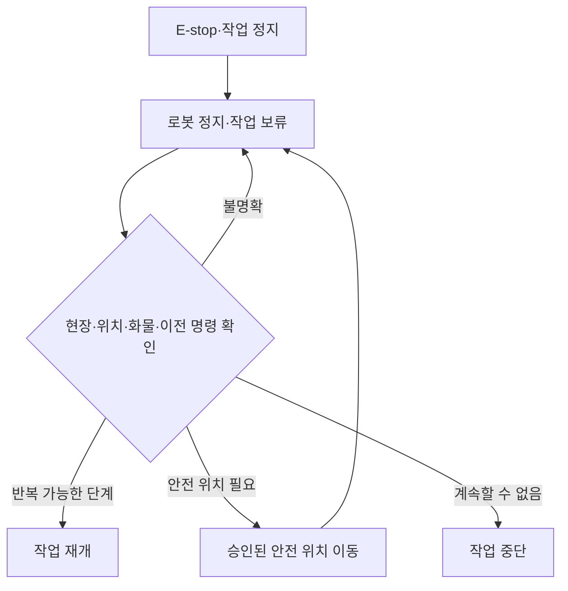

# 실행과 운영

Main Server의 실행 모드, 상태 점검, E-stop 복구와 검증 절차입니다.

---

## 실행과 점검

| 모드 | 구성 | 용도 |
| --- | --- | --- |
| Real | Main API + PostgreSQL + Nav·AI | 현장 연동·통합 검증 |
| Dev | Main API + Vite + PostgreSQL | Backend·UI 개발 |
| Fake | Fake API + Vite | 화면 구조 확인 |

| 준비 | 명령 |
| --- | --- |
| Python·Frontend 설치 | `./scripts/bootstrap.sh --skip-db` |
| 로컬 개발 DB 포함 | `LMS_POSTGRES_PASSWORD="<local-secret>" ./scripts/bootstrap.sh --local-dev` |
| 현장 설정 검사 | `./scripts/real.sh --check` |
| UI 빌드 후 실행 | `./scripts/real.sh --build` |
| Backend·Vite 개발 | `./scripts/real.sh --dev` |
| Fake UI | `LMS_DEV_HOST=127.0.0.1 ./scripts/fake.sh` |
| 종료 | 실행 터미널 `Ctrl+C` 또는 저장소 루트 stack 종료 명령 |

| 필수 설정 | 내용 |
| --- | --- |
| `LMS_DATABASE_URL` | PostgreSQL 연결 주소 |
| `LMS_PUBLIC_BASE_URL` | 외부 서버가 접근할 Main 주소 |
| `LMS_MOVEMENT_HOST` | Nav Server 주소 |
| `LMS_VISION_API_BASE_URL` | AI Server API 주소 |
| `LMS_MOVEMENT_ACTIVE_MAP_ID` | Nav와 함께 사용할 지도 ID |

| 점검 경로 | 확인 대상 |
| --- | --- |
| `/health` | Main API 프로세스 |
| `/api/v1/status` | DB·로봇·작업·외부 서버 상태 |
| `/api/v1/system/external-config` | Nav·AI·Callback·지도 설정 |
| `/api/v1/movement/pose-runtime` | 로봇 위치 수신과 최신성 |

| 증상 | 먼저 확인할 항목 |
| --- | --- |
| 서버 기동 실패 | DB 연결, 현장 설정, 자격 증명, 포트 |
| UI 미표시 | `/health`, `frontend/web/dist`, `--build` |
| 로봇 미배정 | 사용 상태, 통신, 배터리, 기능, 활성 작업 |
| 작업 정체 | 현재 단계, `command_id`, Callback, 안전 보류 |
| 위치 없음 | 로봇 등록, 보고 시각, 지도 ID, localization |
| 영상·판정 없음 | 카메라 등록, AI 연결, 결과 시각 |

---

## E-stop 복구

| 확인 | 기준 |
| --- | --- |
| 현장 | 사람과 장애물 제거 |
| 로봇 | 대상 로봇·지도·localization 일치 |
| 화물 | 적재·리프트 상태 확인 |
| 이전 명령 | `command_id` 종료 여부 확인 |
| 작업 재개 | 반복 가능한 단계만 새 ID로 실행 |
| 상태 불명확 | 자동 재전송 없이 보류 유지 |

E-stop 해제만으로 이전 작업을 재개하지 않습니다.

---

## 검증

| 대상 | 명령·기준 |
| --- | --- |
| 문서 | `./scripts/check_docs.sh` |
| 전체 검사 | `_test` DB를 지정한 뒤 `./scripts/check_all.sh` |
| DB 백업 | `./scripts/dump_current_db.sh` |
| DB 복원 | 별도 DB에서 `./scripts/restore_current_db.sh` 검증 후 적용 |
| Frontend | `npm run typecheck`, `npm run lint`, `npm run build` |
| 실물 동작 | 저장소 실물 E2E 체크리스트 별도 수행 |

| DB 변경 규칙 | 기준 |
| --- | --- |
| 적용된 migration | 수정하지 않음 |
| 복원 대상 | 운영 DB가 아닌 별도 DB에서 먼저 확인 |
| 확인 항목 | migration, 주요 데이터 수, API 응답 |
| 테스트 DB | 이름에 `_test`가 포함된 전용 DB 사용 |

| 관련 문서 | 내용 |
| --- | --- |
| [작업 흐름](WORKFLOW.md) | 작업 보류와 복구 상태 |
| [데이터베이스](DATABASE.md) | transaction과 migration |
| [전체 시작·종료](../../docs/operations/startup-shutdown.md) | 전체 서버 순서 |
| [실물 E2E](../../docs/operations/physical-e2e-checklist.md) | 실제 장비 검증 |
