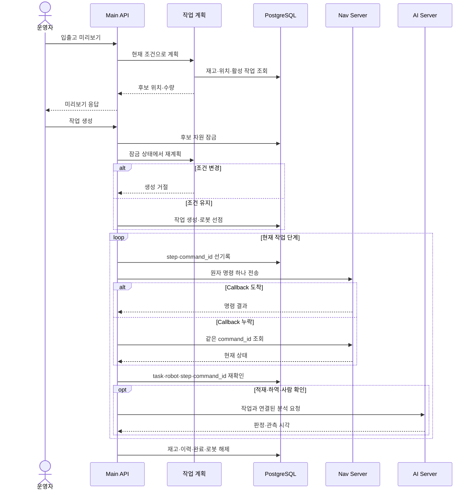
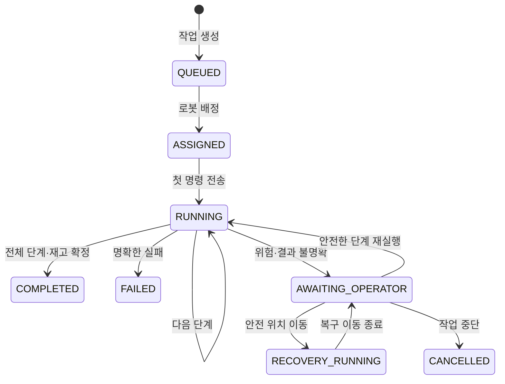

# 작업 흐름

작업 생성부터 로봇 배정, 단계 실행, 안전 복구와 완료까지의 제어 규칙입니다.

---

## 실행 순서

| 구현 지점 | 규칙 |
| --- | --- |
| 미리보기 | DB를 변경하거나 자원을 예약하지 않음 |
| 작업 생성 | 자원 잠금 후 위치·재고 조건을 다시 계산 |
| 로봇 배정 | 우선순위·생성 시각과 준비 상태·지원 기능을 함께 확인 |
| 명령 실행 | Nav에는 현재 단계의 원자 명령 하나만 전달 |
| 결과 반영 | 현재 작업과 명령이 모두 일치하는 종료 결과만 한 번 반영 |
| 완료 | 모든 단계 확인 후 재고와 완료 기록을 함께 저장 |

---

## 상태와 복구

| 전환 조건 | 처리 |
| --- | --- |
| Callback 중복·오래된 결과 | 기록만 남기고 현재 단계를 진행하지 않음 |
| 화물 판정 누락·대상 불일치 | `AWAITING_OPERATOR`로 전환 |
| 사람 위험 감지 | 작업 보류 후 E-stop 요청 |
| E-stop 해제 | 이전 작업을 자동 재개하지 않음 |
| 리프트 실행 여부 불명확 | 같은 명령을 자동 재전송하지 않음 |
| 안전 위치 이동 | 기존 작업을 보류한 채 별도 복구 명령 실행 |

---

## 구현 위치

| 구현 | 파일 |
| --- | --- |
| 작업 계획·재검증 | [`work_order_planner.py`](../backend/app/services/work_order_planner.py) |
| 작업 생성 | [`work_orders_pg.py`](../backend/app/services/work_orders_pg.py) |
| 로봇 배정 | [`tasks.py`](../backend/app/services/tasks.py) |
| 단계 실행 | [`orchestrator.py`](../backend/app/services/orchestrator.py) |
| Callback 처리 | [`movement_callbacks.py`](../backend/app/services/movement_callbacks.py) |
| Polling | [`task_progress_poller.py`](../backend/app/services/task_progress_poller.py) |
| 작업 복구 | [`task_recovery.py`](../backend/app/services/task_recovery.py) |
| 화물·사람 안전 | [`lift_load_evidence.py`](../backend/app/services/lift_load_evidence.py), [`person_hazard.py`](../backend/app/services/person_hazard.py) |
| 재고 확정 | [`inventory_ops.py`](../backend/app/services/inventory_ops.py) |

| 관련 문서                   | 내용                    |
| ----------------------- | --------------------- |
| [데이터베이스](DATABASE.md)   | 자원 점유와 완료 transaction |
| [인터페이스](INTERFACES.md)  | Nav·AI 명령과 결과         |
| [실행과 운영](OPERATIONS.md) | E-stop 복구와 검증         |
