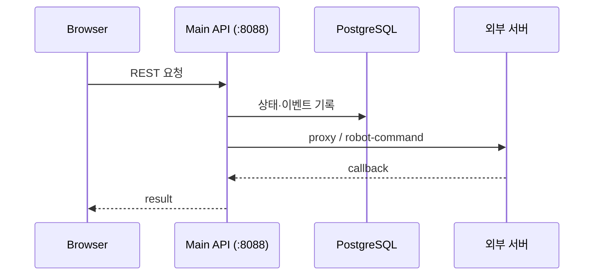

# API

상태: Active
소유: Backend
최종 갱신: 2026-07-09 18:25 KST
목적: Main REST 진입점 — 작성 규칙 + as-built 링크. 엔드포인트·설명은 [API_MAIN](API_MAIN.md) 한 문서.

브라우저는 Main API만 호출한다. 서버 간 계약은 [interfaces/](../interfaces/README.md).

## 문서

| 문서 | 역할 |
| --- | --- |
| 본 README | URL·method·에러·callback **작성 규칙** |
| [API_MAIN](API_MAIN.md) | 엔드포인트 목록 + as-built 설명 |

## 작성 규칙

### URL · Method

- Public prefix: `/api/v1` (`Settings.api_prefix`).
- Collection 복수형: `/robots`, `/tasks`, `/work-orders`. 단건: `/robots/{robot_id}`.
- 상태 전이: `POST /resources/{id}/action`. Callback: `/movement/command-events`.
- Admin/debug: `/db/*`, `/system/*`, `/comm/*`.

| Method | Use |
| --- | --- |
| `GET` | 조회·health·diagnostics |
| `POST` | 생성·command·전이·callback |
| `DELETE` | 실제 삭제 |
| `PUT/PATCH` | 기본 금지 — 필요 시 문서 먼저 |

### Response · Error

- 단순 성공: `ApiMessage`. 조회: Pydantic response model.
- Command API: command id · accepted · external 요약.
- UI 분기 실패는 status + stable `detail` code 유지.

| Situation | Status |
| --- | ---: |
| 없음 | 404 |
| 상태 불가 | 409 |
| 잘못된 값 | 400 / 422 |
| 외부 timeout/failure | 502 / 504 |

### ID · Callback · Limits

- path id 이름 = DB 관례 (`robot_id`, `command_id`, `task_id`, `map_id` …).
- Callback은 중복 전제·idempotency key·raw payload 보존. 폴링으로 보정.
- List 기본 `limit=50` (1–200). DB admin row 최대 500.

### 변경 절차 · 금지

1. [API_MAIN](API_MAIN.md) / 외부 계약 문서 먼저 → 코드 → FE type → `check_all`.
2. Browser가 Movement/Vision URL 직접 호출 금지. Route가 raw external을 UI에 그대로 넘기지 않음. 같은 endpoint에 상황별 다른 response shape 금지.
