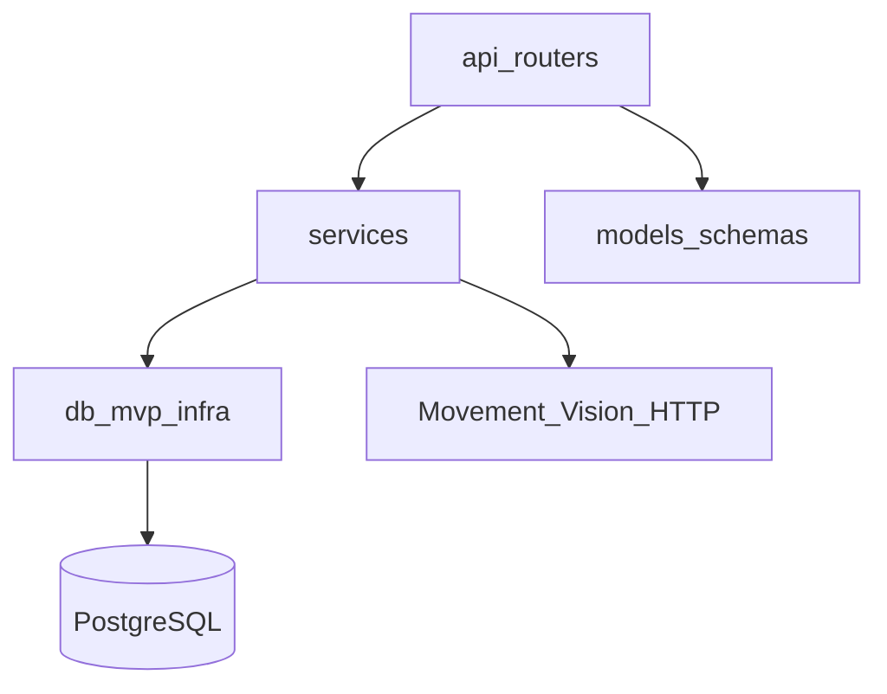
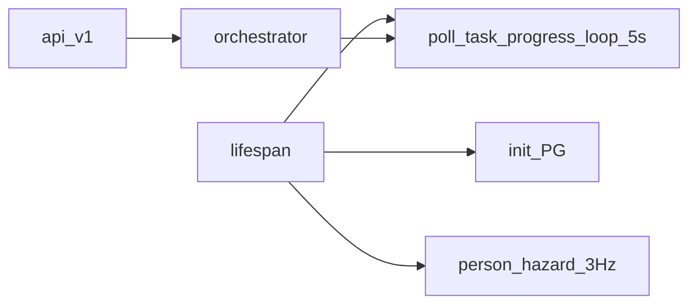
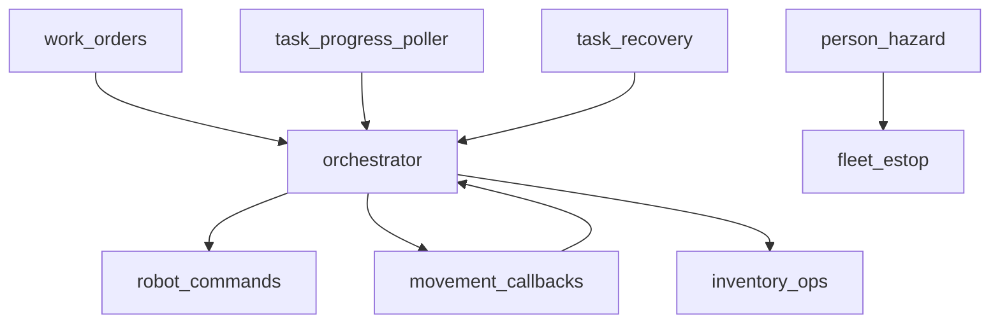

# Backend

상태: Active
소유: Backend
작성: 2026-06-22 22:35 KST
최종 갱신: 2026-07-09 17:05 KST
목적: 백엔드 레이어·오케스트레이션 허브·주요 서비스 경계를 도표로 보인다.

## 레이어

| Layer | 책임 |
| --- | --- |
| `api/routers` | path, validation, txn boundary |
| `services` | 업무·연동 로직 (orchestrator가 허브) |
| `db` | PG connection / repository |
| `models` | request/response schema |
| `core` | settings |

## 런타임

- prefix: `/api/v1` (`Settings.api_prefix`)
- DB: `LMS_DATABASE_URL` 필수 (SQLite runtime 없음)
- SoT: `ref/smartfactory-db-final.dbml` → `database/schema_pg.sql` (+ infra)

## 서비스 허브

상세 모듈 표·폴더 트리는 코드 탐색이 정본이다. 품질 규약: [CODE_QUALITY_POLICY](../contributing/CODE_QUALITY_POLICY.md).

## 디자인 철학

- router는 얇게, **orchestrator가 허브** (역참조 금지: `work_orders→orchestrator→repo/movement`).
- 도메인별 파일 분리; barrel(`mvp_repositories`, `schemas`)로 import 안정.
- 외부 연동 실패는 501/명시 에러로 표면화 — 문서에 “미구현”을 숨기지 않음.

## 관련

- [OVERVIEW](OVERVIEW.md) · [TASK_ORCHESTRATION](TASK_ORCHESTRATION.md) · [db/](db/README.md) · [api/](../api/README.md)
