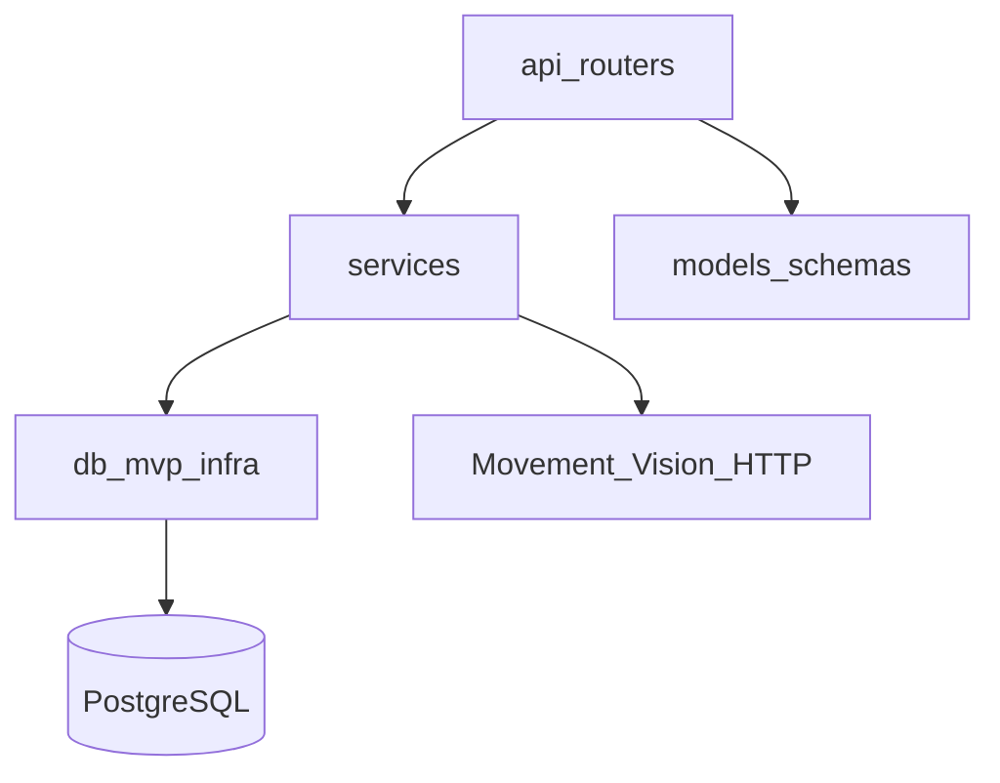
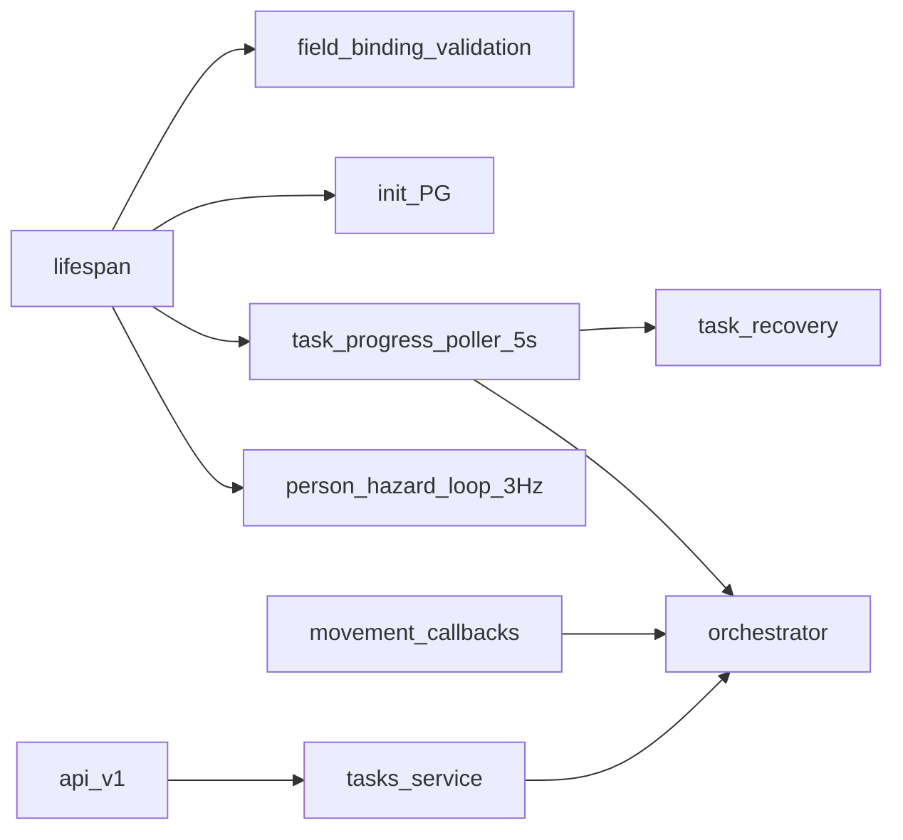
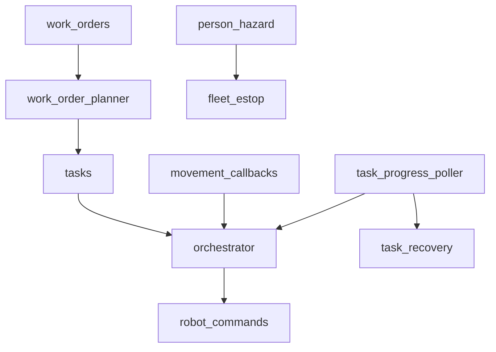

# Backend

상태: Active
소유: Backend
작성: 2026-06-22 22:35 KST
최종 갱신: 2026-07-10 20:02 KST
목적: 백엔드 레이어·오케스트레이션 허브·주요 서비스 경계를 도표로 보인다.

## 레이어

| Layer | 책임 |
| --- | --- |
| `api/routers` | path, validation, txn boundary |
| `services` | 업무·연동 로직 (orchestrator가 허브) |
| `db` | PG connection / repository |
| `models` | request/response schema |
| `core` | settings |

## 런타임

- prefix: `/api/v1` (`Settings.api_prefix`)
- DB: `LMS_DATABASE_URL` 필수 (SQLite runtime 없음)
- 시작 전 `field_bindings`와 DB URL을 검증한다. 검증에 실패하면 background loop를 시작하지 않는다.
- task progress poller는 5초마다 callback 누락 step 진행·recovery 진행을 확인하고, 준비된 유휴 로봇에 queued task를 자동 배정·시작한다.
- person-hazard loop는 기본 3Hz이며 `LMS_PERSON_HAZARD_ENABLED`와 `LMS_PERSON_HAZARD_POLL_HZ`로 제어한다.
- SoT: `ref/smartfactory-db-final.dbml` → `database/schema_pg.sql` (+ infra)

## 서비스 허브

| Service | 현재 책임 |
| --- | --- |
| `tasks` | task 생성·배정·완료·취소를 transaction 안에서 처리한다. 배정 전 Movement readiness와 task type별 capability를 fail-closed로 확인한다. |
| `work_orders` / `work_orders_pg` | 입출고 요청을 planner 결과와 PostgreSQL task facade로 연결하고, 생성·취소·우선순위 변경을 처리한다. |
| `orchestrator` | assigned task를 command steps로 펼쳐 Movement에 dispatch하고, 유효한 callback만으로 step·task 상태를 전진한다. |
| `movement_callbacks` | Movement event/result/status를 감사 로그에 저장하고, active task·robot·command가 일치할 때만 orchestrator에 전달한다. |
| `task_progress_poller` / `task_recovery` | callback 누락을 보완하고 `AWAITING_OPERATOR` task의 recovery context·preview·decision·execute 경로를 제공한다. |

상세 모듈 표·폴더 트리는 코드 탐색이 정본이다. 품질 규약: [CODE_QUALITY_POLICY](../contributing/CODE_QUALITY_POLICY.md).

## 디자인 철학

- router는 얇게, task lifecycle은 `tasks`, step dispatch·전이는 **orchestrator**가 소유한다.
- `work_orders`는 planner와 task facade이며, Movement command를 직접 전진시키지 않는다.
- callback은 active task의 assigned robot과 dispatched command가 일치할 때만 상태를 전진시킨다.
- 도메인별 파일 분리; barrel(`mvp_repositories`, `schemas`)로 import 안정.
- readiness·capability를 확인할 수 없으면 배정을 거부한다. 외부 연동 실패는 명시 오류로 표면화한다.

## 관련

- [OVERVIEW](OVERVIEW.md) · [TASK_ORCHESTRATION](TASK_ORCHESTRATION.md) · [db/](db/README.md) · [api/](../api/README.md)
