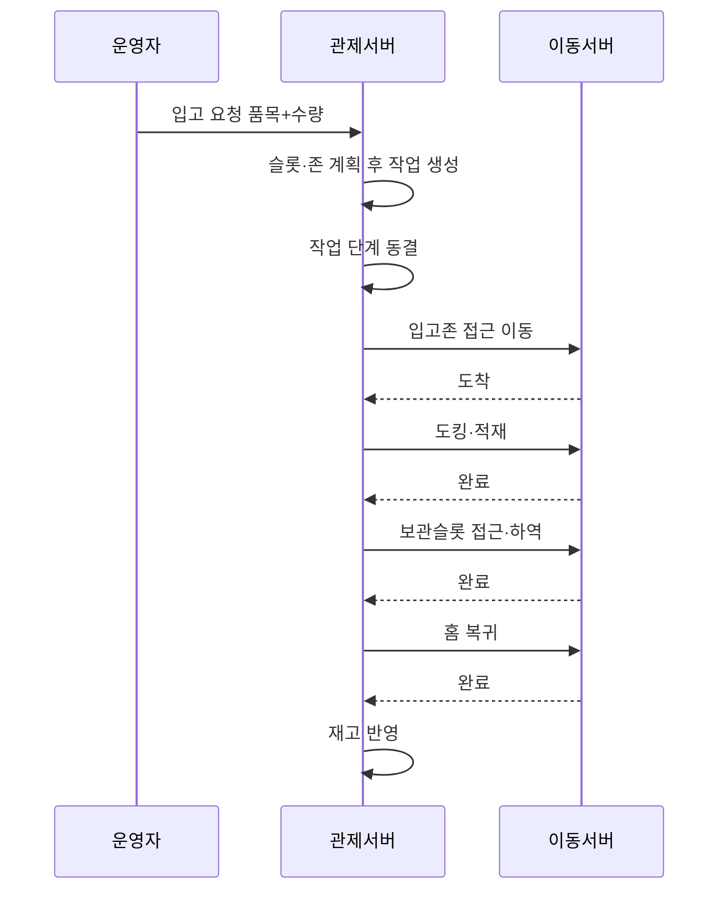
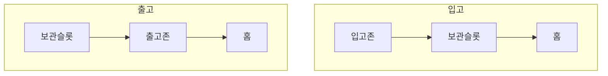

# 입출고 업무 흐름

상태: Active
소유: Backend
작성: 2026-06-22 23:05 KST
최종 갱신: 2026-07-09 17:20 KST
목적: 입고/출고 한 건이 운영자 입력부터 로봇 실행·재고 반영까지 어떻게 도는지 보인다. 용어: [GLOSSARY](GLOSSARY.md).

운영자는 **품목+수량**만 입력한다. 관제가 슬롯·존·작업·단계를 계획한다.

## 입고 한 건 (E2E)

## 왜 접근 후 도킹이 나뉘나 (게이트)

도킹 지점 바로 앞에서 **한 번 멈춘 뒤**(접근/ARRIVED), 관제가 “적재/하역을 진행하라”고 따로 지시한다(`dock_transfer`).
이유: 정밀 도킹·리프트는 이동 서버 원자 블록이고, 관제는 타이밍·층·마커만 고른다. 비상정지·확인 훅을 끼우기 쉽다.

## 업무 흐름 요약

## 디자인 철학

- 별도 업무 서버 없음 — 관제 안 입출고 계층.
- 기본은 자동 계획; 운영자가 슬롯/존을 지정하면 우선.
- 각 도킹은 **게이트 2단계**(접근 → 도킹+층).
- 완료 시에만 재고 반영(비상정지/실패 시 미반영).

## 도메인

| 개념 | 역할 |
| --- | --- |
| waypoint | 맵 좌표 SoT |
| storage slot | 선반 슬롯 |
| work order | 입출고 상위 요청 |
| task / step | 실행 단위 → [작업 실행 흐름](TASK_ORCHESTRATION.md) |

## 시스템 대응

| 업무 | 코드 |
| --- | --- |
| 미리보기 / 생성 | `POST /work-orders/preview`, `POST /work-orders` |
| 단계 실행 | [TASK_ORCHESTRATION](TASK_ORCHESTRATION.md) |
| 도킹 모델 | [ADR](../decisions/2026-06-22-docking-and-path-model.md) |
