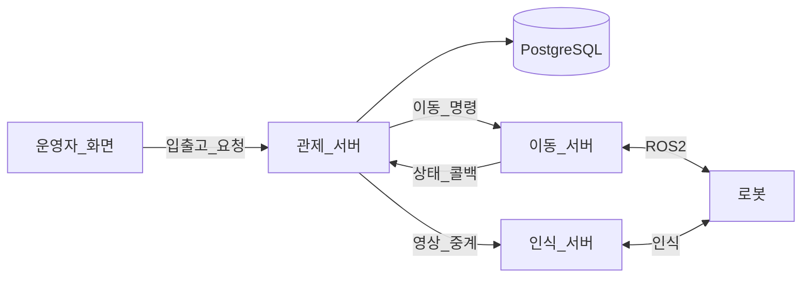
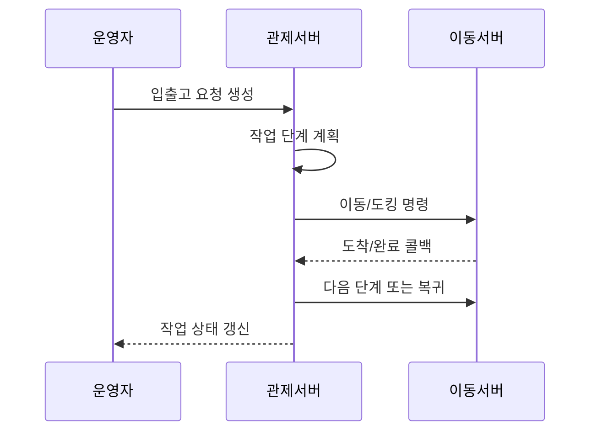
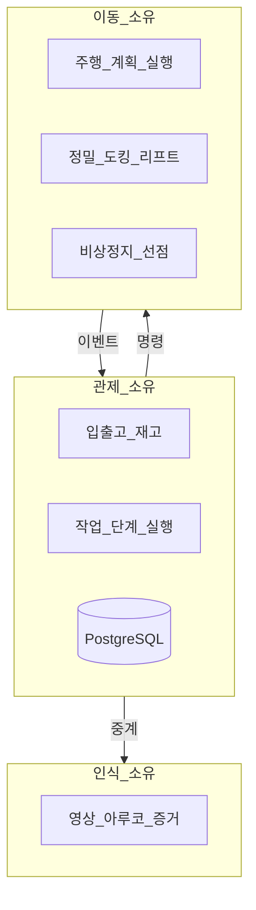

# 시스템 아키텍처 개요

상태: Active
소유: Docs
작성: 2026-06-23 00:00 KST
최종 갱신: 2026-07-09 17:20 KST
목적: 관제·이동·인식 서버의 경계·흐름·책임을 한눈에 보이게 한다. 용어는 [GLOSSARY](GLOSSARY.md).

## 토폴로지

## 요청 흐름

## 디자인 철학

- **브라우저 → 관제만.** 외부 서버 직접 호출 금지(인식 WebRTC 미디어만 예외).
- **외부 서버 → DB 직접 접근 금지.** API/콜백만.
- **관제 = 무엇을** (좌표·마커·동작·층). **이동 = 어떻게**. **인식 = 무엇이 보이나**.
- 콜백은 누락될 수 있다 → 멱등 + 명령 조회 폴백.
- 비상정지는 전 로봇 일괄·자동 재개 금지 → **운영자 개입 대기**. 상세: [작업 실행 흐름](TASK_ORCHESTRATION.md).

## 책임 한눈에

| 책임 | 소유 | 정본 |
| --- | --- | --- |
| 입출고·재고·슬롯 | 관제 | [입출고 흐름](INBOUND_OUTBOUND.md) |
| 작업 단계 실행 | 관제 | [작업 실행 흐름](TASK_ORCHESTRATION.md) |
| 주행·도킹·비상정지 선점 | 이동 | [Nav Server contract](../../../nav-server/docs/reference/MAIN_SERVER_CONTRACT.md) |
| 영상·아루코 | 인식 | [interfaces README](../interfaces/README.md) |
| DB SoT | 관제 | [db/](db/README.md) |

## 시스템 대응 (구현)

코드·계약 식별자. 상단 스토리와 같은 의미다.

| 업무 | 코드 |
| --- | --- |
| 이동 명령 종류 | `move_to_point` · `dock_transfer` · `aruco_align` · `leave_dock` · `manual_drive` · `estop` |
| 명령 API | `POST/GET /robot-commands` (`services/robot_commands.py`) |
| Movement 미구현 | `501 movement_robot_commands_api_missing` |

Movement 필드·callback 스키마 → [Nav Server contract](../../../nav-server/docs/reference/MAIN_SERVER_CONTRACT.md).

## 정본 지도

| 영역 | 링크 |
| --- | --- |
| 용어 | [GLOSSARY](GLOSSARY.md) |
| 백엔드 레이어 | [BACKEND](BACKEND.md) |
| API | [api/](../api/README.md) |
| 연동 | [interfaces/README](../interfaces/README.md) |
| UX | [IA](../ui-ux/IA.md) |
