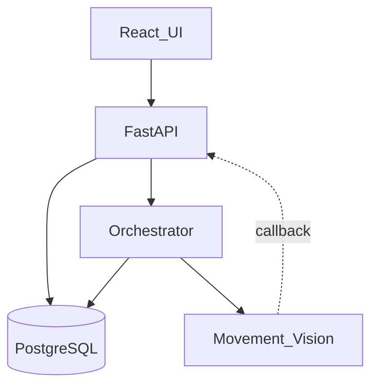

# Architecture

상태: Active
소유: Backend
최종 갱신: 2026-07-09 16:50 KST
목적: 시스템 구조·오케스트레이션·백엔드/프론트 레이아웃·DB를 안내한다.

## 시스템 (diagram-first 정본)

- [GLOSSARY](GLOSSARY.md) — 업무어 ↔ 코드어
- [OVERVIEW](OVERVIEW.md) — 토폴로지·경계·책임
- [INBOUND_OUTBOUND](INBOUND_OUTBOUND.md) — 입출고 업무 흐름
- [TASK_ORCHESTRATION](TASK_ORCHESTRATION.md) — 작업 단계·콜백·복구

## 구조

- [REPOSITORY](REPOSITORY.md)
- [BACKEND](BACKEND.md)
- 프론트 레이아웃·as-built → [ui-ux/FRONTEND](../ui-ux/FRONTEND.md)

## 데이터베이스

→ [db/](db/README.md) — 12테이블 ERD 포함
