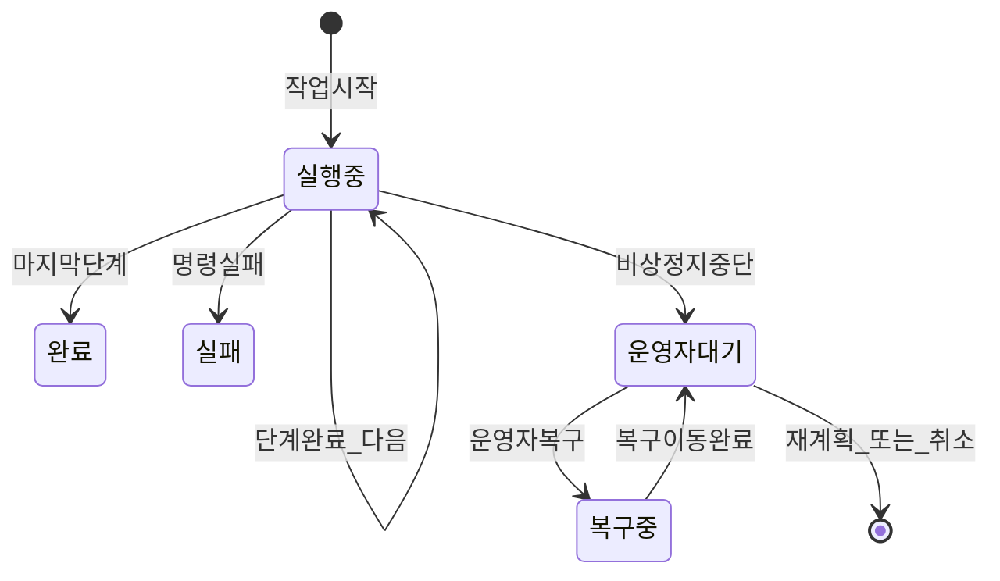
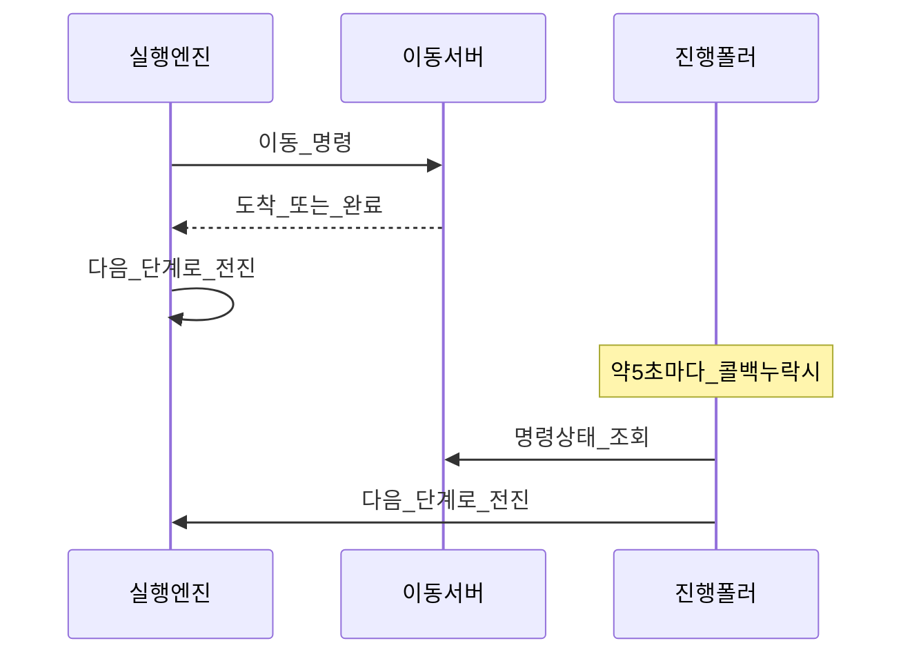
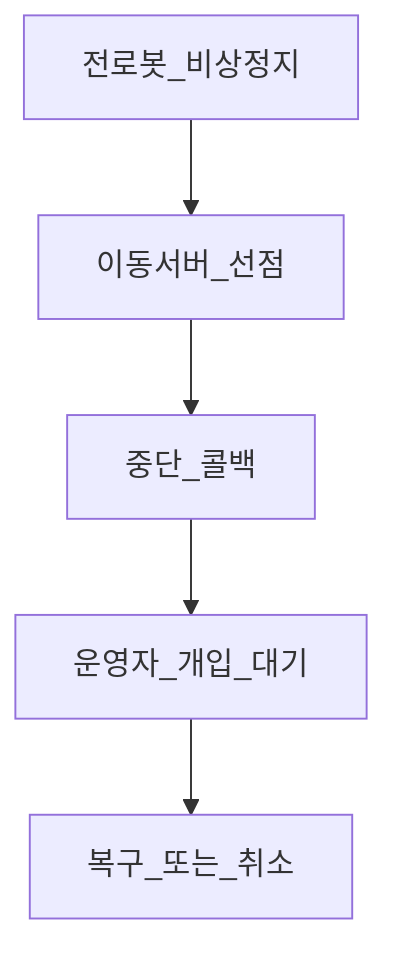

# 작업 실행 흐름

상태: Active
소유: Backend
작성: 2026-06-23 KST
최종 갱신: 2026-07-15 KST
목적: 입출고 스토리([INBOUND_OUTBOUND](INBOUND_OUTBOUND.md)) 이후, 관제가 작업 단계를 어떻게 전진·복구하는지 보인다. 용어: [GLOSSARY](GLOSSARY.md).

코드: `orchestrator.py`, `task_progress_poller.py`, `task_recovery.py`.

## 핵심 흐름

## 디자인 철학

- **미리 펼침:** 작업 시작 시 단계 목록 + 진행 인덱스 동결.
- **하이브리드 전진:** 콜백이 주 경로, 진행 폴러가 안전망. 같은 전진 함수.
- **멱등:** 명령 id·현재 단계·미완료 가드로 중복 콜백 무시.
- **게이트:** 접근 이동 → 도착 → 도킹 → 완료. lift/load evidence `gate` 모드에서는 Main이 `PASS` + `command_satisfying=true`만 승인한다.
- **Fail-safe evidence hold:** load는 `dock_transfer DONE` 뒤, unload는 `PRE_DROP_OFF`(Nav dispatch 직전)에 evidence gate를 수행한다. 비승인/skip/error/예외는 `phase=AWAITING_OPERATOR`, `recovery.reason=evidence_gate`로 보류하고 다음 dispatch를 금지한다.
- **비상정지:** 이동 서버 중단 콜백 → **운영자 개입 대기**. 자동 재개 없음. 복구는 `task_recovery`.
- **물리 이동 hazard monitor:** Main은 `move_to_point`(충전 접근 포함), `aruco_align`, `dock_transfer`
  (접근·삽입·리프트·후진), `leave_dock`를 dispatch 전에 arm한다. arm/retention 실패는 Movement
  HTTP를 보내지 않고 fail-closed 한다; 같은 task의 연속 단계에서는 monitor를 해제하지 않는다.
- **짧은 dispatch claim:** 복구 이동은 `PENDING → DISPATCHING → SENT`를 DB에 남긴다.
  `DISPATCHING` claim을 commit한 뒤 DB lock을 놓고 Movement HTTP를 호출하며, 응답 뒤 같은
  task·command·state일 때만 확정한다. 중간에 hazard 또는 stop이 먼저 기록되면 그 상태를
  덮어쓰지 않는다.
- **모호한 재시작:** `DISPATCHING` 또는 `ABORT_STOP_REQUESTED` 상태로 Main이 재시작하면
  명령 재전송이나 task 종료를 추정하지 않는다. E-stop 후 `AWAITING_OPERATOR`로 전환한다.

## 입고 단계 예

## 비상정지

## 시스템 대응

| 업무 | 코드 |
| --- | --- |
| 단계 계획 | `plan_command_steps` |
| 현재 단계 전송 | `dispatch_current_step` |
| 이벤트 전진 | `advance_on_command_event` |
| 진행 폴러 | `poll_task_progress_loop` |
| 상태 JSON | `steps[]`, `step_index`, `phase=AWAITING_OPERATOR` |

## 관련

- [입출고 흐름](INBOUND_OUTBOUND.md) · [개요](OVERVIEW.md) · [GLOSSARY](GLOSSARY.md)
- 현장 ESTOP 복구: [ESTOP_RECOVERY_PLAYBOOK](../operations/ESTOP_RECOVERY_PLAYBOOK.md)
