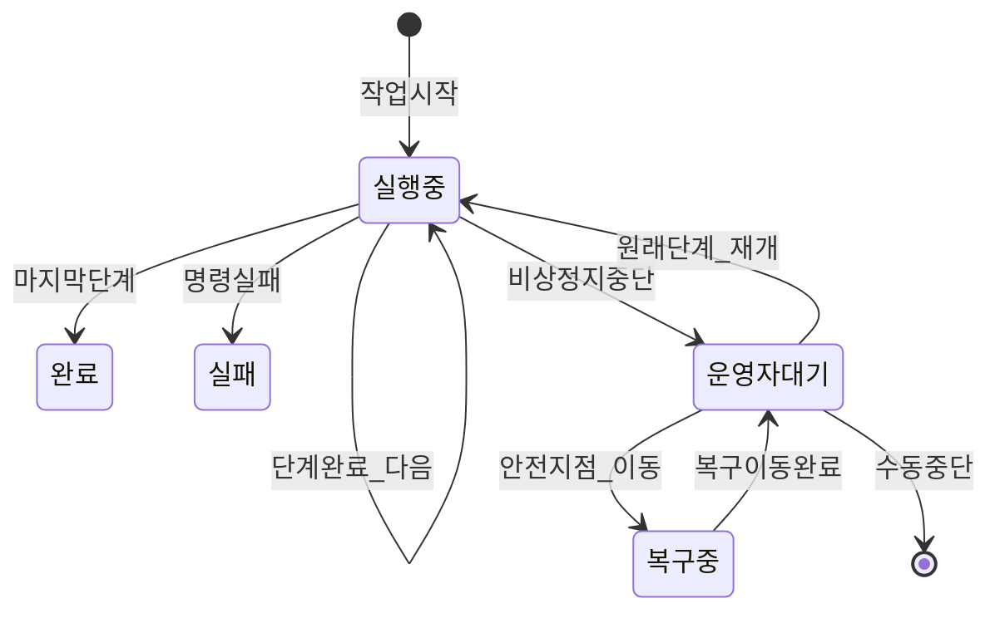
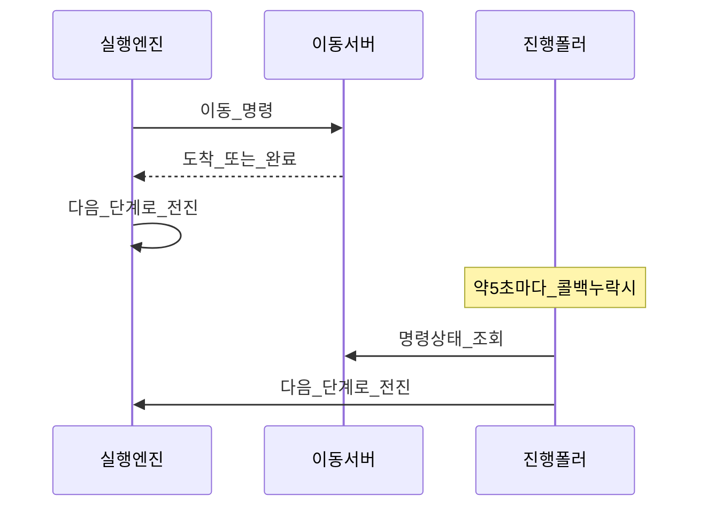
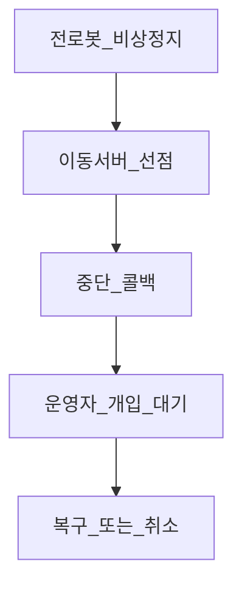

# 작업 실행 흐름

상태: Active
소유: Backend
작성: 2026-06-23 KST
최종 갱신: 2026-07-17 KST
목적: 입출고 스토리([INBOUND_OUTBOUND](INBOUND_OUTBOUND.md)) 이후, 관제가 작업 단계를 어떻게 전진·복구하는지 보인다. 용어: [GLOSSARY](GLOSSARY.md).

코드: `orchestrator.py`, `task_progress_poller.py`, `task_recovery.py`.

## 핵심 흐름

## 디자인 철학

- **미리 펼침:** 작업 시작 시 단계 목록 + 진행 인덱스 동결.
- **정의와 실행 ID 분리:** `commands.id`는 `task_type + sequence_no`의 정적 레시피 FK다. Nav·AI에 보내는 runtime command ID는 실행·재시도마다 새로 만들고 evidence의 `data_json`에 남긴다.
- **하이브리드 전진:** 콜백이 주 경로, 진행 폴러가 안전망. 같은 전진 함수.
- **멱등:** 명령 id·현재 단계·미완료 가드로 중복 콜백 무시.
- **게이트:** 접근 이동 → 도착 → 도킹 → 완료. lift/load evidence `gate` 모드에서는 Main이 `PASS` + `command_satisfying=true`만 승인한다.
- **Fail-safe evidence hold:** load는 `dock_transfer DONE` 뒤, unload는 `PRE_DROP_OFF`(Nav dispatch 직전)에 evidence gate를 수행한다. 비승인/skip/error/예외는 `phase=AWAITING_OPERATOR`, `recovery.reason=evidence_gate`로 보류하고 다음 dispatch를 금지한다.
- **비상정지:** 이동 서버 중단 콜백 → **운영자 개입 대기**. E-stop clear만으로 자동 재개하지 않는다. 운영자가 승인한 retry-safe 이동 step만 새 retry command ID로 같은 Task를 계속하며, 나머지 복구는 `task_recovery`가 차단하거나 대체 경로로 처리한다.
- **사람 hazard monitor 범위:** 기본 로봇 안전장치는 항상 유지한다. AI 사람 monitor는 `POST_PICK_UP`을 통과한 뒤 `PRE_DROP_OFF` 전까지의 **적재 운송 NAV**에만 arm한다. 화물이 `LOADED`인 안전지점 복구 이동도 같은 범위다. 빈 차 접근·도킹·복귀에는 arm하지 않는다. 필요한 구간에서 arm/retention이 실패하면 Movement HTTP를 보내지 않고 fail-closed 한다.
- **짧은 dispatch claim:** 복구 이동은 `PENDING → DISPATCHING → SENT`를 DB에 남긴다.
  `DISPATCHING` claim을 commit한 뒤 DB lock을 놓고 Movement HTTP를 호출하며, 응답 뒤 같은
  task·command·state일 때만 확정한다. 중간에 hazard 또는 stop이 먼저 기록되면 그 상태를
  덮어쓰지 않는다.
- **모호한 재시작:** `DISPATCHING` 또는 `ABORT_STOP_REQUESTED` 상태로 Main이 재시작하면
  명령 재전송이나 task 종료를 추정하지 않는다. E-stop 후 `AWAITING_OPERATOR`로 전환한다.

## 입출고 논리 레시피

경유 waypoint가 늘어도 같은 논리 단계의 `command_sequence_no`를 공유한다. 따라서 runtime step 수가 달라져도 evidence가 다른 `commands.id`에 붙지 않는다.

## 복구 판정

| 상황 | 근거 | 처리 |
| --- | --- | --- |
| callback 유실·중복 | Movement 상태 조회, `event_id`, terminal state | 자동 정합·한 번만 전진 |
| localization 재탐색 | `LOCALIZATION_RECOVERY` 정의, 실행별 ID, fresh health의 `localized=true` | UI의 `위치 다시 찾기`; 로봇은 움직이지 않고 task는 보류 유지 |
| 일시적 ArUco 정렬 실패 | 이전 command terminal, 현재 step·marker 유지 | 현장 확인 뒤 같은 `aruco_align` step을 새 runtime ID로 재개 |
| AI evidence 부족·불일치 | fresh AI response, Main trusted gate | evidence 재평가; PASS가 아니면 보류 |
| 사람 hazard·반복 감지 | fresh person advisory, Main safety stop | timeout만으로 풀지 않음. E-stop/현장 확인 뒤 수동 재개 |
| dock/lift 중단·화물 불명 | cargo·센서 상태가 모호함 | 자동 재시도 금지, 수동복구 또는 중단 |

`LOCALIZATION_RESTART_ACCEPTED`는 재탐색 요청 접수 근거다. 실제 주행 재개 조건은 이후 Movement health의 `localized=true`, fresh scan/TF, `nav2_ready=true`다.

## 비상정지

## 시스템 대응

| 업무 | 코드 |
| --- | --- |
| 단계 계획 | `plan_command_steps` |
| 현재 단계 전송 | `dispatch_current_step` |
| 이벤트 전진 | `advance_on_command_event` |
| 진행 폴러 | `poll_task_progress_loop` |
| 정적 레시피 진행 | `commands` + `evidence_events.command_id` |
| runtime 상태 JSON | `steps[]`, `step_index`, `phase=AWAITING_OPERATOR` |

## 관련

- [입출고 흐름](INBOUND_OUTBOUND.md) · [개요](OVERVIEW.md) · [GLOSSARY](GLOSSARY.md)
- 현장 ESTOP 복구: [ESTOP_RECOVERY_PLAYBOOK](../operations/ESTOP_RECOVERY_PLAYBOOK.md)
