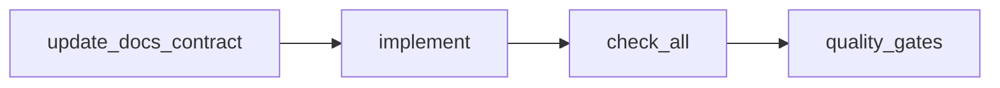

# Development Guide

상태: Active
소유: Docs
작성: 2026-06-26 11:20 KST
최종 갱신: 2026-07-15 KST
목적: 기여 흐름·작성 규칙·CI 요약을 한 진입점으로 둔다.

## 기여 흐름

## 원칙

- Main + PostgreSQL이 업무 SoT. DBML → DDL.
- 웹은 Main `/api/v1`만 (Vision WebRTC 미디어 예외).
- Service hostname/timeout은 `.env` + `Settings`.
- 기능 완료 = API + UI + DB + 문서 + 검증.

## 규칙 지도

| Area | SoT |
| --- | --- |
| 레포 구조 | [REPOSITORY](../architecture/REPOSITORY.md) |
| 백엔드 | [BACKEND](../architecture/BACKEND.md) · [CODE_QUALITY](CODE_QUALITY_POLICY.md) |
| API 규칙 | [api/README](../api/README.md) |
| DB 변경 | [DB_MIGRATION](../operations/DB_MIGRATION.md) |
| 프론트 | [FRONTEND](../ui-ux/FRONTEND.md) · [QUALITY_GATE](../operations/QUALITY_GATE.md) |
| 문서 | [DOCUMENTATION_GUIDE](../DOCUMENTATION_GUIDE.md) |
| Git | [GIT_WORKFLOW](../operations/GIT_WORKFLOW.md) |
| 품질 게이트 | [QUALITY_GATE](../operations/QUALITY_GATE.md) |

## 변경 절차 (요약)

1. **API:** [API_MAIN](../api/API_MAIN.md) / 계약 먼저 → 코드 → 검증.
2. **DB:** DBML → `schema_pg.sql` / infra → repo/tests → [db/README](../architecture/db/README.md).
3. **실행/환경 계약 변경:** `.env.example` + [SERVER_RUN_COMMANDS](../operations/SERVER_RUN_COMMANDS.md).

검증: `./scripts/check_docs.sh` · `./scripts/check_all.sh`.

## GitHub / CI

- 원격 예: `https://github.com/eduwing-robotics/ros2-ai-amr-repo3.git`
- 워크플로: `.github/workflows/check.yml` → `check_all.sh` (Postgres 5433, `LMS_ALLOW_MUTABLE_DB_TESTS=1`)
- GitHub-hosted **자동** CI는 쓰지 않음(`workflow_dispatch` / 로컬 `act` 또는 `./scripts/check_all.sh` 우선).
- push 전 로컬에서 [QUALITY_GATE](../operations/QUALITY_GATE.md) 통과.
- 브랜치 보호 required checks는 자동 CI를 켤 때만 검토. CD(현장 `real.sh`)는 이번 범위 밖.
