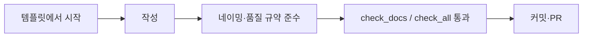

# Contributing

상태: Active
소유: Docs
최종 갱신: 2026-07-09 18:15 KST
목적: 코드 품질·네이밍·문서 규약과 템플릿을 안내한다.

## 규약

- [NAMING_CONVENTION](NAMING_CONVENTION.md) — 이름 규칙
- [CODE_QUALITY_POLICY](CODE_QUALITY_POLICY.md) — 작성 규약 (FE+BE)
- 검증 명령: [operations/QUALITY_GATE](../operations/QUALITY_GATE.md)
- 문서 규칙: [../DOCUMENTATION_GUIDE](../DOCUMENTATION_GUIDE.md)

## 템플릿 (`templates/`)

- `ARCHITECTURE_TEMPLATE.md` · `FEATURE_TEMPLATE.md` · `API_TEMPLATE.md` · `OPERATION_TEMPLATE.md` · `DECISION_TEMPLATE.md`
