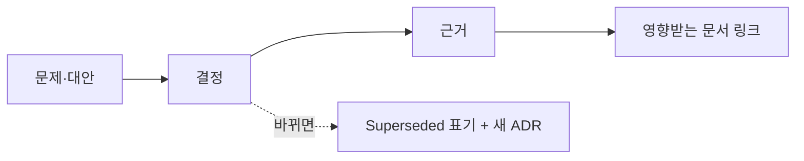

# Decisions (ADR)

상태: Active
소유: Docs
최종 갱신: 2026-07-09 10:51 KST
목적: 중요한 아키텍처 결정과 근거를 시간순으로 기록한다.

파일명은 `YYYY-MM-DD-kebab-topic.md`. 결정과 이유만 담고 실행 절차·구현 현황은 섞지 않는다.

## 기록

- [2026-06-30 postgresql-dbml-source-of-truth](2026-06-30-postgresql-dbml-source-of-truth.md)
- [2026-06-30 dbml-compat-table-policy](2026-06-30-dbml-compat-table-policy.md)
- [2026-06-24 movement-map-id-alignment](2026-06-24-movement-map-id-alignment.md)
- [2026-06-22 operator-admin-two-tier-ui](2026-06-22-operator-admin-two-tier-ui.md)
- [2026-06-22 docking-and-path-model](2026-06-22-docking-and-path-model.md)
- [2026-06-22 backend-refactor-rules](2026-06-22-backend-refactor-rules.md)
