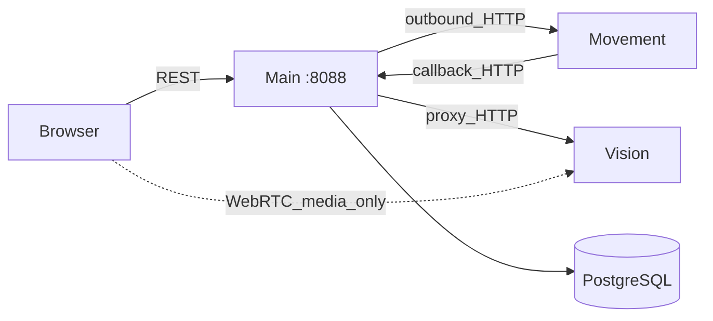
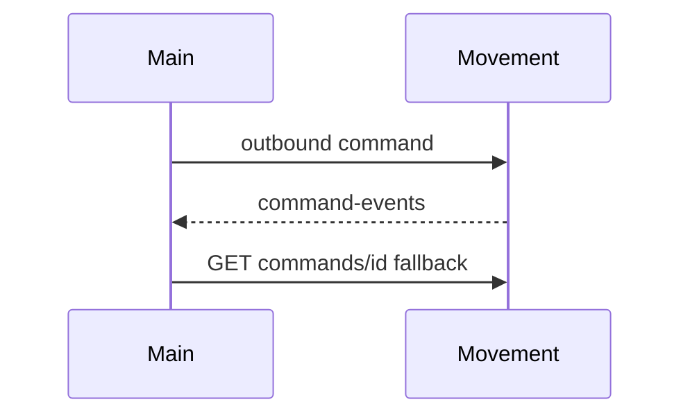

# Interfaces

상태: Active
소유: Integration
최종 갱신: 2026-07-09 18:15 KST
목적: **Main 서버 기준** 외부 HTTP 계약 진입점. Main이 호출·수신·프록시하지 않는 계층(ROS 등)은 다루지 않는다.

Browser REST: [api/](../api/README.md). Pose bridge 실행: [operations/ROS_POSE_BRIDGE](../operations/ROS_POSE_BRIDGE.md).

## 큰 그림 (Main 경계)



## 디자인 철학

- **브라우저 → Main만** (제어·상태). Vision **미디어**만 WebRTC 직결 예외; discovery/offer는 Main.
- Main이 hostname/IP/timeout을 설정으로 소유. 외부는 Main DB에 쓰지 않음.
- 콜백 누락 대비 Main이 command status를 **폴링**.
- map mismatch 시 Main이 이동 명령을 차단.
- fake 모드: `LMS_MOVEMENT_CLIENT_MODE=fake`.

## Main 주소 · Vision proxy

```env
LMS_PUBLIC_BASE_URL=http://smartfactory-main.local:8088
```

```text
Base URL: http://smartfactory-main.local:8088/api/v1
```

외부가 콜백할 base / Main upstream: `GET /api/v1/system/external-config`.

Vision은 Main **pull/proxy**가 기본(이벤트 push 미구현). Main이 중계하는 path 예:

```text
GET  /api/v1/vision/bridge/status
GET  /api/v1/vision/frame/latest/image?source={source_id}
GET  /api/v1/vision/streams?source={source_id}&view={view}
POST /api/v1/vision/streams/{source_id}/webrtc/offer?view={view}
```

`source_id`는 Main `cameras` registry만. WebRTC 실패 시 MJPEG 폴백. Lift-load evaluate: [LIFT_LOAD_EVIDENCE](LIFT_LOAD_EVIDENCE.md).

Health: `GET /health` → `{"ok": true, …}`. 호스트: `LMS_MOVEMENT_HOST`, `LMS_VISION_*`, `LMS_PUBLIC_BASE_URL`.

## 데이터 SoT · 현행 유지 (HTTP 해석)

| 화면/API 이름 | 최종 기준 | 비고 |
| --- | --- | --- |
| `item_code` / items | `items` | DB 기준은 `items.id` |
| `slot_id` | `locations(type=storage)` | |
| `waypoint_id` | `locations` | type으로 존·마커 구분 |
| work order | `tasks` | `work_orders` 물리 테이블 없음 |
| 이벤트·이동 이력 | `evidence_events` | `/events`·`/movement-commands`는 projection |
| 맵·카메라 | `maps` · `cameras` | 인프라 |

### Design Decisions (현행 유지)

| 항목 | 결정 | 재검토 트리거 |
| --- | --- | --- |
| `GET /status` | 종합 스냅샷 유지 | 관제가 더 이상 쓰지 않을 때 |
| 감사 API | `/events`·`/movement-commands`·`/evidence-events` 분리 | 네 번째 projection 필요 시 |
| probe | `/comm/probe/movement`·`/camera` 분리 | 공통 구조가 생길 때 |
## Main이 다루는 경계

| 방향 | 내용 | 정본 |
| --- | --- | --- |
| Main ↔ Movement | Main이 명령 순서·결과 반영을 소유 | [Main consumer boundary](movement/README.md) · [Nav Server contract](../../../nav-server/docs/reference/MAIN_SERVER_CONTRACT.md) |
| Main → Vision | stream/frame proxy · lift-load | [LIFT_LOAD_EVIDENCE](LIFT_LOAD_EVIDENCE.md) (본문 Vision §) |
| Browser → Main | REST `/api/v1/*` | [api/API_MAIN](../api/API_MAIN.md) |

## Integration Quickstart

1. **Config** — `GET /api/v1/system/external-config`
2. **Pose** — `GET /api/v1/robot-poses`
3. **Command** — `POST /api/v1/robot-commands`; Movement endpoint semantics follow the [Nav Server contract](../../../nav-server/docs/reference/MAIN_SERVER_CONTRACT.md).
4. **Callback** — Movement → `POST /api/v1/movement/command-events` (누락 시 Movement `GET …/commands/{id}` 폴링)
5. **Sync** — [MOVEMENT_SYNC_DIAGNOSTICS](../operations/MOVEMENT_SYNC_DIAGNOSTICS.md)



## 계약 문서 (축소 후)

| 문서 | 역할 |
| --- | --- |
| 본 README | Main 경계·주소·Vision proxy·데이터 SoT·Quickstart |
| [LIFT_LOAD_EVIDENCE](LIFT_LOAD_EVIDENCE.md) | Main의 Vision evidence 승인·보류 정책 |
| [movement/](movement/README.md) | Main consumer boundary |
| [Nav Server contract](../../../nav-server/docs/reference/MAIN_SERVER_CONTRACT.md) | Movement endpoint의 유일한 정본 |

실행: [SERVER_RUN_COMMANDS](../operations/SERVER_RUN_COMMANDS.md).
