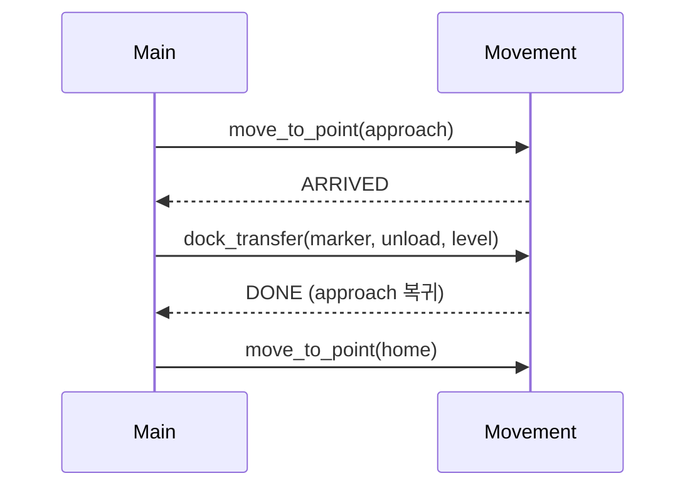

# Movement 게이트 도킹 · 명령 envelope 계약

상태: Draft
소유: Integration
최종 갱신: 2026-07-09 18:05 KST
목적: **Main이 Movement로 보내는** 단일 명령 envelope와 게이트 도킹(`dock_transfer`)·`aruco_align` **목표** 계약. Movement 미구현 시 Main은 `501`을 낸다. Movement 내부 모션/ROS는 다루지 않는다.

> **현행 vs 목표:** 현행 이동 API는 [REQUIREMENTS](REQUIREMENTS.md) §1–9. 본 문서는 **목표** `POST /robot-commands` envelope·게이트(Draft).

> 상위 [REQUIREMENTS](REQUIREMENTS.md) §10–11에서 분리. 경로 모델 ADR: [도킹 ADR](../../decisions/2026-06-22-docking-and-path-model.md).

## Envelope (B안)

명령은 **단일 엔드포인트**로 보낸다. 로봇 식별은 body `robot_id`. 상태 조회만 GET.

```text
POST /robot-commands
GET /robot-commands/{id}
```

```jsonc
{
  "command_id": "task-42-tb3_1-...",
  "robot_id": "tb3_1",
  "task_id": 42,
  "kind": "move_to_point",
  "dry_run": false,
  "params": { /* kind별 */ },
  "callback_url": "http://<main>:8088/api/v1/movement/command-events"
}
```

| kind | 의미 |
| --- | --- |
| `move_to_point` | 한 좌표(approach·home·transit)로 Nav2 주행 |
| `dock_transfer` | 게이트 도킹 블록(ArUco→정밀→리프트→후진) |
| `aruco_align` | 무리프트 정밀 정렬(주차·충전) |
| `manual_drive` | teleop |
| `estop` | 비상 정지/해제 |

`preview`는 kind가 아니라 `dry_run` 플래그. 시퀀스는 **Main 오케스트레이터**가 work order를 step으로 펼친다(이동서버 item-route 미사용).

### params (kind별)

```jsonc
// move_to_point
"params": { "map_id": "Main_map", "x": 1.2, "y": 3.4, "yaw": 1.57, "waypoint_id": "slotA_appr" }

// dock_transfer — 로봇이 approach ARRIVED 대기 중이어야 함
"params": { "aruco_marker_id": 17, "action": "load | unload", "level": 1 }

// aruco_align
"params": { "aruco_marker_id": 21, "final": "hold | return_approach", "tolerance": { "xy_m": 0.02, "yaw_deg": 2 } }

// manual_drive
"params": { "command": "forward|backward|left|right|stop", "hold": true, "linear_x": 0.1, "angular_z": 0.3, "timeout_sec": 1.0 }

// estop
"params": { "op": "stop | clear" }
```

## 게이트 도킹 흐름 (입고 1회)



주문→명령 예 (입고: inbound→storage→home):

```text
move_to_point(inbound_appr) → ARRIVED → dock_transfer(load) → DONE
move_to_point(storage_appr) → ARRIVED → dock_transfer(unload) → DONE
move_to_point(home) → DONE
```

출고는 `storage(load) → outbound(unload) → home`.

## 10. 게이트 도킹 envelope 계약 (목표 — 미구현)

Main은 단일 envelope `POST /robot-commands`(kind 판별)로 명령하고, Movement는 아래 kind별 동작·게이트 상태·콜백을 제공한다. REQUIREMENTS §2–9의 `/routes/*`·상태 조회는 `move_to_point`·status로 흡수된다.

### 10.1 구현 현황 (Main 측 ↔ Movement 측)

| kind | Main 디스패치 | Movement 측 계약 | 상태 |
| --- | --- | --- | --- |
| `move_to_point` | ✅ `_dispatch_move_to_point` | `/routes/commands`(REQUIREMENTS §3) 재사용 가능 | ✅ |
| `manual_drive` | ✅ `_dispatch_manual_drive` | `/manual/*` | ✅ |
| `estop` | ✅ `_dispatch_estop` | estop/clear | ✅ |
| `dock_transfer` | ⚠️ envelope 적재 + 클라이언트 위임 — fake 동작, **http/real 501** | **신규 — 미구현** | ❌ |
| 상태 조회 | ✅ `GET /robot-commands/{id}` | `GET /commands/{id}` | ✅ |

Main `_dispatch_dock_transfer`는 `aruco_marker_id`·`action`·`level`·`command_id`·`callback_base_url`을 `dock_body`로 묶어 `movement_client.dock_transfer`로 위임한다. `FakeMovementClient`는 에코, `HttpMovementClient`는 엔드포인트 미확정으로 **501**. 게이트 상태(`ARRIVED`·`ABORTED`)와 `FAILED{stage}`는 **Movement 측 미제공** → 본 절이 그 계약이다.

### 10.2 `dock_transfer` 실행 계약 (신규)

```http
POST /movement-api/v1/dock/transfer
```

요청(Main → Movement, envelope `params`):

```json
{
  "command_id": "task-42-tb3_1-...",
  "robot_name": "tb3_1",
  "aruco_marker_id": 17,
  "action": "load",
  "level": 1,
  "callback_url": "http://<main>:8088/api/v1/movement/command-events"
}
```

요구사항:

- **전제조건**: 직전 `move_to_point(approach)` 완료로 `ARRIVED` 대기. 아니면 `4xx`.
- 블록은 원자 단위: `① 아루코 → ② 정밀 도킹 → ③ 리프트(level) → ④ approach 복귀`. Main은 리프트 높이·후진을 보내지 않는다.
- 완료 시 로봇은 **approach 포즈 복귀**(`DONE`).
- `dry_run=true`는 물리 동작 없이 수행 가능성만 검증.

### 10.3 게이트 상태·콜백 확장 (신규)

```text
ARRIVED  # approach 도달, dock_transfer 게이트 대기
READY    # (선택) 정렬 완료·리프트 직전
ABORTED  # 중단 — reason:"estop" | "timeout" + stage
FAILED   # stage 필수: nav | aruco | align | lift | reverse
```

게이트 타임아웃(결정 A): `ARRIVED` 후 **120초** 무응답이면 이동서버가 자동취소하되 로봇은 approach 유지, `ABORTED{reason:"timeout", robot_at:"approach", resumable:true}`. Main은 동일 step을 새 `command_id`로 재dispatch.

```json
{ "command_id": "...", "robot_name": "tb3_1", "state": "FAILED",
  "stage": "aruco", "reason": "marker_not_found", "reported_at": "..." }
```

**estop 선점**: 진행 command마다 `ABORTED{reason:"estop", stage}` 콜백.

### 10.4 미결 (Main 측 합의 대기)

| 주제 | Main이 확정해야 할 것 |
| --- | --- |
| 게이트 타임아웃 | `ARRIVED` 후 재dispatch 정책(초안 120s) |
| dock 경로 | 전용 path vs envelope 단일 경로 — Main 클라이언트 분기 |
| 주차 출차 | `aruco_align(hold)` 후 후진 kind — Main step 계획 |

### 10.5 `aruco_align` — 무리프트 정밀 정렬 (S4)

```jsonc
"params": {
  "aruco_marker_id": 21,
  "final": "hold | return_approach",
  "tolerance": { "xy_m": 0.02, "yaw_deg": 2 }
}
```

- 리프트·층 없음. `final:"hold"`면 정렬 위치 정지, `return_approach`면 approach 복귀.
- 완료 `DONE`(또는 `ALIGNED`), 실패 `FAILED` + `stage: aruco|align`.
- 이동서버 `standby` route(Nav2 단순 복귀)와 **구분**.

### 10.6 호출 경로·시퀀스 결정 (S2)

| 항목 | 결정 |
| --- | --- |
| 호출 표면 | Main은 **네이티브 `POST /robot-commands`** (envelope 패스스루) |
| 시퀀스 소유 | Main 오케스트레이터가 `move_to_point→ARRIVED→dock_transfer/aruco_align` step으로 펼침 |
| `dock_transfer` params | `aruco_marker_id`·`action`·`level` **명시 전송** |
| `move_to_point` params | `waypoint_id` 단독·좌표 **양쪽** 수용 |

## 11. 수동 ArUco 정렬 테스트

새 제어 contract 없이 기존 요소만 조합:

- 검출 readout: `GET /aruco/latest` 프록시 → 관리 패널
- 수동 조작: `manual_drive` teleop
- Main 프록시·`ArucoManualTest` UI **구현 완료**

## dock_transfer params · lift (Main outbound)

Main은 리프트 ROS topic을 **발행하지 않는다**. envelope에 마커·action·level(+선택 override)만 넣한다. lift 미지원 로봇은 Movement `4xx`/`409`를 Main이 표면화한다.

호출 순서(Main 오케스트레이션): `move_to_point(approach) → ARRIVED → dock_transfer → DONE`.

| Field | Required | Type | 설명 |
| --- | --- | --- | --- |
| `aruco_marker_id` | yes | integer | 도킹 대상 ArUco marker id |
| `action` | yes | `load` \| `unload` | 적재/하역 |
| `level` | yes* | `1` \| `2` | tier. 미지정 시 Main은 `1`로 정규화 |
| `lift_height_mm` | no | number | 임시 높이 override(mm) — 보낼 때만 |
| `lift_timeout_sec` | no | number | lift timeout override |
| `home_on_unload` | no | boolean | unload 후 home 요청 플래그(Movement 해석) |

\* envelope 검증은 `level` 생략 허용(기본 `1`).

## 결정 요약 (2026-06-23~25)

| 항목 | 결정 |
| --- | --- |
| 도킹 방식 | **게이트 2단계** — approach `ARRIVED` 대기 후 `dock_transfer` |
| 정밀 도킹 블록 | ArUco→정밀→리프트→후진을 Movement **원자 블록** |
| 경계 | Main은 마커·동작·층만. 모션·리프트 높이는 Movement |
| 선반 | 2층. `level: 1\|2`. `lift_height`는 Main이 보내지 않음 |
| 명령 구조 | **B안** — `POST /robot-commands` + `kind` 유니온 |
| 시퀀스 소유 (S2) | **Main 오케스트레이터**가 step으로 펼침. Movement item-route 미사용 |
| 무리프트 정렬 (S4) | `aruco_align` kind (주차·충전) |
| 주차 출차 | 기본은 scan/approach 후진 복귀 후 `move_to_point(next)`. kind/params 미확정 |

### 이동서버 수신 정합 (2026-06-24)

| 항목 | 우리 결정 |
| --- | --- |
| envelope | 네이티브 `POST /robot-commands` 패스스루 |
| 시퀀스 | 원자 kind만, 펼침은 Main |
| `dock_transfer` params | `aruco_marker_id`·`action`·`level` 명시 |
| `aruco_align` | 신 kind 요구 (S4) |
| `move_to_point` | waypoint_id·좌표 양쪽 지원 |

미결 표는 §10.4를 본다.
