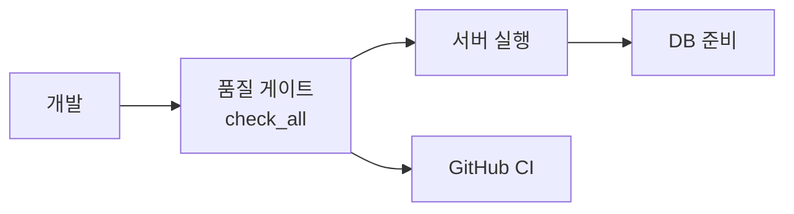

# Operations

상태: Active
소유: Ops
최종 갱신: 2026-07-14 KST
목적: 현장 런북과 개발·배포 절차를 한 폴더에서 안내하되, 읽기 축을 둘로 나눈다.

## 현장 런북 (runbooks)

- [Cross-service TB1 우선 실물 E2E](../../../docs/operations/physical-e2e-checklist.md) — Main·Nav·AI 실행 순서와 합격 경계
- [ESTOP_RECOVERY_PLAYBOOK](ESTOP_RECOVERY_PLAYBOOK.md) — 비상정지 후 운영자 복구
- [MOVEMENT_SYNC_DIAGNOSTICS](MOVEMENT_SYNC_DIAGNOSTICS.md) — Nav2/맵 동기화 진단
- [INBOUND_SCENARIO_TEST](INBOUND_SCENARIO_TEST.md) — 입고 시나리오 점검
- [ROS_POSE_BRIDGE](ROS_POSE_BRIDGE.md) — pose bridge 실행

## 개발·배포 (dev)

- [DEVELOPMENT_GUIDE](DEVELOPMENT_GUIDE.md) — 기여 진입 · hostname · GitHub/CI 요약
- [SERVER_RUN_COMMANDS](SERVER_RUN_COMMANDS.md) — 실행 명령
- [DB_MIGRATION](DB_MIGRATION.md) — PostgreSQL DBML 변경 절차
- [GIT_WORKFLOW](GIT_WORKFLOW.md)

## 품질 게이트

검증 명령·체크리스트만 여기 둔다. 작성 규약은 [contributing/](../contributing/README.md).

- [QUALITY_GATE](QUALITY_GATE.md)
