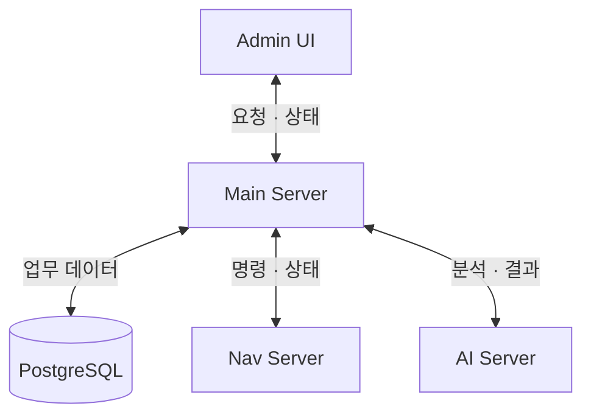
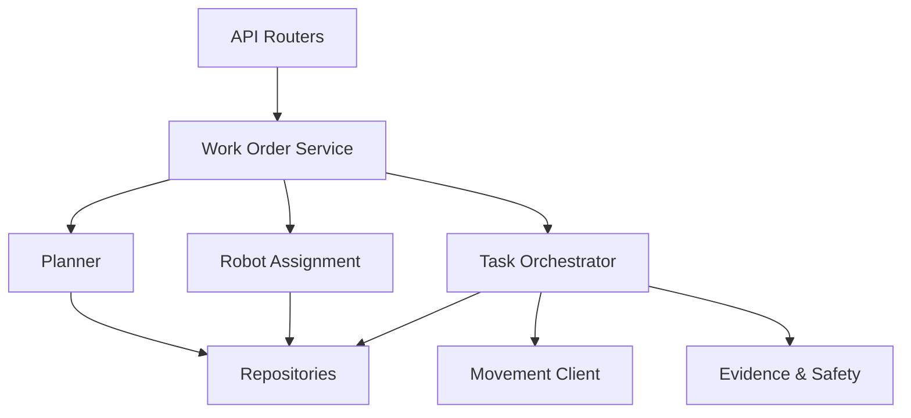

# Main Server Responsibility

## Responsibility Summary

Main Server는 입출고 작업의 업무 정본입니다. 작업을 만들고 로봇을 할당하며, Nav와 AI가 반환한 실행 결과와 관측 근거를 검증해 작업·재고·안전 상태를 확정합니다.

| 구분 | 내용 |
| --- | --- |
| Owns | 작업 생성, 우선순위, 상태 전이와 복구 상태 |
| Owns | 로봇 선택·할당과 업무 자원 점유 |
| Owns | 재고 변경 시점과 작업·재고·이력 transaction |
| Owns | 관제 UI에 제공하는 통합 read model |
| Owns | 사람 위험에 따른 업무 보류와 E-stop 요청 정책 |
| Delegates to | Nav Server: 이동·도킹·리프트·물리 정지 실행 |
| Delegates to | AI Server: 영상 관측·화물 evidence·위험 advisory 생성 |
| Does not own | Nav2 경로 계획, 로봇 제어와 장치 telemetry |
| Does not own | 객체 탐지, segmentation과 영상 stream 처리 |
| Does not own | 물리 동작이나 영상 관측 결과 자체의 생성 |

## Responsibility Boundary

| Decision or State | Owner |
| --- | --- |
| 작업 생성 가능 여부 | Main Server |
| 작업에 사용할 위치·재고·로봇 | Main Server |
| 다음 업무 단계와 작업 완료 여부 | Main Server |
| 재고를 변경할 시점 | Main Server |
| 원자 명령의 물리 실행 결과 | Nav Server |
| 주행 경로·도킹·리프트 제어 | Nav Server |
| 영상 속 객체와 화물 상태 관측 | AI Server |
| AI 관측을 업무 승인으로 사용할지 여부 | Main Server |
| E-stop 정책과 요청 | Main Server |
| E-stop 물리 실행과 정지 확인 | Nav Server |

## Collaboration Diagram

## Internal Responsibility Diagram

## Design Rules

1. 작업·재고·로봇 업무 상태의 정본은 Main PostgreSQL에만 둡니다.
2. 자원 잠금 뒤 생성 조건을 다시 검증하며, 현재 단계에는 하나의 `command_id`만 사용합니다.
3. Nav 결과는 현재 작업·로봇·단계와 일치할 때만 상태 전이에 사용합니다.
4. AI 결과는 관측 근거이며 source·품목·시각을 검증한 뒤 Main 정책으로 승인합니다.
5. timeout, 오래된 결과, 물리 상태 불명확은 성공으로 추정하지 않고 운영자 확인 상태로 보냅니다.
