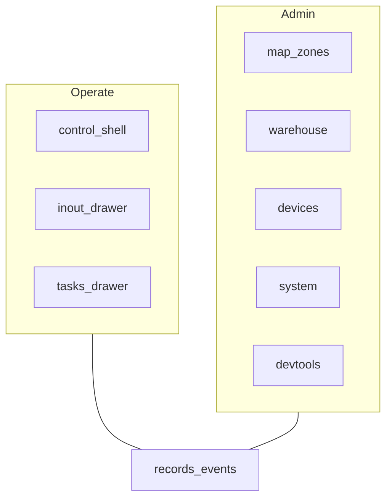
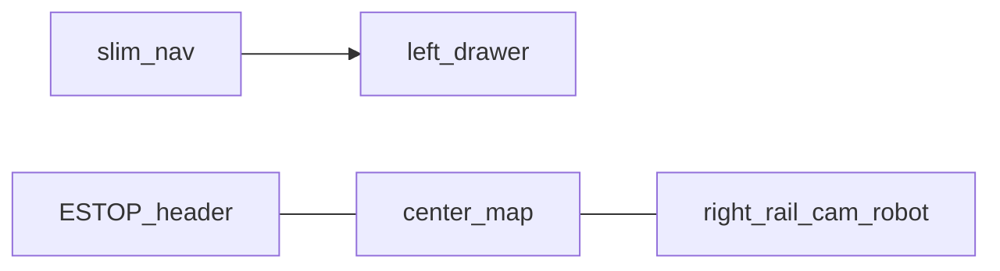
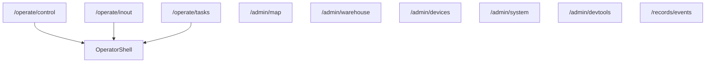

# Information Architecture

상태: Active
소유: Frontend
작성: 2026-06-22 15:30 KST
최종 갱신: 2026-07-09 17:05 KST
목적: 운영/관리 2계층 IA와 라우트 매핑을 도표로 확정한다.

근거: [UX_FOUNDATION](UX_FOUNDATION.md) · [2계층 ADR](../decisions/2026-06-22-operator-admin-two-tier-ui.md). 구현 사실: [FRONTEND](FRONTEND.md).

## 모드

## 운영 셸

- 맵·카메라·로봇 레일 고정; 입출고/작업만 좌측 드로어.
- ESTOP은 헤더 상시(모드 무관). 누름=즉시, 해제=확인.

## 라우트

레거시 URL → `legacyRedirects.ts`. `admin/scenario`·`admin/actions`는 메뉴 없음. 운영 셸에서도 `?drawer=records`로 기록 접근 가능.

## 디자인 철학

- **운영 = 지속 셸**, 관리 = 설정·마스터 데이터.
- 부분 구현은 노출 정책([EXPOSURE_POLICY](EXPOSURE_POLICY.md))을 따른다.
- 화면 상세는 `pages/`·`FRONTEND.md`로.
