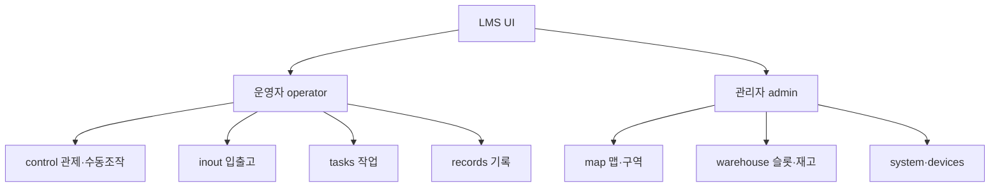

# UI/UX

상태: Active
소유: Frontend
최종 갱신: 2026-07-09 17:50 KST
목적: 화면·UX 파운데이션·정보구조(IA)·화면별 문서를 안내한다.

운영자(operator)와 관리자(admin) 2계층으로 나뉜다. 성숙도는 각 문서의 `상태:`로 본다.

## 파운데이션 (횡단)

- [UX_FOUNDATION](UX_FOUNDATION.md) — 페르소나·Jobs·유저 플로우
- [IA](IA.md) — 네비게이션 정보구조·목표 라우트
- [EXPOSURE_POLICY](EXPOSURE_POLICY.md) — 미완성 화면 노출 기준
- [FRONTEND](FRONTEND.md) — as-built · 레이아웃 · backlog

## 화면별 (pages/ — 라우트 1개 = 페이지 1개, 스크린샷 임베드)

운영: [operate-control](pages/operate-control.md) · [operate-inout](pages/operate-inout.md) · [operate-tasks](pages/operate-tasks.md)
관리: [admin-map](pages/admin-map.md) · [admin-warehouse](pages/admin-warehouse.md) · [admin-devices](pages/admin-devices.md) · [admin-system](pages/admin-system.md) · [admin-actions](pages/admin-actions.md)(Draft)
공유: [records-events](pages/records-events.md)

## 자산

- `wireframes/` — 화면 와이어프레임(SVG)
- `screens/` — 스크린샷(PNG)
