# UX Foundation

상태: Draft
소유: Frontend
최종 갱신: 2026-07-09 18:00 KST
목적: 운영자/관리자 2계층 시스템의 페르소나·Jobs·유저 플로우를 정의하고, 사용자가 만지는 영역과 시스템이 실행하는 영역을 명확히 갈라 IA·화면 설계의 근거로 삼는다.

> 설계 순서: 페르소나 → Jobs → 유저 플로우(본 문서) → IA → 와이어프레임 → 구현.
> 계층 분리 원칙은 [운영자/관리자 2계층 UI 결정](../decisions/2026-06-22-operator-admin-two-tier-ui.md)을 따른다.
> **빠른 참조:** 라우트·메뉴는 [IA](IA.md), 구현 사실은 [FRONTEND](FRONTEND.md), backlog는 [FRONTEND § Backlog](FRONTEND.md#backlog).

## 목차

1. [구현 현황](#0-구현-현황-design--실재)
2. [컨텍스트](#1-컨텍스트--문제-정의)
3. [계층 구분](#2-계층-구분-원칙-본-문서의-중심)
4. [페르소나](#3-페르소나)
5. 이후 절: Jobs · 유저 플로우 · 설계 갭 (§4–§9)

## 0. 구현 현황 (design ↔ 실재)

이 문서는 **설계(목표)**다. 구현 현황·갱신 상태는 [FRONTEND](FRONTEND.md)를 단일 출처로 본다. 설계 글을 복제하지 않는다 — 주제는 두 곳에, 문장은 한 곳에. 설계 갭 상세는 §9.

## 1. 컨텍스트 / 문제 정의

창고 로봇 관제 시스템. 두 종류의 사용자가 전혀 다른 추상화 레벨에서 일한다.

- 매일 쓰는 **운영자**는 "무엇을"(품목·수량·입출고)만 표현하고 싶다. 좌표·스텝·슬롯 배정은 알 필요가 없다.
- 가끔 쓰는 **관리자/설치자**는 현장을 시스템에 정의한다(맵 구역, 슬롯, 품목, 동작).

문제: 현재 UI는 두 역할이 한 네비게이션에 섞여 있고, 운영자가 좌표·시나리오 preset을 직접 다뤄야 한다. 백엔드(`work_orders`)는 이미 고수준 의도를 받을 준비가 됐으나, 그에 맞는 운영자/관리자 화면이 없다.

목표: 운영자는 의도만, 관리자는 정의만 다루도록 경험을 분리한다.

## 2. 계층 구분 원칙 (본 문서의 중심)

UX 검증의 중점은 **"사용자가 원하는 기능마다, 버튼이 올바른 화면에 있는가"** 이다. 이를 위해 모든 플로우를 두 영역으로 가른다.

| 영역 | 정의 | 본 문서 표기 |
| --- | --- | --- |
| 프론트스테이지 | 사용자가 보고 누르고 조작하는 것 (버튼·입력·화면) | 🟦 `FS` 레인 |
| 백스테이지 | 버튼 뒤에서 컴퓨터가 실행하는 것 (검증·합성·배정·기록) | ⬜ `BS` 레인 |

두 레인을 잇는 점선(`-.->`)이 **상호작용 선**이다. 사용자는 점선을 건널 뿐, 백스테이지 내부 단계를 직접 만지지 않는다. 화면 설계에서 **버튼은 전부 FS에만** 존재해야 한다.

## 3. 페르소나

### P1. 운영자 (Operator) — 주 사용자

| 항목 | 내용 |
| --- | --- |
| 목표 | 빠르게 입출고를 지시하고, 로봇 진행을 한눈에 보고, 문제 시 개입 |
| 고충 | 좌표·시나리오·슬롯 같은 기술 개념을 강요받음. 실패 원인이 안 보임 |
| 맥락 | 바쁜 현장, 짧은 조작, 큰 글씨·명확한 상태 선호. 비전공 |
| 핵심 화면 | 관제(대시보드), 입출고 요청, 작업 목록, 수동 조작 |
| 안 보는 것 | 좌표, 스텝 순서, 슬롯 배정 로직, DB |

### P2. 관리자 / 설치자 (Admin / Installer) — 셋업 사용자

| 항목 | 내용 |
| --- | --- |
| 목표 | 맵·슬롯·품목·동작을 정확히 정의해 운영자가 의도만으로 일하게 만듦 |
| 고충 | 정의 화면이 빈약하거나 없음(슬롯·재고·품목 UI 부재). 설정이 흩어져 있음 |
| 맥락 | 시간 여유 있는 셋업, 정확성·검증 우선. 준전문가 |
| 핵심 화면 | 맵&구역, 슬롯·재고·품목, 시나리오, 동작 정의, 로봇/카메라, 시스템 |
| 권한 | 운영자 화면 전부 + 정의/DB |

## 4. Jobs (역할별 원하는 결과)

### 운영자 Jobs

| # | 사용자가 원하는 것 | 프론트스테이지 트리거 | 백스테이지 |
| --- | --- | --- | --- |
| O1 | 로봇 위치·상태를 본다 | (자동 갱신 화면) | pose/status 조회 |
| O2 | 품목·수량으로 입고한다 | 입고 폼 + [실행] | `POST /work-orders` |
| O3 | 품목·수량으로 출고한다 | 출고 폼 + [실행] | `POST /work-orders` |
| O4 | 작업/주문 진행을 추적한다 | 작업 목록 행 클릭 | task/order 조회 |
| O5 | 로봇을 수동 이동/조종한다 | 맵 클릭 / Teleop 버튼 | goto / teleop 명령 |
| O6 | 막힌 이유를 본다 | 에러 배너·이벤트 | 상태/이벤트 조회 |
| O7 | 예약/대기 작업 순서를 본다 | 작업 드로어 목록 | task/order 조회 |

### 관리자 Jobs

| # | 사용자가 원하는 것 | 프론트스테이지 트리거 | 백스테이지 |
| --- | --- | --- | --- |
| A1 | 맵·구역 마커를 배치한다 | 맵 클릭 + 타입 선택 | waypoint 저장 |
| A2 | 슬롯·용량·순서를 정의한다 | 슬롯 폼 + [저장] | storage_slots 저장 |
| A3 | 품목을 등록한다 | 품목 폼 + [추가] | items 저장 |
| A4 | 재고를 입력·조정한다 | 재고 입력 + [반영] | inventory 갱신 |
| A5 | 동작·파라미터를 정의한다 | 동작 정의 폼 | action 정의 저장 |
| A6 | 시나리오 템플릿을 만든다 | 구역 순서 조립 + [저장] | preset 저장 |
| A7 | 로봇·카메라를 등록·점검한다 | 등록 폼 / 로그 조회 | robots/cameras |

## 5. 유저 플로우 (프론트스테이지 / 백스테이지 분리)

### F1. 운영자 — 입고 1건 처리 (happy path)

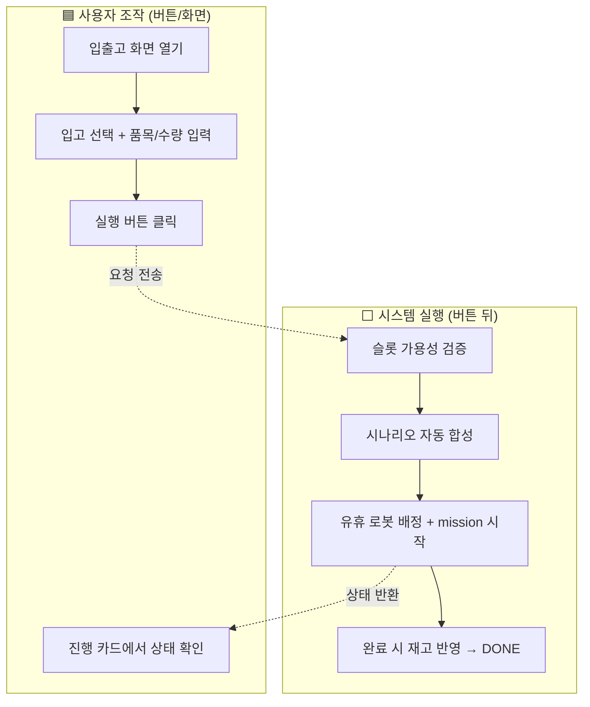

사용자는 B·C만 누른다. E~I는 전부 백스테이지다.

### F2. 운영자 — 출고 + 재고 부족 (엣지케이스)

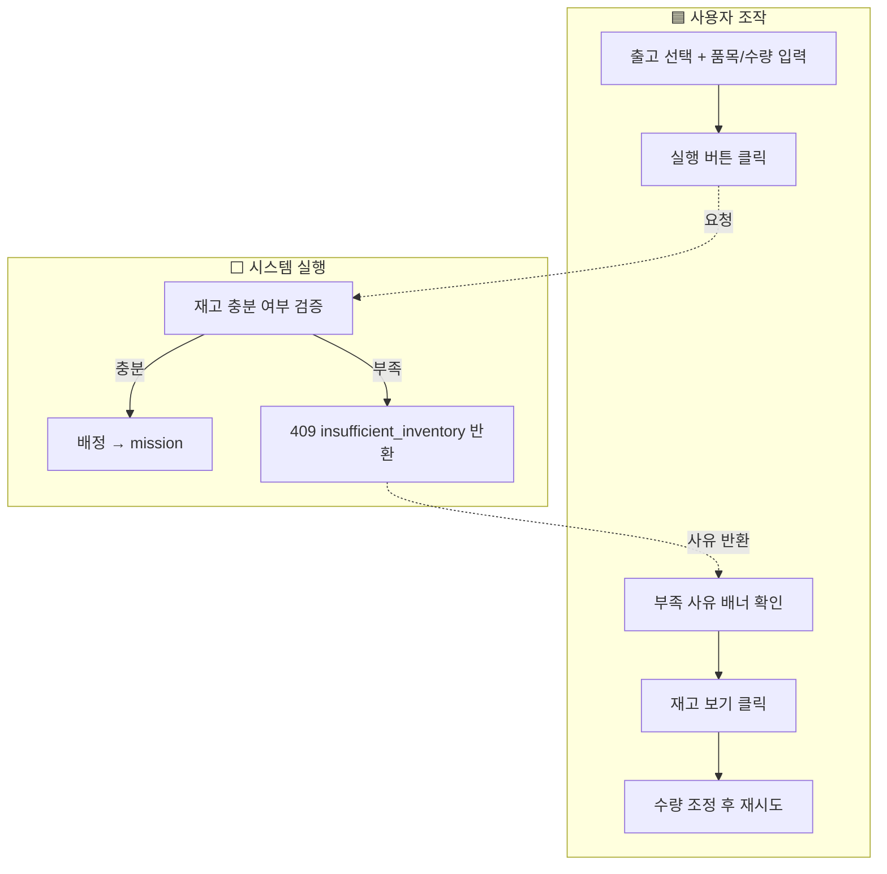

핵심: 실패가 조용히 사라지지 않고 **사유 + 다음 버튼([재고 보기])** 을 프론트에 준다(O6).

### F3. 운영자 — 수동 개입 (teleop override)

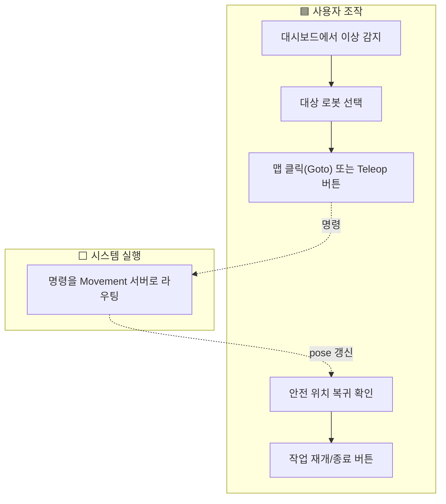

프론트 비중이 가장 큰 플로우(사용자가 직접 조종). 백스테이지는 명령 전달뿐.

### F4. 관리자 — 창고 초기 셋업 (도입 시 1회)

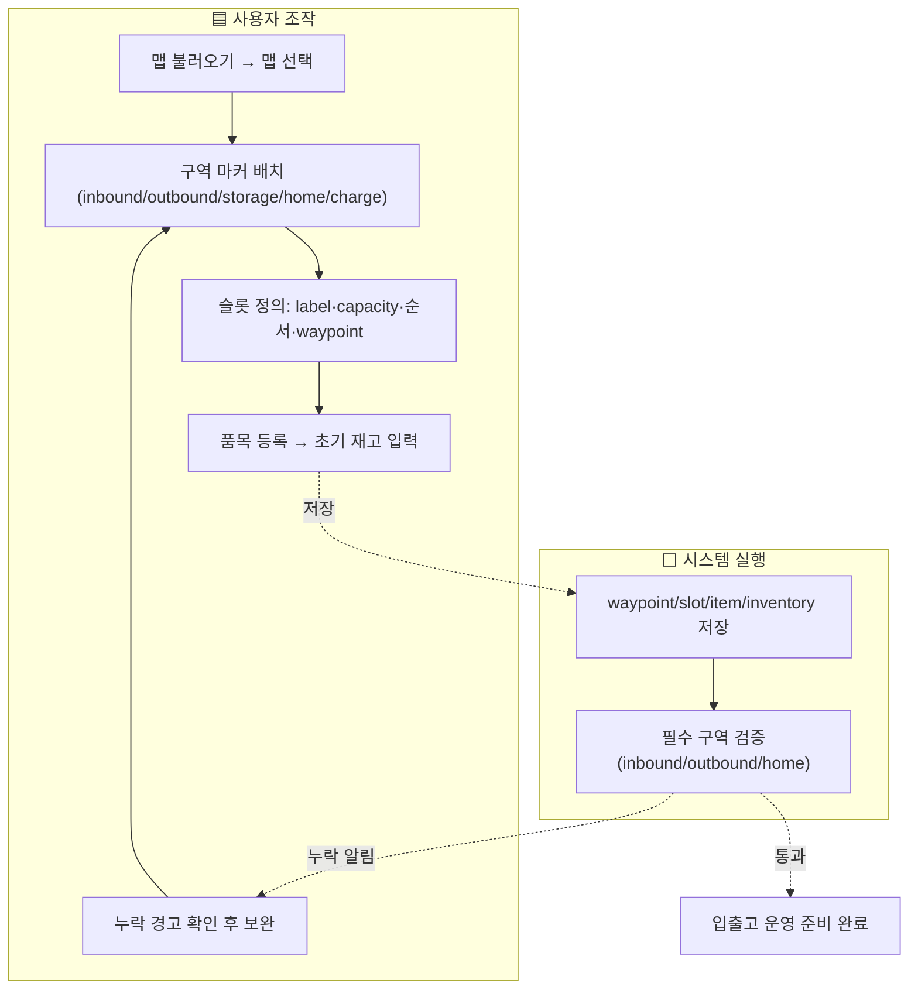

이 셋업이 F1·F2의 전제다. 슬롯·품목·재고가 없으면 `work_orders`가 동작하지 않는다.

### F5. 관리자 — 동작/시나리오 정의 (고급, 선택)

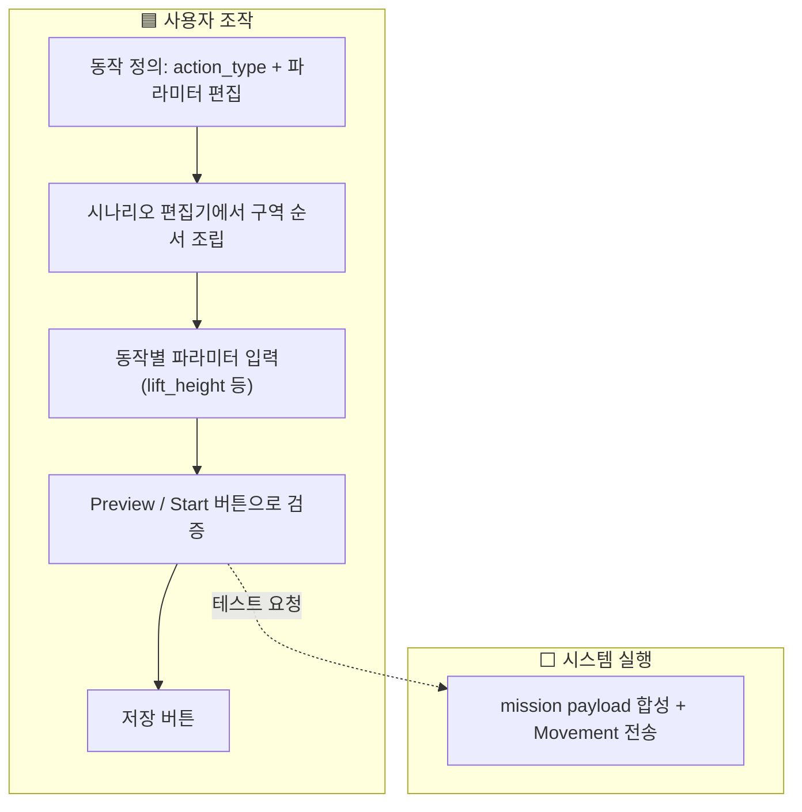

경계 원칙: 모션 시퀀스("리프트 들고 후진")는 Movement 서버가 펼친다. LMS는 **파라미터만** 다룬다.

## 6. Work Order 상태 모델 (백스테이지 참조)

사용자가 누르는 상태가 아니라 시스템이 전이시키는 머신 상태이고, 프론트는 **읽어서 표시만** 한다. 상태 머신 정본은 [architecture/INBOUND_OUTBOUND](../architecture/INBOUND_OUTBOUND.md)를 본다.

## 7. 버튼/컨트롤 배치 검증 (와이어프레임)

각 화면을 와이어프레임으로 그려, 모든 Job이 **프론트스테이지 컨트롤 하나 + 명확한 화면 위치**를 갖는지 눈으로 검증한다. 와이어프레임 안의 `🟦 파란 박스 = 사용자 조작(FS)`, `흰/회색 = 시스템 표시(BS)`, `[Job]` 태그 = 대응 Job. 빈칸이 있으면 화면 설계 갭이다.

> 와이어프레임은 텍스트로 작성한 SVG(`docs/ui-ux/wireframes/`)다. 외부 디자인 툴·이미지 생성 없이 버전관리되며, 배치가 바뀌면 SVG만 고치면 된다. 고충실 비주얼이 필요하면 실제 레이아웃 셸을 만든 뒤 스크린샷으로 대체한다.

**운영자 지속 셸(persistent shell) 원칙**: 운영자 모드는 화면 전체를 바꾸지 않는다. **맵(중앙 대형)과 카메라·로봇 실시간 상태(우측 레일)는 항상 고정**되고, 좌측 슬림 네비로 선택한 작업(입출고/작업)만 **맵 위 좌측 드로어**로 뜬다. 드로어를 닫으면 맵 풀뷰. 운영자가 어떤 작업을 하든 로봇에서 눈을 떼지 않는다.

### 7.1 운영자 — 관제 (기본 셸, 드로어 닫힘 · O1·O5)

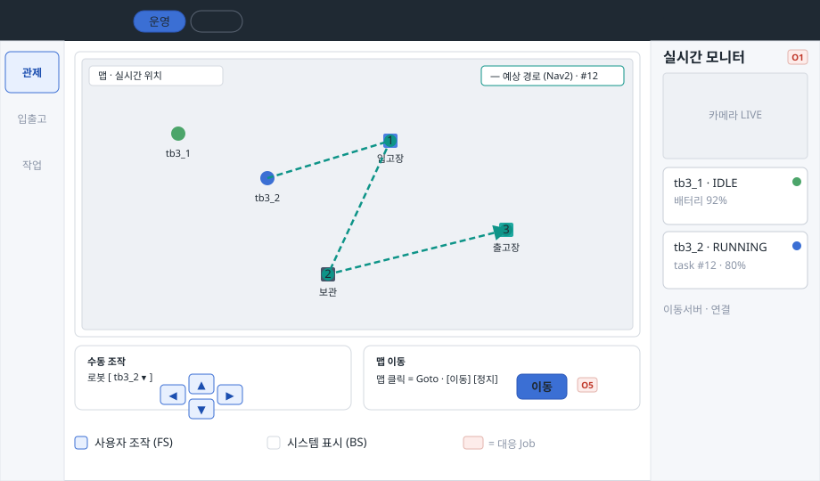

맵·카메라·로봇 상태가 항상 보이는 기본 상태. 수동 조작(O5)은 맵 **아래 상시 조작 영역**(맵 클릭 Goto + Teleop)에 in-flow로 배치해 방향키가 항상 한눈에 보이고 맵을 가리지 않는다. (기존 "맵 위 절대배치 플로팅 바"는 조작 패널이 오버레이 높이를 넘겨 스크롤·빈 간격을 유발해 in-flow 배치로 전환. 맵 최대화가 필요하면 조작 영역 접기로 보존.) 맵 goto는 **큰 맵을 클릭해 목적지 점을 찍고, 방향 핸들을 끌어 도착 방향(yaw)을 지정**한 뒤 [이동]한다(운영 분리 때 누락된 방향 지정을 관리 `MapGoto`의 yaw 핸들 로직 이식으로 복원). 실행 중 task의 **예상 경로(Nav2)**가 맵에 폴리라인 + 순번으로 표시된다(BS readout). 표시는 전부 BS, 조작만 FS. 경로 모델은 [도킹/경로 결정](../decisions/2026-06-22-docking-and-path-model.md) 참조.

### 7.2 운영자 — 입출고 (좌측 드로어 열림 · O2·O3·O4·O6)

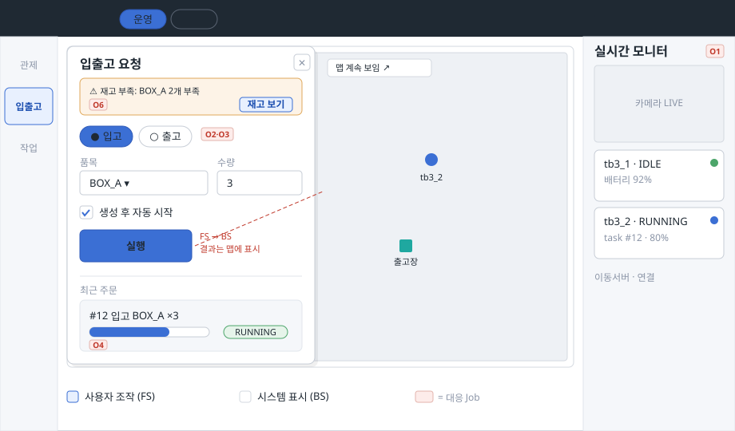

좌측 드로어로 입출고 폼이 뜨고, 맵·카메라·상태는 그대로 고정(우측·드로어 오른편에 맵 계속 보임). [실행]이 FS→BS 경계이며, 결과는 곧장 맵에 반영된다. 실패는 드로어 상단 배너 + [재고 보기]로 다음 행동을 준다(O6). [✕]로 닫으면 관제 풀뷰로 복귀.

### 7.3 운영자 — 작업 / 예약 목록 (좌측 드로어 · O7·O4)

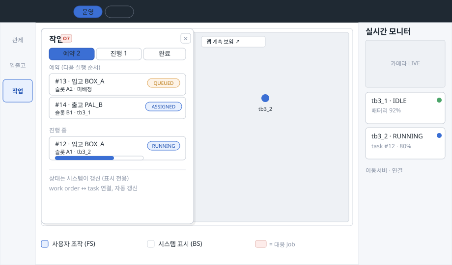

작업 드로어가 **예약(QUEUED·ASSIGNED) · 진행(RUNNING) · 완료**로 구분된 목록을 보여준다. 운영자는 다음에 실행될 작업 순서를 본다(O7). 운영자는 **예약(work order) 단위로 취소**하고, **▲▼ 버튼·드래그 핸들로 예약 순서를 재정렬**한다. 디스패치 순서는 `tasks.priority`(`list_assignable`: `ORDER BY priority DESC, created_at ASC`)로 결정되므로 재정렬 = priority 재기록이다. 단 재정렬은 **프론트 dry-run(로컬 임시 순서, 미저장)**이며, 영속화·디스패치 반영(엔드포인트·스키마)은 DB 변경 대응 시 처리한다. **구현 완료(2026-06-24)**: `TaskQueue`·`WorkOrderQueueControls` — 예약 세그먼트 ▲▼·드래그·일괄 취소. 상태는 시스템이 갱신하는 BS readout이며 프론트는 표시만 한다. 맵·카메라·상태는 고정.

### 7.4 관리자 — 슬롯·재고·품목 (A2·A3·A4)

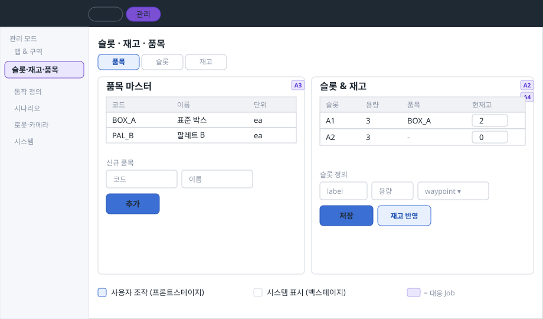

현재 UI에 통째로 없는 화면. `work_orders`가 의존하는 마스터 데이터를 여기서 정의한다. 품목 [추가], 슬롯 [저장], 재고 [반영]이 핵심 컨트롤.

### 7.5 관리자 — 맵 & 구역 (A1)

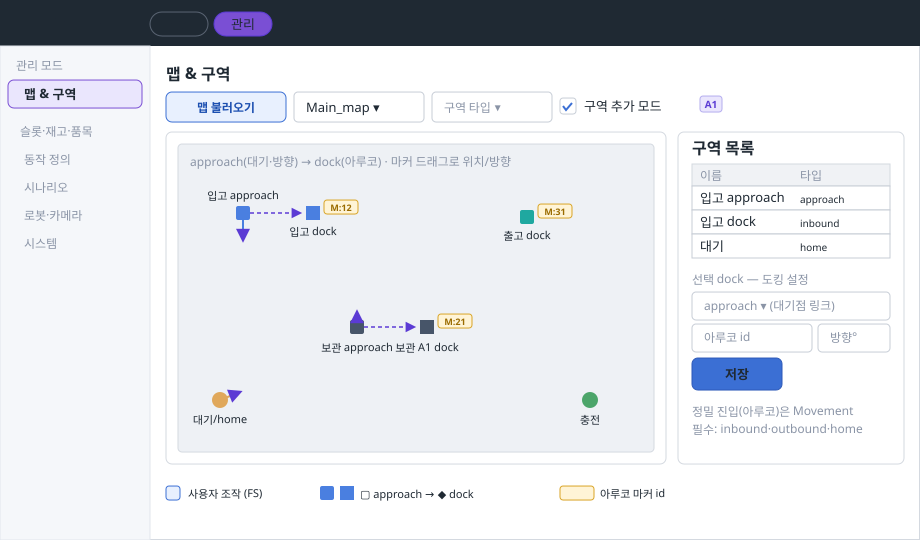

입출고/보관은 **approach(대기·방향) → dock(아루코)** 2점으로 배치한다. approach는 타깃을 바라보는 yaw, dock은 `aruco_marker_id`를 갖고 정밀 진입은 Movement가 수행한다. 보관 dock은 슬롯과 연결된다. 필수 구역(inbound·outbound·home) 누락은 시스템이 검증한다. 모델은 [도킹/경로 결정](../decisions/2026-06-22-docking-and-path-model.md) 참조.

### 7.6 관리자 — 동작 정의 (A5)

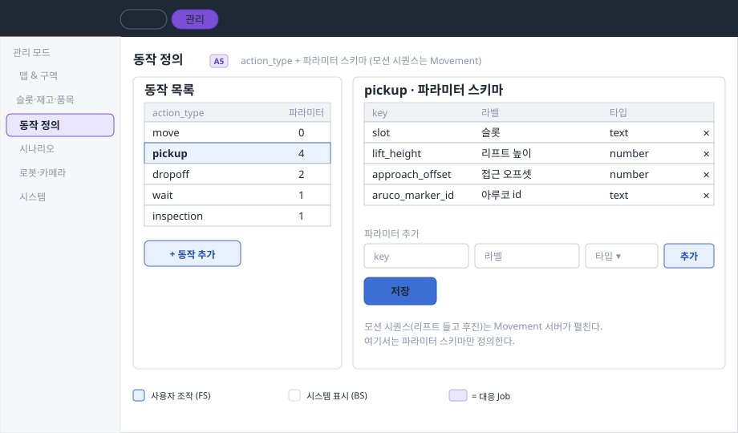

action_type 목록 + 선택 동작의 **파라미터 스키마 편집**(key·라벨·타입). `constants.ts`의 `ACTION_PARAMS`를 DB화한 것. 모션 시퀀스(리프트 들고 후진)는 Movement가 펼치고, 여기선 파라미터(`lift_height`·`approach_offset`·`aruco_marker_id` 등)만 정의한다.

### 7.7 관리자 — 시나리오 편집기 (A6)

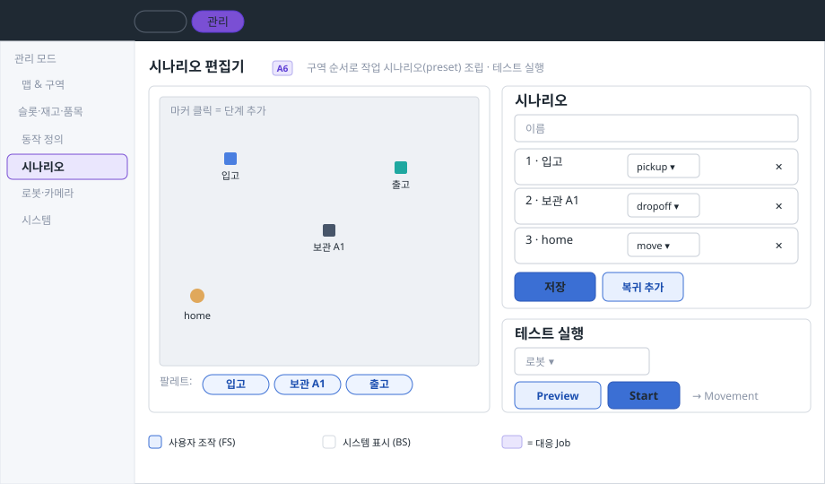

맵 마커/팔레트 클릭으로 구역 순서를 조립해 preset을 만든다. 단계별 동작·파라미터를 정하고, [Preview]/[Start]로 테스트 실행(→ Movement)한 뒤 [저장]. 고급 관리자 도구.

### 7.8 관리자 — 로봇 · 카메라 (A7)

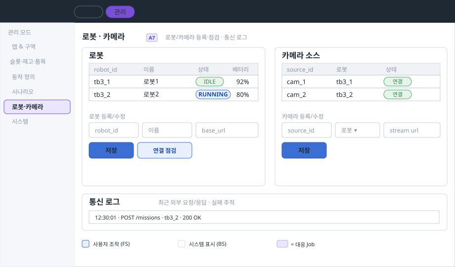

로봇/카메라 소스를 등록·점검하고 통신 로그로 외부 요청/응답·실패를 추적한다. 등록 폼([저장])과 [연결 점검]이 핵심 컨트롤.

## 8. IA (확정)

네비게이션 IA(모드·메뉴·라우트)는 [IA.md](IA.md)에 확정했다. 여기서 메뉴 구조를 중복 기재하지 않는다. 구현 현황은 [FRONTEND](FRONTEND.md).

## 9. IA 미설계 화면 — 와이어프레임

IA(§8)에 명시됐지만 §7에 와이어프레임이 없는 두 화면을 추가한다: **기록**(운영자 읽기·관리자 전체)과 **시스템**(관리자 전용). 설계 원칙·컬러·레이아웃 기조는 §7과 동일하다.

### 9.1 기록 — 이벤트·작업·이동 기록 (O6 · 관리자 전체)

운영자는 **이벤트 타임라인**과 **작업 기록** 탭을 읽기 전용으로 접근하고, 관리자는 **이동 명령**·**운영자 조작** 탭까지 열람한다. 화면은 하나이며 접근 모드에 따라 탭 노출 범위만 달라진다.

> **운영 모드 진입**: 슬림 네비 하단에 `기록` 항목 추가 (읽기 전용, 2탭). **관리 모드 진입**: 사이드바 공유 구역의 `기록` 항목 (전체 4탭).

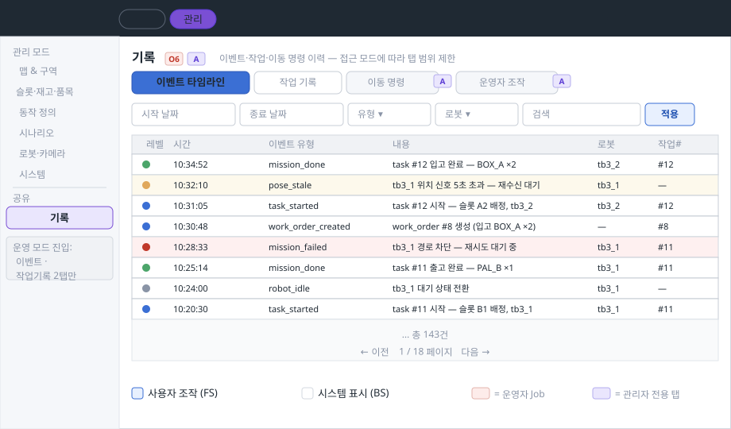

프론트스테이지 컨트롤: 날짜 범위 · 유형 · 로봇 필터 + [적용]. 테이블 자체는 BS readout. 오류 행(빨강)은 O6(막힌 이유 확인)의 직접 근거가 된다.

### 9.2 시스템 — 서버 연결 상태 · DB 탐색 (관리자)

운영자는 진입하지 않는다. 관리자가 서버 연결 상태를 점검하고 DB 테이블 행 수를 확인한다.

> 좌 패널 **서버 연결 상태**: Main DB · Movement(로봇별) · Camera 연결 행렬 + [재연결 시도]. 우 패널 **DB 테이블**: 테이블별 행 수 목록 + [탐색] 버튼(인라인 브라우저). 운영 모드 표시(정상/드라이런)는 좌 패널 하단.

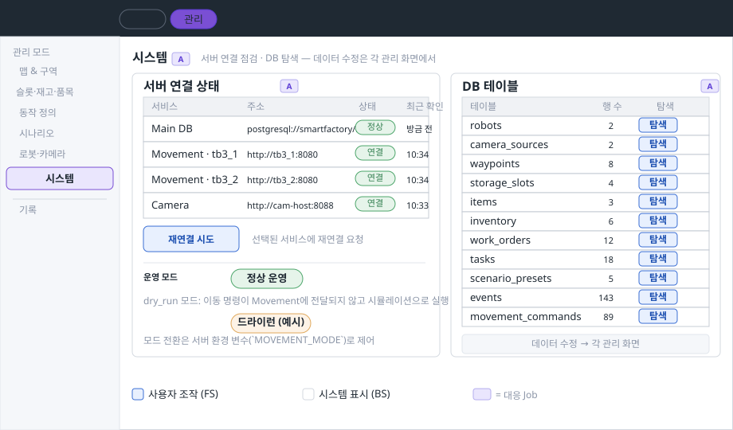

프론트스테이지 컨트롤: [재연결 시도], [탐색] 두 가지뿐. 나머지는 BS readout. 데이터 정의·수정은 각 관리 화면(슬롯·재고·품목, 로봇·카메라 등)에서 처리하며 이 화면에서는 탐색만 가능하다.
