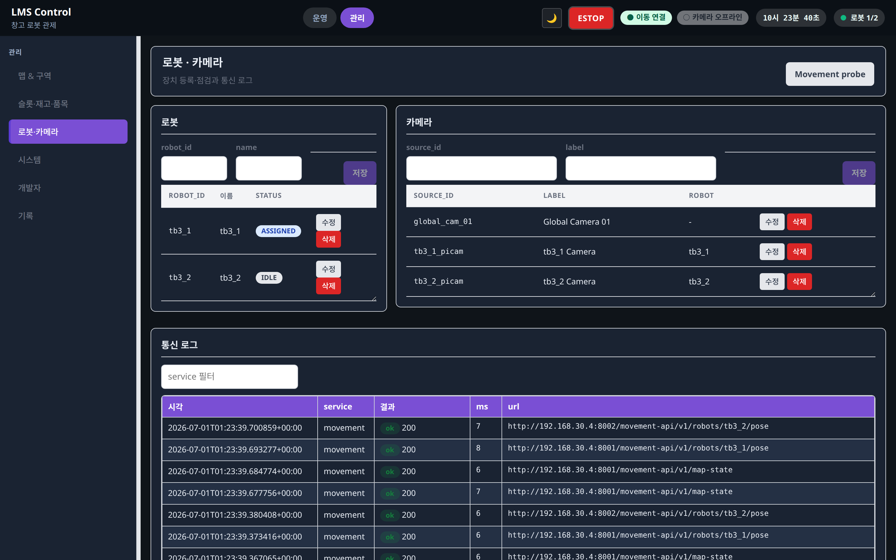

# 로봇·카메라 (/admin/devices)

상태: Active
소유: Frontend
최종 갱신: 2026-07-09 15:06 KST
목적: `/admin/devices`(DevicesAdmin)의 로봇·카메라 CRUD, 명령 envelope 시험, Nav2 진단 패널, 수동 ArUco 정렬을 설명한다.

## User Flow

1. 로봇·카메라 소스를 등록·수정·삭제한다. Movement probe와 통신 로그를 확인한다.
2. **명령 envelope 시험**(`RobotCommandTestPanel`)으로 `move_to_point`·`dock_transfer`·`aruco_align` dry_run을 검증한다. `aruco_align` 실실행은 확인창 후 전송.
3. **수동 ArUco 정렬**(`ArucoManualTest`) — `GET /aruco/latest` 검출값 폴링 + teleop.
4. `MapGoto` 풀 진단 패널로 Nav2 goto·preview·trace·initial pose를 시험한다.

## Behavior

- `DevicesAdmin`: robot/camera CRUD, `GET /comm/logs`, probe 버튼. 행별 **수정** → 폼 채움 → **저장**(upsert). CRUD 규약은 [슬롯·재고·품목 §관리자 CRUD 정책](admin-warehouse.md).
- `RobotCommandTestPanel`: `postRobotCommand`/`getRobotCommand`. kind `move_to_point`·`dock_transfer`(`aruco_marker_id`·`action`·`level`)·`aruco_align`(`aruco_marker_id`·`final`·`tolerance{xy_m,yaw_deg}`). 실실행은 Movement `POST /robot-commands` 지원 필요, 404는 `movement_robot_commands_api_missing`. dry_run 기본 ON.
- `ArucoManualTest`: `GET /aruco/latest` 500ms 폴링으로 `center_error_norm`·`marker_width_px`·`estimated_distance_m` 표시 + `postManualDrive` teleop(3×3). 자동 실행 버튼 없음(자동 정렬은 시험 패널 `aruco_align`). estop 시 비활성.
- `MapGoto` — 관리/dev 풀 패널(Nav2). `missionGoto`/`missionGotoPreview`·`missionStatus`·trace·진단. 목표 링/점/방향 핸들/로봇 글리프는 `MARKER_PX=10` 화면 px 고정. 운영 셸 미노출. preview(`dry_run=true`)는 payload·차단 확인, go 후 command id로 status·trace 폴링. initial pose 모드: 맵 클릭 + yaw 후 `POST /robots/{id}/initial-pose`; Movement 미구현 시 `movement_initial_pose_api_missing`.

## API/Data Dependencies

- `GET/POST /robots`, `DELETE /robots/{id}` · `GET/POST /camera-sources`, `DELETE /camera-sources/{id}`
- `GET /comm/logs`, `POST /comm/probe/movement`, `POST /comm/probe/camera` — 두 probe는 동작·반환이 달라 **분리 유지**([interfaces README § Design Decisions](../../interfaces/README.md#design-decisions-현행-유지))
- `POST /robot-commands` (`move_to_point`·`dock_transfer`·`aruco_align`), `GET /robot-commands/{id}` · `GET /movement/commands/{id}/trace`
- `GET /aruco/latest?robot_id=&marker_id=` · `GET /robots/{id}/localization`·`/nav-state` · `GET /movement/map-state` · `POST /robots/{id}/initial-pose`

## Edge Cases

- emergency·command accepting false·robot offline이면 실제 이동 차단. localization false/pose 없음이면 go 전 확인.
- probe 실패 시 `.env` 호스트·네트워크·Movement health 확인. callback URL은 Movement가 접근 가능한 Main 주소여야 한다.
- `dock_transfer`·`aruco_align` 실실행은 Movement 지원·현장 연결에 의존. 404 → `501 movement_robot_commands_api_missing`.
