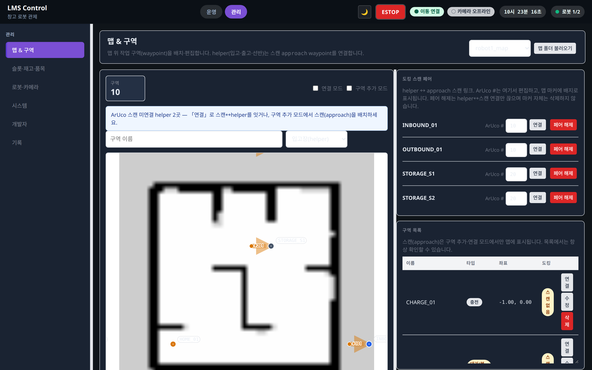

# 맵 & 구역 (/admin/map)

상태: Active
소유: Frontend
최종 갱신: 2026-07-09 15:06 KST
목적: `/admin/map` 맵·구역(waypoint) 편집(MapEditor) 범위를 설명한다.

## User Flow

1. `/admin/map`에서 map을 선택한다 (`/tasks/editor`·`/tasks/list`는 `/admin/map`으로 redirect).
2. map 위에 waypoint(구역)를 추가하거나 기존 구역을 수정·삭제한다.
3. helper(입고·출고·storage) 구역에 **「연결」모드**로 스캔(approach) 마커 → helper 마커를 클릭-클릭 연결한다. ArUco #는 스캔 마커 위 인라인 입력.
4. 신규 스캔(approach)이 필요하면 **구역 추가 모드**에서 타입 `approach`를 선택하고 맵을 클릭해 배치.
5. 구역 목록에서 helper·approach 타입을 구분하고 도킹 링크 상태를 확인한다.
6. 명령 시험은 [로봇·카메라](admin-devices.md)의 `RobotCommandTestPanel`에서 envelope dry_run으로 수행한다.

## Behavior

- 화면 제목 **「맵 & 구역」**. `MapEditor`(`features/mapEditor/`)가 `/admin/map`에 매핑. **시나리오 스텝(번호+보라 폴리라인) UI는 제거.**
- `MapStage`는 map 이미지·좌표 변환·구역 마커·도킹 연결선 표시.
- **연결 모드**: `linkMode` 토글(구역 추가와 배타). approach 클릭 → helper 클릭 = `scan_waypoint_id`·`dock_mode=aruco`·`yawScanToDock` upsert. ArUco #는 스캔 선택 시 인라인 입력.
- **스캔 마커 시각**: `DockPairOverlay` 단일 렌더 — 작은 dot + `#N` 배지, 얇은 scan→helper 선·소형 화살표.
- **스캔 yaw**: `approach`는 yaw 핸들 없음. `yawScanToDock(scan, helper)` 자동.
- **정본 모델**: `waypoint_type=approach` + `aruco_marker_id` on scan; helper는 `scan_waypoint_id`·`dock_mode=aruco`.
- `pickup`/`dropoff` zone type은 DB에 남을 수 있으나 신규 생성 UI 제외.

## API/Data Dependencies

- `GET/POST /maps`, `POST /maps/import-folder`, `GET /map-assets/{map_id}/image.png`
- `GET /waypoints?map_id=...`, `POST /waypoints`, `DELETE /waypoints/{id}` — `scan_waypoint_id`·`aruco_marker_id`·`dock_mode` 포함

## Related

- 도킹 ADR: [decisions/2026-06-22-docking-and-path-model](../../decisions/2026-06-22-docking-and-path-model.md)
