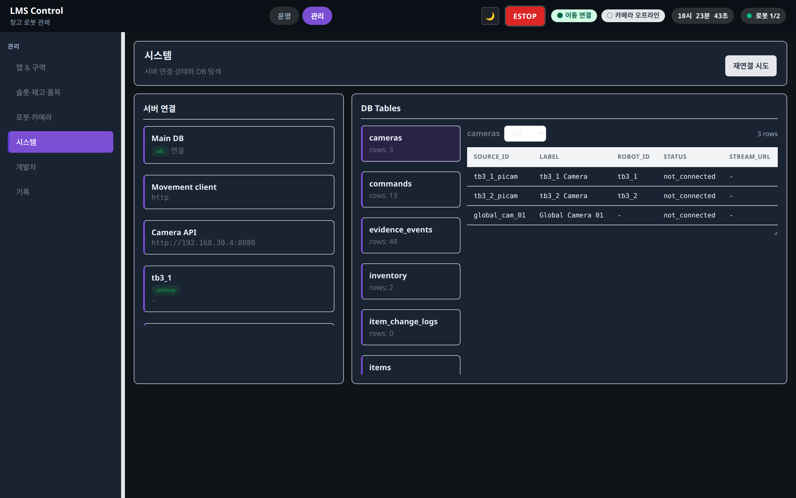

# 시스템 (/admin/system)

상태: Active
소유: Frontend
최종 갱신: 2026-07-09 15:06 KST
목적: `/admin/system`(SystemAdmin)의 외부 서버 연결 상태 확인과 DB read-only 조회를 설명한다.

## User Flow

1. 외부 서버 연결 상태(Movement·Camera·Vision)를 확인한다.
2. DB 테이블 목록과 row sample을 read-only로 조회한다.

## Behavior

- `SystemAdmin`: `GET /status`·`GET /system/external-config` + `GET /db/tables`·`/db/tables/{name}/rows`.
- ESTOP 해제·진단 진입점도 시스템 화면에서 제공한다(운영 셸 헤더의 상시 ESTOP과 별개).

## API/Data Dependencies

- `GET /system/external-config`, `GET /status`
- `GET /db/tables`, `GET /db/tables/{table_name}/rows`

## Edge Cases

- DB viewer는 row 수정 기능 없음(read-only).
- 연결 probe 실패 시 `.env` 호스트·네트워크·외부 서버 health 확인.
