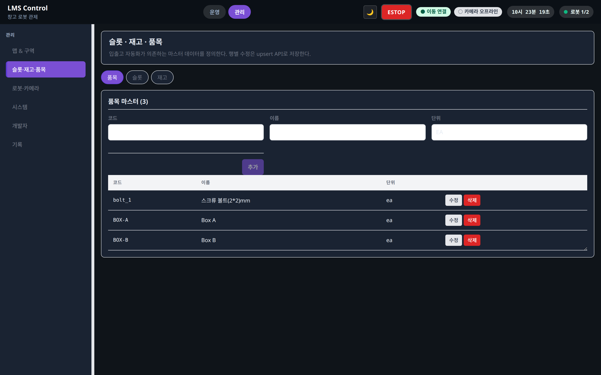

# 슬롯·재고·품목 (/admin/warehouse)

상태: Active
소유: Frontend
최종 갱신: 2026-07-09 15:06 KST
목적: `/admin/warehouse`(WarehouseAdmin)의 품목·슬롯·재고 마스터 CRUD와 관리자 CRUD 정책을 설명한다.

## User Flow

1. 품목·슬롯·재고 마스터를 등록한다.
2. 테이블 행 **수정**으로 폼에 기존 값을 채운 뒤 **수정 저장**(upsert)한다.
3. 재고는 행 **수정** 또는 **초기화**(quantity `0` upsert)로 조정한다.
4. 삭제는 2단 확인 후 `DELETE` API를 호출한다.

## Behavior

- `WarehouseAdmin`: 품목·슬롯·재고 upsert + DELETE. PK(`item_code`·`slot_id`·`slot:item:floor`)는 편집 중 변경 불가.

## 관리자 CRUD 정책

관리 화면 전반(창고·[로봇·카메라](admin-devices.md) 포함)에 적용된다.

| 영역 | API 계약 | UI |
| --- | --- | --- |
| 품목 | `POST /items` upsert, `DELETE /items/{code}` | 추가·행 수정·삭제. `unit` 포함 |
| 슬롯 | `POST /storage-slots` upsert, `DELETE` | 추가·행 수정(capacity/enabled)·삭제 |
| 재고 | `POST /inventory` upsert only | 수량 반영·행 수정·0 초기화. 삭제 API 없음 |
| 로봇·카메라 | upsert + DELETE | 기준 패턴(행 수정·2단 삭제) |
| 맵 메타 | `POST /maps`, `import-folder`, `sync-from-movement` | 직접 CRUD 폼 없음 — 파일/Movement 동기화 중심 |
| 맵 마커 | `POST /waypoints`, DELETE/force-delete | `MapEditor` 전용 편집 패널 |
| 작업·입출고 | 생성·배정·시작·완료·취소 | 일반 수정 없음 — 상태 전이 도메인 |

- `PUT/PATCH`는 도입하지 않는다. 동일 PK로 `POST` 재전송이 수정이다. PK 변경은 삭제 후 재생성.

## API/Data Dependencies

- `GET/POST /items`, `DELETE /items/{item_code}`
- `GET/POST /storage-slots`, `DELETE /storage-slots/{slot_id}`
- `GET/POST /inventory`

## Edge Cases

- 재고 upsert 시 capacity 초과 409, item/slot missing 404 — inline alert로 표시.
