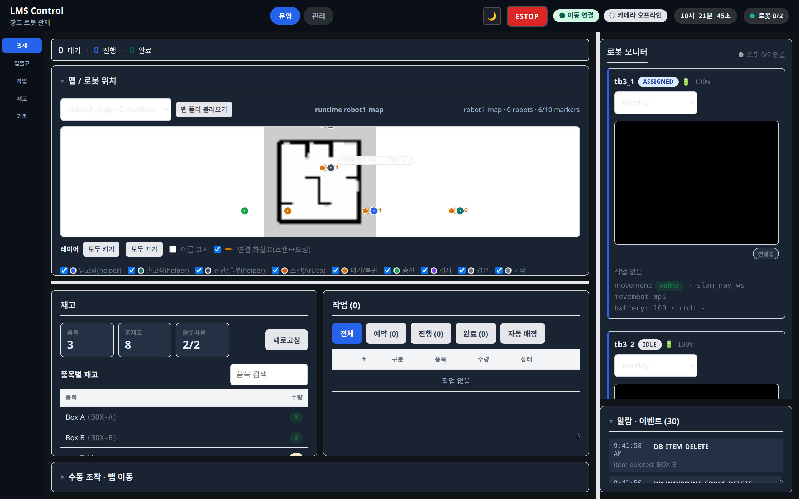

# 관제 (/operate/control)

상태: Active
소유: Frontend
최종 갱신: 2026-07-09 15:06 KST
목적: 운영 관제 화면의 표시 정보·조작 진입점과 운영자 수동 조작(Teleop·맵 이동)을 설명한다.

## User Flow

1. 사용자는 `/operate/control` 또는 `/`로 진입한다 (`/dashboard/overview`는 legacy redirect).
2. 헤더에서 연결·비상 배지와 **ESTOP**(`EstopControls`)을 확인한다.
3. 맵·로봇 pose·카메라·알람·작업 처리량을 확인한다.
4. 맵 아래 in-flow 조작 영역에서 수동 조작(`Teleop`)·맵 이동(`MapGotoOperate`)을 사용한다.
5. 입출고·기록·재고는 슬림 네비로 좌측 드로어를 연다. **작업**은 밴드 작업 탭으로 전환한다.

## Behavior

- `OperatorShell`이 운영 관제의 지속 셸이다. `Dashboard.tsx`는 제거됐다.
- 헤더 `EstopControls` — 누름=`robotEstopAll`(`POST /robot/estop`) 즉시 실행; 해제=confirm 후 `robotClearEstopAll`. `is_emergency` 시 배너·teleop/goto 비활성화.
- `DashboardMap` — map metadata + robot pose로 로봇 위치 표시. 존·방향 글리프·planned path 라벨은 `overlayScale` 역수 `u`로 화면 px 고정, footprint 디스크는 `map.resolution` 미터 환산 honest-scale. `GET /movement/sync-status`의 `planned_paths[]`(fake·dry-run)가 있으면 Nav2 예상 경로를 점선 polyline으로 오버레이.
- 로봇별 pose chip에 `localized`·`pose age`·`reason`·live/stale/lost 표시. 우측 레일에 이벤트 피드·카메라·로봇 상태 카드 상시 표시.

### 수동 조작 (Teleop · 맵 이동)

- `Teleop` — hold 기반 `postManualDrive`(`kind=manual_drive`), 떼면 `stop`. 비상 시 해당 로봇만 disabled. 키보드(WASD·화살표)는 수동 조작 패널이 펼쳐진 때만 활성.
- `MapGotoOperate` — 맵 **아래** `operator-control-bar` in-flow. 큰 운영 맵 클릭·드래그로 목적지 지정(빨간 링=위치, 끝점 핸들=도착 yaw). [이동] `missionGoto(..., yaw)`; [정지] teleop stop. `CollapsiblePanel`로 접어 맵 최대화.
- (관리자용 풀 진단 패널 `MapGoto`·envelope 시험은 [로봇·카메라](admin-devices.md)에 있다.)

## API/Data Dependencies

- `GET /status`: 시스템 snapshot 번들(로봇·카메라·이벤트·작업·`is_emergency`) — 현행 유지([interfaces README § Design Decisions](../../interfaces/README.md#design-decisions-현행-유지))
- `POST /robot/estop`·`/robot/clear_estop`: 일괄 비상 정지/해제
- `POST /robot-commands` (`manual_drive`·`move_to_point`): teleop·운영 goto
- `GET /maps` · `GET /robot-poses?map_id=...` · `GET /movement/sync-status`

## Edge Cases

- active map과 선택 map이 다르면 live pose를 표시하지 않는다.
- pose가 없거나 오래되면 위치 대신 상태 메시지를 보여준다.
- 비상 정지 중에는 teleop·맵 이동·입출고 등 충돌 컨트롤이 비활성화된다.
- 맵 stage 크기 측정 전에는 화면 고정 오버레이 글리프를 숨긴다.
