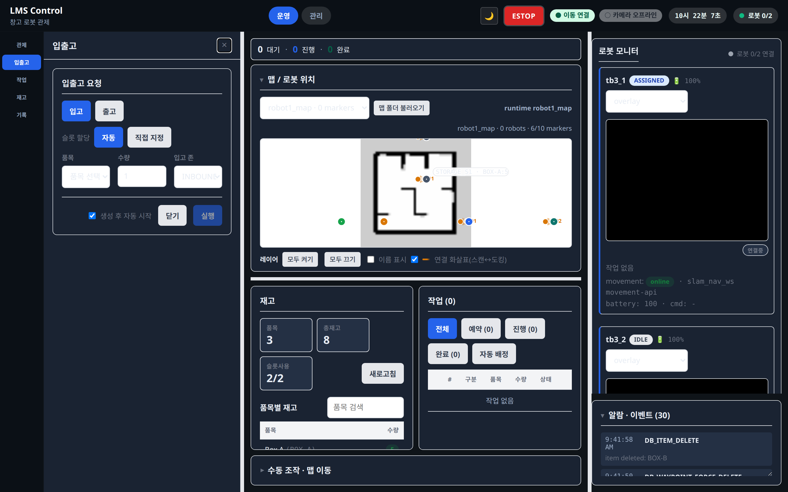

# 입출고 (/operate/inout)

상태: Active
소유: Frontend
최종 갱신: 2026-07-09 15:06 KST
목적: 입출고 work order 생성 폼(WorkOrderForm)의 동작을 설명한다.

업무 흐름·자동 계획 규칙의 정본은 [architecture/INBOUND_OUTBOUND](../../architecture/INBOUND_OUTBOUND.md)이다. 이 문서는 화면 동작만 다룬다.

## User Flow

1. `/operate/inout` 드로어에서 work order를 생성한다. 품목·수량·(다중 시) 입출고 존 선택, 실행 전 슬롯·존 미리보기.
2. 생성 후 진행은 슬림 네비 **작업**([/operate/tasks](operate-tasks.md))에서 추적한다.
3. `/tasks/create`는 `/operate/inout`으로 redirect된다(메뉴 없음, 수동 작업 관리 legacy).

## Behavior

- `WorkOrderForm` — 재고/용량 표시, 수량 상한(50)·경고(20), `POST /work-orders/preview` 계획·**선정 사유** 표시, 다중 존 선택. 성공 후 폼 리셋·슬롯·선정 요약·`auto_start` 반성공 안내.
- `POST /work-orders`·`/work-orders/preview`는 동일 계획 함수를 공유한다(preview는 무쓰기).
- work order가 운영 정본이다. preset 기반 `TaskCreate`는 registry에서 제거·redirect.

## API/Data Dependencies

- `GET/POST /work-orders`, `POST /work-orders/preview`, `GET /work-orders/{order_id}`
- `POST /work-orders/preview`·`GET /work-orders`: `slots[]`에 `source_zone`·`target_zone`·`selection_reason`·`available_qty_at_plan`

## Edge Cases

- 재고/용량 부족은 `409 insufficient_inventory`·`no_available_slot` 등으로 사유+다음 행동을 준다.
- `auto_start=true`일 때만 생성 직후 mission이 시작된다.
