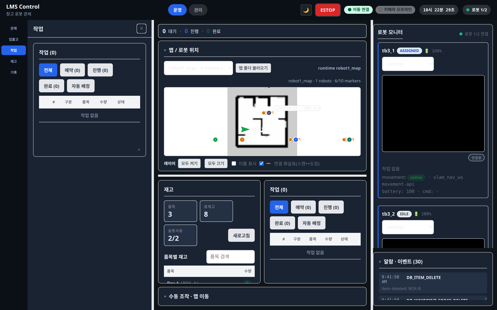

# 작업 (/operate/tasks)

상태: Active
소유: Frontend
최종 갱신: 2026-07-09 15:06 KST
목적: 작업 큐(TaskQueue)의 예약·진행·완료 조회와 배정·시작·취소·우선순위 재정렬 흐름을 설명한다.

## User Flow

1. 슬림 네비 **작업**(`/operate/tasks`)을 누르면 맵 아래 실시간 밴드의 **작업 탭**으로 전환·스크롤된다(별도 드로어 없음). 예약/진행/완료 상태와 order↔task 상세를 확인한다.
2. 주문 행을 펼치면 nested task 목록이 보인다. QUEUED·ASSIGNED task에 [취소]. 예약 행 [취소]는 QUEUED/ASSIGNED만 일괄 취소(RUNNING은 경고).
3. **예약** 세그먼트에서 ▲▼·드래그 핸들(⠿)로 work order 순서를 재배치한 뒤 **[우선순위 저장]**으로 서버에 반영한다. 저장 전 재배치는 로컬 staging(미저장)이며 [되돌리기]·refetch 시 서버 순서로 복귀.

## Behavior

- `TaskQueue` — operation/품목명/상태 한글 표기. task 행에 **자동 선정 요약**(zone·슬롯·사유·가용수량,). 툴바 2-zone: 왼쪽=뷰 전환 세그먼티드(전체/예약/진행/종료·카운트), 오른쪽=배치 실행([자동 배정]·[▶ 배정·시작]). 행 액션 위계: 펼침 `▸`=ghost, [배정]=outline, [▶ 시작]=accent, [취소]=danger.
- `WorkOrderQueueControls` — **예약** 세그먼트 ▲▼·드래그(⠿)·키보드(↑↓) 재배치. 순서 변경 시에만 **편집 커밋 바**(`QueueEditCommitBar`)가 [우선순위 저장]·[되돌리기] 노출(저장 전 자동 배정 잠금). 저장 `useSetWorkOrderPriority` → `POST /work-orders/{id}/priority`(상단=높은 priority)로 `tasks.priority` 영속화.
- **디스패치 순서**: `auto_assign` → `list_assignable`의 `ORDER BY priority DESC, created_at ASC`. `WORK_ORDER_PRIORITY_SET` 이벤트 기록. 저장 전 재배치만 로컬 staging.
- `TaskList` FE 화면은 제거. 작업 운영 정본은 `TaskQueue`. mission 시작은 배정된 작업 기준 별도 실행, 상태 전이는 backend 검증.

## API/Data Dependencies

- `GET /tasks` · `POST /tasks` · `POST /tasks/{id}/{assign|start-mission|complete|cancel}`
- `GET /work-orders` · `POST /work-orders/{id}/priority` · `GET /robots`(배정 대상)

## Edge Cases

- 로봇이 없거나 점유되면 배정 대상 제외. mission 정보 부족 시 start-mission 실패 가능.
- 완료/취소는 현재 상태에 따라 backend에서 거부될 수 있다. RUNNING 개별 취소 시 물리/DB 불일치 경고.
