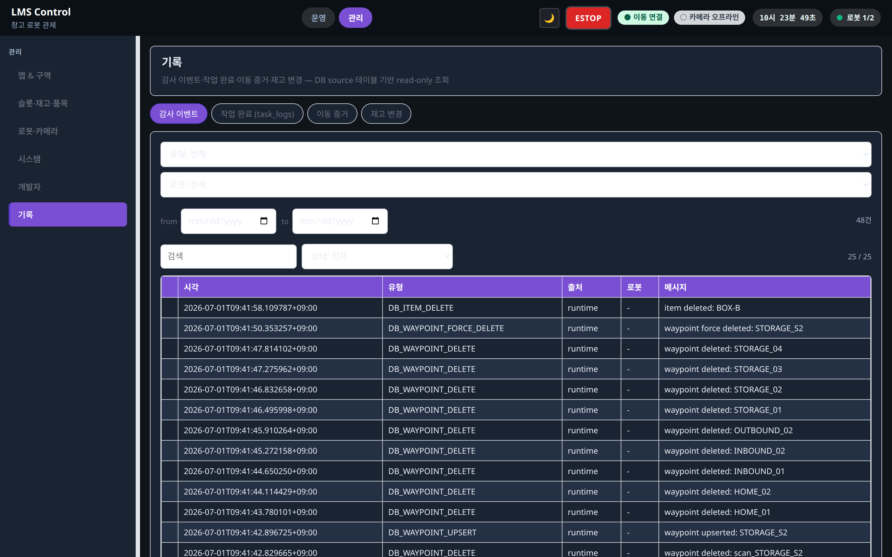

# 기록 (/records/events)

상태: Active
소유: Frontend
최종 갱신: 2026-07-09 15:06 KST
목적: 운영·관리 기록 화면이 DB 정본 테이블을 읽는 read-only 감사 조회 모델임을 설명한다.

## 개요

`records` 물리 테이블은 **없다**. 기록 화면은 `evidence_events`·`task_logs`·`item_change_logs`를 각각 projection/filter로 읽는 통합 감사 UI다. 중복 저장 경로를 만들지 않는다.

## User Flow

1. `/records/events` 또는 운영 드로어 기록으로 진입한다.
2. 탭별로 감사 이벤트·작업 완료·이동 증거·(관리만) 재고 변경을 조회한다.
3. 필요하면 command id·task id·item/slot key로 상세 원인을 추적한다.

## Behavior

- 통합 `Records.tsx`가 source table별 탭을 표시한다.
- **운영 드로어**: 감사 이벤트·작업 완료 2탭(`variant=operate`).
- **관리 기록 화면**: 감사 이벤트·작업 완료·이동 증거·재고 변경 4탭(`variant=full`).
- 운영자 조작 전용 탭(`/operator-actions`)은 제거. 수동 조작·DB 변경은 감사 이벤트 타임라인에서 추적.

## API/Data Dependencies

| UI 탭 | Hook | API | DB source |
| --- | --- | --- | --- |
| 감사 이벤트 | `useEvents` | `GET /events` | `evidence_events` (runtime) |
| 작업 완료 | `useTaskLogs` | `GET /task-logs` | `task_logs` |
| 이동 증거 | `useMovementCommandRecords` | `GET /movement-commands` | `evidence_events` (movement) |
| 재고 변경 | `useItemChangeLogs` | `GET /item-change-logs` | `item_change_logs` |

설계 결정: `/events`·`/movement-commands`·`/evidence-events`는 **분리 유지**한다. 같은 `evidence_events`를 읽지만 응답 shape가 소비자별로 달라 `?source=` 단일화는 더 나빠진다. 재검토 트리거는 4번째 projection 필요 시점. 근거: [interfaces README § Design Decisions](../../interfaces/README.md#design-decisions-현행-유지).
