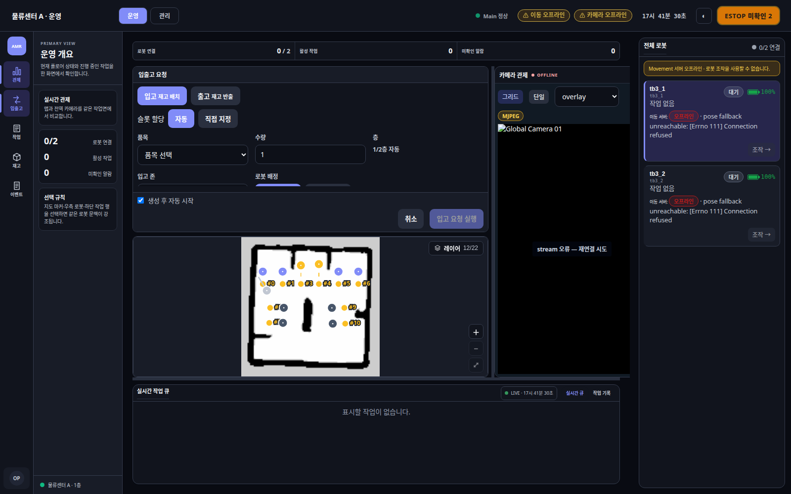
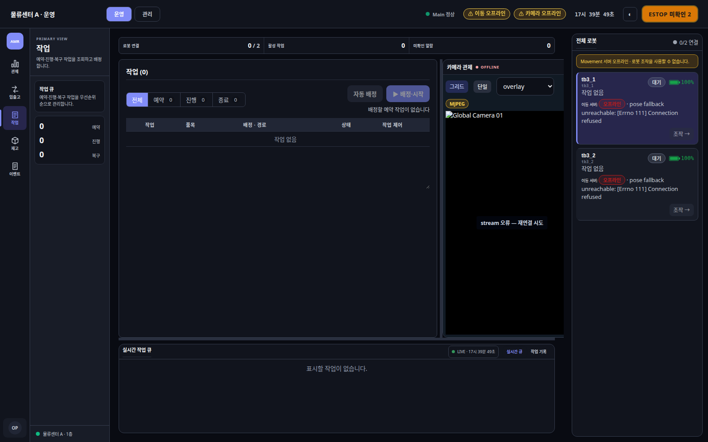
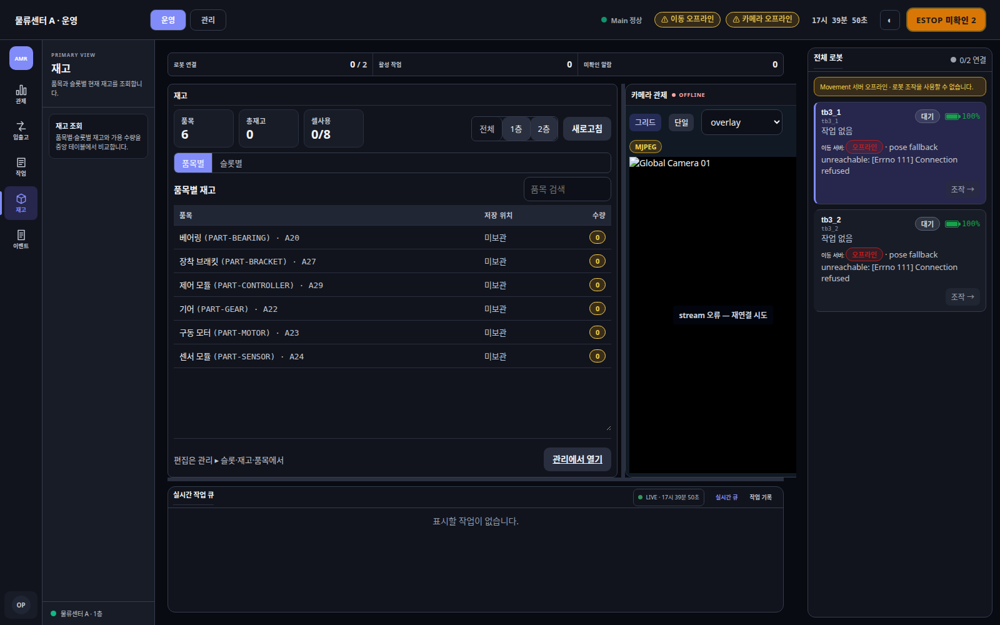
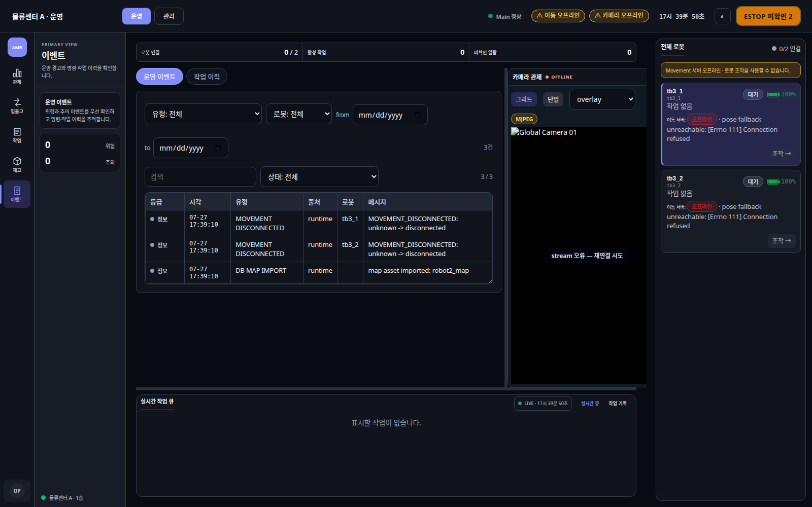
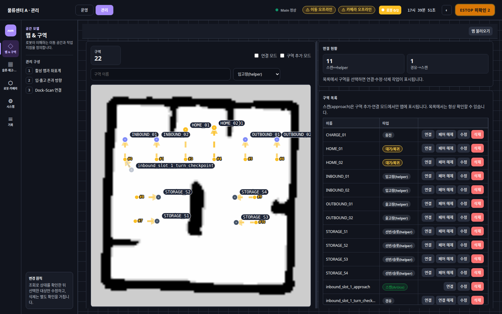
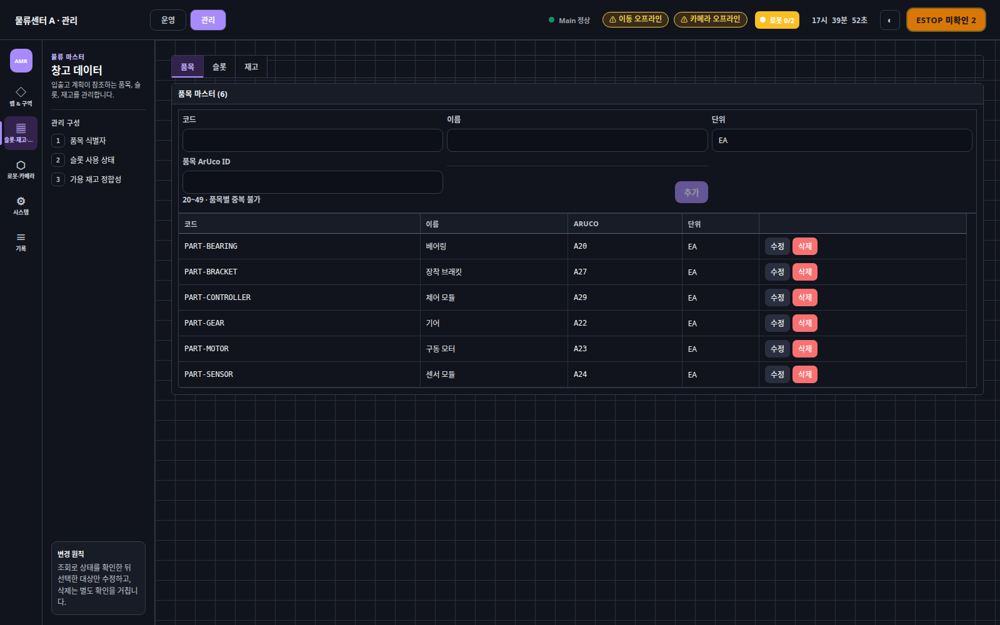
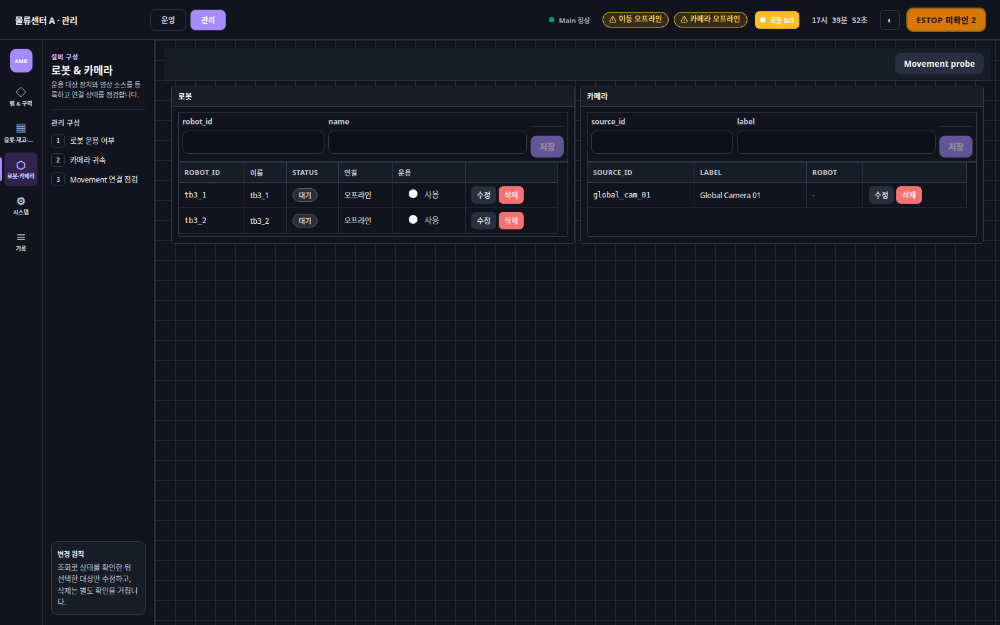
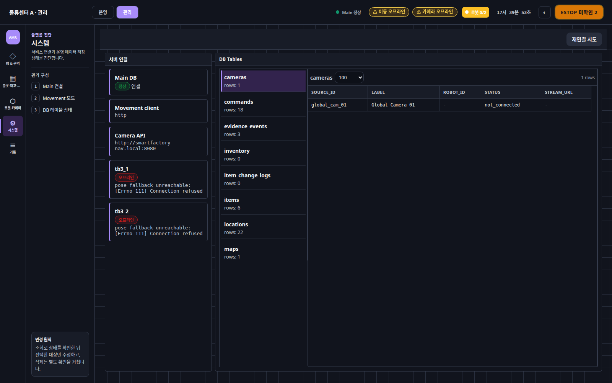
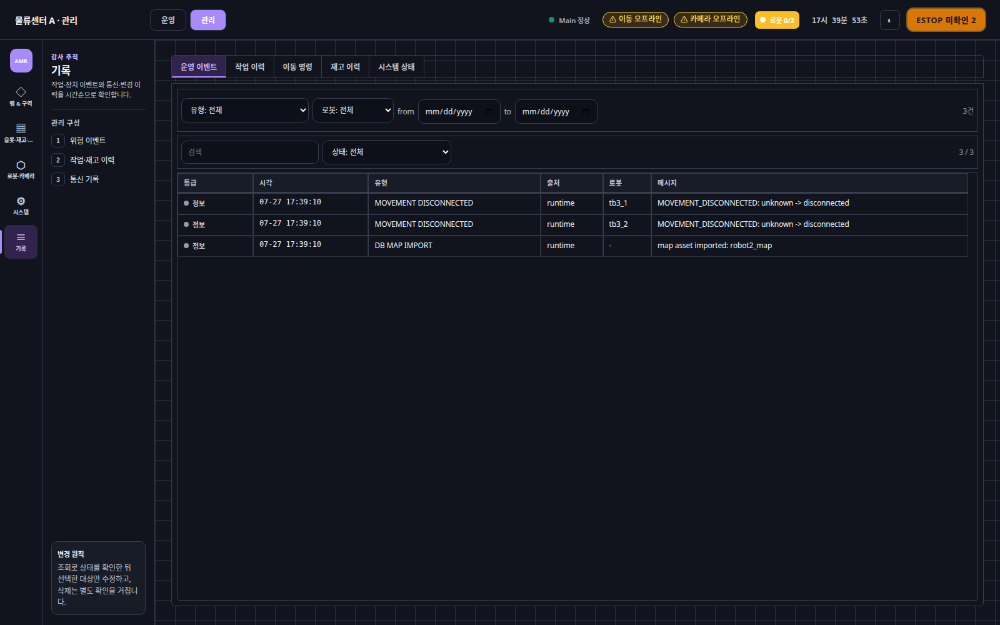

# 관제 UI

Main Server의 작업·로봇·재고 상태를 조회하고 운영 명령을 입력하는 React UI입니다.

---

## 화면 데모

| 캡처 항목 | 내용 |
| --- | --- |
| 실행 구성 | React production build + Main FastAPI + PostgreSQL |
| 화면 크기 | 1600×1000 |
| 외부 장비 | Nav·AI 미연결, 이동·카메라 오프라인 표시 |
| 원본 보기 | 각 이미지 선택 |

### 운영 화면

| 관제 `/operate/control` | 입출고 `/operate/control?drawer=inout` |
| --- | --- |
| [](docs/screens/operate-control.png) | [](docs/screens/operate-inout.png) |
| 작업 `/operate/tasks` | 재고 `/operate/inventory` |
| [](docs/screens/operate-tasks.png) | [](docs/screens/operate-inventory.png) |
| 이벤트 `/operate/events` | |
| [](docs/screens/operate-events.png) | |

### 관리 화면

| 맵·구역 `/admin/map` | 슬롯·재고·품목 `/admin/warehouse` |
| --- | --- |
| [](docs/screens/admin-map.png) | [](docs/screens/admin-warehouse.png) |
| 로봇·카메라 `/admin/devices` | 시스템 `/admin/system` |
| [](docs/screens/admin-devices.png) | [](docs/screens/admin-system.png) |
| 기록 `/records/events` | |
| [](docs/screens/records-events.png) | |

---

## 구현 기준

| 구분 | 페이지 | 책임 |
| --- | --- | --- |
| 운영 | 관제 | 지도·카메라·로봇·활성 작업 확인 |
| 운영 | 입출고 | 작업 미리보기와 생성 요청 |
| 운영 | 작업 | 작업 큐·진행 단계·복구 처리 |
| 운영 | 재고 | 품목·위치별 현재 수량 조회 |
| 운영 | 이벤트 | 경고와 명령·작업 이벤트 조회 |
| 관리 | 맵·구역 | 지도·waypoint·작업 위치 관리 |
| 관리 | 슬롯·재고·품목 | 물류 기준정보 관리 |
| 관리 | 로봇·카메라 | 장치 등록과 연결 상태 확인 |
| 관리 | 시스템 | Main·DB·Nav·AI 연결 진단 |
| 관리 | 기록 | 작업·이동·재고·통신 이력 조회 |

| 데이터 기준 | 대상 | UI 처리 | 확정 기준 |
| --- | --- | --- | --- |
| 실시간 상태 | 로봇 위치, 연결, 카메라, 활성 작업 | 주기 조회, 시각·stale·오프라인 표시 | Main이 마지막으로 확인한 상태 |
| 업무 상태 | 작업 생성·복구, 재고, 품목, 위치·지도 | 변경 후 관련 Query 재조회 | Backend 검증 + PostgreSQL transaction |
| 이력 | 작업 결과, 재고 변경, 운영 이벤트 | 현재 상태와 분리해 시간순 조회 | DB 완료·변경 기록 |

| 기술 사양 | 구현 |
| --- | --- |
| UI | React 18, TypeScript 5.6 |
| Routing | React Router 6 |
| 서버 상태 | TanStack Query 5 |
| Build | Vite 6 |
| API | 동일 출처 `/api/v1` |
| 기본 Query | `staleTime: 5초`, 실패 재시도 1회 |
| 실시간 조회 | 상태·위치·주행 정보 약 1~2초 |
| 작업·이력 조회 | 작업·복구·이벤트·통신 기록 5초 |
| 개발 프록시 | `/api`, `/health`, `/openapi.json` |
| 운영 배포 | `dist/`를 Main FastAPI가 정적 제공 |

| 쓰기 규칙 | 처리 |
| --- | --- |
| 작업·재고·기준정보 | 브라우저 값을 직접 확정하지 않음 |
| 성공 응답 | 관련 Query 무효화 후 서버 상태 재조회 |
| 실패 응답 | 화면의 임시 성공 상태 제거 |
| 외부 연결 | 브라우저에서 Nav·AI·DB 직접 연결 금지 |
| Fake UI | 실제 작업·재고·Callback 검증에 사용하지 않음 |

---

## 실행과 구조

| 경로 | 역할 |
| --- | --- |
| `src/app/` | 운영·관리 메뉴와 화면 모드 |
| `src/components/` | 공통 레이아웃·입력·상태 표시 |
| `src/features/` | 운영·관리 페이지 구현 |
| `src/hooks/` | TanStack Query 조회·변경 요청 |
| `src/lib/` | Main API client와 Query 설정 |
| `src/routes/` | URL과 페이지 연결 |
| `src/styles/` | 공통 토큰과 화면 스타일 |
| `src/types/` | API와 UI 타입 |

| 기준 파일 | 내용 |
| --- | --- |
| `src/app/menus.ts` | 운영·관리 메뉴 |
| `src/routes/registry.ts` | 페이지 registry |
| `src/lib/api.ts` | API 기준 경로 |
| `src/lib/queryClient.ts` | 공통 Query 정책 |
| `vite.config.ts` | 개발 프록시와 빌드 설정 |

```bash
cd main-server/frontend/web
npm ci
npm run dev
```

| 목적 | 명령·설정 |
| --- | --- |
| Backend | 기본 `http://localhost:8088` |
| 개발 UI | 기본 `http://localhost:5173` |
| Backend 변경 | `VITE_API_PROXY_TARGET` |
| 타입 검사 | `npm run typecheck` |
| 코드 검사 | `npm run lint` |
| 운영 빌드 | `npm run build` → `dist/` |

| 관련 문서 | 내용 |
| --- | --- |
| [Main Server](../../README.md) | 구현 구조와 핵심 작업 흐름 |
| [작업 흐름](../../docs/WORKFLOW.md) | 작업 생성·실행·복구 |
| [인터페이스](../../docs/INTERFACES.md) | UI·Nav·AI 연결 |
| [실행과 운영](../../docs/OPERATIONS.md#실행과-점검) | 개발 모드와 점검 |
