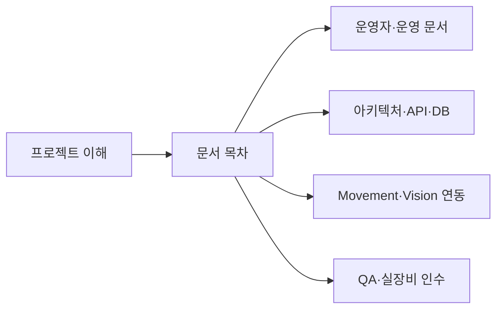

# Main_Control

상태: Active
주 독자: 신규 참여자·기술 평가자
보조 독자: 전체 프로젝트 구성원
난이도: 입문
소유: Main
최종 갱신: 2026-07-16 16:00 KST
구현 기준: main-server 브랜치의 현재 실행·검증 진입점
목적: 프로젝트 목적과 빠른 실행, 다음 문서 진입점을 제공한다.

물류 작업을 계획하고 AMR·카메라·재고 상태를 한 화면에서 운영하는 웹 관제 서버다. Main_Control은
PostgreSQL과 업무 상태를 소유하고, Movement·Vision 서버는 HTTP 계약으로 연동한다.


## 핵심 기능

- 품목·수량 기반 입출고 계획, 슬롯·층·로봇 배정과 재고 반영
- 지도 위 로봇·마커·카메라·작업 큐 통합 관제
- Movement callback과 polling을 결합한 멱등 작업 진행
- ESTOP, 안전 중단, 적재 상태 확인과 운영자 복구
- WebRTC 영상과 MJPEG fallback, 연결·저전력·위험 경보
- Backend·PostgreSQL 통합 gate, 브라우저 UX 자동화와 실로봇 HW-01~11 인수 파이프라인

## 설계 원칙

- 브라우저는 Main_Control API만 호출하고 외부 서버와 PostgreSQL에 직접 접근하지 않는다.
- Main_Control은 무엇을 실행할지, Movement는 주행·도킹 방법을, Vision은 영상·인식 결과를 소유한다.
- 물류 완료와 HOME 복귀를 분리해 주차 실패가 확정된 재고를 되돌리지 않게 한다.
- ESTOP과 작업 중단 후에는 자동 재개하지 않고 운영자가 상태를 확인해 복구한다.
- 개발 환경은 로컬 PostgreSQL을 사용하며 Docker 배포는 팀 통합 후 별도 릴리스 범위다.

## 문서



공식 업무 용어는 [Glossary](docs/GLOSSARY.md), 시스템·도메인 책임은
[Architecture](docs/ARCHITECTURE.md), 로컬 실행과 장애 대응은 [Operations](docs/OPERATIONS.md), 검증 범위는
[Test Cases](docs/TEST_CASES.md)에서 확인한다.

- [문서 목차](docs/README.md) — 독자별 상세 문서 안내
- [Interfaces](docs/INTERFACES.md) — Main_Control↔Movement/Vision 계약
- [Main_Control API](docs/API.md) — 브라우저가 사용하는 REST 카탈로그

## 사전 준비

기준 도구 버전은 Python 3.12와 Node.js 20이며 저장소 루트의 `.python-version`, `.nvmrc`가 정본이다.

- Python 3.12+(CI), Node.js 20+, 로컬 PostgreSQL 16과 client 도구가 필요하다.
- Windows는 Git Bash 또는 WSL에서 bash 스크립트를 실행한다.

새 PC 최초 실행:

```bash
cd <repo-root>/main_server
bash ./scripts/bootstrap.sh    # .env·venv·의존성·로컬 PostgreSQL 준비 + DB snapshot 최초 1회 복원
bash ./scripts/run_main.sh --dev
```

## 실행 방법

PostgreSQL과 실제 Main_Control API를 실행할 때:

```bash
bash ./scripts/run_main.sh --dev
```

프론트 빌드 후 Main_Control에서 서빙할 때:

```bash
bash ./scripts/run_main.sh --build
```

확인:

```bash
curl http://localhost:8088/health
curl http://localhost:8088/ready
curl http://localhost:8088/api/v1/status
curl http://localhost:8088/api/v1/system/external-config
```

## 현재 DB snapshot 갱신

현재 PC의 PostgreSQL 데이터를 새 PC에도 똑같이 올리려면 snapshot을 갱신한다.

```bash
bash ./scripts/db.sh dump
```

새 PC에서 `./scripts/bootstrap.sh`를 실행하면 이 snapshot을 한 번 복원한다. 같은 snapshot은 반복 실행해도 다시 덮어쓰지 않는다. 강제로 다시 맞출 때는:

```bash
bash ./scripts/bootstrap.sh --force-db-restore
```

## 검증

```bash
cd <repo-root>/main_server
bash ./scripts/check.sh backend   # PostgreSQL 없는 backend 검사
bash ./scripts/check.sh frontend  # typecheck, ESLint, production build
bash ./scripts/check.sh ux        # Chrome 기반 핵심 UX 브라우저 테스트
bash ./scripts/check.sh hygiene   # 생성물, 로컬 DB, 비밀 설정 추적 방지
bash ./scripts/check.sh db        # 전용 PostgreSQL test DB 통합 검사
bash ./scripts/check.sh all       # 위 검사 전체 실행
bash ./scripts/check.sh robot --dry-run # 실로봇 인수 시나리오 확인
```

`backend/requirements.txt`와 `requirements-dev.txt`는 사람이 검토하는 입력 목록이고,
`bootstrap.sh`와 검증 환경은 정확한 전이 버전을 고정한 `backend/requirements.lock.txt`를 설치한다.
`check.sh db`는 현재 PostgreSQL 접속정보로 `<database>_test` 전용 DB를 선택해 mutable fixture가 개발 DB를 건드리지 않게 한다.
실로봇이 준비되면 `check.sh robot --robot-id <ID> --operator <이름>`으로 로컬 gate, 외부 서버 사전점검,
HW-01~11 현장 시나리오와 증적 보고서를 한 흐름으로 실행한다. 위험 동작은 자동 실행하지 않는다.

## 주요 경로

```text
backend/app/                   FastAPI application
backend/requirements.lock.txt Python 3.12 runtime+test exact pins
frontend/web/                  React + TypeScript + Vite UI
database/dbml/smartfactory-db-final.dbml  PostgreSQL DB 구조 정본 (DBML)
database/schema_pg.sql         DBML 정본의 PostgreSQL DDL
database/schema_pg_infra.sql   cameras 인프라 DDL
database/seed/bootstrap_pg.sql PostgreSQL bootstrap seed
database/seed/commands_pg.sql  command catalog seed
docs/                          공개 정본 문서
maps/                          ROS map assets
tools/                         Standalone helper tools
```
