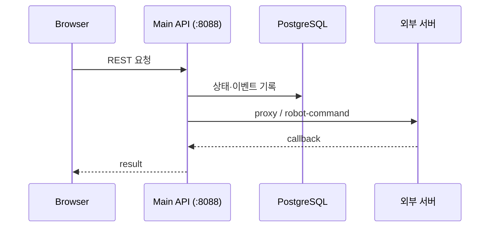

# Main API

상태: Active
소유: Backend
최종 갱신: 2026-07-13 13:59 KST
목적: Main `/api/v1` **작성 규칙 + 엔드포인트 카탈로그**. 외부 계약: [INTERFACES](INTERFACES.md).

브라우저가 사용하는 Main REST API의 경로와 역할을 정리한다. 요청·응답 필드는 실행 서버의 OpenAPI가 정본이다. Movement·Vision 서버 간 계약은 [INTERFACES](INTERFACES.md)에서 관리한다.

Base: `http://<main-host>:8088/api/v1`

## 스키마 · 실시간 갱신 · ROS 연동

- **요청/응답 스키마(메시지 타입)** 는 서버 실행 후 자동 문서에서 확인한다: Swagger UI `http://<main-host>:8088/docs`, OpenAPI JSON `/openapi.json`. 이 문서는 경로와 역할만 정리하고 필드 정의는 중복하지 않는다.
- **실시간 구독 채널은 없다.** WebSocket/SSE를 제공하지 않으며, UI는 `GET /status` 등을 주기 폴링해 상태를 갱신한다. 유일한 실시간 스트림은 Vision WebRTC **미디어**뿐이다(시그널링은 Main이 중계).
- **ROS 토픽도 Main이 직접 구독하지 않는다.** ROS 2 연동은 독립 도구 `tools/ros_pose_bridge`가 담당한다 — TF(`map -> base_link`)와 선택적으로 `nav_msgs/Odometry`를 구독해 `POST /robots/{id}/pose`로 변환해 보낸다. 로봇 주행 자체는 Movement 서버가 ROS를 다룬다.

카탈로그의 `데이터 형식`은 `요청 스키마 → 성공 응답 스키마` 형식이다. `—`는 body가 없다는 뜻이고,
`object`는 아직 이름 있는 Pydantic 스키마가 없는 동적 응답이다. 기본 미디어 타입은
`application/json`; 맵 이미지·영상처럼 다른 형식은 셀에 직접 표시한다. 필드 타입·필수 여부·제약·예시는
OpenAPI를 정본으로 사용한다.

`호출자`는 HTTP 요청을 시작하는 주체다. 이 시스템에는 메시지 브로커 기반 구독자가 없으므로 폴링이나
콜백을 `구독`이라고 부르지 않는다. 서버 간 송수신자와 재시도 계약은 [INTERFACES](INTERFACES.md)가 소유한다.

## Rules

- **브라우저는 Main만 호출한다.** Movement/Vision URL을 직접 호출하지 않는다. 예외는 Vision WebRTC 미디어뿐이고, 그 경우에도 스트림 discovery와 offer는 Main을 거친다.
- **엔드포인트 카탈로그는 이 문서 하나만 둔다.** 서버 간 HTTP 계약은 [INTERFACES](INTERFACES.md)에 둔다.
- 공개 prefix는 `/api/v1`이며, collection 이름은 복수형(`/robots`, `/tasks`)을 쓴다. 상태 전이는 `POST /resources/{id}/action` 형태, 콜백 수신은 `/movement/command-events` 형태다.
- Method는 `GET` 조회, `POST` 생성·명령·전이·콜백, `DELETE` 삭제로 제한하고 `PUT/PATCH`는 기본적으로 쓰지 않는다.
- 실패 응답은 HTTP status와 함께 안정적인 `detail` 코드를 담는다: 대상 없음 404, 상태상 불가 409, 잘못된 값 400/422, 외부 서버 실패 502/504.
- 콜백은 중복 도착을 전제로 idempotent하게 처리하고 원본(raw)을 보존하며, 누락은 폴링으로 보정한다. 목록 조회 기본값은 `limit=50`(1–200).
- 계약을 바꿀 때는 이 문서(또는 INTERFACES)를 먼저 고친 뒤 코드·프론트 타입을 수정하고 `bash ./scripts/check.sh all`로 검증한다. 라우트가 외부 서버 응답을 가공 없이 UI로 넘기지 않는다.



## Quick examples

```bash
curl -s "$BASE/status" | jq '.is_emergency, (.robots|length)'
curl -s -X POST "$BASE/work-orders/preview" -H 'Content-Type: application/json' \
  -d '{"operation":"inbound","item_code":"ITEM01","quantity":1}'
curl -s -X POST "$BASE/robot-commands" -H 'Content-Type: application/json' \
  -d '{"robot_id":"tb3_1","kind":"move_to_point","dry_run":true,"params":{"map_id":"Main_map","x":1.0,"y":2.0,"yaw":0}}'
```

## 대표 에러

| 상황 | HTTP | detail |
| --- | --- | --- |
| Movement가 `/robot-commands`를 지원하지 않음 | 501 | `movement_robot_commands_api_missing` |
| 도킹 게이트 위반 | 409 | Movement passthrough |
| held task 완료 (`AWAITING_OPERATOR`) | 409 | `held_task_complete_blocked_use_recovery` |
| 마커 참조 중 삭제 | 409 | `marker_in_use` |
| 재고/슬롯 부족 | 409 | `insufficient_inventory` / `no_available_slot` |

현재 오류 body는 FastAPI 기본 형식인 `application/json`의 `{"detail": string | object}`다. 입력 검증 실패는
`422`와 필드별 오류 목록을 반환한다. RFC 9457 Problem Details는 아직 적용하지 않았으므로 클라이언트는
`Content-Type: application/problem+json`을 가정하지 않는다.

## 호출 주체 · 계약 요약

| 방향 | 호출자 | 범위 | 요청 → 성공 응답 |
| --- | --- | --- | --- |
| Browser → Main | 운영·관리 UI | `/status`, `/robots`, `/tasks`, `/work-orders` | OpenAPI request schema → response schema |
| Browser → Main | 운영 UI | `/teleop`, `/robot-commands`, ESTOP | `TeleopRequest` / `RobotCommandRequest` → 해당 response |
| Browser → Main | 관리 UI | `/maps`, `/waypoints`, warehouse, devices | 각 Upsert schema → record 또는 `ApiMessage` |
| Movement → Main | Movement | `/movement/command-events`, results, status, mission pose | 계약 payload → `ApiMessage` |
| ROS bridge → Main | `tools/ros_pose_bridge` | `/robots/{id}/pose` | `RobotPoseUpdate → ApiMessage` |
| Main → Movement/Vision | Main 내부 서비스 | 외부 upstream | [INTERFACES](INTERFACES.md)의 계약 |

개별 경로의 `호출자`는 위 방향을 따르고, 실제 Pydantic 이름과 필드 제약은 `/openapi.json`에서 확인한다.
외부 콜백처럼 OpenAPI에 아직 `object`로 보이는 payload는 [INTERFACES](INTERFACES.md)의 최소 필드가 정본이다.

## Endpoint catalog

### System

| 호출자 | Method | Path | 데이터 형식 | 설명 |
| --- | --- | --- | --- | --- |
| Browser | GET | `/system/external-config` | `— → JSON · object` | 외부 서버 연동 설정 조회 |
| Browser | GET | `/status` | `— → JSON · StatusSnapshot` | 로봇·비상·작업 종합 스냅샷 |

### Robots · 수동 조작

| 호출자 | Method | Path | 데이터 형식 | 설명 |
| --- | --- | --- | --- | --- |
| Browser | GET/POST | `/robots` | `— → Robot[]` / `RobotUpsert → ApiMessage` | 로봇 목록·등록 |
| Browser | DELETE | `/robots/{id}` | `— → ApiMessage` | 로봇 삭제 |
| Browser | POST | `/teleop` | `TeleopRequest → TeleopResponse` | 수동 주행(teleop hold, `manual_drive`와 동일) |
| Browser | GET | `/robots/{id}/localization` | `— → JSON · object` | localization 상태 조회 |
| Browser | GET | `/robots/{id}/nav-state` | `— → JSON · object` | 주행 상태(온라인·명령 수락·비상 여부) |
| Browser | POST | `/robots/{id}/initial-pose` | `InitialPoseRequest → JSON · object` | 초기 위치 지정 |
| ROS pose bridge | POST | `/robots/{id}/pose` | `RobotPoseUpdate → ApiMessage` | pose 보고 수신 |

### Movement 연동·로봇 명령

| 호출자 | Method | Path | 데이터 형식 | 설명 |
| --- | --- | --- | --- | --- |
| Browser / Main | POST/GET | `/robot-commands` | `RobotCommandRequest → RobotCommandResponse` | 로봇 명령 envelope 생성·조회 |
| Browser | POST | `/robot/estop` · `/robot/clear_estop` | `— → JSON · object` | 전 로봇 일괄 비상정지·해제 |
| Movement | POST | `/movement/command-events` | `MovementCommandEvent → ApiMessage` | 상태 콜백 수신 → orchestrator |
| Movement | POST | `/movement/results` · `/movement/robots/{name}/status` | `MovementResult/RobotStatus → ApiMessage` | 결과·상태 콜백 수신 |
| Movement | POST | `/movement/missions/{id}/pose` | `RobotPoseReport → ApiMessage` | mission pose 콜백 수신 |
| Browser / Main | GET | `/movement/map-state` · `/movement/runtime-map-context` | `— → JSON · object` | 활성 맵·runtime 컨텍스트 |
| Browser | GET | `/movement/sync-status` | `— → JSON · object` | 맵·pose 동기화 진단 (+`planned_paths[]`) |
| Browser | GET | `/movement/commands/{id}/trace` | `— → JSON · object` | 명령 실행 추적 |
| Browser | GET | `/aruco/latest` | `— → JSON · object` | 아루코 인식 최신값 readout |
| Browser | GET | `/movement-commands` | `— → MovementCommand[]` | 이동 이력 projection |

### Tasks · Work orders

| 호출자 | Method | Path | 데이터 형식 | 설명 |
| --- | --- | --- | --- | --- |
| Browser / Main | GET/POST | `/tasks` | `— → Task[]` / `TaskCreate → Task` | 작업 조회·생성 |
| Browser / Main | POST | `/tasks/{id}/assign\|start-mission\|complete\|cancel` | `TaskAssign/— → Task/JSON object` | 작업 상태 전이 |
| Main / Browser | POST | `/tasks/auto-assign` · `/tasks/auto-assign-and-start` | `— → JSON · object` | 자동 배정 (+mission 시작 일괄) |
| Browser | GET | `/tasks/recovery/awaiting-operator` | `— → JSON · object[]` | 운영자 복구 대상 목록 |
| Browser | GET | `/tasks/{id}/recovery/context` | `— → JSON · object` | 복구 컨텍스트 조회 |
| Browser | POST | `/tasks/{id}/recovery/{preview\|decision\|execute}` | `JSON · RecoveryBody → object` | 복구 실행 흐름 |
| Browser | GET/POST | `/work-orders` | `— → WorkOrder[]` / `WorkOrderCreate → WorkOrder` | 입출고 요청 목록·생성 |
| Browser | GET | `/work-orders/{id}` | `— → WorkOrder` | 입출고 요청 단건 조회 |
| Browser | POST | `/work-orders/preview` | `WorkOrderPreviewRequest → WorkOrderPreview` | 계획 미리보기 (DB 무쓰기) |
| Browser | POST | `/work-orders/{id}/cancel` · `/work-orders/{id}/priority` | `—/WorkOrderPriorityUpdate → WorkOrder` | 예약 취소·우선순위 변경 |
| Browser | POST | `/work-orders/{id}/stop` | `— → JSON · object (202)` | 실행 중 command 안전 중단 요청 |

### Maps · Waypoints

| 호출자 | Method | Path | 데이터 형식 | 설명 |
| --- | --- | --- | --- | --- |
| Browser | GET | `/maps` | `— → MapRecord[]` | 단일 맵 메타데이터 조회 |
| Browser | POST | `/maps/import-folder` | `— → JSON · object` | 단일 YAML·PGM 다시 읽기 및 검증 |
| Browser | GET | `/map-assets` | `— → JSON · object` | 단일 맵 에셋 조회 |
| Browser | GET | `/map-assets/{id}/image.png` · `map.pgm` · `map.yaml` | `— → image/binary/text` | 맵 에셋 파일 |
| Browser | GET | `/robot-poses` | `— → RobotPose[]` | 로봇 pose 일괄 조회 (`in_bounds` 포함) |
| Movement / test tool | POST | `/robot-poses/report` | `RobotPoseReport → ApiMessage` | pose 보고 수신 |
| Browser | GET/POST/DELETE | `/waypoints` | `— → Waypoint[]` / `WaypointUpsert → ApiMessage` | waypoint CRUD |
| Browser | POST | `/waypoint-routes` | `WaypointRouteUpsert → ApiMessage` | 업무 위치의 경유 waypoint 순서 저장 |
| Browser | DELETE | `/waypoint-routes/{waypoint_id}` | `— → ApiMessage` | 해당 업무 위치의 경유 경로 삭제 |
| Browser | GET | `/waypoints/{id}/usage` | `— → MarkerUsage` | 참조 여부 확인 |
| Browser | POST | `/waypoints/{id}/disable` · `/waypoints/{id}/force-delete` | `— → ApiMessage` | 비활성화·강제 삭제 |

### Inventory

| 호출자 | Method | Path | 데이터 형식 | 설명 |
| --- | --- | --- | --- | --- |
| Browser | GET/POST/DELETE | `/items` | `— → Item[]` / `ItemUpsert → ApiMessage` | 품목 마스터 |
| Browser | GET/POST/DELETE | `/storage-slots` | `— → StorageSlot[]` / `StorageSlotUpsert → ApiMessage` | 보관 슬롯 |
| Browser | GET/POST | `/inventory` | `— → InventoryRecord[]` / `InventoryUpsert → ApiMessage` | 재고 조회·조정 |

### Camera · Vision · Admin

| 호출자 | Method | Path | 데이터 형식 | 설명 |
| --- | --- | --- | --- | --- |
| Browser | GET/POST/DELETE | `/camera-sources` | `— → CameraSource[]` / `CameraSourceUpsert → ApiMessage` | 카메라 registry |
| Browser | GET | `/vision/streams` | `— → JSON · object` | 스트림 discovery |
| Browser | POST | `/vision/streams/{id}/webrtc/offer` | `JSON offer → JSON answer` | WebRTC 시그널링 |
| Browser | GET | `/vision/*/stream` · `/vision/*/latest/*` | `— → MJPEG/JPEG/JSON` | 영상·최신 프레임 proxy |
| Browser | GET | `/vision/bridge/status` | `— → JSON · object` | Vision 브리지 상태 |
| Browser | GET/PUT | `/vision/monitors` · `/vision/monitors/person_drive/state` | `JSON · object → object` | 안전 모니터 조회·설정 |
| Browser | GET | `/vision/hazards/person/latest` | `— → JSON · object` | 사람 감지 최신 이벤트 |
| Browser | GET/POST | `/comm/logs` · `/comm/probe/*` | `— → JSON · object` | 통신 로그·연결 probe |
| Admin Browser | GET | `/db/tables…` | `— → JSON · object` | DB 탐색 (관리 화면) |
| Browser | GET | `/events` · `/task-logs` · `/item-change-logs` · `/evidence-events` | `— → 각 OpenAPI record[]` | 감사·이벤트 조회 |

### Evidence reads

| Endpoint | Role | DB |
| --- | --- | --- |
| `GET /evidence-events` | canonical | `evidence_events` |
| `GET /events` | derived (runtime) | 〃 |
| `GET /movement-commands` | derived (movement) | 〃 |
| `GET /task-logs` · `/item-change-logs` | audit | 각 테이블 |

`records`라는 물리 테이블은 없다. 위 감사 API들은 같은 `evidence_events`를 관점별로 나눠 보여주는 projection이며, 의도적으로 분리 유지한다([INTERFACES](INTERFACES.md)).

## Robot commands envelope

로봇에 내리는 모든 명령은 `POST /robot-commands` 하나로 통일하고, `kind` 필드로 동작을 구분한다:

| kind | 상태 | 요지 |
| --- | --- | --- |
| `move_to_point` | ✅ | ui map_id→**runtime map**; context 이벤트 |
| `manual_drive` | ✅ | teleop hold |
| `estop` | ✅ | stop/clear |
| `dock_transfer` | ⚠️ | marker/action/level(+lift override). dry_run OK; 실실행 404→501, 409→409 · [INTERFACES §10](INTERFACES.md) |
| `aruco_align` | ⚠️ | marker/final/tolerance`{xy_m,yaw_deg}` · 동일 501/409 |

명령 상태는 `GET /robot-commands/{id}?robot_id=`로 조회한다. Movement의 진행 콜백은 `POST /movement/command-events`로 들어와 orchestrator에 전달된다.

## Work orders · recovery · waypoints · maps

- **입출고 요청:** `POST /work-orders/preview`는 DB에 쓰지 않고 계획만 보여준다. `POST /work-orders`는 요청 1건당 task 1건을 만들고, 완료 시점에 quantity만큼 재고를 증감한다(1회 상한 50). 가용 수량은 현 재고에서 진행 중 작업이 점유한 몫을 반영해 계산한다.
- **취소·우선순위:** `POST /work-orders/{id}/cancel`은 예약 상태의 요청을 취소하고, `/priority`는 디스패치 순서를 `tasks.priority`에 영속화한다.
- **실행 중 안전 중단:** `POST /work-orders/{id}/stop`은 현재 Movement command 취소를 즉시 요청한다. 빈 로봇은 취소 callback 후 `CANCELLED`, 적재 상태는 `AWAITING_OPERATOR`, 하역 완료 후 복귀·주차 중단은 물류 `DONE`을 유지하고 `PARK_FAILED`로 기록한다.
- **완료·복귀:** 목적지 `dock_transfer(unload)`가 `DONE`이면 재고를 한 번만 반영하고 `business_completed=true`가 된다. 이후 HOME 복귀와 `aruco_align(park)`는 후처리이며 `return_status`는 `RETURNING_HOME | PARKING | PARKED | PARK_FAILED`다. 주차 실패는 완료된 입출고를 실패로 되돌리지 않고 `parking_error`에 기록한다.
- **배정·복구:** `POST /tasks/auto-assign-and-start`는 로봇 배정과 mission 시작을 한 번에 처리한다. 비상정지 후 복구는 awaiting-operator 목록 → context 조회 → preview → execute 순서로 진행한다. 운영 UI는 명시된 HOME 안전 위치 이동과 정지 확인 후 수동 회수만 제공하며 자동 하역·자동 작업 재개는 지원하지 않는다. 운영 절차는 [OPERATIONS §3](OPERATIONS.md).
- **waypoints:** `map_id`로 필터·저장한다. 다른 데이터가 참조 중이면 삭제가 `409 marker_in_use`로 거부되며, usage 확인 → disable 또는 force-delete로 처리한다. 도킹용 필드로 `scan_waypoint_id`·`aruco_marker_id`·`dock_mode`를 가진다.
- **maps:** 표시용 메타와 Nav2 runtime 상태(`runtime_*`, `asset_status`, `runtime_match`)를 분리해 담는다. import는 기존 메타를 보존하고, sync는 runtime 정보만 새로 고친다. 에셋 파일은 `image.png`·`map.pgm`·`map.yaml`로 제공하며 로봇 pose 응답에는 맵 경계 안 여부(`in_bounds`)가 포함된다.

## Vision · teleop

Vision 프록시는 Main `cameras` registry에 등록된 `source_id`만 중계한다(`global_cam_01`은 부팅 시 기본 등록). `/vision/streams`는 스트림 목록 조회, `webrtc/offer`는 시그널링 전용이고 실제 미디어는 브라우저와 Vision이 직접 주고받는다. WebRTC를 쓸 수 없으면 MJPEG(`*/stream`)로 폴백한다. monitors/hazards는 사람 감지 시 주행을 멈추는 안전 모니터용이다.

수동 조작은 `POST /teleop`(내부적으로 `manual_drive`와 동일)을 쓰고, 전 로봇 일괄 비상정지·해제는 `POST /robot/estop`·`/clear_estop`이다.

## 갱신

엔드포인트나 계약이 바뀌면 이 문서와 [INTERFACES](INTERFACES.md)를 같은 변경에서 갱신한다.
