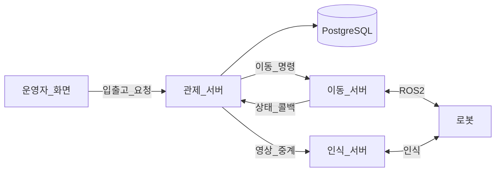
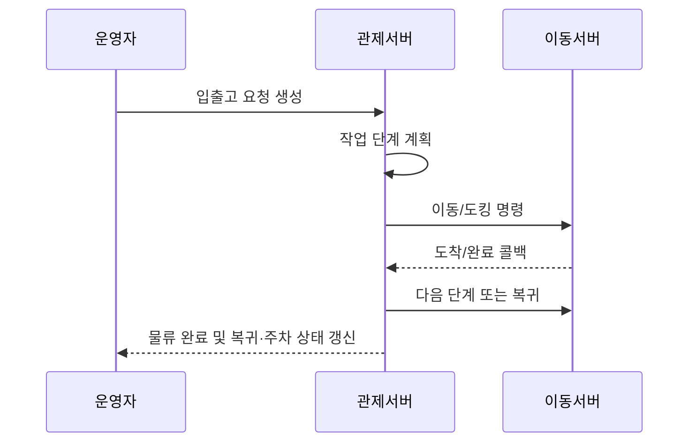
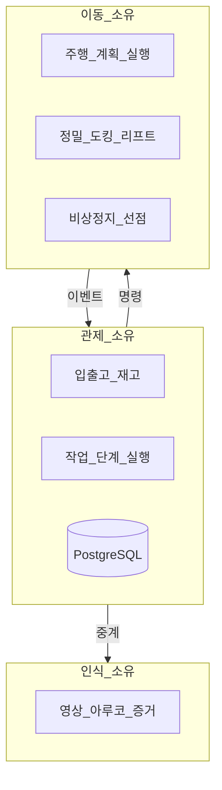
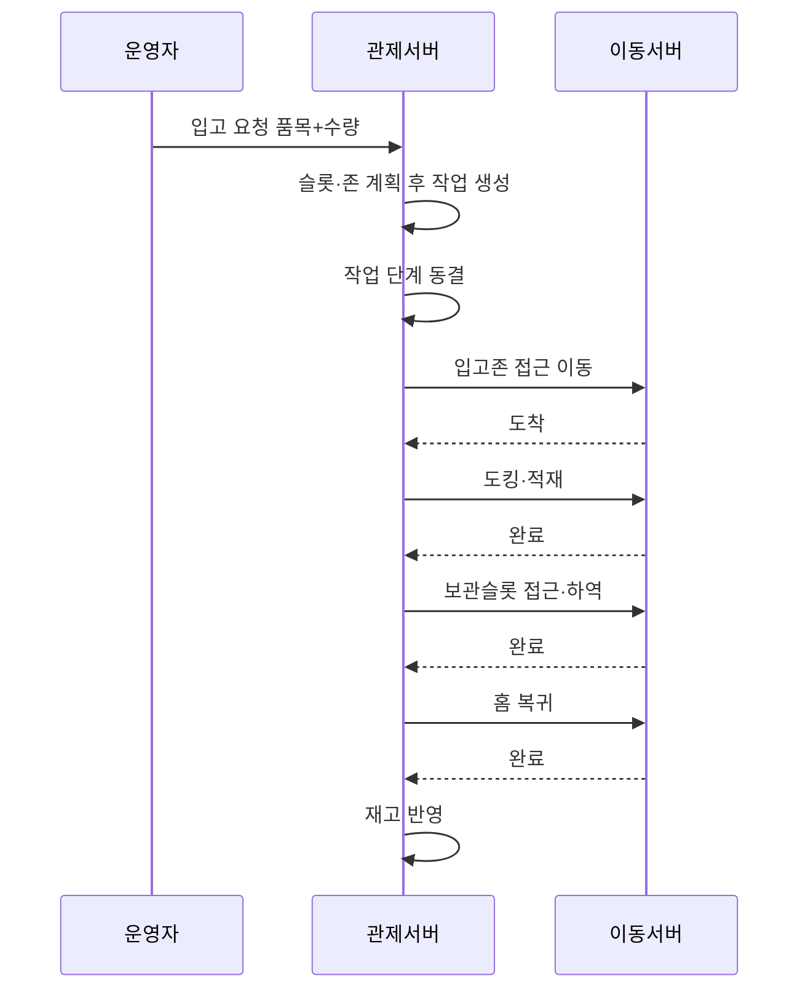
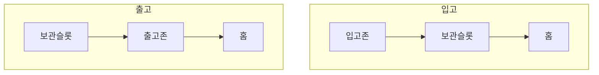
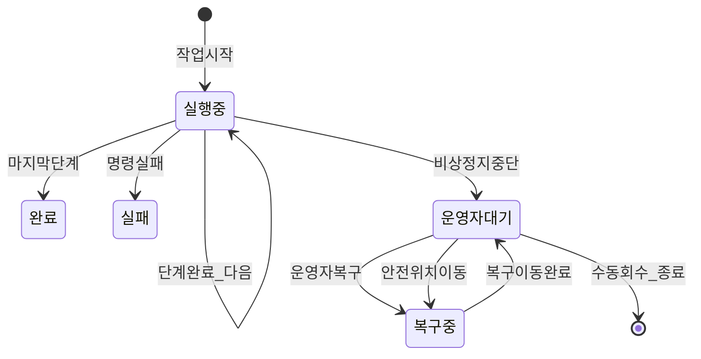
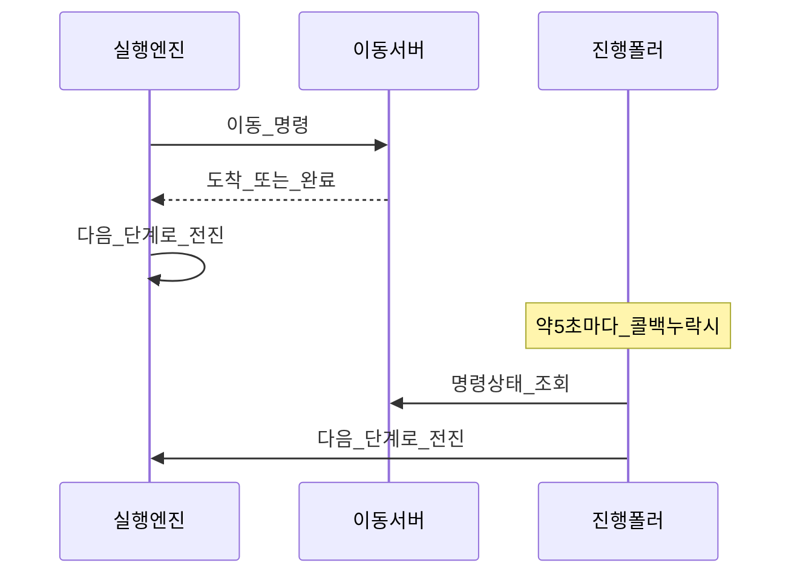
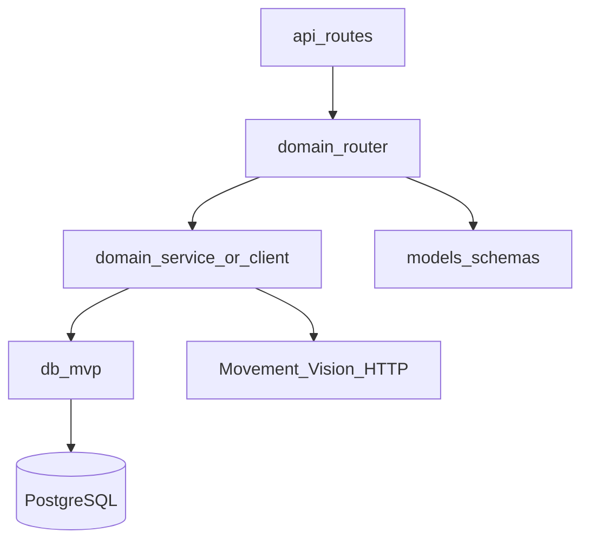
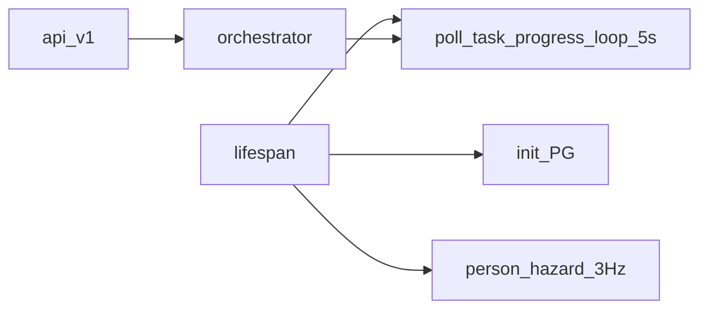
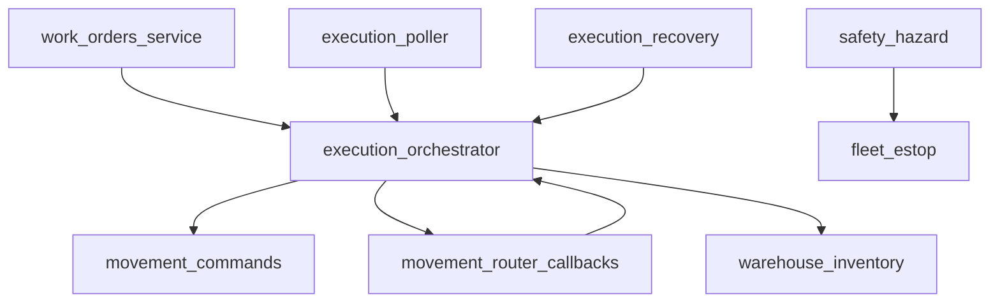

# Architecture

맵 메타데이터의 source of truth는 DB가 아니라 `maps/` 최상위의 단일 ROS YAML·PGM이다. `GET /maps`의 배열과 `map_id`는 기존 클라이언트·Movement 명령 호환을 위해 유지한다.

상태: Active
소유: Docs
최종 갱신: 2026-07-14 10:03 KST
목적: 관제·이동·인식 경계, 입출고·오케스트레이션, 백엔드 레이어, 핵심 용어·레포 트리를 한 문서에 둔다.

시스템은 Main·Movement·Vision 세 서버로 나뉜다. **Main**은 운영자 UI와 PostgreSQL을 소유하고 실행할 작업을 결정한다. **Movement**는 Nav2 주행·정밀 도킹·리프트를, **Vision**은 카메라 영상과 아루코 인식을 담당한다. Main은 입출고 단계를 계획하고 Movement 콜백과 폴링으로 진행을 추적한 뒤 재고를 반영한다.

DB SoT·ERD: [DATABASE](DATABASE.md). API: [API](API.md). 연동: [INTERFACES](INTERFACES.md). Movement 전달 요구: [MOVEMENT_SERVER_REQUIREMENTS](MOVEMENT_SERVER_REQUIREMENTS.md).

## 1. 토폴로지



## 2. 요청 흐름



## 3. 디자인 철학

- **브라우저는 관제 서버만 호출한다.** 이동·인식 서버를 직접 호출하지 않는다(인식 WebRTC 미디어 스트림만 예외).
- **외부 서버는 DB에 직접 접근하지 않는다.** 모든 연동은 API와 콜백으로만 이뤄진다.
- 역할을 세 마디로 나누면 — **관제는 "무엇을"**(어느 좌표·마커에서 어떤 동작을 몇 층에), **이동은 "어떻게"**(경로 계획과 주행), **인식은 "무엇이 보이나"**(영상과 마커 인식)다.
- **콜백은 누락될 수 있다고 전제한다.** 그래서 콜백 처리는 멱등으로 만들고, 안 오면 관제가 명령 상태를 직접 조회해 보정한다.
- **물류 완료와 로봇 주차를 분리한다.** 목적지 하역 완료 시 재고와 업무 결과를 확정하고, HOME 복귀·정밀 주차 실패는 별도 로봇 후처리 상태로 남긴다.
- **비상정지는 전 로봇 일괄이며 자동 재개하지 않는다.** 해제 후에도 운영자가 결정할 때까지 작업은 대기한다. 현장 절차: [OPERATIONS](OPERATIONS.md).

## 4. 책임



| 책임 | 소유 | 정본 |
| --- | --- | --- |
| 입출고·재고·슬롯 | 관제 | 본 문서 §5 |
| 작업 단계 실행 | 관제 | 본 문서 §6 |
| 주행·도킹·비상정지 선점 | 이동 | [INTERFACES](INTERFACES.md) |
| 영상·아루코·lift-load | 인식 | [INTERFACES](INTERFACES.md) |
| DB SoT | 관제 | [DATABASE](DATABASE.md) |

관제가 이동 서버에 내리는 명령은 `POST /robot-commands` 하나로 통일하고, `kind` 필드(`move_to_point` · `dock_transfer` · `aruco_align` · `leave_dock` · `manual_drive` · `estop`)로 동작을 구분한다. 이동 서버가 아직 구현하지 않은 kind는 조용히 대체하지 않고 `501 movement_robot_commands_api_missing`으로 드러낸다.

## 5. 입출고 업무 흐름

운영자는 **품목+수량**만 입력한다. 관제가 슬롯·존·작업·단계를 계획한다.






**게이트:** 로봇은 도킹 지점 바로 앞(대기점)에서 한 번 멈추고(`ARRIVED`), 관제가 `dock_transfer` 명령으로 적재/하역을 따로 지시한다. 마커 정렬부터 리프트 동작까지의 정밀 도킹은 이동 서버가 하나의 원자 블록으로 수행한다.

원칙:

- 별도의 업무(WMS) 서버를 두지 않고, 입출고 계층을 관제 서버 안에 둔다.
- 슬롯·존은 기본적으로 자동 계획하되, 운영자가 직접 지정하면 그 값을 우선한다.
- 재고는 목적지 `dock_transfer(unload)`가 완료된 시점에 멱등하게 반영한다. 이후 HOME 복귀·주차 실패는 완료된 물류 결과를 되돌리지 않는다.

용어로는, 맵 위 좌표를 **waypoint**, 선반의 보관 칸을 **storage slot**이라 부른다. 운영자의 입출고 요청 한 건이 **work order**(`POST /work-orders`)이고, 이것이 로봇이 실행할 **robot task**와 이동/도킹 한 번 단위의 **robot task step**으로 분해된다(§6).

## 6. 작업 실행 흐름

코드: `domains/execution/orchestrator.py`, `poller.py`, `recovery.py`.

작업 진행 보정·자동 배정·사람 위험 감지는 각 transaction에서 서로 다른 PostgreSQL `pg_try_advisory_xact_lock`을 비차단으로 획득한다. 여러 Uvicorn worker나 Main 인스턴스가 떠도 lock을 얻은 하나만 해당 tick을 실행하며, 사용자 API 요청은 이 lock을 사용하지 않는다.





원칙:

- **미리 펼침:** 작업을 시작할 때 전체 단계 목록(`steps[]`)과 진행 인덱스(`step_index`)를 한 번에 계산해 동결한다. 이후에는 인덱스만 전진한다.
- **하이브리드 전진:** 이동 서버의 콜백이 주 경로이고, 약 5초 주기의 진행 폴러가 콜백 누락 시의 안전망이다. 어느 쪽이 먼저 오든 같은 전진 함수를 태운다.
- **멱등:** 명령 id·현재 단계·미완료 여부를 확인해 중복 콜백을 무시한다.
- **게이트:** 접근 이동 → 도착 확인 → 도킹 지시 → 완료 확인 순서를 지킨다.
- **비상정지:** 이동 서버의 중단 콜백을 받으면 운영자 개입 대기 상태가 되고, 자동으로 재개하지 않는다.

입고 작업의 단계 예: 입고존 접근 → 적재 도킹 → 보관슬롯 접근 → 하역 도킹 → 홈 복귀.

코드에서의 이름: 단계 계획은 `plan_command_steps`, 단계 전송은 `dispatch_current_step`, 콜백/폴러의 전진은 `advance_on_command_event`, 진행 폴러 루프는 `poll_task_progress_loop`이다.

## 7. 백엔드 레이어



| Layer | 책임 |
| --- | --- |
| `api/routes.py` | domain router 집계 |
| `api/routers` | system·comm처럼 여러 domain을 조합하는 얇은 API |
| `domains/<domain>/router.py` | path, validation, transaction boundary |
| `domains/<domain>` | 업무 정책·외부 client·domain 상태 소유 |
| `db` | PG connection / repository |
| `models` | request/response schema |
| `core` | settings·외부 호출 로그·health cache 같은 기술 요소 |



- 공개 API prefix는 `/api/v1`이다(`Settings.api_prefix`).
- DB 연결은 `LMS_DATABASE_URL`(PostgreSQL)이 필수이며, SQLite 런타임은 없다.
- 스키마 정본은 `database/dbml/smartfactory-db-final.dbml`이고, 이를 `database/schema_pg.sql`(+ infra DDL)로 구현한다.



- router는 얇게 유지하고 업무 흐름은 **orchestrator가 허브**로 조율한다. 의존 방향은 `work_orders → orchestrator → repository/movement` 한 방향이며 역참조하지 않는다.
- 외부 연동 실패는 감추지 않고 501이나 명시적 에러 코드로 드러낸다.

## 8. 용어 (핵심)

문서와 화면에서 쓰는 **업무 용어**와 코드·API에서 쓰는 **이름**을 잇는 대조표다. 코드를 읽을 때 이 표를 옆에 두면 된다.

| 업무어 | 코드·문서 | 설명 |
| --- | --- | --- |
| 관제 서버 | Main / LMS | FastAPI + PostgreSQL. 브라우저·외부 서버의 허브 |
| 이동 서버 | Movement | 로봇별 Nav2·도킹·리프트 |
| 인식 서버 | Vision | 영상·아루코·위험 advisory |
| 입출고 요청 | work order | 품목+수량 상위 요청 |
| 로봇 작업 | `RobotTask` | work order에서 분해되어 한 로봇에 배정되는 실행 단위 |
| 로봇 작업 단계 | `RobotTaskStep` / `steps[]` | robot task 안의 계획된 이동/도킹 단위 |
| 단계 번호 | `step_index` | 현재 진행 중인 step 인덱스 |
| 접근 대기 → 도킹 | gate | approach 도착(ARRIVED) 후 `dock_transfer` |
| 대기점 / 작업점 | approach / dock | 도킹 전 멈추는 지점 vs 마커 앞 작업 지점 |
| 운영자 개입 대기 | `AWAITING_OPERATOR` | ESTOP 등 후 자동 재개 금지 |
| 복구 진행 중 | `RECOVERY_RUNNING` | 운영자 복구 이동 실행 중 |
| `move_to_point` 등 | command `kind` | 공개 계약 — 변경 금지 |
| `/work-orders`, `/robot-commands` | HTTP path | 공개 계약 — 변경 금지 |
| waypoint | `locations` | 맵 좌표 SoT |
| storage slot | `locations(type=storage)` | 선반 슬롯 |
| evidence | `evidence_events` | 이벤트·이동 이력 SoT |

## 9. 레포 트리 (요약)

```text
backend/app/
├─ api/          route 집계와 교차-domain API
├─ core/         설정·공통 기술 요소
├─ db/           PostgreSQL connection·repository
├─ domains/      admin·execution·maps·movement·records·safety·vision·warehouse·work_orders
├─ models/       request/response schema
└─ main.py
backend/tests/   backend regression tests
database/        schema_pg · infra · seed · dbml/
frontend/web/src/
├─ domains/      map·movement·operate·records·system·vision·warehouse
├─ components/   둘 이상 domain이 공유하는 UI
├─ hooks/        둘 이상 domain이 공유하는 hook
└─ lib/          API client·좌표 등 순수 기술 요소
scripts/         실행·DB 준비·검증 스크립트
docs/            공개 정본
maps/            ROS map asset
```

- 루트 Markdown 문서는 `README.md` 하나만 둔다.
- DB 구조 정본은 `database/dbml/smartfactory-db-final.dbml`이고 `database/schema_pg.sql`로 구현된다.
- 런타임 DB·`.env`·빌드 산출물은 git으로 추적하지 않는다.

## 10. 품질 속성 · 현재 경계

| 품질 속성 | 현재 설계 근거 | 남은 경계 |
| --- | --- | --- |
| 안전성 | 전역 ESTOP, 명령 차단, 자동 재개 금지, cargo 확인 복구 | 하드웨어 안전회로와 실장비 검증이 최종 기준 |
| 일관성 | transaction, command·robot·step 검증, callback event ID/sequence, advisory lock | 외부 서버와의 분산 transaction은 없으며 폴링으로 수렴 |
| 회복성 | callback + 상태 폴링, 재시작 후 진행 task 재동기화 | Movement/Vision 장기 장애의 자동 복구 목표는 미정 |
| 관측성 | health/ready/status, command trace, evidence·task·inventory logs | 중앙 로그·metric·alert와 SLO는 아직 없음 |
| 보안 | 외부 주소·비밀값 분리, Movement callback shared token | 운영자 API 인증/RBAC와 TLS 종단은 아직 제공하지 않음 |
| 성능 | health cache와 제한된 목록 조회 | 부하 시험과 응답시간·처리량 목표는 아직 없음 |

따라서 현재 릴리스 범위는 신뢰된 개발·현장 네트워크의 포트폴리오 검증이다. 외부망 또는 다사용자 운영으로
확장할 때는 인증·권한, TLS, secret 관리, 로그/metric/alert, 측정 가능한 SLO를 별도 릴리스 기준으로 확정한다.

## 관련

- [INTERFACES](INTERFACES.md) · [API](API.md) · [UX](UX.md) · [OPERATIONS](OPERATIONS.md)
