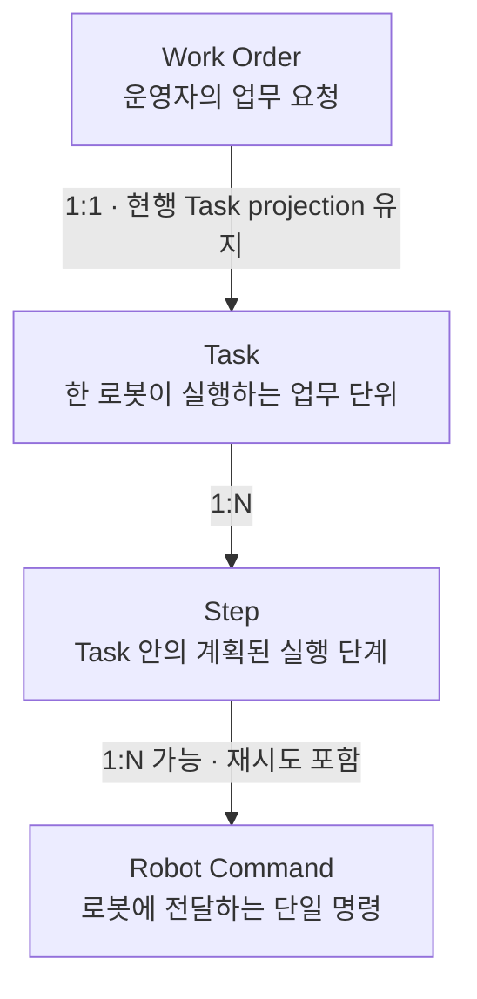
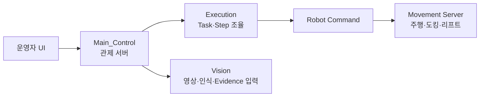
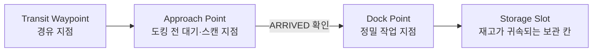
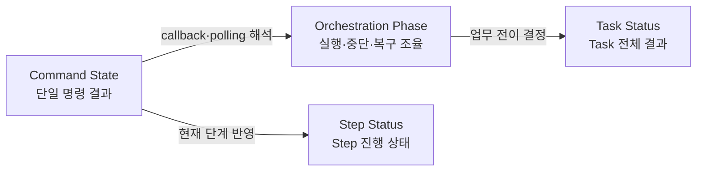

# Glossary

상태: Active — approved terminology baseline
주 독자: 전체 개발자
보조 독자: QA·기획자
난이도: 개발
소유: Docs · Architecture
최종 갱신: 2026-07-18 14:46 KST
구현 기준: 공개 API·DB·UI에서 사용하는 현재 canonical 용어
목적: Main_Control의 업무 개념과 코드·API·DB·UI의 단일 표준 표현을 정의한다.

이 문서는 현재 구현을 기준으로 승인된 공식 용어 정본이다. 세부 함수와 모든 필드를 나열하지 않고 업무 흐름,
상태 축과 도메인 책임을 정의한다. 같은 개념은 코드·API·저장 데이터에서 같은 이름을 사용한다.

## 1. 한눈에 보는 핵심 구조

공식 계층은 `Work Order → Task → Step → Robot Command`다. 업무 문서에서는 `Task`와
`Step`을 사용하고, 코드에서 주체를 분명히 해야 할 때는 `RobotTask`, `RobotTaskStep`을 사용한다.

## 2. 시스템 경계

Main_Control과 연동 서버는 동일 개념에 동일한 필드명을 사용한다. 계약 변경은 한쪽에 alias를 추가하지 않고
공동 계약과 양쪽 구현을 함께 변경한다.

## 3. 빠른 대조표

| 공식 업무 용어 | 코드 대표명 | API·저장 표현 | 한국어 UI | 주의할 표현 |
| --- | --- | --- | --- | --- |
| Work Order | `WorkOrder` | `/work-orders`, `order_id` | 업무 요청 | Task projection 기반 현행 read model |
| Task | `RobotTask` | `/tasks`, `task_id`, DB `tasks` | 작업 | 없음 |
| Step | `RobotTaskStep` | `steps[]`, `step_index` | 단계 | 없음 |
| Robot Command | `RobotCommandRequest` | `/robot-commands`, `command_id`, `kind` | 로봇 명령 | 없음 |
| Waypoint | `Waypoint` | `waypoint_id`, DB `locations` | 지점 | 식별자 의미의 `waypoint` 필드 |
| Storage Slot | `StorageSlot` | `slot_id`, `locations(type=storage)` | 보관 슬롯 | 별도 물리 slot table로 오해하는 표현 |
| Evidence | 해당 업무를 관측한 도메인의 기록 모델 | `evidence_events` | 증거·판정 기록 | 일반 event·조회 projection과 구분 |
| Main_Control | 애플리케이션·배포 단위 | `/api/v1`, 현행 `LMS_*` 설정 | 관제 서버 | Main, LMS, main server |

## 4. 업무 실행 용어

### Work Order

운영자가 생성하는 입고·출고 같은 상위 업무 요청이다. 현행은 하나의 Work Order가 하나의 Task에 대응하며,
독립 테이블 없이 Task projection으로 조회한다.

- 상위 개념: 없음
- 하위 개념: Task
- 소유 도메인: `work_orders`
- API: `/api/v1/work-orders`, `order_id`
- UI: 업무 요청, Work Order
- 현행 관계: Work Order 1 : 1 Task
- 저장 결정: 독립 `work_orders` 테이블을 추가하지 않고 Task와 실행 상태를 projection한다.
- ID 결정: 현행 `order_id`는 대응 Task의 `task_id`다.

### Task

한 로봇에 배정되어 실행되는 업무 단위다. 전체 업무 결과와 로봇 배정, 실행 시작·종료 상태를 소유한다.

- 상위 개념: Work Order
- 하위 개념: Step
- 소유 도메인: `execution`
- 코드: `RobotTask`, `RobotTaskStatus`, `RobotTaskKind`
- API·DB: `/tasks`, `task_id`, DB `tasks`
- UI: 작업
- 실행 API: `POST /tasks/{task_id}/start`

### Step

Task 시작 시 계획되어 `steps[]`에 저장되는 이동·정렬·도킹 등의 실행 단계다. `step_index`가 현재 단계를
가리키며, 하나의 Step은 재시도를 포함해 하나 이상의 Robot Command를 만들 수 있다.

- 상위 개념: Task
- 하위 개념: Robot Command
- 소유 도메인: `execution`
- 코드: `RobotTaskStep`, `RobotTaskStepStatus`
- 저장 표현: `steps[]`, `step_index`
- canonical 저장 표현: `steps`, `step_index`, `step_count`
- 저장 표현은 `steps`, `step_index`, `step_count`로 단일화하며 migration `0007`이 구형 JSON을 변환한다.
- 검수 필요: Command 재시도를 별도 Command Attempt 개념으로 공식화할지 결정해야 한다.

### Robot Command

Main이 로봇의 한 가지 동작을 요청하기 위해 Movement로 보내는 실행 계약이다. `command_id`로 식별하며
`kind`와 kind별 `params`를 갖는다.

- 상위 개념: Step
- 소유 도메인: 내부 실행 의미는 `execution`, 전송 계약은 `movement`
- 코드: `RobotCommandRequest`, `RobotCommandResponse`, `RobotCommandKind`
- API: `POST /robot-commands`
- 현재 kind: `move_to_point`, `dock_transfer`, `manual_drive`, `estop`, `aruco_align`, `leave_dock`
- 기록 projection: `RobotCommandRecord`, movement command 기록

### 명칭 일관성

Task 실행과 로봇 동작은 각각 Task, Step, Robot Command로만 표현한다. 같은 개념의 API·모델·저장 필드는 동일한 이름을 사용한다.

## 5. 위치와 물류 용어

### Waypoint

맵 좌표와 방향을 가진 이동·업무 위치다. API에서는 `waypoint_id`, DB에서는 주로 `locations`로 표현한다.
`home`, `storage`, `dock`, `transit`, `scan` 같은 위치 유형을 포함한다.

- 소유 도메인: `maps`
- canonical 식별자: `waypoint_id`
- DB: `locations`, `location_route_steps`

### Approach Point

정밀 도킹 전에 로봇이 멈추고 도착을 확인하는 대기·스캔 지점이다. 프런트와 API에서는
`waypoint_type=approach`, DB adapter에서는 `locations(type=scan)`으로 대응한다.

- 도착 상태: 보통 Robot Command의 `ARRIVED`
- 슬롯 업무: waypoint 자체가 정밀 접근·삽입까지 수행하며 최종 상태는 `ARRIVED`
- 대기장 주차: `vehicle_2_approach` ARRIVED 뒤 `aruco_align`
- 검수 필요: UI의 “스캔”과 문서의 “대기점/approach” 표시를 하나로 통일할지 결정해야 한다.

### Dock Point

ArUco 정렬, 적재·하역 또는 최종 주차처럼 정밀 작업이 수행되는 목표 지점이다. Approach Point와 구분하며,
자동 입출고에서는 Movement가 waypoint profile 안에서 dock 접근을 수행한다. 리프트 전용 동작은 별도 API 계약이 확정된 경우에만 ARRIVED 이후 요청한다.

- 소유: 좌표·업무 연결은 Main_Control, 정밀 접근과 동작은 Movement
- 관련 command kind: `dock_transfer`, `aruco_align`
- DB 대표 표현: `locations(type=dock)` 및 업무 위치 helper

### Storage Slot

선반에서 재고가 귀속되는 보관 칸이다. 현재 독립 물리 테이블이 아니라 `locations(type=storage)`와 inventory의
위치·층 조합으로 표현한다.

- 소유 도메인: `warehouse`
- API: `slot_id`
- DB: `locations(type=storage)`, `inventory(location_id, floor)`
- UI: 보관 슬롯

## 6. 상태 용어와 소유권

| 상태 축 | 소유 대상 | 현재 코드 값 | 다른 축에서 직접 사용하지 않는 값 |
| --- | --- | --- | --- |
| Task Status | Task 전체 생명주기 | `QUEUED`, `ASSIGNED`, `RUNNING`, `DONE`, `FAILED`, `CANCELLED` | `ARRIVED`, `STOPPED`, `AWAITING_OPERATOR` |
| Step Status | Task 내부 Step | `PENDING`, `DISPATCHED`, `RUNNING`, `DONE`, `FAILED`, `CANCELLED` | `ASSIGNED`, `RECOVERY_RUNNING` |
| Command State | 단일 Robot Command | `ACCEPTED`, `RUNNING`, `ARRIVED`, `DONE`, `FAILED`, `CANCELLED`, `STOPPED` | `QUEUED`, `AWAITING_OPERATOR` |
| Orchestration Phase | Main_Control 실행 조율 | `RUNNING`, `CANCEL_REQUESTED`, `AWAITING_OPERATOR`, `RECOVERY_RUNNING`, `DONE`, `FAILED`, `CANCELLED` | `ACCEPTED`, `ARRIVED`, `DISPATCHED` |

### Task Status

Task의 배정 전부터 업무 종료까지의 생명주기다. 코드의 `RobotTaskStatus`가 API canonical 값을 표현하고,
DB는 현재 `DONE` 대신 `COMPLETED`를 저장해 repository 경계에서 변환한다.

- 소유 도메인: `execution`
- canonical 초기 상태: `QUEUED`
- DB 경계: 물리 DB의 `COMPLETED`는 유지하고 내부/API의 `DONE`으로 변환한다. 이번 작업에서 DB migration은 하지 않는다.
- 기존 `CREATED` 값은 저장 데이터 read·취소 처리 경계에서만 허용한다.

### Command State

하나의 Robot Command가 Movement에서 어느 단계에 있는지를 나타낸다. callback과 polling 응답을 같은 의미로
정규화해 Step과 Task 전진의 입력으로 사용한다.

- 소유 경계: Movement가 발생시키고 Main의 movement adapter가 정규화
- canonical 철자: `state`, `CANCELLED`
- callback `event`와 조회 `state`는 계약별 역할을 유지하되 동일 상태 값은 같은 철자를 사용한다.
- 실패 종료는 `FAILED`, 취소 종료는 `CANCELLED`로 기록한다.

### Orchestration Phase

Main이 Task의 현재 실행·취소·운영자 대기·복구 과정을 조율하기 위한 내부 phase다. Movement 명령 자체의
상태가 아니며 `RobotTaskOrchestrationPhase`가 소유한다.

- 소유 도메인: `execution`
- 운영자 대기: `AWAITING_OPERATOR`
- 복구 실행: `RECOVERY_RUNNING`
- 취소 요청과 종료: `CANCEL_REQUESTED`, `CANCELLED`

## 7. 안전과 복구 용어

### Emergency Stop

즉시 로봇 동작을 중단시키는 비상정지다. UI에서는 ESTOP으로 표시하며 Movement·로봇 계층의 실제 정지와
Main의 작업 중단·기록이 함께 필요하다. 해제 후 Task를 자동 재개하지 않는다.

- 코드·API 대표 표현: `ESTOP`, `estop`
- 로봇별 수명주기: `stop_requested`, `stop_confirmed`, `stop_unconfirmed`,
  `clear_requested`, `clear_confirmed`, `clear_unconfirmed`, `clear`
- `robot_online=false`는 연결 상태이지 ESTOP 상태가 아니다. 정지/해제 요청 이력이 있고 결과를 확인하지
  못한 경우에만 ESTOP 미확인으로 분류한다.
- 해제 성공은 기존 Task 자동 재개를 의미하지 않는다.
- 소유: 실제 선점 정지는 Movement/로봇, fleet 조율과 운영 기록은 Main_Control safety
- UI: 비상정지

### Safe Stop

운영자가 Work Order 또는 Task의 정상 진행을 안전하게 중단하도록 요청하는 업무 흐름이다. Emergency Stop과
달리 즉각적인 하드웨어 비상회로를 뜻하지 않으며, 적재 상태와 현재 command의 취소 결과를 확인해 종료한다.

- 소유 도메인: `work_orders`, `execution`
- UI: 안전 중단
- 결과: 자동 재개하지 않고 완료된 물류와 복귀·주차 상태를 분리해 보존

### Recovery

ESTOP, 명령 실패 또는 안전 중단 이후 운영자가 상황을 확인하고 안전 위치 이동, 재시도, 수동 회수 같은
후속 결정을 수행하는 과정이다.

- 소유 도메인: `execution/recovery`
- phase: `AWAITING_OPERATOR`, `RECOVERY_RUNNING`
- 원칙: 운영자 결정 전 자동 재개 금지
- API: `/tasks/{id}/recovery/*`

## 8. 기록 용어

### Evidence

명령·인식·안전 판단을 설명하거나 사후 검증하기 위해 보존하는 관측 기록이다. 현재 Vision의 lift-load 판정,
Movement 실행 결과와 안전 관련 사건 등이 `evidence_events`에 기록될 수 있다.

- 생성 책임: 관측을 수행한 `execution`, `movement`, `safety`, `vision`, `warehouse` 도메인
- 조회 projection: `records`
- DB: `evidence_events`
- 관련 식별자: `task_id`, `command_id`, `event_type`, `source`, `observed_at`
- 경계: `records`는 현재 조회 projection을 제공하며 다른 도메인의 기록 생성 정책을 소유하지 않는다.

## 9. 금지 동의어

`Mission`, `MovementCommand`, `leg`, `legs`, `cursor`, `leg_count`, `mission_id`는 신규·기존 코드 모두에서 사용하지 않는다.
동일 개념의 계층별 alias를 만들지 않으며 기존 orchestration JSON은 migration `0007`로 변환한다.

## 10. 확정 사항

이번 검수에서 확정한 항목:

1. 공식 계층은 `Work Order → Task → Step → Robot Command`다.
2. Work Order–Task는 현행 1:1이며 DB migration을 하지 않는다.
3. 실행 단계는 Step이며 저장 키는 `steps`와 `step_index`만 사용한다.
4. Task 초기 상태는 `QUEUED`, 내부 완료는 `DONE`, DB 완료는 `COMPLETED`다.
5. 시스템 표준 명칭은 `Main_Control`이다.
