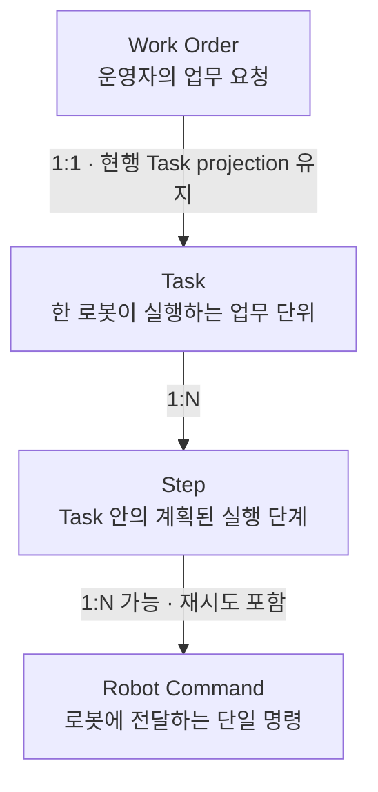
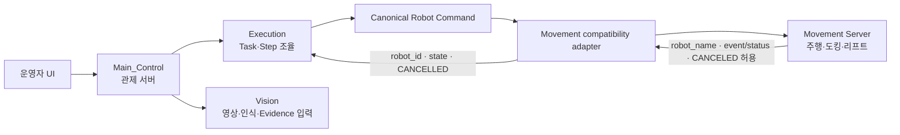
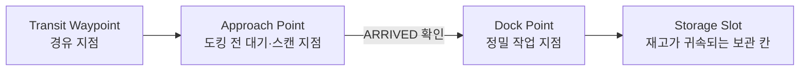
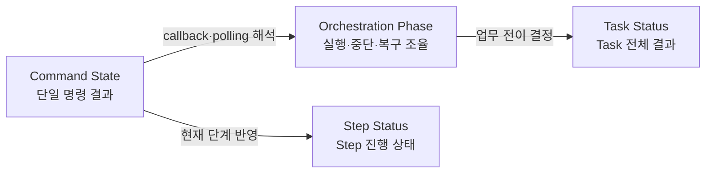
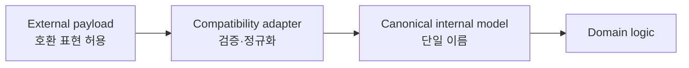

# Glossary

상태: Active — approved terminology baseline
소유: Docs · Architecture
최종 갱신: 2026-07-14 15:14 KST
목적: Main_Control의 업무 개념, 코드·API·DB·UI 표현과 호환·폐기 용어를 한 곳에서 연결한다.

이 문서는 현재 구현을 기준으로 승인된 공식 용어 정본이다. 세부 함수와 모든 필드를 나열하지 않고 업무 흐름,
상태 축, 도메인 책임과 외부 계약 경계를 정의한다. 공개 API 또는 저장 JSON의 호환 필드는 별도 migration 승인
전까지 유지하며, 신규 내부 코드에서는 canonical 이름만 사용한다.

## 1. 한눈에 보는 핵심 구조

공식 계층은 `Work Order → Task → Step → Robot Command`다. 업무 문서에서는 `Task`와
`Step`을 사용하고, 코드에서 주체를 분명히 해야 할 때는 `RobotTask`, `RobotTaskStep`을 사용한다.

## 2. 시스템과 호환 경계

Main_Control 내부에서는 canonical 이름을 사용한다. 외부 서버나 기존 클라이언트의 다른 이름은 호환 경계에서 받고,
도메인 로직에 전달하기 전에 내부 표현으로 변환하는 것을 목표로 한다.

## 3. 빠른 대조표

| 공식 업무 용어 | 코드 대표명 | API·저장 표현 | 한국어 UI | 호환·deprecated 표현 |
| --- | --- | --- | --- | --- |
| Work Order | `WorkOrder` | `/work-orders`, `order_id` | 업무 요청 | Task projection 기반 현행 read model |
| Task | `RobotTask` | `/tasks`, `task_id`, DB `tasks` | 작업 | Mission(일부 route·response) |
| Step | `RobotTaskStep` | `steps[]`, `step_index` | 단계 | `leg`, `legs`, `cursor`, `leg_count` |
| Robot Command | `RobotCommandRequest` | `/robot-commands`, `command_id`, `kind` | 로봇 명령 | `MovementCommand`, mission command |
| Waypoint | `Waypoint` | `waypoint_id`, DB `locations` | 지점 | 식별자 의미의 `waypoint` 필드 |
| Storage Slot | `StorageSlot` | `slot_id`, `locations(type=storage)` | 보관 슬롯 | 별도 물리 slot table로 오해하는 표현 |
| Evidence | 해당 업무를 관측한 도메인의 기록 모델 | `evidence_events` | 증거·판정 기록 | 일반 event·조회 projection과 구분 |
| Main_Control | 애플리케이션·배포 단위 | `/api/v1`, 현행 `LMS_*` 설정 | 관제 서버 | Main, LMS, main server |

## 4. 업무 실행 용어

### Work Order

운영자가 생성하는 입고·출고 같은 상위 업무 요청이다. 현행은 하나의 Work Order가 하나의 Task에 대응하며,
독립 테이블 없이 Task projection으로 조회한다.

- 상위 개념: 없음
- 하위 개념: Task
- 소유 도메인: `work_orders`
- API: `/api/v1/work-orders`, `order_id`
- UI: 업무 요청, Work Order
- 현행 관계: Work Order 1 : 1 Task
- 저장 결정: 독립 `work_orders` 테이블을 추가하지 않고 Task와 실행 상태를 projection한다.
- ID 결정: 현행 `order_id`는 대응 Task의 `task_id`다.

### Task

한 로봇에 배정되어 실행되는 업무 단위다. 전체 업무 결과와 로봇 배정, 실행 시작·종료 상태를 소유한다.

- 상위 개념: Work Order
- 하위 개념: Step
- 소유 도메인: `execution`
- 코드: `RobotTask`, `RobotTaskStatus`, `RobotTaskKind`
- API·DB: `/tasks`, `task_id`, DB `tasks`
- UI: 작업
- 공개 호환 표현: 기존 `/start-mission` route의 Mission. 내부 함수명에는 사용하지 않는다.

### Step

Task 시작 시 계획되어 `steps[]`에 저장되는 이동·정렬·도킹 등의 실행 단계다. `step_index`가 현재 단계를
가리키며, 하나의 Step은 재시도를 포함해 하나 이상의 Robot Command를 만들 수 있다.

- 상위 개념: Task
- 하위 개념: Robot Command
- 소유 도메인: `execution`
- 코드: `RobotTaskStep`, `RobotTaskStepStatus`
- 저장 표현: `steps[]`, `step_index`
- canonical 저장 표현: `steps`, `step_index`, `step_count`
- 저장·공개 호환 표현: `legs`, `cursor`, `leg_count` (migration 승인 전 read/response 경계에만 유지)
- 검수 필요: Command 재시도를 별도 Command Attempt 개념으로 공식화할지 결정해야 한다.

### Robot Command

Main이 로봇의 한 가지 동작을 요청하기 위해 Movement로 보내는 실행 계약이다. `command_id`로 식별하며
`kind`와 kind별 `params`를 갖는다.

- 상위 개념: Step
- 소유 도메인: 내부 실행 의미는 `execution`, 전송 계약은 `movement`
- 코드: `RobotCommandRequest`, `RobotCommandResponse`, `RobotCommandKind`
- API: `POST /robot-commands`
- 현재 kind: `move_to_point`, `dock_transfer`, `manual_drive`, `estop`, `aruco_align`, `leave_dock`
- 기록 projection: `RobotCommandRecord`, movement command 기록

### Movement Command

Movement 서버로 전송되거나 Movement 응답에서 관찰되는 명령 표현이다. 현재 `MovementCommand`는
`RobotCommandRecord`의 호환 alias이며, Main_Control 내부의 별도 업무 계층으로 취급하지 않는다.

- 권장 사용처: Movement client·adapter·연동 문서
- 내부 canonical 개념: Robot Command
- deprecated 코드 alias: `MovementCommand`

### Mission

Main_Control의 도메인 개념이 아니다. 기존 Task 시작 route, Movement Server API, 응답 wrapper와
`mission_results`에 남은 공개 계약 용어다.

- 현행 표현: `/tasks/{id}/start-mission`, `MissionStatusResponse`, `mission_results`, Movement mission route
- 확정 기준: 내부 함수·변수에는 사용하지 않고 Movement Server·기존 공개 API 경계에서만 허용
- 현재 내부 이름: `start_task_execution`, Step, Robot Command
- 후속 승인 필요: `/start-mission`, `MissionStatusResponse`, `mission_results` 제거는 공개 계약 변경으로 별도 수행

## 5. 위치와 물류 용어

### Waypoint

맵 좌표와 방향을 가진 이동·업무 위치다. API에서는 `waypoint_id`, DB에서는 주로 `locations`로 표현한다.
`home`, `storage`, `dock`, `transit`, `scan` 같은 위치 유형을 포함한다.

- 소유 도메인: `maps`
- canonical 식별자: `waypoint_id`
- DB: `locations`, `location_route_steps`

### Approach Point

정밀 도킹 전에 로봇이 멈추고 도착을 확인하는 대기·스캔 지점이다. 프런트와 API에서는
`waypoint_type=approach`, DB adapter에서는 `locations(type=scan)`으로 대응한다.

- 도착 상태: 보통 Robot Command의 `ARRIVED`
- 다음 동작: `dock_transfer` 또는 `aruco_align`
- 검수 필요: UI의 “스캔”과 문서의 “대기점/approach” 표시를 하나로 통일할지 결정해야 한다.

### Dock Point

ArUco 정렬, 적재·하역 또는 최종 주차처럼 정밀 작업이 수행되는 목표 지점이다. Approach Point와 구분하며,
Main은 approach 도착 확인 후 별도 명령으로 dock 동작을 요청한다.

- 소유: 좌표·업무 연결은 Main_Control, 정밀 접근과 동작은 Movement
- 관련 command kind: `dock_transfer`, `aruco_align`
- DB 대표 표현: `locations(type=dock)` 및 업무 위치 helper

### Storage Slot

선반에서 재고가 귀속되는 보관 칸이다. 현재 독립 물리 테이블이 아니라 `locations(type=storage)`와 inventory의
위치·층 조합으로 표현한다.

- 소유 도메인: `warehouse`
- API: `slot_id`
- DB: `locations(type=storage)`, `inventory(location_id, floor)`
- UI: 보관 슬롯

## 6. 상태 용어와 소유권

| 상태 축 | 소유 대상 | 현재 코드 값 | 다른 축에서 직접 사용하지 않는 값 |
| --- | --- | --- | --- |
| Task Status | Task 전체 생명주기 | `QUEUED`, `ASSIGNED`, `RUNNING`, `DONE`, `FAILED`, `CANCELLED` | `ARRIVED`, `STOPPED`, `AWAITING_OPERATOR` |
| Step Status | Task 내부 Step | `PENDING`, `DISPATCHED`, `RUNNING`, `DONE`, `FAILED`, `CANCELLED` | `ASSIGNED`, `RECOVERY_RUNNING` |
| Command State | 단일 Robot Command | `ACCEPTED`, `RUNNING`, `ARRIVED`, `DONE`, `FAILED`, `CANCELLED`, `STOPPED` | `QUEUED`, `AWAITING_OPERATOR` |
| Orchestration Phase | Main_Control 실행 조율 | `RUNNING`, `CANCEL_REQUESTED`, `AWAITING_OPERATOR`, `RECOVERY_RUNNING`, `DONE`, `FAILED`, `CANCELLED` | `ACCEPTED`, `ARRIVED`, `DISPATCHED` |

### Task Status

Task의 배정 전부터 업무 종료까지의 생명주기다. 코드의 `RobotTaskStatus`가 API canonical 값을 표현하고,
DB는 현재 `DONE` 대신 `COMPLETED`를 저장해 repository 경계에서 변환한다.

- 소유 도메인: `execution`
- canonical 초기 상태: `QUEUED`
- DB 경계: 물리 DB의 `COMPLETED`는 유지하고 내부/API의 `DONE`으로 변환한다. 이번 작업에서 DB migration은 하지 않는다.
- 기존 `CREATED` 값은 저장 데이터 read·취소 처리 경계에서만 허용한다.

### Command State

하나의 Robot Command가 Movement에서 어느 단계에 있는지를 나타낸다. callback과 polling 응답을 같은 의미로
정규화해 Step과 Task 전진의 입력으로 사용한다.

- 소유 경계: Movement가 발생시키고 Main의 movement adapter가 정규화
- canonical 철자: `state`, `CANCELLED`
- 호환 입력: `event`, `status`, `result`, `CANCELED`, `ABORTED`, `REJECTED`
- normalization: `ABORTED`, `REJECTED` → `FAILED`; `STOPPED`, `CANCELED` → `CANCELLED`

### Orchestration Phase

Main이 Task의 현재 실행·취소·운영자 대기·복구 과정을 조율하기 위한 내부 phase다. Movement 명령 자체의
상태가 아니며 `RobotTaskOrchestrationPhase`가 소유한다.

- 소유 도메인: `execution`
- 운영자 대기: `AWAITING_OPERATOR`
- 복구 실행: `RECOVERY_RUNNING`
- 취소 요청과 종료: `CANCEL_REQUESTED`, `CANCELLED`

## 7. 안전과 복구 용어

### Emergency Stop

즉시 로봇 동작을 중단시키는 비상정지다. UI에서는 ESTOP으로 표시하며 Movement·로봇 계층의 실제 정지와
Main의 작업 중단·기록이 함께 필요하다. 해제 후 Task를 자동 재개하지 않는다.

- 코드·API 대표 표현: `ESTOP`, `estop`
- 소유: 실제 선점 정지는 Movement/로봇, fleet 조율과 운영 기록은 Main_Control safety
- UI: 비상정지

### Safe Stop

운영자가 Work Order 또는 Task의 정상 진행을 안전하게 중단하도록 요청하는 업무 흐름이다. Emergency Stop과
달리 즉각적인 하드웨어 비상회로를 뜻하지 않으며, 적재 상태와 현재 command의 취소 결과를 확인해 종료한다.

- 소유 도메인: `work_orders`, `execution`
- UI: 안전 중단
- 결과: 자동 재개하지 않고 완료된 물류와 복귀·주차 상태를 분리해 보존

### Recovery

ESTOP, 명령 실패 또는 안전 중단 이후 운영자가 상황을 확인하고 안전 위치 이동, 재시도, 수동 회수 같은
후속 결정을 수행하는 과정이다.

- 소유 도메인: `execution/recovery`
- phase: `AWAITING_OPERATOR`, `RECOVERY_RUNNING`
- 원칙: 운영자 결정 전 자동 재개 금지
- API: `/tasks/{id}/recovery/*`

## 8. 기록 용어

### Evidence

명령·인식·안전 판단을 설명하거나 사후 검증하기 위해 보존하는 관측 기록이다. 현재 Vision의 lift-load 판정,
Movement 실행 결과와 안전 관련 사건 등이 `evidence_events`에 기록될 수 있다.

- 생성 책임: 관측을 수행한 `execution`, `movement`, `safety`, `vision`, `warehouse` 도메인
- 조회 projection: `records`
- DB: `evidence_events`
- 관련 식별자: `task_id`, `command_id`, `event_type`, `source`, `observed_at`
- 경계: `records`는 현재 조회 projection을 제공하며 다른 도메인의 기록 생성 정책을 소유하지 않는다.

## 9. canonical 필드와 호환 입력

| 의미 | 내부 canonical | 외부 호환 입력 | 비고 |
| --- | --- | --- | --- |
| 로봇 ID | `robot_id` | `robot_name` | adapter 직후 `robot_id`만 유지 |
| 명령 ID | `command_id` | mission 관련 ID는 별도 검수 | 재전송 멱등 키 |
| 명령 상태 | `state` | `event`, `status`, `result` | 상태 축의 `status` 명칭과 구분 |
| 명령 종류 | `kind` | `command_type` | 기록 projection은 호환 가능 |
| Task ID | `task_id` | `mission_id` | Mission 호환 경계만 허용 |
| 발생 시각 | `reported_at` | 서버 수신 시각 | 외부 사건 시각과 저장 시각 구분 |
| Waypoint ID | `waypoint_id` | `waypoint` | 식별자 의미일 때만 변환 |
| 취소 철자 | `CANCELLED` | `CANCELED` | 영국식 철자를 canonical로 사용 |

## 10. deprecated·금지 동의어

아래 규칙은 신규 내부 코드에 적용한다. 외부 compatibility adapter, migration, 기존 저장 데이터 read와
공개 API 호환은 예외로 두며, 실제 제거는 소비자와 저장 데이터 확인 후 별도로 진행한다.

| 공식 표현 | 신규 내부 코드에서 피할 표현 | 현재 허용 위치 | 제거 조건 |
| --- | --- | --- | --- |
| Step | `leg` | 기존 orchestration JSON과 alias | 저장 데이터 migration과 소비자 전환 |
| Robot Command | `MovementCommand`, mission command | Movement adapter·기록 projection | 외부 연동과 기록 타입 전환 |
| Task | Mission | Movement route·기존 API response | API deprecation 정책 승인 |
| Main_Control | Main, LMS, main server 식별자 | `LMS_*` 환경변수와 기존 배포 설정 | 설정 prefix migration 별도 승인 |
| `robot_id` | `robot_name` | 외부 Movement 입력 | Movement 계약 전환 |
| `state` | command `event/status/result` | callback input adapter | 외부 계약 전환 |
| `task_id` | `mission_id` | Movement 호환 표면 | Mission 제거 조건 충족 |
| `waypoint_id` | 식별자인 `waypoint` | 외부 입력 adapter | 소비자 전환 |
| `CANCELLED` | `CANCELED` | 외부 입력 normalization | 외부 상태 철자 전환 |

## 11. 확정 사항과 남은 공개 계약 검수

이번 검수에서 확정한 항목:

1. 공식 계층은 `Work Order → Task → Step → Robot Command`다.
2. Work Order–Task는 현행 1:1이며 DB migration을 하지 않는다.
3. 내부 canonical 용어는 Step이고 `leg`는 저장·공개 호환 경계만 허용한다.
4. Task 초기 상태는 `QUEUED`, 내부 완료는 `DONE`, DB 완료는 `COMPLETED`다.
5. 시스템 표준 명칭은 `Main_Control`이다.

남은 검수는 공개 계약 변경 두 가지다: Mission route/type/response 필드 제거 시점, 저장된 `legs/cursor` 제거를
위한 데이터 migration 여부. 둘 다 현재 소비자와 저장 데이터 확인 후 별도 변경한다.
