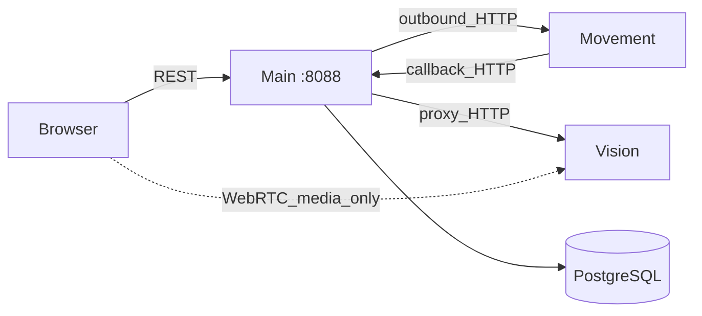
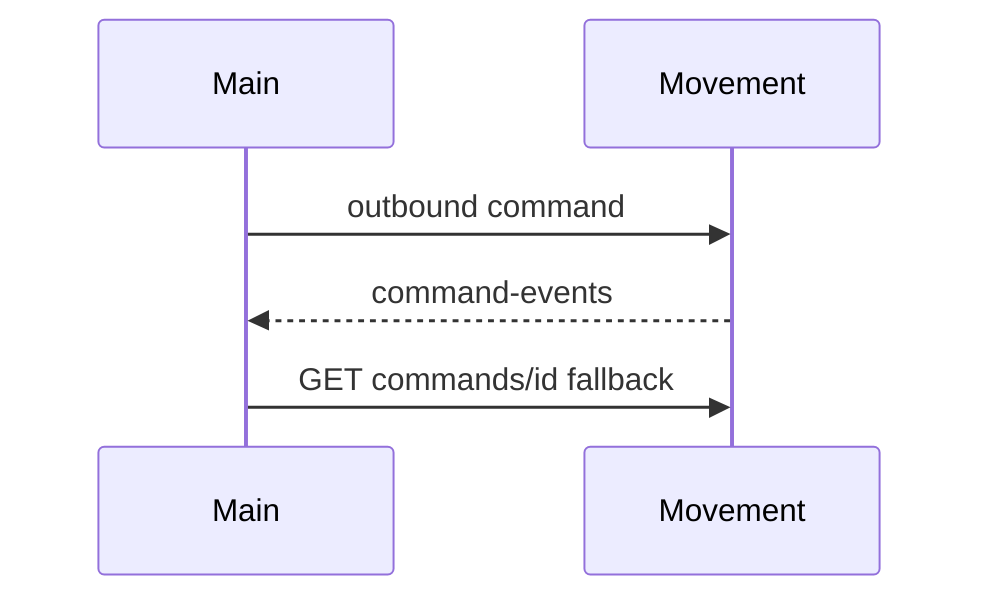
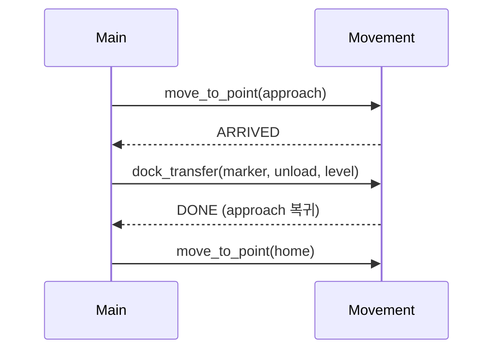

# Interfaces

맵 API는 파일 기반 단일 맵만 제공한다. `GET /maps`는 호환상 길이 0 또는 1인 배열이며, `POST /maps/import-folder`는 저장이 아니라 파일 재검증이다.

상태: Active
소유: Integration
최종 갱신: 2026-07-13 13:59 KST
목적: **Main 서버 기준** 외부 HTTP 계약 — Movement/Vision 경계, robot-commands, 콜백, lift-load evidence.

Main 서버와 다른 서버(Movement·Vision) 사이의 HTTP 계약을 정의한다. Main이 호출하는 API, 수신하는 콜백,
상대 서버가 지원하지 않는 command에 대한 `501` 응답을 담는다. 브라우저가 쓰는 REST 목록은
[API](API.md), 시스템 전체 구조는 [ARCHITECTURE](ARCHITECTURE.md) 참고.

## 1. 큰 그림 (Main 경계)



## 2. 디자인 철학

- **제어와 상태 조회는 브라우저가 Main만 호출한다.** 예외는 Vision WebRTC **미디어** 직결뿐이고, 그 경우에도 스트림 discovery와 offer는 Main을 거친다.
- 외부 서버의 hostname·IP·timeout은 Main이 설정(`.env`)으로 소유한다. 외부 서버는 Main DB에 직접 쓰지 않는다.
- 콜백이 누락될 수 있으므로 Main이 명령 상태를 주기적으로 **폴링**해 보정한다.
- Main과 Movement의 활성 맵이 다르면(map mismatch) Main이 이동 명령을 차단한다.

## 3. Main 주소 · Vision proxy

```env
LMS_PUBLIC_BASE_URL=http://smartfactory-main.local:8088
```

```text
Base URL: http://smartfactory-main.local:8088/api/v1
```

외부 서버가 콜백할 base URL과 Main이 바라보는 upstream 주소는 `GET /api/v1/system/external-config`로 조회할 수 있다.

Vision 연동은 Main이 **끌어오고 중계(pull/proxy)** 한다. Main이 중계하는 path 예:

```text
GET  /api/v1/vision/bridge/status
GET  /api/v1/vision/frame/latest/image?source={source_id}
GET  /api/v1/vision/streams?source={source_id}&view={view}
POST /api/v1/vision/streams/{source_id}/webrtc/offer?view={view}
```

`source_id`는 Main `cameras` registry에 등록된 값만 허용한다. WebRTC를 쓸 수 없으면 MJPEG로 폴백한다. 헬스체크는 `GET /health` → `{"ok": true, …}`.

## 4. 데이터 SoT · 현행 유지

| 화면/API 이름 | 최종 기준 | 비고 |
| --- | --- | --- |
| `item_code` / items | `items` | DB 기준은 `items.id` |
| `slot_id` | `locations(type=storage)` | |
| `waypoint_id` | `locations` | type으로 존·마커 구분 |
| work order | `tasks` | `work_orders` 물리 테이블 없음 |
| 이벤트·이동 이력 | `evidence_events` | `/events`·`/movement-commands`는 projection |
| 맵·카메라 | `maps/` YAML·PGM · `cameras` | filesystem · infra |

| 항목 | 결정 | 재검토 트리거 |
| --- | --- | --- |
| `GET /status` | 종합 스냅샷 유지 | 관제가 더 이상 쓰지 않을 때 |
| 감사 API | `/events`·`/movement-commands`·`/evidence-events` 분리 | 네 번째 projection 필요 시 |
| probe | `/comm/probe/movement`·`/camera` 분리 | 공통 구조가 생길 때 |

## 5. Main이 다루는 경계

이 문서에서 `생산자`는 데이터를 만드는 쪽, `소비자`는 받는 쪽이다. `호출자`는 HTTP 요청을 시작하는 쪽이라
콜백에서는 생산자와 호출자가 같지만, Main의 upstream 조회에서는 Main이 호출자이자 소비자다.

| 방향 | 호출자 | 생산자 → 소비자 | 전송·형식 | 주요 계약 | 성공 확인 | 누락·실패 처리 |
| --- | --- | --- | --- | --- | --- | --- |
| Main → Movement | Main | Main → Movement | HTTP · `application/json` | command envelope | HTTP `2xx` + command ID | timeout/5xx 표면화, 상태 폴링 |
| Movement → Main | Movement | Movement → Main | HTTP callback · `application/json` | command event/result/status/pose | Main `2xx` · `ApiMessage` | `command_id` 기준 멱등 처리, Main 폴링 보정 |
| Main → Vision | Main | Main → Vision | HTTP · JSON/JPEG/MJPEG/SDP | stream/frame · lift-load evaluate | upstream HTTP 응답 | timeout/오류 기록, 미디어 MJPEG 폴백 |
| Browser → Main | Browser | Browser/Main → Main/Browser | HTTP · JSON, 일부 media | REST `/api/v1/*` | HTTP status + OpenAPI schema | UI 오류 매핑, 안전 조작 차단 |

현재 MQTT·Kafka·WebSocket 이벤트 채널은 없다. 향후 실제 pub/sub를 추가할 때만 channel/topic, message schema,
delivery semantics, ordering, retry/DLQ를 AsyncAPI 계약으로 분리한다.

## 6. Integration Quickstart

1. **Config** — `GET /api/v1/system/external-config`
2. **Pose** — `GET /api/v1/robot-poses` (§9)
3. **Command** — `POST /api/v1/robot-commands` (`move_to_point` dry_run → 실실행). Movement가 command kind를 지원하지 않으면 `501`
4. **Callback** — Movement → `POST /api/v1/movement/command-events` (누락 시 Movement `GET /robot-commands/{id}` 폴링)
5. **Sync** — `GET /api/v1/movement/sync-status`로 맵·pose 동기화 상태를 진단



---

## 7. Movement HTTP 계약 (Active)

아래 계약은 Main이 사용하는 canonical Movement API다.

### 7.1 Movement base

로봇마다 Movement API 인스턴스가 하나씩 뜨며, 주소 예시는 다음과 같다:

```text
tb3_1 -> http://<movement-host>:8001/movement-api/v1
tb3_2 -> http://<movement-host>:8002/movement-api/v1
```

설정: `LMS_MOVEMENT_*` / `LMS_MOVEMENT_BASE_URLS`.

### 7.2 Main이 호출하는 API (현행)

```text
GET /movement-api/v1/health
GET /movement-api/v1/robots/{robot_name}/pose
POST /robot-commands
GET /robot-commands/{command_id}
POST /robot-commands/{command_id}/cancel
POST /movement-api/v1/manual/stop
GET /movement-api/v1/robots/{robot_name}/localization
GET /movement-api/v1/robots/{robot_name}/nav-state
GET /movement-api/v1/map-state
POST /movement-api/v1/robots/{robot_name}/initial-pose
```

Command envelope(Movement가 kind를 지원하지 않으면 Main `501`):

```text
POST /robot-commands
GET /robot-commands/{id}
```

### 7.3 좌표 이동 요청

`POST /robot-commands`에 Main이 보내는 command envelope:

```json
{
  "command_id": "coord-20260618T103000-tb3_1",
  "task_id": null,
  "robot_name": "tb3_1",
  "x": 0.0,
  "y": 1.0,
  "yaw": 0.0,
  "waypoint": "operator_clicked_goal",
  "callback_url": "http://<main>:8088/api/v1/movement/command-events"
}
```

- 접수 시 `ACCEPTED` (또는 동등)
- 완료는 callback 또는 `GET /robot-commands/{command_id}`
- `robot_name`/포트 불일치 → `409`
- localization 미준비 → 명확한 error/reason

### 7.4 Command 상태 조회 (Main 폴링)

```http
GET /robot-commands/{command_id}
```

상태 예: `ACCEPTED` · `RUNNING` · `DONE` · `FAILED` · `WAITING_TRAFFIC` · `CANCELED`/`CANCELLED` · `STOPPED`.
최소 필드: `command_id`, `robot_name`, `state`, `message`, `pose`(가능 시).

### 7.5 Nav State · Battery · Map State

`GET …/nav-state` — Main이 쓰는 필드: `robot_online`, `command_accepting`, `is_emergency`, `localized`, `current_command_id`, `reason`.

`GET …/health`의 `battery`(정수 0–100). 없거나 `null`이면 마지막 값 유지. 소수 비율(0.0–1.0) 금지.

`GET …/map-state` — UI map 비교: `active_map_id`, `frame_id`, `resolution`, `origin`, `width`, `height`.

### 7.6 Callback (Movement → Main)

```http
POST http://<main>:8088/api/v1/movement/command-events
```

```json
{
  "command_id": "coord-…",
  "robot_name": "tb3_1",
  "event": "RUNNING",
  "state": "RUNNING",
  "message": "navigation started",
  "pose": {"frame_id": "map", "x": 0.1, "y": 0.2, "yaw": 0.0, "age_sec": 0.2},
  "reported_at": "2026-06-18T10:40:00Z"
}
```

최소 payload 계약:

| 필드 | 형식 | 필수 | 의미 |
| --- | --- | --- | --- |
| `command_id` | string | 예 | 명령 상관관계·중복 처리 키 |
| `robot_name` 또는 `robot_id` | string | 예 | Main registry의 로봇 식별자 |
| `event` 또는 `state` | enum string | 예 | `ACCEPTED`, `RUNNING`, `DONE`, `FAILED` 등 |
| `message` | string | 아니요 | 운영자·진단용 설명 |
| `pose` | object | 아니요 | `frame_id`, `x`, `y`, `yaw`, 선택 `age_sec` |
| `reported_at` | RFC 3339 UTC datetime | 아니요 | Movement 발생 시각 |

추가 필드는 원본 payload에 보존한다. Main은 `command_id`와 현재 step 상태를 기준으로 업무 전진을 멱등 처리한다.

Main은 callback 누락을 가정하고 `GET /robot-commands/{id}`로 보정한다.

추가 inbound: `POST /api/v1/movement/results` · `/movement/robots/{name}/status` · pose report (`/robot-poses/report`, `/robots/{id}/pose`, `/movement/missions/{id}/pose`).

### 7.7 이동 전 확인

`robot_online` · `command_accepting` · not emergency · `localized` · pose 존재. 불충족 시 명령을 보내지 않거나 Movement `4xx`를 표면화.

Main 진단 API: `GET /api/v1/movement/map-state` · `/sync-status` · `/robots/{id}/localization` · `/movement/commands/{id}/trace`.

---

## 8. Robot-commands envelope (Main outbound)

Main `POST /api/v1/robot-commands`는 `domains/movement/commands.py`가 소유한다. Movement 네이티브 envelope가
없으면 legacy route로 조용히 대체하지 않고 `501 movement_robot_commands_api_missing`으로 드러낸다.

실행 중 command 취소는 `POST /robot-commands/{command_id}/cancel`을 사용한다. Main은 운영자의 안전 중단 요청에
이 endpoint를 즉시 호출하고 `202 CANCEL_REQUESTED`를 반환한다. Movement는 실제 정지 후
`CANCELLED | CANCELED | STOPPED | ABORTED` callback을 보내야 한다.

| kind | Main | Movement | 요지 |
| --- | --- | --- | --- |
| `move_to_point` | ✅ | `/robot-commands` | ui map_id→runtime map |
| `manual_drive` | ✅ | `/manual/*` | teleop hold |
| `estop` | ✅ | estop/clear | stop/clear |
| `dock_transfer` | Movement 지원 여부 반영 | 미지원 응답 → Main `501` | marker/action/level |
| `aruco_align` | Movement 지원 여부 반영 | 미지원 응답 → Main `501` | marker/final/tolerance |

```jsonc
{
  "command_id": "task-42-tb3_1-...",
  "robot_id": "tb3_1",
  "task_id": 42,
  "kind": "move_to_point",
  "dry_run": false,
  "params": { "map_id": "Main_map", "x": 1.2, "y": 3.4, "yaw": 1.57 },
  "callback_url": "http://<main>:8088/api/v1/movement/command-events"
}
```

`preview`는 kind가 아니라 `dry_run` 플래그. 시퀀스는 **Main 오케스트레이터**가 step으로 펼침.

---

## 9. Pose / Localization (요약)

증상 예: `localized: false`, `pose: null` → Main `GET /robot-poses`에 그릴 위치 없음 → 운영자가 initial pose 필요.

```http
GET /movement-api/v1/robots/{robot_name}/localization
POST /movement-api/v1/robots/{robot_name}/initial-pose
```

initial-pose body: `{ "frame_id":"map", "x", "y", "yaw", "source":"main_ui" }`.
API 없으면 Main `movement_initial_pose_api_missing`.

---

## 10. 게이트 도킹 (확정 결정 요약)

**Active 결정 (공개):**

- 도킹은 **게이트 2단계** — approach `ARRIVED` 대기 후 `dock_transfer`.
- 정밀 도킹 블록(ArUco→정밀→리프트→후진)은 Movement **원자 블록**. Main은 마커·동작·층만.
- 명령 구조 **B안** — `POST /robot-commands` + `kind` 유니온.
- 시퀀스 소유는 Main. Movement item-route 미사용.
- 무리프트 정렬: `aruco_align` (주차·충전).



입고 예: `move_to_point(inbound_appr) → ARRIVED → dock_transfer(load) → DONE` → storage → home.
출고: `storage(load) → outbound(unload) → home`.

목적지 `dock_transfer(unload)`의 `DONE`에서 Main은 물류 업무와 재고를 멱등하게 확정한다. 이어지는 `move_to_point(home approach) → aruco_align(final=park)`는 복귀·주차 후처리다. 이 후처리가 실패해도 이미 완료된 입출고는 되돌리지 않으며 Main은 `PARK_FAILED`와 원본 오류를 기록한다.

`dock_transfer` params (Main outbound): `aruco_marker_id` · `action`(`load`\|`unload`) · `level`(`1`\|`2`, 기본 1) · 선택 `lift_height_mm` / `lift_timeout_sec` / `home_on_unload`.

Main은 Movement가 반환하는 `ARRIVED`, `READY`, `ABORTED`, `FAILED{stage}` 상태와 command timeout,
ESTOP callback을 정규화한다. Movement가 지원하지 않는 kind는 Main이 `501`로 응답한다.

---

## 11. Lift-load evidence (Main → Vision, compact)

상태: Draft (record-only MVP).

`dock_transfer` DONE 후 Vision evaluate를 1회 실행해 `evidence_events`에 저장한다. Vision 평가 결과는 기록용이며 task 전진을 차단하지 않는다.

```http
POST {LMS_VISION_API_BASE_URL}/api/v1/vision/evidence/lift-load/evaluate
```

요청 핵심: `source`, `robot_id`, `operation`(`PICK_UP`\|`DROP_OFF`), `expected_item_id`, `expected_marker_id`(20..49), `expected_item_count`, `vision_zone_id`.
응답: `result`(`PASS`/`FAIL`/`UNCERTAIN`/`NO_DECISION`) + `event`. HTTP 오류 → `LIFT_LOAD_EVIDENCE_ERROR` 기록, task 계속.

Zone 예: `inbound_static_item_zone` · `outbound_static_item_zone` · `storage_upper_static_item_zone` · `storage_lower_static_item_zone`.

설정은 `LMS_LIFT_LOAD_*` 환경변수로 켜고, 기록된 결과는 `GET /evidence-events`로 조회한다.

## Gaps (Main이 보는 증상)

- Movement에 initial pose API 없음 → `movement_initial_pose_api_missing`
- envelope `/robot-commands` 없음 → `501 movement_robot_commands_api_missing`

## 관련

- [ARCHITECTURE](ARCHITECTURE.md) · [API](API.md) · [OPERATIONS](OPERATIONS.md)
