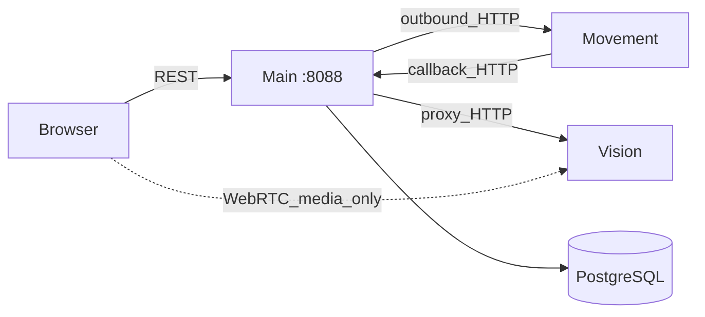
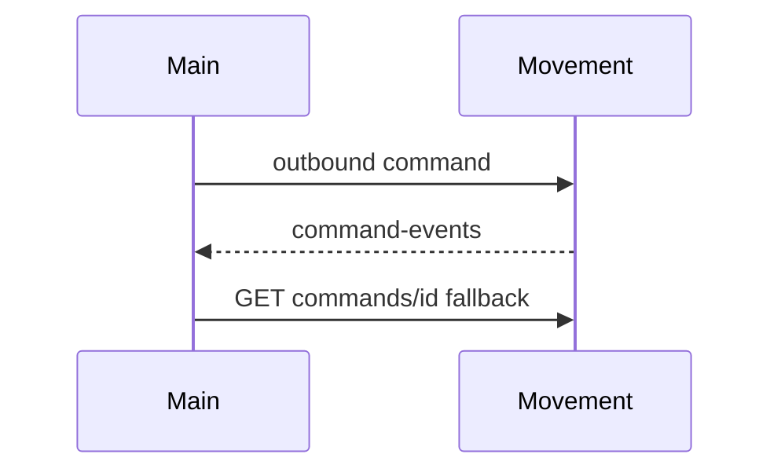
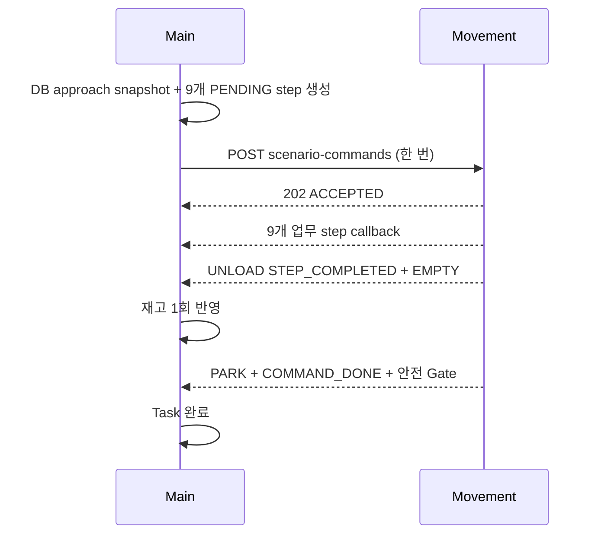

# Interfaces

맵 API는 파일 기반 단일 맵만 제공한다. `GET /maps`는 호환상 길이 0 또는 1인 배열이며, `POST /maps/import-folder`는 저장이 아니라 파일 재검증이다.

상태: Active
주 독자: Main·Movement·Vision 연동 개발자
보조 독자: 배포 담당자·QA
난이도: 연동
소유: Integration
최종 갱신: 2026-07-16 20:50 KST
구현 기준: Main outbound client·callback route·현재 환경변수
목적: **Main 서버 기준** 외부 HTTP 계약 — Movement/Vision 경계, robot-commands, 콜백, lift-load evidence.

Main 서버와 다른 서버(Movement·Vision) 사이의 HTTP 계약을 정의한다. Main이 호출하는 API, 수신하는 콜백,
상대 서버가 지원하지 않는 command에 대한 `501` 응답을 담는다. 브라우저가 쓰는 REST 목록은
[API](API.md), 시스템 전체 구조는 [ARCHITECTURE](ARCHITECTURE.md) 참고.

자동 입고·출고 Scenario API의 요청·9개 업무 단계·callback·화물·재고 계약은
[Main ↔ Movement Scenario API Contract](MOVEMENT_SCENARIO_API_CONTRACT.md)가 최우선 정본이다.

## 1. 큰 그림 (Main 경계)



## 2. 디자인 철학

- **제어와 상태 조회는 브라우저가 Main만 호출한다.** 예외는 Vision WebRTC **미디어** 직결뿐이고, 그 경우에도 스트림 discovery와 offer는 Main을 거친다.
- 외부 서버의 hostname·IP·timeout은 Main이 설정(`.env`)으로 소유한다. 외부 서버는 Main DB에 직접 쓰지 않는다.
- 콜백이 누락될 수 있으므로 Main이 명령 상태를 주기적으로 **폴링**해 보정한다.
- Main과 Movement의 활성 맵이 다르면(map mismatch) Main이 이동 명령을 차단한다.

## 3. Main 주소 · Vision proxy

```env
LMS_PUBLIC_BASE_URL=http://smartfactory-main.local:8088
```

```text
Base URL: http://smartfactory-main.local:8088/api/v1
```

외부 서버가 콜백할 base URL과 Main이 바라보는 upstream 주소는 `GET /api/v1/system/external-config`로 조회할 수 있다.

Vision은 hostname-first가 기본이다.

```env
LMS_VISION_API_BASE_URL=http://smartfactory-vision.local:8100
LMS_VISION_STREAM_BASE_URL=http://smartfactory-vision.local:8090
LMS_VISION_API_FALLBACK_BASE_URL=http://192.168.30.3:8100
LMS_VISION_STREAM_FALLBACK_BASE_URL=http://192.168.30.3:8090
```

`smartfactory-vision.local`은 배포 환경의 hosts/DNS에서 현장 Vision 주소로 해석되어야 한다. 실행 스크립트는
hostname 경로가 준비되지 않은 복구 상황을 위해 별도 fallback URL을 유지하지만 Browser에 upstream 주소를
직접 노출해 호출시키지는 않는다.

Movement·Vision base URL과 callback URL은 `http`/`https`와 명시적 host가 필요하며 userinfo·query·fragment를 허용하지 않는다. Main proxy는 JSON/binary/오류 응답에 크기 상한을 적용하고 upstream 오류 본문을 브라우저 응답에 노출하지 않는다. `external-config`는 내부 endpoint topology를 포함하므로 신뢰된 운영망에서만 노출한다.

Vision 연동은 Main이 **끌어오고 중계(pull/proxy)** 한다. Main이 중계하는 path 예:

```text
GET  /api/v1/vision/bridge/status
GET  /api/v1/vision/frame/latest/image?source={source_id}
GET  /api/v1/vision/streams?source={source_id}&view={view}
POST /api/v1/vision/streams/{source_id}/webrtc/offer?view={view}
```

`source_id`는 Main `cameras` registry에 등록된 값만 허용한다. WebRTC를 쓸 수 없으면 MJPEG로 폴백한다. 헬스체크는 `GET /health` → `{"ok": true, …}`.

## 4. 데이터 SoT · 현행 유지

| 화면/API 이름 | 최종 기준 | 비고 |
| --- | --- | --- |
| `item_code` / items | `items` | DB 기준은 `items.id` |
| `slot_id` | `locations(type=storage)` | |
| `waypoint_id` | `locations` | type으로 존·마커 구분 |
| work order | `tasks` | `work_orders` 물리 테이블 없음 |
| 이벤트·이동 이력 | `evidence_events` | `/events`·`/movement-commands`는 projection |
| 맵·카메라 | `maps/` YAML·PGM · `cameras` | filesystem · infra |

Work Order 내부 read model은 `RobotTaskSummary`와 canonical 필드(`requested_quantity`, `allocated_quantity`, `robot_task_id`, `active_command_id`)를 사용한다. 이는 외부 계약 변경이 아니며 `/api/v1` adapter가 기존 `quantity`, `tasks[]`, `task_id`, `command_id`를 계속 제공한다.

| 항목 | 결정 | 재검토 트리거 |
| --- | --- | --- |
| `GET /status` | 종합 스냅샷 유지 | 관제가 더 이상 쓰지 않을 때 |
| 감사 API | `/events`·`/movement-commands`·`/evidence-events` 분리 | 네 번째 projection 필요 시 |
| probe | `/comm/probe/movement`·`/camera` 분리 | 공통 구조가 생길 때 |

## 5. Main이 다루는 경계

이 문서에서 `생산자`는 데이터를 만드는 쪽, `소비자`는 받는 쪽이다. `호출자`는 HTTP 요청을 시작하는 쪽이라
콜백에서는 생산자와 호출자가 같지만, Main의 upstream 조회에서는 Main이 호출자이자 소비자다.

| 방향 | 호출자 | 생산자 → 소비자 | 전송·형식 | 주요 계약 | 성공 확인 | 누락·실패 처리 |
| --- | --- | --- | --- | --- | --- | --- |
| Main → Movement | Main | Main → Movement | HTTP · `application/json` | command envelope | HTTP `2xx` + command ID | timeout/5xx 표면화, 상태 폴링 |
| Movement → Main | Movement | Movement → Main | HTTP callback · `application/json` | command event/result/status/pose | Main `2xx` · `ApiMessage` | `command_id` 기준 멱등 처리, Main 폴링 보정 |
| Main → Vision | Main | Main → Vision | HTTP · JSON/JPEG/MJPEG/SDP | stream/frame · lift-load evaluate | upstream HTTP 응답 | timeout/오류 기록, 미디어 MJPEG 폴백 |
| Browser → Main | Browser | Browser/Main → Main/Browser | HTTP · JSON, 일부 media | REST `/api/v1/*` | HTTP status + OpenAPI schema | UI 오류 매핑, 안전 조작 차단 |

현재 MQTT·Kafka·WebSocket 이벤트 채널은 없다. 향후 실제 pub/sub를 추가할 때만 channel/topic, message schema,
delivery semantics, ordering, retry/DLQ를 AsyncAPI 계약으로 분리한다.

## 6. Integration Quickstart

1. **Config** — `GET /api/v1/system/external-config`
2. **Pose** — `GET /api/v1/robot-poses` (§9)
3. **Command** — `POST /api/v1/robot-commands` (`move_to_point` dry_run → 실실행). Movement가 command kind를 지원하지 않으면 `501`
4. **Callback** — Movement → `POST /api/v1/movement/command-events` (누락 시 Movement `GET /robot-commands/{id}` 폴링)
5. **Sync** — `GET /api/v1/movement/sync-status`로 맵·pose 동기화 상태를 진단



---

## 7. Movement HTTP 계약 (Active)

아래 계약은 Main이 사용하는 canonical Movement API다.

### 7.1 Movement base

로봇마다 Movement API 인스턴스가 하나씩 뜨며, 주소 예시는 다음과 같다:

```text
tb3_1 -> http://<movement-host>:8001/movement-api/v1
tb3_2 -> http://<movement-host>:8002/movement-api/v1
```

설정: `LMS_MOVEMENT_*` / `LMS_MOVEMENT_BASE_URLS`.

### 7.2 Main이 호출하는 API (현행)

```text
GET /movement-api/v1/health
GET /movement-api/v1/robots/{robot_name}/pose
POST /api/v1/robots/{robot_name}/pose  # Movement -> Main canonical latest-pose push
POST /robot-commands
GET /robot-commands/{command_id}
POST /robot-commands/{command_id}/cancel
POST /movement-api/v1/scenario-commands
GET /movement-api/v1/scenario-commands/{command_id}
POST /movement-api/v1/scenario-commands/{command_id}/safe-stop
POST /movement-api/v1/manual/stop
GET /movement-api/v1/robots/{robot_name}/localization
GET /movement-api/v1/robots/{robot_name}/nav-state
GET /movement-api/v1/map-state
POST /movement-api/v1/robots/{robot_name}/initial-pose
```

Command envelope(Movement가 kind를 지원하지 않으면 Main `501`):

```text
POST /robot-commands
GET /robot-commands/{id}
```

### 7.3 Waypoint 이동 요청

수동·일반 단일 이동은 Movement의 canonical `waypoint_id`를 보낸다. Main outbound envelope:

```json
{
  "command_id": "task-342-tb3_2-inbound2-20260714T110000123456",
  "task_id": 342,
  "robot_id": "tb3_2",
  "robot_name": "tb3_2",
  "kind": "move_to_point",
  "dry_run": false,
  "params": {"waypoint_id": "inbound_slot_2_approach"},
  "callback_url": "http://<main>:8088/api/v1/movement/command-events"
}
```

- 정상 상태: `ACCEPTED → RUNNING → ARRIVED`; Main은 `ARRIVED` 뒤에만 다음 step을 보낸다.
- 슬롯 waypoint는 Movement가 `nav2_pose → aruco_align(0.4m) → wait(3s) → aruco_align(0.2m, straight_insert)`로 확장한다.
- 자동 입출고는 이 envelope가 아니라 [Scenario API Contract](MOVEMENT_SCENARIO_API_CONTRACT.md)를 사용한다.
- 수동 좌표 이동의 `map_id/x/y/yaw` 입력은 legacy 호환 경계로만 유지한다.
- `robot_name`/포트 불일치 또는 같은 `command_id`의 다른 payload는 `409`다.
- localization 미준비는 명확한 error/reason으로 실패한다.

### 7.4 Command 상태 조회 (Main 폴링)

```http
GET /robot-commands/{command_id}
```

상태 예: `ACCEPTED` · `RUNNING` · `DONE` · `FAILED` · `WAITING_TRAFFIC` · `CANCELED`/`CANCELLED` · `STOPPED`.
최소 필드: `command_id`, `robot_name`, `state`, `message`, `pose`(가능 시).

### 7.5 Nav State · Battery · Map State

`GET …/nav-state` — Main이 쓰는 필드: `robot_online`, `command_accepting`, `is_emergency`, `localized`, `current_command_id`, `reason`.

`GET …/health`의 `battery`(정수 0–100). 없거나 `null`이면 DB의 마지막 값은 보존하되 운영 응답은 미수신으로 표시한다. 소수 비율(0.0–1.0) 금지. 신규 작업 배정에서는 20% 미만을 `robot_battery_low`로 제외하고, 20%와 `null`은 배터리 사유로 차단하지 않는다.

`GET …/map-state` — UI map 비교: `active_map_id`, `frame_id`, `resolution`, `origin`, `width`, `height`.

### 7.6 Callback (Movement → Main)

```http
POST http://<main>:8088/api/v1/movement/command-events
```

```json
{
  "command_id": "coord-…",
  "robot_name": "tb3_1",
  "event": "RUNNING",
  "state": "RUNNING",
  "message": "navigation started",
  "pose": {"frame_id": "map", "x": 0.1, "y": 0.2, "yaw": 0.0, "age_sec": 0.2},
  "reported_at": "2026-06-18T10:40:00Z",
  "event_id": "tb3_1:coord-…:2",
  "sequence": 2
}
```

최소 payload 계약:

| 필드 | 형식 | 필수 | 의미 |
| --- | --- | --- | --- |
| `command_id` | string | 예 | 명령 상관관계·중복 처리 키 |
| `robot_name` 또는 `robot_id` | string | 예 | Main registry의 로봇 식별자 |
| `event` 또는 `state` | enum string | 예 | `ACCEPTED`, `RUNNING`, `DONE`, `FAILED` 등 |
| `message` | string | 아니요 | 운영자·진단용 설명 |
| `event_id` | string | 권장 | callback 재전송 중복 제거 키 |
| `sequence` | integer ≥ 0 | 권장 | command별 단조 증가 순서. 작거나 같은 값은 상태 적용에서 무시 |
| `pose` | object | 아니요 | `frame_id`, `x`, `y`, `yaw`, 선택 `age_sec` |
| `reported_at` | RFC 3339 UTC datetime | 아니요 | Movement 발생 시각 |

추가 필드는 원본 payload에 보존한다. Main은 `command_id`·배정 robot·현재 step을 모두 대조하고, `event_id` 중복과
`sequence` 역행을 상태 적용에서 제외한다. 필수 필드 누락은 `422`, 설정된 callback token 불일치는 `401`이다.


릴리즈 환경에서는 Main과 Movement에 같은 `LMS_MOVEMENT_CALLBACK_TOKEN`을 설정하고 Movement가 모든 callback에
`X-Movement-Callback-Token` 헤더를 보낸다. Main token이 비어 있으면 로컬 개발 호환 모드로 인증을 강제하지 않는다.
성공 ACK는 `ok`, `message`, `duplicate`, `task_advanced`를 반환한다. 중복 callback도 `200 duplicate=true`로 응답해
Movement의 불필요한 재전송을 끝낸다. Callback과 누락 보정 poller는 같은 Execution 전진 경로와 task lock을 사용하며, 이미 terminal인 step은 다시 적용하지 않는다.

Main은 callback 누락을 가정하고 `GET /robot-commands/{id}`로 보정한다.

상세 구현 요구는 [MOVEMENT_SERVER_REQUIREMENTS](MOVEMENT_SERVER_REQUIREMENTS.md)를 따른다.

추가 inbound: `/movement/robots/{name}/status` · canonical pose report (`/robots/{id}/pose`).

Robot status callback이 `is_emergency`를 명시하면 Main은 해당 로봇의 ESTOP latch를 실제 보고값으로 정합화하고
`ROBOT_ESTOP_CONFIRMED` 또는 `ROBOT_CLEAR_ESTOP_CONFIRMED` 이벤트를 남긴다. 같은 확인 상태의 반복 보고는
추가 이벤트를 만들지 않는다. 현재 fleet ESTOP outbound는 로봇별 HTTP 응답까지 확인하며 request ID를
Movement body에 전달하지는 않으므로, 물리 실행과의 강한 상관관계가 필요하면 Movement 계약 확장이 필요하다.

### 7.7 이동 전 확인

`robot_online` · `command_accepting` · not emergency · `localized` · pose 존재. 불충족 시 명령을 보내지 않거나 Movement `4xx`를 표면화.

Main 진단 API: `GET /api/v1/movement/map-state` · `/sync-status` · `/robots/{id}/localization` · `/movement/commands/{id}/trace`.

### 7.8 Fleet ESTOP 상태 계약

- 정지는 등록 로봇 전체에 즉시 fan-out하고 실행 중 task를 `AWAITING_OPERATOR`로 전환한다.
- Main은 전송 전에 로컬 latch를 세우므로 요청 응답이 유실돼도 해당 로봇의 신규 명령·자동 배정을 차단한다.
- 해제는 stale health로 대상을 제외하지 않고 모든 enabled 로봇에 전송한다.
- 로봇별 상태는 `stop_requested|stop_confirmed|stop_unconfirmed|clear_requested|clear_confirmed|clear_unconfirmed|clear`이다.
- 단순 `robot_online=false`는 ESTOP unknown이 아니다. ESTOP 요청 이력이 있는 미확인 로봇만 격리한다.
- 마지막 수명주기 이벤트는 `evidence_events`에 저장하며 Main 재시작 시 latch 복원에 사용한다.
- 해제 후 task는 자동 재개하지 않는다.

---

## 8. Robot-commands envelope (Main outbound)

Main_Control의 `POST /api/v1/robot-commands`는 Robot Command 외부 계약이다. Movement 네이티브 envelope가
없으면 legacy route로 조용히 대체하지 않고 `501 movement_robot_commands_api_missing`으로 드러낸다. 내부
파일·함수 배치는 이 외부 계약의 일부가 아니다.

요청 헤더 `Idempotency-Key`는 body의 `command_id`와 같다. Movement는 같은 key와 같은 payload의 재전송에는 기존
명령 상태를 반환하고 새 동작을 시작하지 않아야 하며, 같은 key에 다른 payload가 오면 `409`를 반환해야 한다.
이 계약이 없으면 Main의 primary→fallback 전환 중 응답 유실이 중복 주행으로 이어질 수 있다.

실행 중 command 취소는 `POST /robot-commands/{command_id}/cancel`을 사용한다. Main은 운영자의 안전 중단 요청에
이 endpoint를 즉시 호출하고 `202 CANCEL_REQUESTED`를 반환한다. Movement는 실제 정지 후
`CANCELLED | CANCELED | STOPPED | ABORTED` callback을 보내야 한다.

| kind | Main | Movement | 요지 |
| --- | --- | --- | --- |
| `move_to_point` | ✅ | `/robot-commands` | 업무 경로는 canonical waypoint_id; 좌표는 legacy |
| `manual_drive` | ✅ | `/manual/*` | teleop hold |
| `estop` | ✅ | estop/clear | stop/clear |
| `dock_transfer` | Movement 지원 여부 반영 | 미지원 응답 → Main `501` | marker/action/level |
| `aruco_align` | Movement 지원 여부 반영 | 미지원 응답 → Main `501` | marker/final/tolerance |
| `inout_scenario` | Main 내부 전용 | `/scenario-commands` | DB 접근 좌표를 한 번 전송하고 9개 업무 callback 추적 |

```jsonc
{
  "command_id": "task-342-tb3_2-warehouse-d-...",
  "robot_id": "tb3_2",
  "task_id": 342,
  "kind": "move_to_point",
  "dry_run": false,
  "params": { "waypoint_id": "warehouse_d_approach" },
  "callback_url": "http://<main>:8088/api/v1/movement/command-events"
}
```

자동 입출고는 Main에 단일 `inout_scenario` command step과 9개 업무 타임라인을 미리 생성한다. Main은 DB에서
pickup/dropoff 업무 위치에 연결된 접근 waypoint의 `id/x/y/yaw`를 snapshot하고 한 번 POST한다. 품목·수량,
marker, 리프트 높이, 정밀 거리와 속도는 전송하지 않는다. 상세 필드·멱등·callback·완료 Gate는
[Scenario API Contract](MOVEMENT_SCENARIO_API_CONTRACT.md)만 정본으로 사용한다.

---

## 9. Pose / Localization (요약)

증상 예: `localized: false`, `pose: null` → Main `GET /robot-poses`에 그릴 위치 없음 → 운영자가 initial pose 필요.

```http
GET /movement-api/v1/robots/{robot_name}/localization
POST /movement-api/v1/robots/{robot_name}/initial-pose
```

initial-pose body: `{ "frame_id":"map", "x", "y", "yaw", "source":"main_ui" }`.
API 없으면 Main `movement_initial_pose_api_missing`.

---

## 10. 자동 입출고 Scenario 실행



적재 후 terminal 실패는 Task와 robot 할당을 유지한 채 `AWAITING_OPERATOR`로 전환한다. UNLOAD 이후 복귀·주차
실패는 물류 완료를 되돌리지 않고 `PARK_FAILED`로 기록한다. callback 유실은 같은 command ID의 상태 조회로
보정하고, 실제 재실행은 새 command ID를 사용한다.

---

## 11. Lift-load evidence (Main → Vision, compact)

상태: Draft (record-only MVP).

`dock_transfer` DONE 후 Vision evaluate를 1회 실행해 `evidence_events`에 저장한다. Vision 평가 결과는 기록용이며 robot task 전진을 차단하지 않는다.

```http
POST {LMS_VISION_API_BASE_URL}/api/v1/vision/evidence/lift-load/evaluate
```

요청 핵심: `source`, `robot_id`, `operation`(`PICK_UP`\|`DROP_OFF`), `expected_item_id`, `expected_marker_id`(20..49), `expected_item_count`, `vision_zone_id`.
응답: `result`(`PASS`/`FAIL`/`UNCERTAIN`/`NO_DECISION`) + `event`. HTTP 오류 → `LIFT_LOAD_EVIDENCE_ERROR` 기록, robot task 계속.

Zone 예: `inbound_static_item_zone` · `outbound_static_item_zone` · `storage_upper_static_item_zone` · `storage_lower_static_item_zone`.

설정은 `LMS_LIFT_LOAD_*` 환경변수로 켜고, 기록된 결과는 `GET /evidence-events`로 조회한다.

## Gaps (Main이 보는 증상)

- Movement에 initial pose API 없음 → `movement_initial_pose_api_missing`
- envelope `/robot-commands` 없음 → `501 movement_robot_commands_api_missing`

## 관련

- [ARCHITECTURE](ARCHITECTURE.md) · [API](API.md) · [OPERATIONS](OPERATIONS.md)
