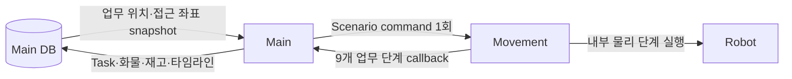

# Main ↔ Movement Scenario API Contract

상태: Active — Main·Movement 구현, 통합 검증 중
주 독자: Main·Movement 서버 개발자
보조 독자: 통합 QA·현장 운영 담당자
난이도: 연동
소유: Main·Movement Integration
최종 갱신: 2026-07-17 18:40 KST
구현 기준: Main Scenario API v1 client·DB waypoint snapshot·9단계 callback orchestrator
목적: Main이 업무 위치와 실제 접근 좌표를 한 번 전송하고 Movement가 전체 입출고를 실행하면서 공통 업무 단계로 진행도를 callback하는 양방향 정본 계약.

운영 진단은 [Movement Scenario Troubleshooting](MOVEMENT_SCENARIO_TROUBLESHOOTING.md), location과 waypoint의 명시적
연결은 [Movement Waypoint Contract](MOVEMENT_WAYPOINT_CONTRACT.md)를 따른다.

문서 버전: `1.0`

이 문서는 자동 입고·출고 통신의 최우선 정본이다. [INTERFACES](INTERFACES.md)와
[Movement Callback Requirements](MOVEMENT_SERVER_REQUIREMENTS.md)에 같은 내용이 있더라도 충돌하면 이 문서를
우선한다. ESTOP·수동조작·일반 위치 이동은 이 문서 범위가 아니다.

이 문서에서 **필수**는 양쪽 구현이 반드시 지켜야 하는 조건, **금지**는 보내거나 해석하면 안 되는 조건이다.

## 1. 책임과 설계 원칙



| Main 소유 | Movement 소유 |
| --- | --- |
| Task·품목·수량·재고 | Nav2·ArUco·리프트·도킹 제어 |
| pickup/dropoff 업무 위치 | 업무 단계를 물리 동작으로 확장 |
| DB에 연결된 접근 waypoint와 `x/y/yaw` | 마커 ID·정밀 거리·속도·허용 오차·timeout |
| `map_id`, `frame_id`, 작업 층 | 층별 리프트 높이와 센서 판정 |
| 9개 업무 step과 UI 타임라인 | 삽입·후진·기본 대기 위치·주차 정책 |
| callback 기반 화물·재고·Task 판정 | 실제 화물 상태와 최종 안전 상태 보고 |

Main은 ArUco marker, 리프트 높이, 정밀 접근 거리, `skip_lift`, `fork_insert_enabled`, 후진 거리,
속도, 허용 오차, 대기 시간, return pose key, traffic segment를 보내지 않는다. Movement는 이 값을
`location_id`·`approach.waypoint_id`·`floor`에 연결된 자체 설정에서 해석한다.

## 2. API 목록

| 방향 | Method·path | 용도 |
| --- | --- | --- |
| Main → Movement | `POST /movement-api/v1/scenario-commands` | 시나리오 전체 1회 실행 |
| Main → Movement | `GET /movement-api/v1/scenario-commands/{command_id}` | callback 유실 보정·현재 상태 조회 |
| Main → Movement | `POST /movement-api/v1/scenario-commands/{command_id}/safe-stop` | 운영자 안전 중지 |
| Movement → Main | `POST /api/v1/movement/command-events` | 명령·업무 단계 callback |

v1에서는 실행 중 자동 resume을 제공하지 않는다. 안전 중지·실패 후 재실행은 현장 확인과 운영자 승인을 거쳐
새로운 `command_id`로 새 명령을 생성한다.

모든 body는 UTF-8 JSON이며 `Content-Type: application/json`을 사용한다. 운영 환경은
`smartfactory-main.local`·`smartfactory-nav.local` hostname을 우선 사용하고, IP는 긴급 복구 시에만 사용한다.
Movement base URL은 Main의 robot별 설정을 정본으로 한다. 예시의 `tb3_2`는
`http://smartfactory-nav.local:8002/movement-api/v1`, Main callback base는
`http://smartfactory-main.local:8088/api/v1`이다.

분리 서버 환경에서 callback에 `localhost` 또는 `127.0.0.1`을 사용하는 것은 금지한다. 이 주소는 Movement 서버
자신을 가리킨다. IP 주소는 hostname 장애 시에만 fallback으로 사용한다.

### 2.1 실행 전 READY Gate

Main은 명령 직전 최신 `/health`에서 아래 조건을 모두 확인한다. 누락 또는 `null`은 실패다.

```text
ok=true, dry_run=false, robot_online=true, localized=true,
nav2_ready=true, command_accepting=true, is_emergency=false
```

Main의 신규 배차에는 `battery >= 20` 정책을 추가 적용한다. Gate 실패 시 Task는 대기시키고 같은 명령을 반복 POST하지
않는다. Movement 상태가 READY로 복구된 뒤 같은 Task를 다시 평가한다.

## 3. Scenario 실행 요청

```http
POST /movement-api/v1/scenario-commands HTTP/1.1
Content-Type: application/json
Idempotency-Key: task-355-tb3_2-inbound-20260716-001
```

### 3.1 최상위 필드

| 필드 | 타입 | 필수 | 규칙 |
| --- | --- | --- | --- |
| `contract_version` | string | 예 | v1은 정확히 `1.0` |
| `command_id` | string | 예 | 실행 단위 고유 ID; `Idempotency-Key`와 동일 |
| `task_id` | integer | 예 | Main DB Task ID |
| `robot_name` | string | 예 | Movement가 인식하는 로봇 이름 |
| `scenario_type` | enum | 예 | `inbound` 또는 `outbound` |
| `map` | object | 예 | Main 좌표 snapshot의 맵 문맥 |
| `pickup` | object | 예 | 적재 업무 위치와 실제 접근점 |
| `dropoff` | object | 예 | 하역 업무 위치와 실제 접근점 |
| `callback_url` | string | 예 | canonical callback 전체 URL |

정의되지 않은 필드는 거부한다. 특히 품목·수량과 물리 튜닝값은 Scenario 실행 요청에 넣지 않는다.

### 3.2 `map`

| 필드 | 타입 | 필수 | 단위·규칙 |
| --- | --- | --- | --- |
| `map_id` | string | 예 | Main이 승인한 활성 맵 ID |
| `frame_id` | string | 예 | v1은 `map` |

### 3.3 `pickup`·`dropoff`

| 필드 | 타입 | 필수 | 설명 |
| --- | --- | --- | --- |
| `location_id` | string | 예 | Main DB의 업무 위치 ID |
| `floor` | integer | 예 | `1` 또는 `2` |
| `approach` | object | 예 | Main DB에 연결된 접근·스캔 waypoint snapshot |
| `approach.waypoint_id` | string | 예 | Movement 물리 profile 조회 키 |
| `approach.x` | number | 예 | `frame_id` 기준 미터 |
| `approach.y` | number | 예 | `frame_id` 기준 미터 |
| `approach.yaw` | number | 예 | 라디안, `-π` 이상 `π` 이하 |

좌표는 유한한 숫자여야 한다. Main은 업무 위치 자체의 표시 좌표가 아니라 그 위치에 연결된
`approach/scan waypoint` 좌표를 전송한다.

### 3.4 역할 규칙

| `scenario_type` | `pickup.location_id` | `dropoff.location_id` |
| --- | --- | --- |
| `inbound` | `locations.type=inbound` | `locations.type=storage` |
| `outbound` | `locations.type=storage` | `locations.type=outbound` |

Main은 Task 생성 시 저장한 위치·층과 request snapshot이 일치하는지 확인한다. Movement는 location과 approach
profile의 연결, 해당 층의 리프트 profile 존재 여부를 확인한다.

### 3.5 평문 JSON 예시

아래 좌표는 형식을 설명하는 snapshot이며 실행 시 Main DB의 현재 값을 사용한다.

```json
{
  "contract_version": "1.0",
  "command_id": "task-355-tb3_2-inbound-20260716-001",
  "task_id": 355,
  "robot_name": "tb3_2",
  "scenario_type": "inbound",
  "map": {
    "map_id": "robot2_map",
    "frame_id": "map"
  },
  "pickup": {
    "location_id": "INBOUND_02",
    "floor": 1,
    "approach": {
      "waypoint_id": "inbound_slot_2_approach",
      "x": 0.234,
      "y": 0.006,
      "yaw": 1.571
    }
  },
  "dropoff": {
    "location_id": "STORAGE_02",
    "floor": 1,
    "approach": {
      "waypoint_id": "warehouse_a_approach",
      "x": 0.019,
      "y": -0.618,
      "yaw": -0.02480715457412523
    }
  },
  "callback_url": "http://smartfactory-main.local:8088/api/v1/movement/command-events"
}
```

## 4. 실행 수락 응답

Movement는 요청 schema와 실행 전 gate를 동기적으로 검사한다. 접수된 경우 `202 Accepted`로 다음 필드를 반환한다.

```json
{
  "accepted": true,
  "command_id": "task-355-tb3_2-inbound-20260716-001",
  "task_id": 355,
  "execution_id": "exec-task-355-tb3_2-inbound-20260716-001",
  "state": "ACCEPTED",
  "scenario_type": "inbound",
  "authority_owner": "MOVEMENT"
}
```

`accepted=true`는 물리 작업 완료가 아니라 Movement가 실행 책임을 인수했다는 뜻이다.

## 5. Main 업무 Step 정본

Main은 Movement에 POST하기 전에 다음 9개 step을 `PENDING`으로 생성한다. Movement 내부 물리 step 개수와
상관없이 callback의 `current_step_index`·`current_step_code`도 이 표를 사용한다.

| index | `step_code` | 화면 표시 | 완료 의미 |
| ---: | --- | --- | --- |
| 0 | `LEAVE_HOME` | 대기 위치 출차 | 주차 위치 안전 이탈 |
| 1 | `PICKUP_APPROACH` | 적재 위치 이동 | pickup approach 도착 |
| 2 | `PICKUP_ALIGN` | 적재 위치 정밀 접근 | 적재 가능한 정렬·삽입 완료 |
| 3 | `LOAD` | 화물 적재 | 적재·화물 확인·안전 후진 완료 |
| 4 | `TRANSPORT` | 목적 위치 이동 | dropoff approach 도착 |
| 5 | `DROPOFF_ALIGN` | 하역 위치 정밀 접근 | 하역 가능한 정렬·삽입 완료 |
| 6 | `UNLOAD` | 화물 하역 | 하역·빈 차 확인·안전 후진 완료 |
| 7 | `RETURN_HOME` | 대기 위치 복귀 | 기본 대기 approach 도착 |
| 8 | `PARK` | 대기 위치 주차 | 최종 주차와 제어권 반환 완료 |

`scenario_type`에 따라 화면의 “적재 위치”와 “목적 위치” 문구만 달라진다. step code와 index는 바뀌지 않는다.

## 6. Callback 계약

```http
POST /api/v1/movement/command-events HTTP/1.1
Content-Type: application/json
X-Movement-Callback-Token: <shared-secret>
```

### 6.1 공통 필드

| 필드 | 타입 | 필수 | 규칙 |
| --- | --- | --- | --- |
| `contract_version` | string | 예 | `1.0` |
| `event_id` | string | 예 | callback 멱등 키 |
| `sequence` | integer | 예 | command별 0부터 단조 증가 |
| `command_id` | string | 예 | 실행 요청과 동일 |
| `task_id` | integer | 예 | 실행 요청과 동일 |
| `robot_name` | string | 예 | 실행 요청과 동일 |
| `event` | enum | 예 | 아래 이벤트 목록 |
| `current_step_index` | integer/null | 조건부 | 업무 step index `0..8` |
| `current_step_code` | string/null | 조건부 | index와 정확히 일치 |
| `current_step_action` | string/null | 아니요 | 진단용 현재 물리 동작 이름 |
| `last_completed_step_index` | integer/null | 예 | 완료된 마지막 업무 step, 없으면 `null` |
| `cargo_state` | enum | 예 | `EMPTY`, `LOADED`, `UNKNOWN` |
| `business_completed` | boolean | 예 | UNLOAD 완료 이후 계속 `true` |
| `message` | string | 예 | 운영자가 이해할 수 있는 평문 |
| `reason_code` | string/null | 실패 시 | 기계 판독 가능한 원인 코드 |
| `reported_at` | string | 예 | RFC 3339 UTC |

Movement는 원칙적으로 필드를 생략하지 않는다. 단, `COMMAND_ACCEPTED`, 첫 `COMMAND_RUNNING`, 첫 `STEP_STARTED`처럼 완료된 단계가 없는 초기 callback은 `last_completed_step_index` 생략을 `null`과 동일하게 수신한다. 이후 callback에는 필수다.

`current_step_action`은 운영 로그용이며 Main은 이 값으로 step·Task·재고 상태를 변경하지 않는다.

### 6.2 이벤트 목록

| 이벤트 | 의미 |
| --- | --- |
| `COMMAND_ACCEPTED` | Movement가 명령을 접수함 |
| `COMMAND_RUNNING` | 전체 시나리오 실행 시작 |
| `STEP_STARTED` | `current_step_code` 실행 시작 |
| `STEP_COMPLETED` | `current_step_code` 완료 |
| `BUSINESS_COMPLETED` | UNLOAD 완료 후 Movement가 보내는 정보성 확인; Task·재고는 앞선 UNLOAD `STEP_COMPLETED`로만 전진 |
| `COMMAND_DONE` | PARK 포함 전체 성공 |
| `COMMAND_FAILED` | 복구 없는 실행 실패 |
| `COMMAND_ABORTED` | ESTOP·제어 중단으로 종료 |
| `COMMAND_STOPPED` | safe-stop 완료 |
| `COMMAND_CANCELLED` | 실행 전 또는 안전한 취소 완료 |

단계 이벤트에는 `current_step_index`와 `current_step_code`가 필수다. 명령 이벤트에서도 현재 단계가 정해졌다면
두 값을 제공한다. `current_step_code`와 index가 표와 다르면 Main은 Task 상태에 적용하지 않고 계약 위반으로 기록한다.

### 6.3 단계 시작 예시

```json
{
  "contract_version": "1.0",
  "event_id": "exec-355-seq-7",
  "sequence": 7,
  "command_id": "task-355-tb3_2-inbound-20260716-001",
  "task_id": 355,
  "robot_name": "tb3_2",
  "event": "STEP_STARTED",
  "current_step_index": 3,
  "current_step_code": "LOAD",
  "current_step_action": "lift_load",
  "last_completed_step_index": 2,
  "cargo_state": "EMPTY",
  "business_completed": false,
  "message": "화물 적재를 시작합니다.",
  "reason_code": null,
  "reported_at": "2026-07-16T10:20:00Z"
}
```

### 6.4 적재 완료 예시

```json
{
  "contract_version": "1.0",
  "event_id": "exec-355-seq-8",
  "sequence": 8,
  "command_id": "task-355-tb3_2-inbound-20260716-001",
  "task_id": 355,
  "robot_name": "tb3_2",
  "event": "STEP_COMPLETED",
  "current_step_index": 3,
  "current_step_code": "LOAD",
  "current_step_action": "safe_reverse",
  "last_completed_step_index": 3,
  "cargo_state": "LOADED",
  "business_completed": false,
  "message": "화물 적재와 안전 후진이 완료됐습니다.",
  "reason_code": null,
  "reported_at": "2026-07-16T10:21:00Z"
}
```

### 6.5 최종 완료 예시

Terminal callback에는 다음 필드가 추가로 필수다.

```json
{
  "contract_version": "1.0",
  "event_id": "exec-355-seq-20",
  "sequence": 20,
  "command_id": "task-355-tb3_2-inbound-20260716-001",
  "task_id": 355,
  "robot_name": "tb3_2",
  "event": "COMMAND_DONE",
  "current_step_index": 8,
  "current_step_code": "PARK",
  "current_step_action": "park_hold",
  "last_completed_step_index": 8,
  "cargo_state": "EMPTY",
  "business_completed": true,
  "navigator_status": "IDLE",
  "is_emergency": false,
  "authority_owner": "MAIN",
  "authority_released": true,
  "message": "입고 시나리오가 완료됐습니다.",
  "reason_code": null,
  "reported_at": "2026-07-16T10:25:00Z"
}
```

### 6.6 Main ACK

```json
{
  "ok": true,
  "message": "movement command event saved",
  "duplicate": false,
  "task_advanced": true
}
```

Movement는 `2xx`에서 전송 성공으로 처리한다. 동일 callback 재전송은 같은 `event_id`를 사용하며 Main은
`200 duplicate=true`로 ACK한다.

Scenario v1 callback에서 이 절의 필수 필드를 누락하는 것은 계약 위반이다. 현재 Main의 공개 callback 모델은 구형
Movement callback 호환을 위해 일부 필드를 nullable로 수신하지만, 이 호환 범위를 Scenario v1 필수 계약으로
해석하면 안 된다. Main은 향후 Scenario command에 연결된 callback에 strict 검증을 적용한다.

## 7. 화물·재고·Task 판정

| 조건 | Main 처리 |
| --- | --- |
| LOAD 완료 전 | `cargo_state=EMPTY`, 재고 미반영 |
| `LOAD + STEP_COMPLETED + LOADED` | 화물 적재 상태 저장 |
| LOAD 완료 후 UNLOAD 완료 전 실패 | `AWAITING_OPERATOR`, 재고 미반영 |
| `UNLOAD + STEP_COMPLETED + EMPTY` | 재고를 정확히 한 번 반영, `business_completed=true` |
| UNLOAD 이후 복귀·주차 실패 | 업무 완료 유지, `PARK_FAILED` |
| 화물 상태를 확인할 수 없음 | `cargo_state=UNKNOWN`, 자동 완료·자동 재개 금지 |

Main은 `STEP_STARTED`나 단순 위치 도착으로 재고를 변경하지 않는다. 동일 UNLOAD 완료 callback이 재전송돼도
Task별 멱등 처리로 재고는 한 번만 변경한다.

## 8. 실패와 안전 중지

실패 callback 예시:

```json
{
  "contract_version": "1.0",
  "event_id": "exec-355-seq-11",
  "sequence": 11,
  "command_id": "task-355-tb3_2-inbound-20260716-001",
  "task_id": 355,
  "robot_name": "tb3_2",
  "event": "COMMAND_FAILED",
  "current_step_index": 4,
  "current_step_code": "TRANSPORT",
  "current_step_action": "nav2",
  "last_completed_step_index": 3,
  "cargo_state": "LOADED",
  "business_completed": false,
  "navigator_status": "IDLE",
  "is_emergency": false,
  "authority_owner": "MAIN",
  "authority_released": true,
  "message": "하역 위치 이동에 실패했습니다.",
  "reason_code": "NAVIGATION_FAILED",
  "reported_at": "2026-07-16T10:22:00Z"
}
```

safe-stop 요청은 즉시 접수하되 실제 속도 0, Nav goal 취소, 리프트 안전 상태 확인 전에는 terminal callback을
보내지 않는다. 안전 중지 후 남은 업무 step을 자동 시작하지 않는다.

- Movement가 실행을 수락하기 전인 Main 대기 작업은 Main이 자체 `CANCELLED` 처리하며 safe-stop을 보내지 않는다.
- Movement가 수락했지만 물리 동작 전이면 Movement는 `COMMAND_CANCELLED`로 확정할 수 있다.
- 물리 동작 시작 뒤에는 `COMMAND_STOPPED` 또는 `COMMAND_ABORTED`로만 종료한다.
- 종료 시 `EMPTY`면 Main Task는 `CANCELLED`, `LOADED`면 `AWAITING_OPERATOR`, 이미 UNLOAD를 완료했으면
  물류 완료를 유지하고 복귀 상태만 `PARK_FAILED`로 기록한다.

```http
POST /movement-api/v1/scenario-commands/task-355-tb3_2-inbound-20260716-001/safe-stop HTTP/1.1
Content-Type: application/json
Idempotency-Key: stop-task-355-001
```

```json
{
  "request_id": "stop-task-355-001",
  "reason": "OPERATOR_REQUESTED",
  "requested_by": "main-operator"
}
```

Movement는 중지 요청을 접수하면 `202 Accepted`와 아래 응답을 반환하고, 실제 안전 중지가 확인된 뒤
`COMMAND_STOPPED` callback을 보낸다. 같은 `request_id` 재요청은 중지 동작을 중복 실행하지 않는다.

```json
{
  "accepted": true,
  "command_id": "task-355-tb3_2-inbound-20260716-001",
  "request_id": "stop-task-355-001",
  "state": "STOP_REQUESTED"
}
```

## 9. 상태 조회

```http
GET /movement-api/v1/scenario-commands/{command_id}
```

응답은 마지막 callback과 같은 업무 상태 필드를 제공한다.

```json
{
  "contract_version": "1.0",
  "command_id": "task-355-tb3_2-inbound-20260716-001",
  "task_id": 355,
  "robot_name": "tb3_2",
  "state": "RUNNING",
  "current_step_index": 4,
  "current_step_code": "TRANSPORT",
  "last_completed_step_index": 3,
  "cargo_state": "LOADED",
  "business_completed": false,
  "authority_owner": "MOVEMENT",
  "authority_released": false,
  "updated_at": "2026-07-16T10:22:00Z"
}
```

Main은 callback 유실 시 이 응답을 callback과 동일한 상태 전이 함수에 입력한다.

`state`는 `ACCEPTED`, `RUNNING`, `STOP_REQUESTED`, `DONE`, `FAILED`, `ABORTED`, `STOPPED`,
`CANCELLED` 중 하나다. terminal state는 각각 같은 의미의 `COMMAND_*` callback과 일치해야 한다.

## 10. 인증과 전송 보호

| 방향 | 필수 헤더 | 설정 정본 |
| --- | --- | --- |
| Main → Movement | v1 애플리케이션 인증 헤더 없음 | Movement 전용망·허용 host/port |
| Movement → Main | `X-Movement-Callback-Token: <token>` | Main의 `LMS_MOVEMENT_CALLBACK_TOKEN`과 Movement 설정 |

- callback token은 운영 환경에서 빈 값을 허용하지 않는다. token 불일치는 `401`이며 callback을 저장하지 않는다.
- Main → Movement는 현재 전용망 경계를 신뢰하는 v1 계약이다. command 인증을 추가할 때는 양쪽 구현과 계약을
  동시에 변경하며, 한쪽만 임의의 `Authorization` 헤더를 필수화하지 않는다.
- token은 JSON·로그·오류 message에 넣지 않는다.
- 내부망 HTTP를 사용하더라도 외부 라우팅을 금지한다. 망 경계를 넘기면 동일 계약에 TLS를 적용한다.
- Main의 실행 요청 timeout은 `LMS_MOVEMENT_TIMEOUT_SEC`이며 현재 기준은 3초다. 이는 실행 완료가 아니라 접수
  응답까지만 측정하며, 실제 진행은 callback과 GET으로 확인한다.

## 11. 멱등성·순서·재전송

- 같은 `command_id`·같은 body 재요청은 새 로봇 동작을 만들지 않고 기존 실행 상태를 반환한다.
- 같은 `command_id`·다른 body는 `409 command_id_payload_mismatch`로 거부한다.
- Main의 POST 응답이 불확실하면 먼저 GET으로 조회하고, `404`일 때만 같은 ID·같은 body를 재전송한다.
- 실제 작업을 다시 수행할 때는 반드시 새로운 `command_id`를 사용한다.
- callback `sequence`가 마지막 적용값보다 작거나 같으면 Main은 Task에 재적용하지 않는다.
- callback `sequence`는 command별 0에서 시작해 단조 증가하며 같은 값을 재사용하지 않는다. gap이 감지되면 Main은
  GET 상태 조회로 보정하고 `last_completed_step_index`를 감소시키지 않는다.
- 정상 실행의 `STEP_COMPLETED`는 0부터 8까지 건너뛰지 않는다. 실패·중지 terminal callback은 현재 단계에서
  종료할 수 있지만 완료하지 않은 step을 완료로 보고하지 않는다.
- Movement는 callback을 durable outbox에 먼저 저장하고 Main의 `2xx` ACK를 받은 뒤 전송 완료로 표시한다.
- ACK를 받지 못한 callback은 같은 `event_id`·`sequence`로 1초, 2초, 5초, 10초 뒤 재전송하고 이후 30초
  간격을 상한으로 계속 재시도한다. 10분 이상 미전달이면 통신 장애를 알리되 outbox를 삭제하지 않는다.
- `401`·`422`는 설정·schema 오류이므로 무한 재시도하지 않고 운영 오류로 올린다.

## 12. 검증과 오류 응답

모든 비정상 응답은 같은 envelope를 사용한다.

```json
{
  "detail": {
    "code": "waypoint_profile_missing",
    "message": "Movement profile for warehouse_a_approach is not configured.",
    "retryable": false
  }
}
```

| HTTP | `detail.code` 예시 | 의미 |
| ---: | --- | --- |
| 400 | `invalid_request` | JSON 의미 오류 |
| 401 | `callback_auth_required` | 인증 정보 누락·불일치 |
| 404 | `command_not_found` | 조회·중지 대상 없음 |
| 409 | `robot_not_ready` | offline·busy·ESTOP·localization 불량 |
| 409 | `map_mismatch` | Movement 활성 맵과 요청 맵 불일치 |
| 409 | `waypoint_profile_missing` | approach에 연결된 물리 profile 없음 |
| 409 | `waypoint_location_mismatch` | location과 approach 연결 불일치 |
| 409 | `floor_profile_missing` | 요청 층 리프트 profile 없음 |
| 409 | `coordinate_mismatch` | 요청 좌표와 승인 profile 차이가 허용 범위 초과 |
| 409 | `active_execution` | 동일 로봇에 실행 중 시나리오 존재 |
| 409 | `command_id_payload_mismatch` | 같은 ID에 다른 body |
| 422 | `schema_validation_failed` | 타입·필수 필드·enum 오류 |

Movement는 오류 응답에 물리 튜닝값이나 내부 stack trace를 노출하지 않는다.

terminal 실패 callback에는 `reason_code`와 `message`가 필수다. 상태 조회가 `FAILED`인데 두 필드가 없으면 Main은
안전한 실패 상태만 적용하고 자동 재실행·원인별 복구를 금지하며 계약 위반 이벤트를 기록한다.

`retryable=false`는 동일 body 자동 재시도로 해결되지 않는다는 뜻이다. `retryable=true`여도 Main은 로봇 동작의
중복 가능성을 확인하기 위해 GET 조회와 `command_id` 멱등 규칙을 먼저 적용한다.

## 13. 완료 Gate

Main은 `COMMAND_DONE`만으로 Task를 완료하지 않고 다음을 모두 확인한다.

- `current_step_code=PARK`
- `last_completed_step_index=8`
- `cargo_state=EMPTY`
- `business_completed=true`
- `navigator_status=IDLE`
- `is_emergency=false`
- `authority_owner=MAIN`
- `authority_released=true`

하나라도 없거나 잘못되면 완료를 보류하고 상태 조회로 보정한다.

## 14. 삭제된 구형 연동

Main 자동 입고·출고 구현에서 다음 경로와 result callback은 삭제됐다.

- `/routes/preview`, `/routes/commands`
- `/scenarios/{scenario_id}/preview`, `/scenarios/{scenario_id}/commands`
- Main이 여러 `move_to_point`·`dock_transfer`를 순차 전송하는 방식
- `/api/v1/movement/results` legacy result로 Task를 종료하는 방식

Movement도 신규 구현과 배포 설정에서 이 경로를 제공하거나 호출하지 않는다.

## 15. 공동 인수 체크리스트

| ID | 검증 | 합격 조건 |
| --- | --- | --- |
| SC-01 | 요청 schema | 예시 요청이 양쪽 모델 검증 통과 |
| SC-02 | DB 좌표 snapshot | Main Task 위치와 approach ID·좌표 일치 |
| SC-03 | 물리 설정 분리 | 요청 body에 marker·리프트 높이·정밀 거리 없음 |
| SC-04 | 단일 실행 | 한 POST가 전체 시나리오를 실행 |
| SC-05 | 업무 타임라인 | 9개 code의 시작·완료가 순서대로 callback |
| SC-06 | 적재 상태 | LOAD 완료 후 `LOADED` |
| SC-07 | 재고 멱등 | UNLOAD 완료 중복 callback에도 재고 1회 반영 |
| SC-08 | 적재 후 실패 | `AWAITING_OPERATOR`, 자동 재개 없음 |
| SC-09 | 하역 후 주차 실패 | 업무 완료 유지, `PARK_FAILED` |
| SC-10 | callback 유실 | GET 조회로 동일 상태 수렴 |
| SC-11 | safe-stop | 실제 정지 후 terminal callback, 후속 step 미실행 |
| SC-12 | 최종 Gate | PARK·EMPTY·IDLE·권한 반환 후에만 COMPLETED |
| SC-13 | READY Gate | null 없는 7개 boolean 조건을 명령 직전에 확인 |
| SC-14 | callback 주소 | Movement 장비에서 hostname callback 도달, localhost 미사용 |
| SC-15 | 실패 진단 | terminal 실패에 reason code·message·step 문맥 포함 |

## 16. 변경 관리

- 호환 변경은 선택 필드를 추가하더라도 `contract_version=1.0` 의미를 바꾸지 않는다.
- 필수 필드·step code·상태 의미 변경은 새 major version으로 올린다.
- 양쪽 배포 전 contract fixture와 callback fixture를 같은 테스트 데이터로 검증한다.
- Movement 물리 튜닝 변경은 API version을 올리지 않지만, 동일 waypoint·floor의 안전 의미가 바뀌면 공동 실기
  검증 기록을 남긴다.
