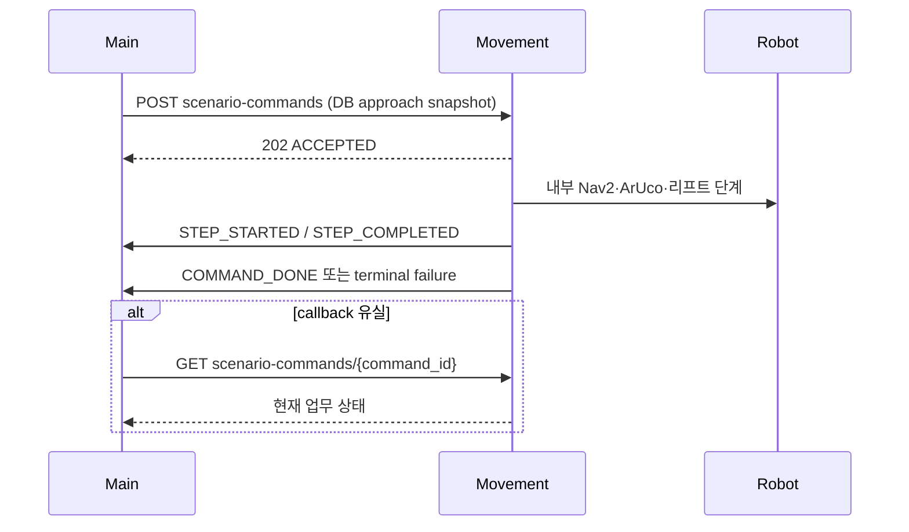

# Movement Server Integration Requirements

상태: Active
주 독자: Movement 서버 개발자
보조 독자: Main 개발자·통합 QA
난이도: 연동
소유: Main·Movement Integration
최종 갱신: 2026-07-16 20:50 KST
구현 기준: Main Scenario API v1 client·callback schema·orchestrator
목적: Movement가 현재 Main 구현과 동일한 실행·callback·중지·재전송 의미를 구현하기 위한 전달 요구서.

자동 입고·출고의 필드 전체 정본은 [Main ↔ Movement Scenario API Contract](MOVEMENT_SCENARIO_API_CONTRACT.md)다.
이 문서는 Movement 구현자가 반드시 제공할 동작과 배포 점검만 요약한다. 일반 수동 이동과 ESTOP 계약은
[INTERFACES](INTERFACES.md)를 따른다.

## 1. 필수 API

| 방향 | Method·path | 요구 동작 |
| --- | --- | --- |
| Main → Movement | `POST /movement-api/v1/scenario-commands` | 한 요청으로 입출고 전체 실행 |
| Main → Movement | `GET /movement-api/v1/scenario-commands/{command_id}` | callback 유실 상태 보정 |
| Main → Movement | `POST /movement-api/v1/scenario-commands/{command_id}/safe-stop` | 멱등 안전 중지 |
| Movement → Main | `POST /api/v1/movement/command-events` | 9개 업무 단계와 terminal callback |
| Movement → Main | `POST /api/v1/movement/robots/{robot_name}/status` | pose·ESTOP·온라인 상태 보고 |

Movement의 robot별 기본 주소는 `tb3_1=:8001`, `tb3_2=:8002`이며 `/movement-api/v1`을 base로 사용한다.
Main callback 기본 주소는 다음과 같다.

```text
http://smartfactory-main.local:8088/api/v1/movement/command-events
```

## 2. Scenario 실행 책임



Movement는 요청의 `pickup/dropoff.approach` 좌표까지 이동한 뒤 자체 profile로 다음을 결정한다.

- ArUco marker와 탐색·정렬 정책
- 정밀 접근 거리·속도·허용 오차·timeout
- 층별 리프트 높이와 load/unload 순서
- 삽입·후진·대기·주차와 최종 화물 확인

Main request에 이 물리값이 없다는 이유로 기본 동작을 생략하면 안 된다. `location_id`,
`approach.waypoint_id`, `floor` 조합의 profile이 없으면 실행 전에 `409 waypoint_profile_missing` 또는
`409 floor_profile_missing`으로 거부한다.

## 3. 업무 단계 callback

Movement 내부 물리 step 수와 무관하게 Main에는 다음 index와 code만 보고한다.

| index | code | 완료 의미 |
| ---: | --- | --- |
| 0 | `LEAVE_HOME` | 대기 위치 이탈 |
| 1 | `PICKUP_APPROACH` | pickup 접근점 도착 |
| 2 | `PICKUP_ALIGN` | 적재 정렬·삽입 완료 |
| 3 | `LOAD` | 적재 확인·안전 후진 완료 |
| 4 | `TRANSPORT` | dropoff 접근점 도착 |
| 5 | `DROPOFF_ALIGN` | 하역 정렬·삽입 완료 |
| 6 | `UNLOAD` | 하역 확인·안전 후진 완료 |
| 7 | `RETURN_HOME` | 기본 대기 접근점 도착 |
| 8 | `PARK` | 주차·제어권 반환 완료 |

`current_step_action`에는 내부 물리 동작을 진단용으로 보낼 수 있지만 Main의 상태 전이에 사용되지 않는다.
단계 callback은 `current_step_index`와 `current_step_code`가 정확히 일치해야 한다. `sequence`와
`last_completed_step_index`는 모든 callback에 반드시 포함한다. 완료된 단계가 없으면 명시적 `null`, 첫 완료 이후에는 `0..8`을 보내며 값은 감소할 수 없다.

## 4. 화물·완료·실패 보고

- LOAD 완료 callback: `STEP_COMPLETED`, index `3`, code `LOAD`, `cargo_state=LOADED`.
- UNLOAD 완료 callback: `STEP_COMPLETED`, index `6`, code `UNLOAD`, `cargo_state=EMPTY`,
  `business_completed=true`.
- Main은 위 UNLOAD callback에서만 재고를 한 번 반영한다.
- LOAD 이후 UNLOAD 이전 실패는 `cargo_state=LOADED`로 보고한다. Main은 `AWAITING_OPERATOR`로 유지한다.
- 화물 판정이 불가능하면 `UNKNOWN`을 보내며 자동 재개하지 않는다.
- UNLOAD 이후 복귀·주차 실패도 `business_completed=true`, `cargo_state=EMPTY`를 유지한다.
- `COMMAND_DONE`은 PARK 8, EMPTY, business 완료, navigator IDLE, ESTOP 해제, Main 권한 반환이 모두 확인된
  경우에만 보낸다.

terminal callback에는 `navigator_status`, `is_emergency`, `authority_owner`, `authority_released`가 필수다.

## 5. 멱등성과 재전송

- `Idempotency-Key`와 `command_id`는 같다.
- 같은 ID·같은 body는 기존 실행을 반환하고 로봇 동작을 추가하지 않는다.
- 같은 ID·다른 body는 `409 command_id_payload_mismatch`다.
- callback은 durable outbox에 먼저 저장한다.
- Main의 `2xx` ACK 전까지 같은 `event_id`·`sequence`로 재전송한다.
- 권장 backoff는 1초, 2초, 5초, 10초, 이후 최대 30초다.
- `200 duplicate=true`도 성공 ACK다.
- `401`·`422`는 설정·schema 오류로 분류하고 무한 반복하지 않는다.

## 6. Safe-stop

safe-stop body는 `request_id`, `reason`, `requested_by`를 받으며 같은 `request_id`는 한 번만 처리한다.
접수 응답은 `accepted=true`, 원래 `command_id`, 같은 `request_id`, `state=STOP_REQUESTED`를 반환한다.

Movement는 Nav goal 취소, 실제 속도 0, 리프트 안전 상태를 확인한 뒤에만 `COMMAND_STOPPED`를 보낸다.
Movement가 실행을 수락했지만 물리 동작 전이면 `COMMAND_CANCELLED`도 가능하다. 중지 이후 남은 step을 자동으로
재개하면 안 되며 재실행은 새 `command_id`를 사용한다.

## 7. 인증과 ACK

Movement는 모든 callback에 다음 헤더를 전송한다.

```http
X-Movement-Callback-Token: <shared-secret>
```

양쪽에 같은 비어 있지 않은 `LMS_MOVEMENT_CALLBACK_TOKEN`을 설정한다. Main 성공 ACK 형식은 다음과 같다.

```json
{
  "ok": true,
  "message": "movement command event saved",
  "duplicate": false,
  "task_advanced": true
}
```

## 8. 공동 인수 기준

배포 전 다음을 양쪽 동일 fixture로 검증한다.

- 요청 예시가 양쪽 schema를 통과하고 물리 튜닝 필드가 없음
- 한 POST로 전체 입고·출고가 각각 실행됨
- 9개 업무 단계가 순서대로 시작·완료됨
- LOAD 이후 실패가 `AWAITING_OPERATOR`로 남음
- UNLOAD callback 중복에도 재고가 한 번만 변경됨
- callback 차단 후 GET 조회로 같은 상태에 수렴함
- safe-stop이 실제 정지 후 terminal callback을 보냄
- PARK 완료 Gate 전에는 Main Task가 완료되지 않음
- 삭제된 구형 route·preview·result endpoint에 의존하지 않음

상세 시험 ID와 JSON 예시는 [Scenario API Contract §15](MOVEMENT_SCENARIO_API_CONTRACT.md#15-공동-인수-체크리스트)를
따른다.
