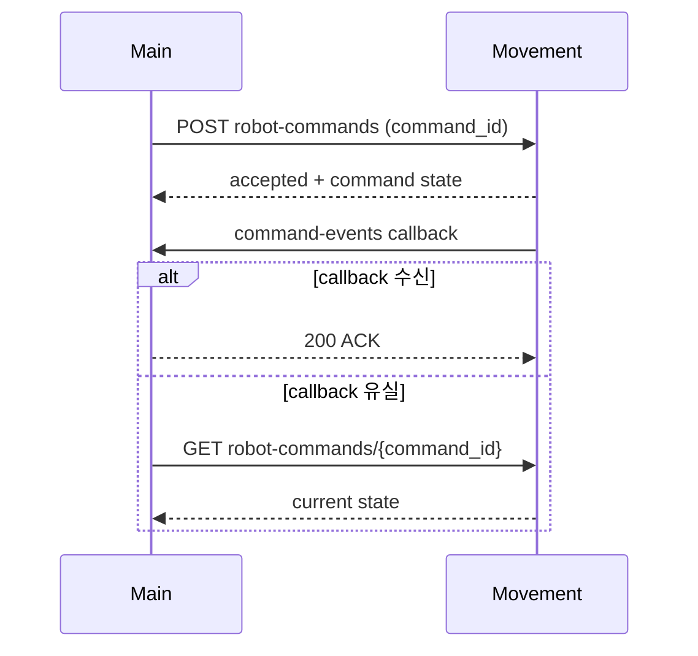
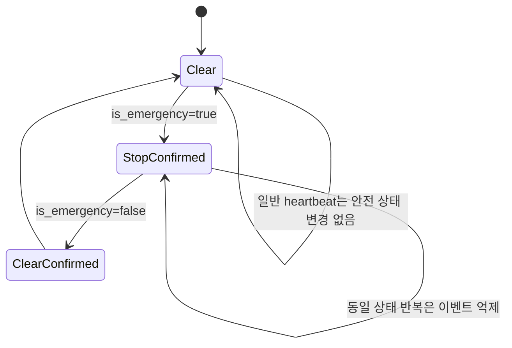

# Movement Callback API Integration Requirements

상태: Active
주 독자: Movement 서버 개발자
보조 독자: Main 개발자·통합 QA
난이도: 연동
소유: Main·Movement Integration
최종 갱신: 2026-07-16 16:00 KST
구현 기준: Main의 Movement callback schema·router·orchestrator
목적: 현재 Main 구현을 기준으로 Movement 서버의 명령 callback·상태 보고·재전송 계약을 맞추기 위한 전달 명세.

이 문서는 현재 구현된 callback API의 정본이다. 전체 서버 간 계약은 [INTERFACES](INTERFACES.md), Main의
브라우저 API는 [API](API.md)를 따른다. Movement/base watchdog과 향후 message broker 설계는 이 문서 범위가 아니다.

## 1. 통신 방향과 기준 주소

| 방향 | Method·path | 용도 |
| --- | --- | --- |
| Main → Movement | `POST /robot-commands` | canonical command 접수 |
| Main → Movement | `GET /robot-commands/{command_id}` | callback 누락 보정용 상태 조회 |
| Main → Movement | `POST /robot-commands/{command_id}/cancel` | 실행 command 취소 |
| Movement → Main | `POST /api/v1/movement/command-events` | canonical command lifecycle callback |
| Movement → Main | `POST /api/v1/movement/results` | legacy result callback |
| Movement → Main | `POST /api/v1/movement/robots/{robot_name}/status` | robot 상태·pose 보고 |

Main 기준 기본 주소:

```text
http://smartfactory-main.local:8088
```

Main은 command body의 `callback_url`로 실제 callback 주소를 전달한다. Movement는 주소를 자체 조합하지 않고
전달받은 값을 우선 사용한다.

```text
http://smartfactory-main.local:8088/api/v1/movement/command-events
```

Main은 callback URL에 `http` 또는 `https` scheme과 명시적 host를 요구하며 userinfo·query·fragment는 허용하지 않는다.

## 2. Main → Movement command 연결



Main은 다음 두 값을 동일하게 전송한다.

```http
Idempotency-Key: task-342-tb3_2-inbound2-20260714T110000123456
```

```json
{
  "command_id": "task-342-tb3_2-inbound2-20260714T110000123456",
  "robot_id": "tb3_2",
  "robot_name": "tb3_2",
  "task_id": 342,
  "kind": "move_to_point",
  "dry_run": false,
  "params": {
    "waypoint_id": "inbound_slot_2_approach"
  },
  "callback_url": "http://smartfactory-main.local:8088/api/v1/movement/command-events"
}
```

Movement 요구사항:

- 같은 `command_id`·같은 payload 재요청은 새 goal을 만들지 않고 기존 command 상태를 반환한다.
- 같은 `command_id`·다른 payload는 `409`로 거부한다.
- `GET /robot-commands/{command_id}`는 callback과 같은 상태 문자열과 슬롯 waypoint의 `step_actions`를 반환한다.
- 슬롯 waypoint는 `nav2_pose, aruco_align(0.4m), wait(3s), aruco_align(0.2m, straight_insert)` 순서로 확장하고 최종 상태를 `ARRIVED`로 보낸다.
- cancel 재요청도 새 동작을 만들지 않는 멱등 API여야 한다.

## 3. Canonical command callback

```http
POST /api/v1/movement/command-events HTTP/1.1
Content-Type: application/json
X-Movement-Callback-Token: <shared-token>
```

### 3.1 Request schema

| 필드 | 형식 | 필수 | 현재 Main 처리 |
| --- | --- | --- | --- |
| `command_id` | non-empty string | 예 | command·현재 Step 상관관계 확인 |
| `robot_name` 또는 `robot_id` | non-empty string | 둘 중 하나 | Task 배정 robot 확인 |
| `event` 또는 `state` | non-empty string | 둘 중 하나 | command lifecycle 상태로 사용 |
| `task_id` | integer ≥ 1 | 아니요 | 없으면 `command_id`로 Task 검색 |
| `message` | string | 아니요 | 감사 event 설명에 저장 |
| `reported_at` | RFC 3339 datetime | 아니요 | 원본 callback 시각 보존 |
| `event_id` | non-empty string | 권장 | callback 재전송 중복 확인 |
| `sequence` | integer ≥ 0 | 권장 | 현재 Step의 역행·중복 상태 차단 |
| `pose` | object | 아니요 | 원본 payload에 보존 |
| 그 외 필드 | JSON | 허용 | Pydantic `extra=allow`, 원본 payload 보존 |

권장 lifecycle 상태:

```text
move_to_point: ACCEPTED → RUNNING → ARRIVED
other command: ACCEPTED → RUNNING → DONE
                   ↘ FAILED | ABORTED | REJECTED | CANCELLED | STOPPED
```

요청 예시:

```json
{
  "command_id": "task-42-tb3_1-move_to_point-001",
  "robot_name": "tb3_1",
  "task_id": 42,
  "event": "ARRIVED",
  "message": "precision waypoint completed",
  "reported_at": "2026-07-14T08:05:30Z",
  "event_id": "tb3_1:task-42-tb3_1-move_to_point-001:3",
  "sequence": 3
}
```

### 3.2 Success ACK

```json
{
  "ok": true,
  "message": "movement command event saved",
  "duplicate": false,
  "task_advanced": true
}
```

| 필드 | 의미 |
| --- | --- |
| `ok` | callback API 처리 성공 |
| `message` | 처리 결과 설명 |
| `duplicate` | 같은 `event_id`가 이미 저장됐는지 여부. legacy result는 command/result/reported_at 합성 키 사용 |
| `task_advanced` | 이 callback으로 Task Step 또는 recovery 상태가 실제 변경됐는지 여부 |

`task_advanced=false`는 callback 실패를 뜻하지 않는다. `ACCEPTED`·`RUNNING`, 이미 terminal인 Step, robot·command
불일치 또는 현재 Task와 관계없는 callback도 정상 저장 후 `false`일 수 있다.

### 3.3 HTTP status

| status | 의미 | Movement 처리 |
| --- | --- | --- |
| `200` | 저장·처리 또는 중복 확인 완료 | ACK 확인 후 해당 사건 재전송 종료 |
| `200 duplicate=true` | 같은 `event_id`가 이미 처리됨 | 성공으로 확정하고 재전송 종료 |
| `401` | callback token 누락·불일치 | 설정 수정 전 무한 재시도 금지 |
| `422` | 필수 필드·형식 오류 | payload 수정 후 새 요청 |
| `5xx` 또는 network 오류 | Main 처리 완료 여부 불명 | 같은 `event_id`·`sequence`로 backoff 재전송 |

## 4. Legacy result callback

신규 Movement 구현은 canonical `/movement/command-events`를 사용한다. 아래 API는 기존 연동 호환용이다.

```http
POST /api/v1/movement/results
```

필드:

| 필드 | 형식 | 필수 |
| --- | --- | --- |
| `command_id` | non-empty string | 예 |
| `robot_name` 또는 `robot_id` | non-empty string | 둘 중 하나 |
| `result` | non-empty string | 예 |
| `task_id` | integer ≥ 1 | 아니요 |
| `message` | string | 아니요 |
| `reported_at` | RFC 3339 datetime | 아니요 |
| `event_id` | non-empty string | 권장 |
| `sequence` | integer ≥ 0 | 권장 |

Main 정규화:

| result | canonical event |
| --- | --- |
| `OK`, `SUCCESS`, `SUCCEEDED`, `COMPLETED` | `DONE` |
| `CANCELED` | `CANCELED` |
| `CANCELLED` | `CANCELLED` |
| `STOPPED` | `STOPPED` |
| `ABORTED` | `ABORTED` |
| `FAILED` | `FAILED` |
| `REJECTED` | `REJECTED` |

ACK 형식과 인증·재전송 규칙은 canonical callback과 동일하다.

## 5. Robot status callback



```http
POST /api/v1/movement/robots/{robot_name}/status HTTP/1.1
Content-Type: application/json
X-Movement-Callback-Token: <shared-token>
```

Robot identity는 URL의 `{robot_name}`에서 결정한다.

| 필드 | 형식 | 필수 | 의미 |
| --- | --- | --- | --- |
| `state` | string | 조건부 | idle·navigating·error 등 |
| `current_command_id` | string 또는 null | 조건부 | 현재 실행 command |
| `localized` | boolean | 조건부 | localization 유효 여부 |
| `is_emergency` | boolean | 조건부 | 실제 로봇 ESTOP 상태. Main 안전 latch 정합화 입력 |
| `pose` | object | 조건부 | `frame_id`, `x`, `y`, `yaw`, 선택 `source`·`reported_at` |
| `reported_at` | RFC 3339 datetime | 아니요 | status 발생 시각 |
| 그 외 필드 | JSON | 허용 | 원본 status event에 보존 |

`state`, `current_command_id`, `localized`, `pose`, `is_emergency` 중 하나 이상이 있어야 한다. `pose`가 있고 `localized`가
명시적으로 `false`가 아니면 Main의 최신 robot pose에 반영한다.

요청 예시:

```json
{
  "state": "navigating",
  "current_command_id": "task-42-tb3_1-move_to_point-001",
  "localized": true,
  "is_emergency": false,
  "pose": {
    "frame_id": "map",
    "x": 1.15,
    "y": 3.31,
    "yaw": 1.55,
    "reported_at": "2026-07-14T08:05:29Z"
  },
  "reported_at": "2026-07-14T08:05:29Z"
}
```

성공 ACK:

```json
{
  "ok": true,
  "message": "movement robot status saved"
}
```

현재 status callback에는 `event_id` 중복 ACK가 없다. 다만 같은 `is_emergency` 확인 상태는 Main이 이벤트
중복 저장을 억제한다. 상태 변화 즉시 전송하고 주기 보고가 필요하면 1초 이내를 권장한다.
`current_command_id`는 실제 실행 command와 일치시키고 terminal 이후 비운다.

`is_emergency=true`는 정지 확인, `false`는 해제 확인으로 사용한다. 해제 확인은 작업 재개 지시가 아니며
Movement와 Main 모두 기존 command를 자동 재개해서는 안 된다.

## 6. 인증 설정

Main 환경 변수:

```env
LMS_MOVEMENT_CALLBACK_TOKEN=<shared-secret>
```

세 callback API 모두 `X-Movement-Callback-Token`을 같은 방식으로 검사한다. Main 설정값이 비어 있으면 현재
개발 호환 모드에서는 인증을 생략한다. 실장비·릴리즈 인수에서는 Main과 Movement에 같은 non-empty token을
설정한다.

## 7. Main 내부 적용 규칙

현재 Main은 callback을 다음 순서로 처리한다.

1. HTTP token과 request schema 검증
2. DB transaction 시작
3. `event_id`가 있으면 기존 callback event 조회
4. callback 원본을 operational event로 저장
5. `task_id` 또는 `command_id`로 대상 Task 확인
6. 배정 robot과 callback robot 비교
7. 현재 Step의 `command_id` 비교
8. Task별 advisory lock 획득
9. `sequence` 역행과 terminal Step 재적용 차단
10. Step·Task·recovery 상태 변경 후 transaction commit
11. ACK 반환

robot 또는 command가 현재 Task와 일치하지 않으면 감사 event는 남지만 Task는 전진하지 않는다. DB 저장이나
상태 변경이 실패하면 transaction이 rollback되고 Movement는 `5xx` 또는 연결 오류로 판단해 같은 사건을 재전송한다.

중단 요청 상태가 `CANCEL_REQUESTED`이면 Movement의 `CANCELLED`, `CANCELED`, `STOPPED`, `ABORTED` callback을
다음처럼 적용한다.

- 비적재 상태: Task `CANCELLED`
- 적재 상태: Task는 `RUNNING`, orchestration은 `AWAITING_OPERATOR`
- 물류 업무 완료 후 복귀·주차 중단: 업무 `DONE` 유지, parking failure 기록

## 8. Callback 유실 보정

Main은 약 5초마다 실행 중 command에 다음 API를 호출한다.

```http
GET /robot-commands/{command_id}
```

Movement 상태가 terminal이면 callback과 같은 Execution 전진 함수를 사용한다. callback과 poller가 동시에 같은
terminal 상태를 확인해도 Task lock과 terminal-Step 검사로 업무 상태는 한 번만 변경된다.

Movement의 상태 조회 응답은 callback과 동일한 `command_id`와 상태 의미를 반환해야 한다.

## 9. 현재 구현 제한

- `event_id`와 `sequence`는 현재 권장값이며 필수 필드는 아니다.
- `event_id` 중복 확인은 애플리케이션 조회 방식이며 DB unique constraint는 아직 없다.
- 완전히 동시에 도착한 동일 callback은 Task를 한 번만 전진시키지만 감사 event가 중복 저장될 가능성이 있다.
- Robot status callback에는 별도 event ID·중복 ACK가 없다.
- Main의 fleet ESTOP outbound request ID는 현재 Main 이벤트 상관관계용이며 Movement 요청 body에는 아직 포함되지 않는다.
- `/movement/results`는 legacy 호환 API이며 신규 구현의 기준이 아니다.
- Callback URL 등록 API는 없고 Main이 command body에 전달하는 `callback_url`을 사용한다.

## 10. 공동 인수 테스트

| 시험 | 통과 조건 |
| --- | --- |
| 같은 command POST 2회 | Movement goal 1개, 기존 command 상태 반환 |
| 같은 command ID·다른 payload | Movement `409` |
| canonical callback 정상 | Main `200`, event 저장, terminal이면 `task_advanced=true` |
| 필수 robot 또는 state 누락 | Main `422` |
| token 누락·오류 | Main `401` |
| 같은 `event_id` 2회 | 두 번째 `200 duplicate=true`, Task·재고 1회 변경 |
| 작은 `sequence` 재전송 | Main 상태가 과거로 되돌아가지 않음 |
| 다른 robot callback | event는 남고 `task_advanced=false` |
| 다른 command callback | event는 남고 `task_advanced=false` |
| Main `5xx` 후 재전송 | 동일 event ID로 최종 `200` 수신 |
| callback 차단 | 약 5초 poller가 terminal 상태 복구 |
| cancel terminal callback | cargo 상태에 따라 `CANCELLED` 또는 `AWAITING_OPERATOR` |
| Robot status callback | pose·status event 저장, `200` ACK |
| Robot ESTOP status callback | `is_emergency=true/false`에 따라 Main latch와 확인 이벤트가 수렴 |
| Main 재시작 | Movement command 조회로 실행 상태 수렴 |
| Main 재시작(ESTOP) | 마지막 ESTOP 수명주기 이벤트로 로봇별 latch 복원, 작업 자동 재개 없음 |

시험 결과에는 Main·Movement 시각, robot ID, task ID, command ID, event ID, sequence, HTTP status와 양쪽 최종
상태를 함께 기록한다.
