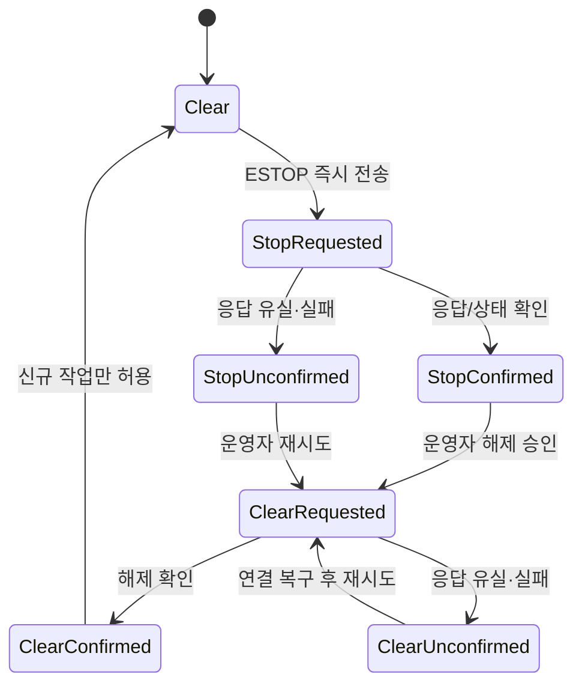

# Operations

상태: Active
주 독자: 배포·운영 담당자
보조 독자: 현장 관리자·Backend 개발자
난이도: 운영
소유: Ops
최종 갱신: 2026-07-16 16:00 KST
구현 기준: scripts/run_main.sh·check.sh·db.sh와 현재 Main 상태 API
목적: 실서버 실행·검증·ESTOP 복구와 추가 개발 정책의 단일 정본.

Main은 PostgreSQL과 실제 Movement·Vision 서버만 사용한다. fake/mock 서버 실행 경로는 제공하지 않는다.
시스템 구조는 [ARCHITECTURE](ARCHITECTURE.md), 외부 계약은
[INTERFACES](INTERFACES.md)를 따른다.

## 1. 준비와 실행

IP·hostname·timeout은 코드에 넣지 않고 `main_server/.env`에서 관리한다.
현재 개발 정책은 호스트에 설치한 PostgreSQL 16을 `localhost:5432`에서 사용한다. 컨테이너 기반
개발·배포 환경은 브랜치 통합 후 별도 릴리스 작업에서 구성한다.

실장비 릴리즈에서는 Main과 Movement의 `LMS_MOVEMENT_CALLBACK_TOKEN`을 같은 비어 있지 않은 값으로 설정한다.
Movement는 callback마다 `X-Movement-Callback-Token`을 보내며, 활성 여부는
`GET /api/v1/system/external-config`의 `movement.callback_auth_required`로 확인한다.

```bash
cd main_server
cp .env.example .env                 # 최초 1회, 현장 값 확인
bash ./scripts/bootstrap.sh               # 의존성·로컬 PostgreSQL 준비
bash ./scripts/run_main.sh --dev          # Main + Vite 개발 서버
bash ./scripts/run_main.sh --build        # Frontend build 후 Main 서빙
bash ./scripts/run_main.sh --stop         # 실행 중인 로컬 Main 종료
```

주요 진입점은 다음 4개다.

| 목적 | 진입점 |
| --- | --- |
| 최초 환경 준비 | `scripts/bootstrap.sh` |
| Main 서버 실행 | `scripts/run_main.sh` |
| 검증 | `scripts/check.sh` |
| PostgreSQL 관리 | `scripts/db.sh` |

`bootstrap.sh`는 로컬 PostgreSQL 서비스 자체를 설치하지 않는다. 서비스가 준비된 PC에서 최초 한 번
`scripts/db.sh`의 `setup` 하위 명령을 실행하면 `lms` 사용자·`lms_mvp` DB·스키마를 준비하고 `.env`를 갱신한다.

확인:

```bash
curl http://localhost:8088/health
curl http://localhost:8088/ready
curl http://localhost:8088/api/v1/status
```

### DB migration과 맵 기준 데이터

```bash
bash ./scripts/db.sh status
bash ./scripts/db.sh migrate
bash ./scripts/db.sh reference-verify
bash ./scripts/db.sh reference-export --output /tmp/robot2_map.review.json
bash ./scripts/db.sh reference-sync
```

좌표 최초 등록은 연결된 현장 DB를 `reference-export`로 별도 파일에 내보낸 뒤 검토하고,
승인된 `locations`만 `database/reference/robot2_map.json`에 반영한다. 이 파일과 맵 YAML·PGM은
항상 같은 커밋으로 배포한다. `reference-sync`는 manifest에 명시된 좌표만 upsert하며 다른 행은 삭제하지 않는다.
manifest는 `inbound_slot_1_pre_approach` 하나만 독립 `transit`으로 관리하고, Movement의 approach 10개는
어떤 업무 위치에도 연결하지 않은 `scan` 마커로 관리한다. scan 위치 ID는 Movement의 `waypoint_id`와 동일하다.
업무용 inbound·outbound·storage·home 위치를 다시 연결하기 전까지 입출고 작업 생성은 사용할 수 없다.
스키마 변경 전에는 `bash ./scripts/db.sh dump`로 백업하고, 이미 적용된 migration SQL은 수정하지 않는다.

Main 8088, Movement, Vision, PostgreSQL listener가 없으면 실서버 E2E는 실행할 수 없다. 이 경우 로컬 gate를
먼저 실행하고, 환경이 준비된 뒤 operator·입고·출고·ESTOP 복구 시나리오를 검증한다.

## 2. 검증

```bash
cd main_server
bash ./scripts/check.sh docs
bash ./scripts/check.sh hygiene
bash ./scripts/check.sh backend
bash ./scripts/check.sh frontend
bash ./scripts/check.sh db          # 전용 PostgreSQL test DB 필요
bash ./scripts/check.sh operator    # 실행 중인 실제 Main 필요, 기본 read-only
bash ./scripts/check.sh robot --dry-run # 실장비 시나리오와 통과 조건 확인
bash ./scripts/check.sh all         # 로컬 gate 후 PostgreSQL integration
```

- `check.sh db`는 `<database>_test` 전용 DB를 준비하고 mutable fixture를 적용한다.
- `check.sh pg`에 운영 DB URL을 넘길 때는 이름에 `_test`가 없으면 기본적으로 거부한다.
- `LMS_ALLOW_MUTABLE_DB_TESTS=1`은 폐기 가능한 DB에서만 사용한다.
- `check.sh operator`의 변경 검사는 `LMS_VERIFY_MUTATING=1`과 mutable DB 허용을 모두 요구한다.
- Frontend gate는 TypeScript typecheck, ESLint, Vite production build를 실행한다.
- 실장비 Movement·Vision 연동은 `check.sh robot`의 현장 인수 단계에서 최종 검증한다.

### 실로봇 인수 실행

```bash
bash ./scripts/check.sh robot \
  --robot-id tb3_2 \
  --operator "검증자 이름" \
  --api-base http://smartfactory-main.local:8088/api/v1 \
  --ui-base http://smartfactory-main.local:8088
```

기본 실행은 로컬 전체 gate 후 Main `/health`·`/ready`, 운영 API, Movement와 Vision 강제 probe,
callback token을 확인한다. 그 다음 [TEST_CASES](TEST_CASES.md)의 HW-01~12을 순서대로 안내하고
각 단계 전후의 API snapshot을 `.bootstrap/robot-acceptance/`에 저장한다. 이 경로는 로컬 증적이므로 Git에
추가하지 않는다. ESTOP·서버 단절·재시작·로봇 이동은 스크립트가 실행하지 않으며 현장 안전 책임자가 수행한다.

`--preflight-only`는 장비 준비 상태만 확인하고 모든 HW 판정을 `UNVERIFIED`로 남긴다. 전체 인수 실행은
FAIL 또는 `UNVERIFIED`가 하나라도 있으면 종료 코드 1을 반환한다. `--skip-local`은 같은 commit의
`check.sh all` 결과가 별도 보존된 경우에만 사용한다.

## 3. ESTOP 복구



ESTOP은 전 로봇을 선점 중단하며 해제 후에도 task를 자동 재개하지 않는다. 단순 Movement 오프라인과
ESTOP 미확인은 별개다. 정지/해제 요청 이력이 있는 미확인 로봇만 개별 격리하고 다른 로봇은 계속 운영한다.

1. 사람·장애물 등 현장 위험을 제거한다.
2. 관제 복구 패널 또는 `GET /tasks/recovery/awaiting-operator`에서 대상 task를 확인한다.
3. Movement health, active map, localization, cargo 상태를 확인한다.
4. 헤더에서 ESTOP 해제를 확인한다. Main은 stale health와 무관하게 모든 enabled 로봇에 해제를 시도한다.
5. `해제 미확인` 로봇은 현장 상태와 Movement 연결을 확인한 뒤 해당 표시에서 재시도한다.
6. cargo 상태와 복구 전략을 선택하고 preview 후 execute한다.
7. `RECOVERY_RUNNING` 이후 결과와 재고·로봇 후처리 상태를 확인한다.

`GET /api/v1/status`의 `system.estop_summary.robot_states`에서 로봇별 상태를 확인한다. Main 재시작은
`evidence_events`의 마지막 ESTOP 수명주기 이벤트로 latch를 복원한다. 소프트웨어 상태를 임의로 초기화하는
관리 API는 현재 제공하지 않으며, 실제 `is_emergency=false` 콜백 또는 해제 성공 응답으로만 clear한다.

운영 UI가 제공하는 복구 방식은 `safe_move`(설정된 `LMS_RECOVERY_SAFE_LOCATION_ID` HOME으로 이동)과
`manual_abort`(정지 확인 후 작업 종료·수동 회수) 두 가지다. 안전 위치 이동은 자동 하역이나 기존 작업 재개를
수행하지 않으며 완료 후 다시 운영자 확인을 기다린다. 물류 완료와 HOME 복귀·주차 상태는 분리하므로 목적지 하역 후 복귀 실패가 이미 확정된
재고를 되돌리지 않는다.

## 4. Movement 동기화 진단

| 증상 | 우선 확인 |
| --- | --- |
| `robot_online=false` | Movement bringup·네트워크·ROS domain |
| `command_accepting=false` | emergency·offline·busy 상태 |
| `localized=false` 또는 pose 없음 | initial pose·AMCL·Movement pose API |
| active map mismatch | runtime map id·origin·resolution·width·height |
| callback 없음 | Main callback URL·방화벽; command status polling 보정 여부 |
| command가 `ACCEPTED`에 고정 | Nav2 상태와 Movement command event |

Main 진단 표면은 `/movement/map-state`, `/movement/sync-status`, `/movement/runtime-map-context`,
`/robots/{id}/localization`, `/robots/{id}/nav-state`, `/movement/commands/{id}/trace`다. mismatch 상태에서도 배경은
유지하고 이동 전 좌표계 경고를 확인한다. 명령은 Movement runtime active map을 기준으로 한다.

## 5. 릴리스 체크리스트

- [ ] 운영 .env의 DB·Movement·Vision 주소와 timeout을 확인했다.
- [ ] `bash ./scripts/check.sh all`이 통과했다.
- [ ] `bash ./scripts/db.sh dump`로 배포 전 DB를 백업했다.
- [ ] 맵 YAML·PGM과 database/reference/robot2_map.json을 같은 버전으로 확정했다.
- [ ] 소프트웨어 ESTOP과 하드웨어 안전회로의 범위를 운영자에게 안내했다.
- [ ] [TEST_CASES](TEST_CASES.md)의 실장비 인수 항목을 확인했다.
- [ ] 서버 재시작 후 진행 task와 Movement 명령 상태를 확인했다.
- [ ] 알려진 제한사항과 미검증 항목을 릴리스 노트에 남겼다.

## 6. 장애 · 롤백 · 보안 경계

`/health`는 Main 프로세스 생존, `/ready`는 DB와 worker 준비, `/api/v1/status`는 로봇·외부 연동을 포함한
운영 snapshot이다. 장애 판단에서 세 응답을 서로 대체하지 않는다.

| 상황 | 우선 조치 | 보존할 증거 |
| --- | --- | --- |
| Main 응답 없음 | 프로세스 로그·포트·`/health` 확인 후 재시작 | 발생 시각, 배포 commit, stderr |
| DB 준비 실패 | PostgreSQL 상태·URL·migration 확인 | `/ready` 응답, migration status, DB 로그 |
| Movement/Vision 장애 | Main은 유지하고 해당 조작 차단·진단 | robot/command/task ID, upstream 응답·timeout |
| 배포 회귀 | 이전 애플리케이션 commit으로 롤백 | 실패 gate, 변경 diff, DB migration 버전 |
| DB 손상·오배포 | 쓰기 중단 후 승인된 snapshot 복원 검토 | snapshot 시각·checksum, 복원 대상, row 검증 결과 |

DB migration은 이전 SQL을 수정해 되돌리지 않고 forward fix를 우선한다. snapshot 복원은 이후 데이터를 잃을 수 있어
현장 책임자 승인과 영향 확인 후 `scripts/db.sh`의 `restore`로 수행한다. `.env`와 DB dump는 Git에 올리지 않는다.
Movement callback에는 선택적 shared token 검증이 있다. 운영자 API의 인증/RBAC·TLS·중앙 alert는 제공하지 않으므로
외부망 공개 배포 전 별도 구성하고, callback token도 비어 있지 않은지 확인한다.

## 7. 변경 규칙

- Backend 업무 코드는 `backend/app/domains/<domain>`, Frontend 업무 UI는 `frontend/web/src/domains/<domain>`이 소유한다.
- API 계약 변경은 API 또는 INTERFACES, DB 변경은 DBML과 새 migration부터 갱신한다.
- 배포된 migration SQL을 수정하지 않고 새 번호를 추가한다.
- fake/mock 서버와 수동 명령 시험 화면을 운영 메뉴에 추가하지 않는다.
- 새 문서는 기존 정본에 넣을 수 없는 독립 책임이 있을 때만 만든다.
- 변경 후 관련 `check.sh` gate와 `git diff --check`를 실행한다.

## 관련

- [ARCHITECTURE](ARCHITECTURE.md)
- [Database](DATABASE.md)
- [INTERFACES](INTERFACES.md)
- [API](API.md)
- [UX](UX.md)
