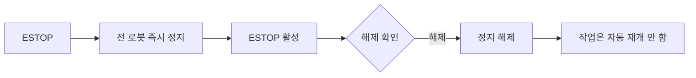
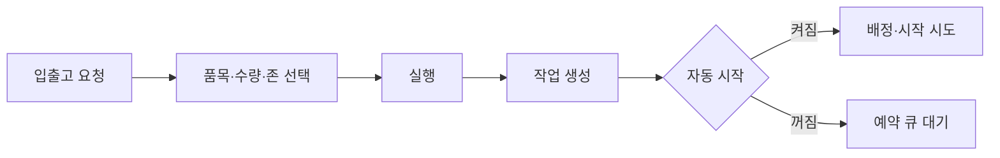
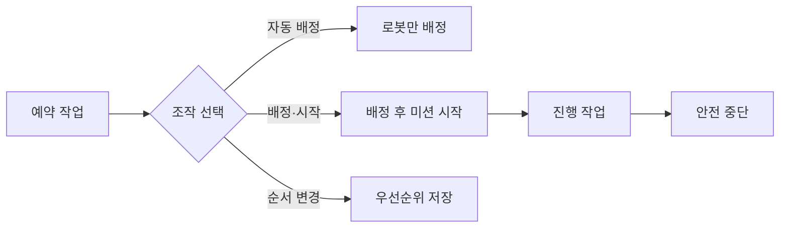
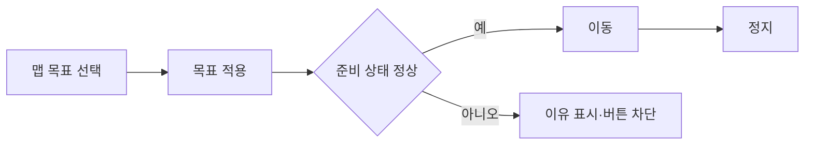
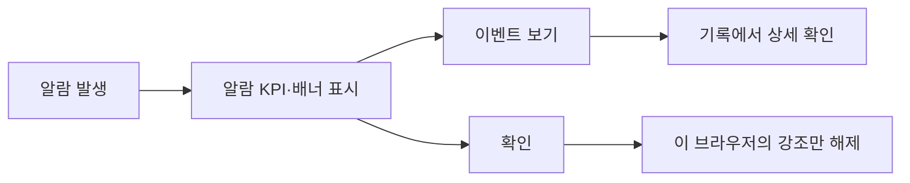

# 운영자 버튼 빠른 안내

상태: Active  
소유: Frontend  
최종 갱신: 2026-07-15 KST  
목적: 운영 화면의 주요 버튼과 소기능을 약 15초 안에 훑고, 필요할 때 흐름을 바로 확인한다.

## 15초 요약

| 버튼·기능 | 하는 일 | 주의 |
| --- | --- | --- |
| `ESTOP` | 전 로봇 즉시 정지 | 해제만 확인창 표시 |
| `입출고 요청` → `실행` | 작업 생성, 기본값은 자동 시작 | 대기 시 5초 주기로 시작 재시도 |
| `자동 배정` / `배정·시작` | 배정만 / 배정 후 즉시 시작 | 후자는 여러 작업을 움직일 수 있음 |
| `안전 중단` / `취소` | 실행 중 정지 / 시작 전 취소 | 적재물이 있으면 복구 필요 |
| 방향키·WASD | 누르는 동안 수동 이동 | 패널을 열면 키보드 조작 활성 |
| `이동` / `정지` | 맵 목표로 이동 / 현재 이동 정지 | 정지는 작업 취소가 아님 |
| `단계 미리보기` / 복구 실행 | 복구 경로 확인 / 복구 수행 | 현장·자세·적재 확인 필요 |
| 알람 `확인` | 현재 알람 강조를 로컬에서 해제 | 장애 해결이나 서버 확인 처리가 아님 |

## 기능별 흐름

### 1. ESTOP

### 2. 입출고 요청

`실행 전 계획`은 현재 슬롯·층·존 요약만 보여주며, Movement의 전체 세부 단계는 이 폼에 표시하지 않는다.

### 3. 작업 큐

행의 `배정`·`시작`은 해당 작업에만 적용한다. `취소`는 시작 전, `안전 중단`은 실행 중에 사용한다.

### 4. 수동 조작

가운데 `■`은 즉시 정지다. 창이 포커스를 잃거나 포인터가 취소돼도 정지를 전송한다.

### 5. 맵 이동

오프라인·위치 미확정·맵 불일치·ESTOP이면 이동을 차단한다. `정지`는 현재 이동을 멈추지만 작업을 취소하지 않는다.

### 6. 작업 복구

안전 위치 이동은 기존 작업을 자동 재개하지 않는다. 수동 종료를 선택하면 화물은 현장에서 회수한다.

### 7. 알람·조회

`새로고침`은 관제 상태를 다시 조회한다. `작업`·`재고`·`기록`은 하단 패널을 열고, 같은 버튼을 다시 누르면 접는다.

## 관련

- [UX](UX.md) · [운영 절차](OPERATIONS.md) · [테스트 기준](TEST_CASES.md)
